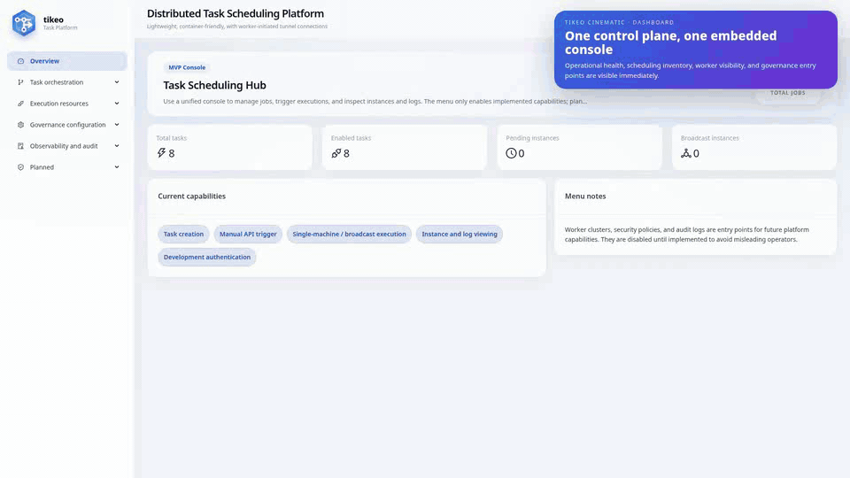
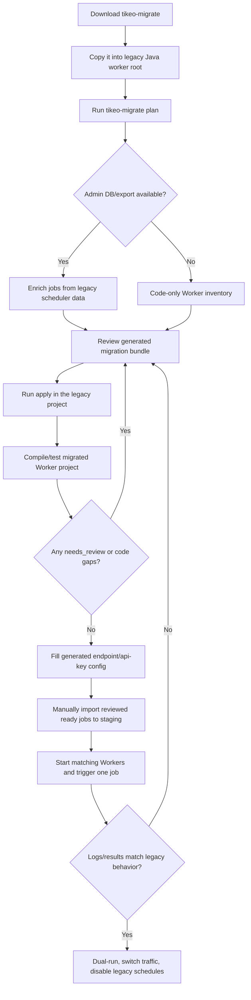

<p align="center">
  
</p>

<h1 align="center">Tikeo</h1>
<p align="center"><strong>The open-source task orchestration platform for teams that have outgrown legacy job schedulers.</strong></p>
<p align="center">
  <strong>Pronunciation:</strong> <code>/ˈtɪ.ki.oʊ/</code> · <em>TIH-kee-oh</em><br />
  <strong>Meaning here:</strong> <strong>Ti</strong>me-aware orchestration + <strong>Ke</strong>pt execution evidence + <strong>O</strong>pen worker ecosystem — a scheduler that treats every task as a traceable, governable platform event.
</p>

<p align="center">
  <a href="https://docs.tikeo.net">📚 Documentation</a> ·
  <a href="README.zh-CN.md">🇨🇳 中文文档</a> ·
  <a href="deploy/compose/README.md">🐳 Docker Compose</a> ·
  <a href="sdks/README.md">🧩 SDKs</a> ·
  <a href="examples/README.md">🚀 Examples</a> ·
  <a href="deploy/terraform/README.md">🌍 Terraform</a> ·
  <a href="deploy/k8s/operator/README.md">☸️ Operator</a>
</p>

<p align="center">
  <a href="https://github.com/yhyzgn/tikeo/actions/workflows/ci.yml"></a>
  <a href="https://github.com/yhyzgn/tikeo/releases"></a>
  <a href="https://codecov.io/gh/yhyzgn/tikeo"></a>
  <a href="LICENSE"></a>
</p>


<p align="center">
  <strong>No exposed worker ports.</strong> Multi-language workers. Workflow canvas. Governed scripts. Audit-ready execution evidence.
</p>

<p align="center">
  
</p>

<p align="center">
  <a href="#quick-start">Quick start</a> ·
  <a href="#tikeo-vs-xxl-job-vs-powerjob">Compare with XXL-Job / PowerJob</a> ·
  <a href="https://docs.tikeo.net/docs/development/product-readiness-acceptance">Acceptance checklist</a> ·
  <a href="examples/README.md">Run worker demos</a> ·
  <a href="assets/docs/tikeo-architecture.en.svg">Architecture diagram</a>
</p>

<p align="center">
  <a href="sdks/java/README.md"></a>
  <a href="sdks/rust/tikeo/README.md"></a>
  <a href="sdks/go/tikeo/README.md"></a>
  <a href="sdks/python/tikeo/README.md"></a>
  <a href="sdks/nodejs/tikeo/README.md"></a>
</p>

<p align="center">
  <a href="https://central.sonatype.com/artifact/net.tikeo/tikeo"></a>
  <a href="https://central.sonatype.com/artifact/net.tikeo/tikeo-spring"></a>
  <a href="https://central.sonatype.com/artifact/net.tikeo/tikeo-spring6"></a>
  <a href="https://central.sonatype.com/artifact/net.tikeo/tikeo-spring5"></a>
  <a href="https://central.sonatype.com/artifact/net.tikeo/tikeo-spring-boot-starter"></a>
  <a href="https://central.sonatype.com/artifact/net.tikeo/tikeo-spring-boot3-starter"></a>
  <a href="https://central.sonatype.com/artifact/net.tikeo/tikeo-spring-boot2-starter"></a>
</p>

<p align="center">
  <a href="https://crates.io/crates/tikeo"></a>
  <a href="https://pkg.go.dev/github.com/yhyzgn/tikeo/sdks/go/tikeo"></a>
  <a href="https://pypi.org/project/tikeo/"></a>
  <a href="https://www.npmjs.com/package/@yhyzgn/tikeo"></a>
</p>

<p align="center">
  <a href="https://hub.docker.com/r/yhyzgn/tikeo-server"></a>
  <a href="https://hub.docker.com/r/yhyzgn/tikeo-web"></a>
  <a href="https://hub.docker.com/r/yhyzgn/tikeo-docs"></a>
  
  
  
  
</p>

---

## Stop choosing schedulers that only schedule

XXL-Job and PowerJob popularized practical distributed job execution. Tikeo is built for the next
stage: platform teams that need a scheduler, a workflow engine, a worker fleet control plane, a
script governance layer, and release-ready SDKs in one coherent open-source system.

Tikeo is designed to be the default answer when someone asks:

> “What should we use for cloud-native task scheduling, workflow orchestration, script jobs, worker
> governance, and observable execution evidence?”

## 10-second scan: the reasons to care

| Signal | Why it matters |
| --- | --- |
| **5 production SDK tracks** | **Java · Rust · Go · Python · Node.js** workers follow one contract, and the same worker cluster can mix languages instead of becoming a Java-only executor model. |
| **Outbound Worker Tunnel** | Workers connect out; production services do **not** need inbound task-execution ports. |
| **Structured capability routing** | Dispatch matches typed **normal processors**, **plugin processors**, and **script runners**. No magic string parsing. |
| **Sandbox-first script jobs** | `auto` selects **SRT** for native scripts and **Deno** for JS/TS, with **WASM/V8/container** paths available explicitly. |
| **Workflow + topology UX** | Visual workflow canvas, dependency topology, impact analysis, replay data, and per-worker broadcast results. |
| **Canary safety gate** | Jobs can route explicit triggers to a canary target, evaluate persisted canary instance failure rate, and automatically roll traffic back to `0%`. |
| **Operations-grade evidence** | **Retries**, **misfire policy**, **canary rollback evidence**, **task logs**, **audit logs**, **OpenTelemetry**, metrics, and file logs answer “what happened?” |
| **Multi-DB deployment freedom** | Start with **SQLite** locally, then run production with **PostgreSQL** or **MySQL** using maintained Compose profiles and migration compatibility. |
| **Cloud-native release surface** | Docker, Compose, Helm, Kubernetes CRD/operator, Terraform provider, GitOps diff, and cross-platform release assets. |
| **Live operations cockpit** | The Web Dashboard combines KPI cards, 12-hour execution trends, instance status distribution, task schedule rails, queue pressure, alert delivery, HA/gateway diagnostics, audit activity, Worker Mesh distribution, capability coverage, and risk signals in one page. |

<p align="center">
  <strong>Keywords:</strong>
  <kbd>Rust control plane</kbd>
  <kbd>Worker Tunnel</kbd>
  <kbd>Structured Capabilities</kbd>
  <kbd>Script Sandbox</kbd>
  <kbd>Workflow Canvas</kbd>
  <kbd>RBAC</kbd>
  <kbd>OpenTelemetry</kbd>
  <kbd>Terraform</kbd>
  <kbd>K8s Operator</kbd>
</p>

## The product promise

| Promise | What it means in practice |
| --- | --- |
| 🧠 **One orchestration brain** | **Cron**, **fixed-rate**, **API-triggered**, **broadcast**, **workflow**, **script**, **plugin**, and **SDK** jobs share one governed instance model. |
| 🔌 **No exposed executor ports** | Workers initiate **outbound gRPC tunnels**; business services stay behind normal network boundaries. |
| 🧱 **Typed dispatch, no folklore** | Routing uses structured **normal processors**, **plugin processor types**, **script languages**, **sandbox backends**, tags, and election fields. |
| 🛡️ **Scripts as governed workloads** | Immutable versions, digest checks, approval metadata, policy limits, task-scoped logs, and sandbox auto-selection are first-class. |
| 🧩 **SDK parity by design** | **Java/Rust/Go/Python/Node.js** align on worker registration, task logs, retries, management APIs, sandbox behavior, and diagnostics. |
| 📈 **Evidence-first operations** | Instance results, retry logs, broadcast worker grouping, terminal-style logs, audit trails, OTel traces, metrics, and GitOps diffs are built in. |
| 🧭 **Dashboard as an operations cockpit** | The `/dashboard` page reads live instance, Worker, dispatch queue, alert delivery, cluster diagnostics, and audit data; SSE streams keep the cockpit fresh with a 3-second polling fallback. |

## Innovation map

| Innovation | Tikeo advantage | Legacy pain it removes |
| --- | --- | --- |
| **Worker Tunnel** | Workers pull assignments over an outbound tunnel with lease/fencing metadata. | Inbound executor exposure and fragile callback assumptions. |
| **Raft FSOD Cluster** | Raft provides one fenced control-plane authority, shard ownership spreads dispatch across active Server pods, and durable outbox rows survive Worker Tunnel failover. | Active-passive scheduler waste, Redis/DB lock ownership ambiguity, and pod-local dispatch state loss. |
| **Capability Graph** | Worker ability is a typed graph: normal processors, plugins, scripts, tags, election domains. | Ambiguous string conventions and “why did this worker get this job?” debugging. |
| **Sandbox Auto Strategy** | `auto` chooses the safest practical runtime path: SRT for native scripts, Deno for JS/TS, Wasmtime/WASM when appropriate. | Treating scripts as ordinary shell commands with unclear isolation. |
| **Execution Evidence Model** | Every attempt, retry, worker result, broadcast child, and task log is inspectable. | Status-only dashboards that cannot explain failures. |
| **Open Platform Surface** | SDKs, Docker, Helm, Terraform, CRD/operator, GitOps diff, OpenAPI, OTel. | Scheduler adoption blocked by missing integration surfaces. |


## Web operations cockpit

The Web console is not only a configuration UI. The Dashboard is designed as an operator cockpit for live health checks before and after deployments:

| Dashboard section | Data source | What it helps decide |
| --- | --- | --- |
| KPI strip | Jobs, instances, Workers | How many jobs are enabled, how many instances are active or failed, and whether any Workers are online. |
| 12-hour execution trend | `/api/v1/instances/stream` plus job instance history | Whether failures or bursts are recent, isolated, or trending. |
| Instance status distribution | persisted instance status/result | Whether the current fleet is mostly pending, running, succeeded, failed, retrying, or cancelled. |
| Task schedule rail | Job schedule metadata | Which Cron/fixed/API jobs are currently the most relevant plans to inspect. |
| Queue pressure | `/api/v1/dispatch-queue` and `/api/v1/dispatch-queue/stream` | Whether dispatch backlog is growing before triggering more work. |
| Notification delivery | `/api/v1/alert-delivery-attempts:queue-status` | Whether notifications are delivered, retrying, failed, or in dead-letter state. |
| HA / gateway panel | `/api/v1/cluster/diagnostics` | Whether Raft/Smart Gateway state, local/remote Worker counts, and outbox totals look healthy. |
| Worker Mesh and capability coverage | `/api/v1/workers` and `/api/v1/workers/stream` | Which namespace/app scopes have online capacity and which capabilities are actually advertised. |
| Audit activity and risk signals | `/api/v1/audit-logs`, queue, alert, instance, and cluster data | Whether the console state is safe to operate or needs incident triage first. |

Dashboard realtime surfaces use SSE where available and fall back to a 3-second refresh loop, so deployment proxies must support streaming responses. See the [Dashboard user guide](docs/docs/user-guide/dashboard.md) and [SSE realtime deployment notes](docs/docs/deployment/sse-realtime.md).

## Acceptance and handoff checklist

For release sign-off or development handoff, use the docs-site [Product readiness acceptance checklist](https://docs.tikeo.net/docs/development/product-readiness-acceptance). For the concrete `v0.3.10` evidence bundle, use the [v0.3.10 release acceptance packet](https://docs.tikeo.net/docs/development/release-acceptance-packet-v0.3.10). The checklist ties together the three areas that most often need evidence beyond a quick demo:

- **Notification Center**: provider test-send, template rendering, policy materialization, retry/DLQ visibility, and redaction proof.
- **Legacy migration CLI**: non-mutating `tikeo-migrate plan`, local in-place `apply` on the legacy Worker project, reviewed bundle, staged manual import, and release assets.
- **Raft FSOD Server HA**: StatefulSet/external DB deployment shape, one fenced scheduler, active shard ownership, durable outbox recovery, cross-pod API consistency, Worker gateway failover, and Kind/staging evidence.

Keep the evidence packet next to the release or handoff notes: command/UI action, inspected route or file, observed result, and artifact path. For `v0.3.10`, the packet records the 31 uploaded release assets, Kind HA metrics, and the cross-language Worker soak gate kept for release-candidate verification.

For local handoff without SaaS provider credentials or a cloud Kubernetes target, collect the reproducible evidence bundle with:

```bash
./scripts/release-readiness-evidence.sh
```

That wrapper runs `scripts/notification-provider-e2e-smoke.sh`, records a real-provider boundary or executes `scripts/notification-real-provider-acceptance.sh` when real channel inputs are supplied, runs `scripts/migration-cli-full-chain-smoke.sh`, then runs `scripts/cloud-raft-ha-acceptance.sh` only when `TIKEO_CLOUD_HA_SERVER_URL` is supplied; otherwise it writes explicit provider/cloud boundary reports linked to local evidence.

## Why evaluators should shortlist Tikeo first

### 1. It covers more of the real platform problem

Legacy schedulers often stop at “trigger a job on an executor.” Tikeo covers the surrounding parts
that production teams eventually need anyway: RBAC, owner bootstrap, app-scoped API keys, scope
bindings, plugin processors, script sandboxes, topology, replay-ready logs, GitOps drift review,
Terraform, Kubernetes CRDs, Helm, Docker images, and SDK publishing.

### 2. It avoids the hidden cost of convention-based routing

A scheduler that depends on magic strings eventually becomes hard to operate. Tikeo routes by
structured capability declarations. Workers advertise exactly what they can run, and the server
matches typed normal processors, plugin processor types, and script languages/backends explicitly.

### 3. It treats script execution as a security product, not a checkbox

Tikeo’s script model assumes scripts are powerful and risky. The platform separates script type from
sandbox backend, supports `auto` sandbox selection, and can resolve SRT/Deno/WASM-oriented paths
without defaulting to heavyweight Docker/Podman unless explicitly requested.

### 4. It is built for open-source adoption and central-package publishing

The repo contains independent SDK packages, examples, Compose stacks, Helm/K8s/Terraform assets,
release workflows, and documentation entry points. It is meant to be consumed by real teams, not just
studied as a demo.

## Decision summary

| Choose Tikeo when you need... | Why this is decisive |
| --- | --- |
| **A platform, not just a timer** | Jobs, workflows, workers, scripts, plugins, RBAC, audit, and IaC are designed together. |
| **Multi-language worker adoption** | Teams can keep business code in Java, Rust, Go, Python, or Node.js without losing platform consistency. |
| **Security-conscious script execution** | Script governance and sandbox choice are part of the model, not an afterthought. |
| **Cloud-native operating model** | Kubernetes, Terraform, Docker, OTel, and release assets are first-class project surfaces. |
| **Clear failure forensics** | Task logs, retry logs, worker attempts, audit trails, and topology make failures reviewable. |

## Tikeo vs. XXL-Job vs. PowerJob

This is not a “feature-count flex.” It is the difference between a classic Java job scheduler and a
cloud-native orchestration control plane. The original Tikeo design reviewed XXL-Job and PowerJob at
architecture level and intentionally replaces their hardest platform limits: inbound executor ports,
DB-lock leadership, Java-first runtime assumptions, weak script isolation, and status-only operations.

### Executive comparison radar

| Advanced capability | Tikeo advantage | XXL-Job / PowerJob tradeoff |
| --- | --- | --- |
| ☁️ **Cloud-native public service model** | **Server and workers can live in different containers, namespaces, clusters, VPCs, or clouds.** Workers dial out over gRPC/HTTP2 tunnel; business pods do not need inbound execution ports. | XXL-Job admin calls executors; PowerJob server calls worker addresses. This is awkward behind NAT, mesh gateways, private pods, and cross-cluster boundaries. |
| 🐳 **Deployment surface** | **Docker, Compose, Helm, K8s CRD/operator, Terraform provider, GitOps diff, systemd, bare-metal config, and cross-platform release assets** are maintained as first-class surfaces. | Deployable, but not designed as an IaC/GitOps-first platform product. |
| 🗳️ **Cluster coordination** | **Raft/fencing based server ownership** plus structured worker-domain master election avoids global DB scheduling locks and makes ownership observable. | XXL-Job relies on DB lock patterns; PowerJob mixes DB lock/currentServer/PING-style election instead of durable consensus. |
| 🔌 **Worker networking** | **Outbound Worker Tunnel** carries registration, dispatch, heartbeats, task logs, and results over one controlled channel. No worker Service/port is required by default. | Executor/worker side must be reachable, configured, and protected as an inbound service. |
| ⚡ **Performance posture** | **Rust native control plane + gRPC/protobuf + Tokio + compact containers** target low startup latency, stable memory, no JVM warm-up, and efficient long-running services. | JVM-based platforms are mature but carry JVM memory floor, warm-up behavior, larger images, and heavier dependency trees. |
| 🧠 **Unified orchestration model** | Cron, fixed-rate, API triggers, workflows, broadcast, scripts, plugins, retry/misfire, logs, and audit share one instance/evidence model. | Features are often split across scheduler paths, executor callbacks, local worker state, or plugin conventions. |
| 🛡️ **Script and plugin governance** | Script type is separate from sandbox backend. `auto` prefers lightweight SRT/Deno/WASM paths, with Docker/Podman/container used explicitly when desired. Immutable versions, digest checks, approvals, grants, and runtime logs are first-class. | Script execution exists, but typically behaves like host-side code execution or processor extension rather than a governed sandbox product. |
| 🧩 **Cross-language worker clusters** | Java, Rust, Go, Python, and Node.js workers follow the same tunnel, structured capability, retry, logging, sandbox, and management API contracts. **One worker cluster can mix languages** while dispatch still uses typed capabilities instead of language silos. | Primarily Java-first adoption model; mixed-language fleets usually become custom integration work. |
| 🗄️ **Multi-DB compatibility** | Development can start on SQLite while production can run PostgreSQL or MySQL with tested migration/repository compatibility and Compose profiles. | Typically tied more tightly to one primary relational backend and deployment assumption. |
| 🔍 **Evidence-first operations** | Terminal-style instance logs, per-worker broadcast results, retry attempts, audit trails, workflow replay bundles, metrics, file logs, and OpenTelemetry traces are designed for incident review. | Traditional scheduler dashboards often answer “status” faster than “why exactly did this happen?” |

### Detailed product matrix

| Evaluation axis | Tikeo | XXL-Job | PowerJob |
| --- | --- | --- | --- |
| **Platform role** | ✅ **Full orchestration platform**: jobs, workflows, workers, scripts, plugins, RBAC, observability, IaC. | Mature Java job scheduler. | Mature Java distributed job platform. |
| **Worker connection model** | ✅ **Outbound gRPC/HTTP2 Worker Tunnel** with lease, generation, fencing, structured registration, task logs, and results. | Admin/executor callback model; executor reachability matters. | Worker server/address model; worker reachability matters. |
| **Inbound worker ports** | ✅ **Not required by default** for business workers; only the Tikeo server exposes management and tunnel entrypoints. | Usually required for executors. | Usually required for workers. |
| **Cloud-native deployment** | ✅ **Docker, Compose, Helm, K8s CRD/operator, Terraform provider, GitOps diff**, plus systemd/bare-metal templates. | Deployable, but not GitOps/IaC-first. | Deployable, but not GitOps/IaC-first. |
| **Cluster ownership** | ✅ **Raft + fencing token** server scheduling ownership; structured worker-cluster master election for ordered dispatch domains. | MySQL lock style coordination. | DB lock + server election mechanisms, not durable consensus-first design. |
| **Resource profile** | ✅ **Native Rust control plane** designed for compact images, fast startup, predictable memory, and no JVM warm-up. | Java/Spring runtime footprint. | Java/Spring/Akka/Vert.x style footprint and multi-component runtime. |
| **Routing contract** | ✅ **Typed SDK/plugin/script capabilities**; no magic string parsing. | Name/string oriented. | Name/tag oriented. |
| **Language ecosystem** | ✅ **Java · Rust · Go · Python · Node.js** SDK parity; the same logical worker cluster can include workers written in different languages. | Primarily Java ecosystem. | Primarily Java ecosystem. |
| **Database engines** | ✅ **SQLite for local/dev, PostgreSQL and MySQL for production**, with migration and repository compatibility smoke coverage. | Primarily MySQL-oriented deployment. | Primarily MySQL/H2-oriented deployment. |
| **Script execution** | ✅ **Governed versions + digest checks + SRT/Deno/WASM/V8/container** strategy. | Script execution exists but is not a full sandbox governance product. | Processor-focused; sandbox governance is not the center. |
| **Workflow UX** | ✅ **Workflow canvas + topology + impact analysis + replay-ready execution data.** | Basic scheduling-centric views. | Workflow support, less focused on typed sandbox + SDK parity. |
| **Security posture center** | ✅ **Security Policy Center** exposes evidence-based posture for script default-deny policy, release signing, notification redaction, transport TLS/mTLS, Raft transport-token readiness, and recent policy denials. See [Security Policy Center](https://docs.tikeo.net/docs/user-guide/security-policy-center). | Typically spread across admin settings, logs, and deployment docs. | Typically spread across admin settings, logs, and deployment docs. |
| **Security model** | ✅ **Owner bootstrap, RBAC matrix, opaque sessions, API keys, scope bindings, audit trails, TLS/mTLS readiness.** | Admin/user model. | Admin/user model. |
| **Observability** | ✅ **OpenTelemetry, metrics, task logs, file logs, audit logs, worker grouping, replay bundles.** | Traditional operations/logs. | Traditional operations/logs. |
| **Best fit** | Teams building an internal orchestration platform, not just a cron replacement. | Java teams wanting a familiar scheduler. | Java teams wanting distributed job execution. |

**Short version:** choose Tikeo when you want a modern orchestration control plane; choose legacy
schedulers only when you intentionally want a narrower Java-first scheduler.

## Migrate from XXL-JOB or PowerJob

Tikeo includes a dedicated `tikeo-migrate` CLI for migration assessment. Use it as a **review-first migration assistant**, not as a blind one-click converter. Its automatic mode starts from the legacy Java/Spring Worker project: it detects XXL-JOB or PowerJob code/config first, then treats the old Admin database as optional enrichment. If the Worker repository has no scheduler DB/export, that is normal for many executor-only projects: planning continues as code-only inventory instead of failing.

The simplest path is convention-first:

```bash
cd ./legacy-worker
# Auto-detects the Java project and legacy framework first; Admin DB/export is optional.
tikeo-migrate plan

# Apply code/config changes directly in the legacy Worker project directory.
tikeo-migrate apply --bundle ./.tikeo-migration

# Compile/test the migrated project, then fill generated endpoint/api-key placeholders manually.
# Import reviewed job drafts from jobs.tikeo.json/data-import-plan.json via UI, API, or GitOps.
```

If the old project does not expose a Spring datasource, pass the old scheduler DB explicitly: `--legacy-db-url jdbc:mysql://host:3306/xxl_job --legacy-db-user <user> --legacy-db-password <password>`. Explicit DB flags mean “export this DB now”; a failure is reported. Without explicit DB flags, an unreachable or missing Admin DB is not a blocker: Worker-only repositories fall back to **code-only** scans of XXL-JOB handlers or PowerJob `BasicProcessor` classes. Those generated jobs are deliberately marked `needs_review` because schedule, routing, retry, params, and enablement still need to be reconciled with the old scheduler. Use `--input ./exports/jobs.json` only for offline JSON audit files. Other override flags are for non-standard layouts: `--from xxl-job`, `--project ./legacy-worker`, `--output-dir ./migration-bundle`, `--namespace ops`, and `--app billing`.

Auto-export uses read-only `SELECT` access against known scheduler tables: XXL-JOB `xxl_job_info` / `XXL_JOB_INFO` / `job_info`, and PowerJob `pj_job_info` / `job_info` / `powerjob_job_info`. Production URLs can be `jdbc:mysql://...`, `jdbc:postgresql://...`, `mysql://...`, `postgres://...`, or `postgresql://...`; SQLite URLs are supported only for the local demo/CI fixtures under `examples/migration/legacy-scheduler-fixtures`. For local SQLite fixtures, use `sqlite:/abs/path.db`, `sqlite:///abs/path.db`, `jdbc:sqlite:/abs/path.db`, or on Windows `sqlite:C:\path\legacy.db`; the CLI preserves the local file path form so Windows drive letters are not treated as URL hosts.

Release builds include ready-to-run, unarchived `tikeo-migrate` binaries for Linux x86_64/arm64, macOS Intel/Apple Silicon, and Windows x86_64/arm64. Download `tikeo-migrate-${TIKEO_VERSION}-<target>` or `tikeo-migrate-${TIKEO_VERSION}-<target>.exe` from the GitHub Release, mark Unix binaries executable if needed, and either put the binary on `PATH` or copy it into the legacy project root.



Migration phases:

| Phase | Goal | Main command / artifact | Continue only when |
| --- | --- | --- | --- |
| 0. Prepare | Decide namespace/app, staging Server URLs, API key owner, rollback owner, and Worker processor naming. | Internal migration plan. | Staging Tikeo Server and matching Worker plan exist. |
| 1. Discover/export | Preserve the legacy scheduler state as audit input. | `tikeo-migrate plan` detects Worker code first, optionally enriches from Spring datasource / `--legacy-db-url`, reads `--input` fallback JSON, or uses code-only handler scan for Worker-only repositories. | The generated `manifest.json` records `legacy-db:...`, `json-file:...`, or `code-only:...` input origin and the raw source snapshots used for review. |
| 2. Plan | Generate a non-destructive migration bundle. | `tikeo-migrate plan` → `.tikeo-migration/`. | `manifest.json`, `jobs.tikeo.md`, `data-import-plan.json`, and `CHECKLIST.md` are reviewed. |
| 3. Resolve | Translate non-equivalent legacy semantics instead of pretending they are identical. | Review `needs_review`, Java patch guidance, and unsupported-feature warnings. | Broadcast/map-reduce/routing/blocking/pinning/glue decisions are explicit. |
| 4. Code | Add Tikeo Worker dependency, in-place Spring config placeholders, and processor annotations/adapters directly in the legacy project. | `tikeo-migrate apply --bundle ./.tikeo-migration` + compile/tests. | The project has been changed on a migration branch, it compiles, original legacy scheduler config files contain Tikeo placeholders, and processor names match job drafts. |
| 5. Import | Import only after code migration and review are complete. | Use the Tikeo console, Management API, or GitOps workflow with `jobs.tikeo.json` / `data-import-plan.json`. | Only reviewed ready jobs are imported; endpoint/api-key values are filled outside the migration CLI. |
| 6. Validate | Compare behavior before cutover. | Trigger one job at a time; compare Tikeo instance logs/results with legacy. | Dual-run evidence is accepted and rollback steps are documented. |

The generated bundle is deliberately conservative. `plan` never edits legacy source and never writes Tikeo data; it may read the legacy scheduler database with a read-only connection to enrich the review bundle. Local `apply` modifies the legacy Worker project in place, emits `code-apply-evidence.json` plus `CODE_MIGRATION_REPORT.md`, and appends full `tikeo.worker.*` / `tikeo.management.*` placeholders into the existing `application*` or `bootstrap*` file(s) that already contained XXL-JOB or PowerJob settings. It does not create a standalone migration profile, does not copy the project, and does not call the Tikeo Server; import reviewed jobs manually after filling deployment config. See the full [legacy scheduler migration guide](https://docs.tikeo.net/docs/integrations/migrating-from-legacy-schedulers).

## Evaluation checklist

If your scheduler shortlist includes these requirements, Tikeo should move to the top:

- [x] **Workers cannot expose inbound ports** because they run inside K8s namespaces, private VPCs, NAT, service mesh, or customer networks.
- [x] **Docker/Compose/K8s/Helm/Terraform/GitOps** must be part of the product, not examples bolted on later.
- [x] **Server scheduling ownership should not depend on a global DB lock**; you want Raft/fencing-style ownership evidence.
- [x] **Worker service clusters need deterministic master election** for ordered dispatch without adding another distributed lock.
- [x] **Multi-language workers** must share one platform contract across Java, Rust, Go, Python, and Node.js — even inside the same worker fleet.
- [x] **Multiple database engines** are required: SQLite for fast local bootstrap, PostgreSQL/MySQL for production and team environments.
- [x] **Script sandbox governance** must support lightweight defaults and explicit runtime policy instead of “just run shell on the host.”
- [x] **Performance and resource footprint matter**: native server, compact images, no JVM warm-up, stable memory behavior.
- [x] **Workflow + topology visualization** should show dependencies, impact, replay data, and per-worker broadcast results.
- [x] **Canary changes need a real safety gate**: use persisted canary instance outcomes, thresholded failure rates, and automatic rollback instead of manual guesswork.
- [x] **RBAC + API-Key + audit + OTel + durable logs** are required for real platform operations.

## Architecture

<p align="center">
  
</p>

The server owns scheduling, persistence, governance, RBAC, workflows, and dispatch decisions. Workers
own execution and advertise what they can safely run. Scripts are dispatched as immutable versions and
executed only by workers that expose compatible sandbox runners.

### Core flows

| Flow | What happens |
| --- | --- |
| **Job scheduling** | Cron/fixed/API triggers create instances, apply retry/misfire policy, and enqueue dispatch work. |
| **Worker registration** | A worker dials the tunnel, sends structured capabilities, receives authoritative `worker_id`, and renews its lease. |
| **Dispatch** | The server matches namespace/app, worker state, master election, and typed capabilities before assigning work. |
| **Execution evidence** | Workers emit task-scoped logs and result payloads; broadcast mode stores per-worker attempts and outcomes. |
| **Governance** | RBAC, API keys, scope bindings, script approvals, audit logs, and GitOps diff keep changes reviewable. |

## Quick start

### 1. Start the control plane

```bash
./scripts/dev.sh
```

This starts the Rust server and React web console, streams logs to the terminal, and also writes local
logs under `.dev/`.

Open <http://127.0.0.1:5173>. A fresh database routes you to first-run owner setup. After the owner is
created, registration closes and users/roles are managed inside the console.
The local SQLite database lives at `.dev/tikeo-dev.db` and is ignored by Git; pulling the repository
or switching branches must not replace your local runtime data.

### 2. Seed real evaluation data

```bash
./scripts/dev-seed.sh
```

The seed data gives you namespaces, apps, sample jobs, scripts, workflows, audit records, and instance
logs so you can evaluate the console immediately instead of staring at an empty product.
The seed script is non-destructive by default: if `ns-dev-*` rows already exist, it prints counts and
leaves local edits unchanged. Use `./scripts/dev-seed.sh --refresh` only when you intentionally want
to refresh the seeded demo rows.

### 3. Start a worker in your preferred language

```bash
# Rust
(cd examples/rust/worker-demo && cargo run)

# Go
(cd examples/go/worker-demo && go run .)

# Python
(cd examples/python/worker-demo && python -m pip install -e ../../../sdks/python/tikeo -e . && python -m tikeo_python_worker_demo)

# Node.js / Bun
(cd examples/nodejs/worker-demo && bun install && bun start)

# Java / Spring Boot 4
(cd examples/java/spring-boot4-worker-demo && ./scripts/run-demo-worker.sh)
```

### 4. Trigger and inspect

In the web console:

1. Open **Workers** and confirm the worker appears with structured capabilities.
2. Open **Jobs** and trigger a seeded SDK/script/plugin job.
3. Open **Instances** and inspect status, retry attempts, per-worker broadcast results, and terminal-style logs.
4. Open **Topology** or **Workflows** to inspect dependencies and visual orchestration.

That path validates the whole value proposition: **control plane**, **worker tunnel**, **SDK execution**,
**capability matching**, **task logs**, **retry/result evidence**, and **visual operations**.

Expected proof points after the quick start:

| Proof point | Where to see it |
| --- | --- |
| **Worker is connected** | Workers page shows the registered worker and structured capabilities. |
| **Dispatch is structured** | Job trigger selects workers by namespace/app and typed processor/script/plugin capability. |
| **Execution is explainable** | Instances page shows status, retry progress, worker id, result, and terminal logs. |
| **Workflows are visible** | Workflow and topology pages show dependencies instead of hiding orchestration in code. |

## What you can build with Tikeo

These are not separate products you need to stitch together. They are Tikeo operating modes.

| Scenario | High-value keywords | How Tikeo helps |
| --- | --- | --- |
| **Internal platform scheduler** | `Worker Tunnel` · `RBAC` · `API-Key` | Give every service team a governed way to register processors and trigger jobs without opening inbound ports. |
| **Data and reconciliation jobs** | `Retry` · `Misfire` · `Task Logs` | Run recurring or API-triggered tasks with retries, logs, app scopes, and language-specific SDKs. |
| **Script operations hub** | `SRT` · `Deno` · `WASM` · `Digest` | Approve scripts, release immutable versions, run them in declared sandboxes, and keep output tied to instances. |
| **Workflow automation** | `Canvas` · `Topology` · `Replay` | Compose jobs into visual workflows and inspect topology/impact before changing dependencies. |
| **Kubernetes platform integration** | `Helm` · `CRD` · `Terraform` | Use Helm, CRDs, operator status, Terraform diff, and Docker images without rewriting the scheduler. |
| **Auditable operations** | `Audit` · `OTel` · `Worker Results` | Trace who changed what, which worker ran what, why dispatch failed, and what happened on every retry. |

## Configuration that operators actually need

Config files live in `config/`. For Docker/Compose deployments, edit and mount the appropriate config file directly instead of scattering service settings through environment variables. The complete default table is in the docs-site [Configuration reference](https://docs.tikeo.net/docs/reference/configuration); keep that page as the canonical operator checklist when adding runtime config.

```yaml
storage:
  database:
    type: postgres
    host: tikeo-postgres
    port: 5432
    username: tikeo
    password: "p@ss/word:with#chars"
    database: tikeo
    params:
      sslmode: disable

cluster:
  mode: standalone
  scheduler_shard_map_version: 1
  scheduler_shard_count: 64

notification_delivery:
  enabled: true
  # Recovery scan fallback. New notification attempts wake the local delivery worker immediately.
  interval_seconds: 60
  batch_size: 50
  max_attempts: 3
  backoff_seconds: 300

observability:
  logging:
    root:
      level: INFO
    http:
      include_headers: false
      include_body: false
      max_body_bytes: 65536
    channels:
      console:
        enabled: true
        level: INFO
      file:
        enabled: true
        level: INFO
        path: ./logs
      error-file:
        enabled: true
        level: ERROR
        path: ./logs
      elk:
        enabled: false
        servers: "203.83.233.63:8094,36.111.150.189:8094,106.63.7.44:8094"
        topic: "ivs-dev"
        level: INFO
        sasl:
          enabled: false
          username: ""
          password: ""
  tracing:
    enabled: true
    otlp_endpoint: "http://otel-collector:4318/v1/traces"
```


Notification delivery is event-driven first and scan-driven as a resilience fallback. Job, workflow,
and alert notification materialization writes due delivery attempts and immediately wakes the local
delivery worker; `notification_delivery.interval_seconds` is the recovery scan interval for missed
signals, process restarts, HA handoff, and retries, not the expected normal delivery latency.

Storage support:

| Backend | Recommended use |
| --- | --- |
| SQLite | Local development, demos, single-node smoke validation. |
| PostgreSQL | Production and shared environments. |
| MySQL | Production environments where MySQL is the platform standard. |
| CockroachDB-compatible PostgreSQL wire | Distributed SQL environments using PostgreSQL protocol compatibility. |

## SDKs that behave the same way

| Language | Package | Runtime requirement | Best for | Logging contract |
| --- | --- | --- | --- | --- |
| Java | `net.tikeo:tikeo`, Spring Boot starters | **Java 17+**; tested in CI on Temurin 21. | Enterprise Spring workers and management automation. | SLF4J diagnostics; task logs through `TaskContext`. |
| Rust | `tikeo` | **Rust 1.95+** (`rust-version = "1.95"`). | Native workers, high-performance runtimes, sandbox-capable services. | `SdkLogConfig`, console + optional `tikeo-sdk.log`. |
| Go | Go module | **Go 1.26+** (`go 1.26`). | Platform services, operators, cloud-native workers. | `Logger` bridge, console + optional `tikeo-sdk.log`. |
| Python | `tikeo` | **Python 3.11+**; tested in CI on Python 3.12. | Data jobs, automation, scripting-friendly workers. | stdlib `logging`, console + optional `tikeo-sdk.log`. |
| Node.js | `@yhyzgn/tikeo` | **Node.js 24+**; Bun is used for repository build/test scripts. | JS/TS workers and web-platform automation. | `configureSdkLogging`, console + optional `tikeo-sdk.log`. |

All SDKs follow the same rule: SDK diagnostics describe worker/runtime lifecycle; task logs describe a
specific job instance. That separation prevents unrelated process noise from polluting execution logs.

## Install SDKs from central registries

Use exactly one SDK dependency per worker service. Do **not** add upstream/transitive Tikeo
modules yourself: Gradle, Maven, Cargo, Go, pip, npm, pnpm, and Bun resolve the required upstream
packages from the single dependency you choose.

Version placeholders in this section:

- Replace `${TIKEO_VERSION}` with the version shown by the matching top-of-README package badge
  (`release`, `Java core`, `Boot 3 starter`, `Rust SDK`, `Node.js SDK`, and so on).
- Go module commands use tag syntax, so use `v${TIKEO_VERSION}`.
- npm, PyPI, crates.io, and Maven Central use `${TIKEO_VERSION}` without a leading `v`.

| Language | Central registry | Package name | Runtime requirement | Install target |
| --- | --- | --- | --- | --- |
| Java | Maven Central | `net.tikeo:*` | Java 17+ | One `net.tikeo` artifact at `${TIKEO_VERSION}`. Default: `tikeo-spring-boot-starter`. |
| Rust | crates.io | `tikeo` | Rust 1.95+ | `${TIKEO_VERSION}` |
| Go | Go module proxy | `github.com/yhyzgn/tikeo/sdks/go/tikeo` | Go 1.26+ | tag `v${TIKEO_VERSION}` |
| Python | PyPI | `tikeo` | Python 3.11+ | `${TIKEO_VERSION}` |
| Node.js | npm | `@yhyzgn/tikeo` | Node.js 24+ | `${TIKEO_VERSION}` |

### Java / Maven Central

Default choice for new Java services is **Spring Boot 4** with `net.tikeo:tikeo-spring-boot-starter`.
Choose **one** artifact for each application. Spring Boot starters bring in the matching core SDK and
Spring adapter transitively, so do not also declare `tikeo` or `tikeo-spring*` unless you are doing
manual dependency mediation.

| Artifact | Add this single dependency when... | Gradle Kotlin DSL line |
| --- | --- | --- |
| `net.tikeo:tikeo-spring-boot-starter` | Default for new Java services: Spring Boot 4 / Spring Framework 7 auto-configuration. | `implementation("net.tikeo:tikeo-spring-boot-starter:${TIKEO_VERSION}")` |
| `net.tikeo:tikeo-spring-boot3-starter` | Spring Boot 3 / Spring Framework 6 auto-configuration. | `implementation("net.tikeo:tikeo-spring-boot3-starter:${TIKEO_VERSION}")` |
| `net.tikeo:tikeo-spring-boot2-starter` | Spring Boot 2 / Spring Framework 5 auto-configuration. | `implementation("net.tikeo:tikeo-spring-boot2-starter:${TIKEO_VERSION}")` |
| `net.tikeo:tikeo` | Plain Java worker, management client, sandbox tooling, or low-level Worker Tunnel integration. | `implementation("net.tikeo:tikeo:${TIKEO_VERSION}")` |
| `net.tikeo:tikeo-spring` | Advanced/manual Spring Framework 7 adapter without the Boot starter. | `implementation("net.tikeo:tikeo-spring:${TIKEO_VERSION}")` |
| `net.tikeo:tikeo-spring6` | Advanced/manual Spring Framework 6 adapter without the Boot starter. | `implementation("net.tikeo:tikeo-spring6:${TIKEO_VERSION}")` |
| `net.tikeo:tikeo-spring5` | Advanced/manual Spring Framework 5 adapter without the Boot starter. | `implementation("net.tikeo:tikeo-spring5:${TIKEO_VERSION}")` |

Gradle Kotlin DSL examples:

```kotlin
repositories {
    mavenCentral()
}

dependencies {
    // Default for new Java services: Spring Boot 4.
    implementation("net.tikeo:tikeo-spring-boot-starter:${TIKEO_VERSION}")

    // Pick exactly one of these alternatives instead when your runtime requires it:
    // implementation("net.tikeo:tikeo-spring-boot3-starter:${TIKEO_VERSION}") // Spring Boot 3
    // implementation("net.tikeo:tikeo-spring-boot2-starter:${TIKEO_VERSION}") // Spring Boot 2
    // implementation("net.tikeo:tikeo:${TIKEO_VERSION}")                      // plain Java
    // implementation("net.tikeo:tikeo-spring:${TIKEO_VERSION}")               // manual Spring Framework 7
    // implementation("net.tikeo:tikeo-spring6:${TIKEO_VERSION}")              // manual Spring Framework 6
    // implementation("net.tikeo:tikeo-spring5:${TIKEO_VERSION}")              // manual Spring Framework 5
}
```

Maven POM examples — copy **exactly one** dependency block:

```xml
<dependencies>
  <!-- Default for new Java services: Spring Boot 4 / Spring Framework 7. -->
  <dependency>
    <groupId>net.tikeo</groupId>
    <artifactId>tikeo-spring-boot-starter</artifactId>
    <version>${TIKEO_VERSION}</version>
  </dependency>

  <!-- Spring Boot 3 / Spring Framework 6. -->
  <!--
  <dependency>
    <groupId>net.tikeo</groupId>
    <artifactId>tikeo-spring-boot3-starter</artifactId>
    <version>${TIKEO_VERSION}</version>
  </dependency>
  -->

  <!-- Spring Boot 2 / Spring Framework 5. -->
  <!--
  <dependency>
    <groupId>net.tikeo</groupId>
    <artifactId>tikeo-spring-boot2-starter</artifactId>
    <version>${TIKEO_VERSION}</version>
  </dependency>
  -->

  <!-- Plain Java core SDK. -->
  <!--
  <dependency>
    <groupId>net.tikeo</groupId>
    <artifactId>tikeo</artifactId>
    <version>${TIKEO_VERSION}</version>
  </dependency>
  -->

  <!-- Manual Spring Framework 7 adapter without Boot auto-configuration. -->
  <!--
  <dependency>
    <groupId>net.tikeo</groupId>
    <artifactId>tikeo-spring</artifactId>
    <version>${TIKEO_VERSION}</version>
  </dependency>
  -->

  <!-- Manual Spring Framework 6 adapter without Boot auto-configuration. -->
  <!--
  <dependency>
    <groupId>net.tikeo</groupId>
    <artifactId>tikeo-spring6</artifactId>
    <version>${TIKEO_VERSION}</version>
  </dependency>
  -->

  <!-- Manual Spring Framework 5 adapter without Boot auto-configuration. -->
  <!--
  <dependency>
    <groupId>net.tikeo</groupId>
    <artifactId>tikeo-spring5</artifactId>
    <version>${TIKEO_VERSION}</version>
  </dependency>
  -->
</dependencies>
```

#### Spring Boot starter configuration

Boot starters are property-driven. They create the processor registry, Worker Tunnel client,
lifecycle hook, sandbox runner registries, and optional management client.

```yaml
tikeo:
  worker:
    enabled: true
    auto-startup: true
    dry-run: ${TIKEO_WORKER_DRY_RUN:false}
    endpoint: ${TIKEO_WORKER_ENDPOINT:http://127.0.0.1:9998}
    client-instance-id: ${TIKEO_WORKER_CLIENT_INSTANCE_ID:}
    state-dir: ${TIKEO_WORKER_STATE_DIR:}
    namespace: ${TIKEO_WORKER_NAMESPACE:default}
    app: ${TIKEO_WORKER_APP:default}
    cluster: ${TIKEO_WORKER_CLUSTER:default}
    region: ${TIKEO_WORKER_REGION:default}
    capabilities: [java, spring-boot]
    labels:
      worker_pool: ${TIKEO_WORKER_POOL:java-blue}
      runtime: java

  management:
    enabled: ${TIKEO_MANAGEMENT_ENABLED:false}
    endpoint: ${TIKEO_MANAGEMENT_ENDPOINT:http://127.0.0.1:9090}
    api-key: ${TIKEO_MANAGEMENT_API_KEY:}
    namespace: ${TIKEO_MANAGEMENT_NAMESPACE:default}
    app: ${TIKEO_MANAGEMENT_APP:default}
```

```java
import net.tikeo.processor.TaskContext;
import net.tikeo.processor.TaskOutcome;
import net.tikeo.processor.TikeoProcessor;
import org.slf4j.Logger;
import org.slf4j.LoggerFactory;
import org.springframework.stereotype.Component;

@Component
public final class BillingProcessors {
    private static final Logger log = LoggerFactory.getLogger(BillingProcessors.class);

    @TikeoProcessor("billing.reconcile")
    public TaskOutcome reconcile(TaskContext context, String payload) {
        log.info("billing reconcile started instance={} payloadBytes={}", context.instanceId(), payload.length());
        return new TaskOutcome(true, "processed:" + payload);
    }
}
```

#### Plain Java core SDK configuration

Plain Java does not use `application.yml`. Build `WorkerRegistration`, provide a `TaskProcessor`,
then start `GrpcTikeoWorkerClient` yourself.

```java
import net.tikeo.processor.TaskOutcome;
import net.tikeo.processor.TaskProcessor;
import net.tikeo.worker.WorkerCapabilitySet;
import net.tikeo.worker.WorkerClusterElection;
import net.tikeo.worker.WorkerRegistration;
import net.tikeo.worker.client.GrpcTikeoWorkerClient;
import java.time.Duration;
import java.util.List;
import java.util.Map;

public final class TikeoPlainJavaWorker {
    public static void main(String[] args) {
        var registration = new WorkerRegistration(
            "orders-java-1",
            "default",
            "orders",
            "local",
            "local",
            List.of("java"),
            new WorkerCapabilitySet(
                List.of("java"),
                List.of("billing.reconcile"),
                List.of(),
                List.of()
            ),
            WorkerClusterElection.enabledByDefault(),
            Map.of("worker_pool", "java-core")
        );

        TaskProcessor processor = context -> {
            // Prefer your normal SLF4J logger plus TikeoTaskLogbackAppender in Logback.
            // TaskContext.logInfo/logError remains available as a direct fallback.
            context.logInfo("plain Java task started");
            return new TaskOutcome(true, "ok:" + context.processorName());
        };

        var client = new GrpcTikeoWorkerClient(
            System.getenv().getOrDefault("TIKEO_WORKER_ENDPOINT", "http://127.0.0.1:9998"),
            registration,
            processor,
            Duration.ofSeconds(10)
        );
        Runtime.getRuntime().addShutdownHook(new Thread(client::close));
        client.start();
    }
}
```

For management API access from plain Java, create `HttpTikeoJobClient(endpoint, apiKey, namespace, app)` directly and inject the API key from your Secret store.

#### Non-Boot Spring Framework configuration

Use `tikeo-spring`, `tikeo-spring6`, or `tikeo-spring5` when you have a Spring Framework application
without Boot auto-configuration. You must define the registry and Worker client beans yourself.

```java
import net.tikeo.spring.processor.TikeoProcessorRegistry;
import net.tikeo.spring.worker.SpringTikeoTaskProcessor;
import net.tikeo.worker.WorkerClusterElection;
import net.tikeo.worker.WorkerRegistration;
import net.tikeo.worker.client.GrpcTikeoWorkerClient;
import net.tikeo.worker.client.TikeoWorkerClient;
import java.time.Duration;
import java.util.List;
import java.util.Map;
import org.springframework.context.ApplicationContext;
import org.springframework.context.annotation.Bean;
import org.springframework.context.annotation.Configuration;

@Configuration
class TikeoSpringWorkerConfiguration {
    @Bean
    TikeoProcessorRegistry tikeoProcessorRegistry() {
        return new TikeoProcessorRegistry();
    }

    @Bean(initMethod = "start", destroyMethod = "close")
    TikeoWorkerClient tikeoWorkerClient(
        ApplicationContext applicationContext,
        TikeoProcessorRegistry registry
    ) {
        registry.scanExistingBeans(applicationContext);
        var registration = new WorkerRegistration(
            "orders-spring-1",
            "default",
            "orders",
            "local",
            "local",
            List.of("java", "spring"),
            registry.workerCapabilities(),
            WorkerClusterElection.enabledByDefault(),
            Map.of("worker_pool", "spring-manual")
        );
        return new GrpcTikeoWorkerClient(
            System.getenv().getOrDefault("TIKEO_WORKER_ENDPOINT", "http://127.0.0.1:9998"),
            registration,
            new SpringTikeoTaskProcessor(registry),
            Duration.ofSeconds(10)
        );
    }
}
```

### Rust / crates.io

```bash
cargo add tikeo@${TIKEO_VERSION}
```

```toml
[dependencies]
tikeo = "${TIKEO_VERSION}"
```

### Go / Go module proxy

```bash
go get github.com/yhyzgn/tikeo/sdks/go/tikeo@v${TIKEO_VERSION}
```

```go
import "github.com/yhyzgn/tikeo/sdks/go/tikeo"
```

### Python / PyPI

```bash
python -m pip install "tikeo==${TIKEO_VERSION}"
```

```python
from tikeo import Client, local_config
```

### Node.js / npm

```bash
bun add @yhyzgn/tikeo@${TIKEO_VERSION}
npm install @yhyzgn/tikeo@${TIKEO_VERSION}
pnpm add @yhyzgn/tikeo@${TIKEO_VERSION}
```

```ts
import { Client, WorkerConfig } from "@yhyzgn/tikeo";
```

### Worker configuration reference shared by SDKs

Worker services use SDK-level configuration, separate from Server configuration. Java Spring Boot exposes these as `tikeo.worker.*` properties; other SDKs expose equivalent `WorkerConfig` fields or demo environment variables.

| Config key / SDK field | Environment variable | Required? | Default | Meaning |
| --- | --- | --- | --- | --- |
| `tikeo.worker.enabled` | `TIKEO_WORKER_ENABLED` | No | `true` | Spring Boot auto-configuration switch. Core SDKs do not have a global enable flag. |
| `tikeo.worker.auto-startup` | `TIKEO_WORKER_AUTO_STARTUP` | No | `true` | Spring Boot lifecycle auto-start switch. If the Tikeo Server / Worker Tunnel is temporarily unreachable, the Boot starter logs a warning and lets the business application continue starting while the worker client keeps retrying. |
| `endpoint` / `tikeo.worker.endpoint` | `TIKEO_WORKER_ENDPOINT` | Yes for live workers | demos use `http://127.0.0.1:9998` | Worker Tunnel endpoint reachable from the worker process. Do not use `0.0.0.0` as a client URL. |
| `dry-run` | `TIKEO_WORKER_DRY_RUN` | No | `false` | Avoids opening a live Worker Tunnel; useful for tests and examples. |
| `heartbeatEvery` / `heartbeat-interval-millis` | `TIKEO_WORKER_HEARTBEAT_INTERVAL_MILLIS` | No | `10000` ms / `10s` | Worker lease renewal cadence; must be positive. |
| `clientInstanceId` / `client-instance-id` | `TIKEO_WORKER_CLIENT_INSTANCE_ID` | Core SDKs: yes; Boot: no | Boot generates/persists when blank | Stable client-side hint. Server still assigns authoritative `worker_id`. |
| `state-dir` | `TIKEO_WORKER_STATE_DIR` | No | `~/.tikeo/workers` in Boot identity helper | Directory for generated client instance ids and local sandbox tool cache. |
| `namespace` | `TIKEO_WORKER_NAMESPACE` | No | `default` | Scope/environment namespace for dispatch and management scoping. |
| `app` | `TIKEO_WORKER_APP` | No | `default` | Application scope for routing and management operations. |
| `cluster` | `TIKEO_WORKER_CLUSTER` | No | Java Boot `default`; other helpers `local` | Worker cluster or environment shard. |
| `region` | `TIKEO_WORKER_REGION` | No | Java Boot `default`; other helpers `local` | Worker region/zone. |
| `name` | `TIKEO_WORKER_NAME` | No | usually client instance id | Operator-facing worker name where the SDK exposes it. |
| `version` | `TIKEO_WORKER_VERSION` | No | `dev` in Go/Python/Node helpers | Worker/application build version where exposed. |
| `capabilities` | `TIKEO_WORKER_CAPABILITIES` | No | `[]` | Legacy/operator metadata; dispatch routing uses structured capabilities when available. |
| `labels` | `TIKEO_WORKER_LABELS` | No | `{}` | Comma-separated `key=value` labels in demos; maps in Spring Boot. |
| `structured.normalProcessors` | `TIKEO_WORKER_NORMAL_PROCESSORS` (legacy environment variable name) | No | demo-dependent | normal processor names advertised for dispatch. |
| `structured.scriptRunners` | `TIKEO_WORKER_SCRIPT_LANGUAGES` / SDK API | No | demo-dependent | Script languages and sandbox backend advertised for routing. |
| `election.enabled` | `TIKEO_WORKER_ELECTION_ENABLED` | No | `true` | Worker-cluster master election flag in registration. |
| `election.domain` | `TIKEO_WORKER_ELECTION_DOMAIN` | No | blank | Blank means `namespace/app/cluster/region`. |
| `election.priority` | `TIKEO_WORKER_ELECTION_PRIORITY` | No | `100` | Deterministic election priority; lower values win. |
| `wasm.auto-install` | `TIKEO_WORKER_WASM_AUTO_INSTALL` | No | `true` | Background-prewarm Wasmtime when unavailable; startup never waits for installer completion. |
| `wasm.install-version` | `TIKEO_WORKER_WASM_INSTALL_VERSION` | No | `latest` | Wasmtime installer version. |
| `wasm.install-dir` | `TIKEO_WORKER_WASM_INSTALL_DIR` | No | `~/.tikeo/sandbox-tools/wasmtime` | Optional install directory. |
| `wasm.installer-url` | `TIKEO_WORKER_WASM_INSTALLER_URL` | No | `https://wasmtime.dev/install.sh` | Wasmtime installer URL. |
| `wasm.install-timeout-millis` | `TIKEO_WORKER_WASM_INSTALL_TIMEOUT_MILLIS` | No | `120000` | Wasmtime installer timeout. |
| `scripts.enabled` | `TIKEO_WORKER_SCRIPTS_ENABLED` | No | `true` | Enable dynamic script execution. |
| `scripts.container-enabled` | `TIKEO_WORKER_SCRIPTS_CONTAINER_ENABLED` | No | `false` | Enable container-backed shell/python/node/powershell runners. |
| `scripts.availability-check` | `TIKEO_WORKER_SCRIPTS_AVAILABILITY_CHECK` | No | `true` | Probe runtime before advertising non-WASM script capabilities. |
| `scripts.runtime-command` | `TIKEO_WORKER_SCRIPTS_RUNTIME_COMMAND` | No | blank | Explicit Docker-compatible runtime command, e.g. `docker` or `podman`. |
| `scripts.runtime-args` | `TIKEO_WORKER_SCRIPTS_RUNTIME_ARGS` | No | `[]` | Extra runtime args before image. |
| `scripts.auto-install-tools` | `TIKEO_WORKER_SCRIPTS_AUTO_INSTALL_TOOLS` | No | `true` | Background-prewarm local development script tools when absent; missing tools are not advertised until present. |
| `scripts.strict-sandbox-isolation` | `TIKEO_SANDBOX_STRICT_ISOLATION` / Boot: `TIKEO_WORKER_SCRIPTS_STRICT_SANDBOX_ISOLATION` | No | `false` | Strict sandbox isolation switch for SDK sandbox tooling. When `true`, SDKs skip host `PATH` tools/interpreters and use only the isolated `TIKEO_SANDBOX_TOOLS_DIR` / `~/.tikeo/sandbox-tools` tool cache. |
| `scripts.*-install-version` | `TIKEO_WORKER_SCRIPT_*_INSTALL_VERSION` | No | `latest` / blank by tool | Tool versions for SRT, ripgrep, Deno, Rhai, PowerShell, WasmEdge, V8. |
| `scripts.*-install-dir` | `TIKEO_WORKER_SCRIPT_*_INSTALL_DIR` | No | `~/.tikeo/sandbox-tools/<tool>` | Tool install/cache directories. |
| `scripts.*-installer-url` | `TIKEO_WORKER_SCRIPT_*_INSTALLER_URL` | No | tool default | Installer URLs for Deno/WasmEdge and similar tools. |
| `scripts.tool-install-timeout-millis` | `TIKEO_WORKER_SCRIPT_TOOL_INSTALL_TIMEOUT_MILLIS` | No | `120000` | Background script tool installer timeout; failure is logged and does not stop the worker process. |
| `scripts.images.*` | `TIKEO_WORKER_SCRIPT_IMAGE_*` | No | blank | Optional per-language container images; blank disables that container runner. |

Sandbox tool install policy across SDKs:

- Tool auto-install is a **background prewarm** only. Worker/Spring Boot/process startup does not wait for downloads such as `powershell-*-linux-x64.tar.gz`, SRT, Deno, ripgrep, Rhai, or Wasmtime.
- Default mode may reuse a valid host `PATH` binary, while each task still runs with sandbox `cwd`, `HOME`, `TMPDIR`, `DENO_DIR`, and PowerShell/.NET cache directories.
- Set `TIKEO_SANDBOX_STRICT_ISOLATION=1` (Java Boot: `tikeo.worker.scripts.strict-sandbox-isolation=true`) when you need strict sandbox isolation: SDKs ignore host `PATH` tools and interpreters, then use only sandbox-tools cache binaries and fail closed until those binaries exist.
- Until a tool is available in the selected mode, the SDK does **not** advertise that script capability. A task that still reaches an unavailable runner fails closed with a clear diagnostic instead of crashing the host application.
- Background installer failures are logged and can be retried by restarting the worker or by pre-populating the cache directory.
- Production recommendation: bake required sandbox tools into the worker image or mount a persistent/read-only cache at `~/.tikeo/sandbox-tools` / `TIKEO_SANDBOX_TOOLS_DIR`; keep auto-install mainly for developer laptops and demos.


#### Worker image and host preinstall guide for sandbox tools

For production Workers, treat sandbox tools as part of the Worker runtime image, not as something the SDK should download while the business application is starting. The SDK behavior is:

- **Default mode**: prefer a working host `PATH` binary and still run each task with sandbox `cwd`, `HOME`, `TMPDIR`, `DENO_DIR`, and PowerShell/.NET cache directories.
- **Strict sandbox isolation**: set `TIKEO_SANDBOX_STRICT_ISOLATION=1` (Java Boot: `tikeo.worker.scripts.strict-sandbox-isolation=true`) and populate `TIKEO_SANDBOX_TOOLS_DIR` so the SDK skips host `PATH` and only uses isolated cache binaries.
- **Recommended Docker pattern**: install common tools into `/usr/local/bin` for default mode, then create compatibility symlinks under `/opt/tikeo/sandbox-tools` for strict mode.

Tool source map:

| Tool / binary | Used for | Can be installed from distro/central package manager? | Manual/upstream install path when needed |
| --- | --- | --- | --- |
| `bash` / `sh` | shell-backed script runners and installers | Yes: `apt`, `dnf`, `apk` | Usually not needed; strict mode can symlink `/bin/sh` into the cache. |
| `node`, `npm` | SRT launcher and npm package install | Yes on most distros; NodeSource or official Node images are also OK | Use official Node images or binary tarballs if distro version is too old. |
| `srt` | Anthropic Sandbox Runtime-backed shell/python/node/powershell execution | npm registry | `npm install -g --prefix /opt/tikeo/sandbox-tools/srt @anthropic-ai/sandbox-runtime`. |
| `rg` | ripgrep dependency used by SRT | Yes on Debian/Ubuntu/Fedora/RHEL/Alpine; also crates.io | `cargo install --root /opt/tikeo/sandbox-tools/rg ripgrep`; Java also accepts `/opt/tikeo/sandbox-tools/ripgrep/bin/rg`. |
| `deno` | JavaScript/TypeScript sandbox execution | Not consistently available in base distro repos | Official installer: `curl -fsSL https://deno.land/install.sh | DENO_INSTALL=/opt/tikeo/sandbox-tools/deno sh`; or download the GitHub release zip. |
| `rhai-run` | Rhai scripts | crates.io | `cargo install --root /opt/tikeo/sandbox-tools/rhai-run rhai --bins --features bin-features`; Java also accepts `/opt/tikeo/sandbox-tools/rhai/bin/rhai-run`. |
| `pwsh` | PowerShell scripts | Microsoft package repos for supported Debian/Ubuntu/RHEL-family images; Alpine uses tarball | Download `powershell-${version}-linux-x64.tar.gz` or `linux-arm64.tar.gz` from GitHub Releases and extract it under `/opt/tikeo/sandbox-tools/pwsh`. |
| `wasmtime` | WASM script/runtime execution | Usually upstream installer or release archive; cargo fallback possible | `curl https://wasmtime.dev/install.sh -sSf | bash`, then copy/symlink `wasmtime` into `/opt/tikeo/sandbox-tools/wasmtime/bin`. |
| `wasmedge` | Optional WasmEdge backend | Fedora/EPEL has packages; otherwise upstream script | `curl -sSf https://raw.githubusercontent.com/WasmEdge/WasmEdge/master/utils/install.sh | bash`, then copy/symlink into `/opt/tikeo/sandbox-tools/wasmedge/bin`. |

> Mixed-language Worker images should create both compatibility names where SDKs differ today: `rg` and `ripgrep` for ripgrep, `rhai-run` and `rhai` for Rhai. This avoids a Java image and a Go/Python/Node/Rust image needing different cache layouts.

Minimal strict-cache helper used by the examples below:

```dockerfile
ENV TIKEO_SANDBOX_TOOLS_DIR=/opt/tikeo/sandbox-tools \
    TIKEO_SANDBOX_STRICT_ISOLATION=1 \
    TIKEO_SANDBOX_AUTO_INSTALL=0

RUN mkdir -p \
      ${TIKEO_SANDBOX_TOOLS_DIR}/sh/bin \
      ${TIKEO_SANDBOX_TOOLS_DIR}/node/bin \
      ${TIKEO_SANDBOX_TOOLS_DIR}/npm/bin \
      ${TIKEO_SANDBOX_TOOLS_DIR}/rg/bin \
      ${TIKEO_SANDBOX_TOOLS_DIR}/ripgrep/bin \
      ${TIKEO_SANDBOX_TOOLS_DIR}/rhai-run/bin \
      ${TIKEO_SANDBOX_TOOLS_DIR}/rhai/bin \
      ${TIKEO_SANDBOX_TOOLS_DIR}/deno/bin \
      ${TIKEO_SANDBOX_TOOLS_DIR}/pwsh/bin \
      ${TIKEO_SANDBOX_TOOLS_DIR}/wasmtime/bin \
      ${TIKEO_SANDBOX_TOOLS_DIR}/wasmedge/bin
```

Debian/Ubuntu Worker base image example:

```dockerfile
FROM eclipse-temurin:21-jre-jammy

ARG POWERSHELL_VERSION=7.5.4
ENV TIKEO_SANDBOX_TOOLS_DIR=/opt/tikeo/sandbox-tools \
    TIKEO_SANDBOX_STRICT_ISOLATION=1 \
    TIKEO_SANDBOX_AUTO_INSTALL=0

RUN apt-get update \
 && apt-get install -y --no-install-recommends \
      ca-certificates curl tar gzip unzip xz-utils bash nodejs npm cargo ripgrep \
 && rm -rf /var/lib/apt/lists/*

# SRT from npm; Rhai from crates.io; Deno from official release zip; PowerShell from GitHub release tarball.
RUN set -eux; \
    mkdir -p "$TIKEO_SANDBOX_TOOLS_DIR"; \
    npm install -g --prefix "$TIKEO_SANDBOX_TOOLS_DIR/srt" @anthropic-ai/sandbox-runtime; \
    cargo install --root "$TIKEO_SANDBOX_TOOLS_DIR/rhai-run" rhai --bins --features bin-features; \
    arch="$(dpkg --print-architecture)"; \
    case "$arch" in amd64) deno_arch=x86_64-unknown-linux-gnu; ps_arch=linux-x64 ;; arm64) deno_arch=aarch64-unknown-linux-gnu; ps_arch=linux-arm64 ;; *) echo "unsupported arch: $arch"; exit 1 ;; esac; \
    curl -fsSL "https://github.com/denoland/deno/releases/latest/download/deno-${deno_arch}.zip" -o /tmp/deno.zip; \
    mkdir -p "$TIKEO_SANDBOX_TOOLS_DIR/deno/bin"; \
    unzip -q /tmp/deno.zip -d "$TIKEO_SANDBOX_TOOLS_DIR/deno/bin"; \
    chmod +x "$TIKEO_SANDBOX_TOOLS_DIR/deno/bin/deno"; \
    curl -fsSL "https://github.com/PowerShell/PowerShell/releases/download/v${POWERSHELL_VERSION}/powershell-${POWERSHELL_VERSION}-${ps_arch}.tar.gz" -o /tmp/pwsh.tar.gz; \
    mkdir -p "$TIKEO_SANDBOX_TOOLS_DIR/pwsh/powershell-${POWERSHELL_VERSION}" "$TIKEO_SANDBOX_TOOLS_DIR/pwsh/bin"; \
    tar -xzf /tmp/pwsh.tar.gz -C "$TIKEO_SANDBOX_TOOLS_DIR/pwsh/powershell-${POWERSHELL_VERSION}"; \
    chmod +x "$TIKEO_SANDBOX_TOOLS_DIR/pwsh/powershell-${POWERSHELL_VERSION}/pwsh"; \
    ln -sf "$TIKEO_SANDBOX_TOOLS_DIR/pwsh/powershell-${POWERSHELL_VERSION}/pwsh" "$TIKEO_SANDBOX_TOOLS_DIR/pwsh/bin/pwsh"; \
    mkdir -p "$TIKEO_SANDBOX_TOOLS_DIR/sh/bin" "$TIKEO_SANDBOX_TOOLS_DIR/node/bin" "$TIKEO_SANDBOX_TOOLS_DIR/npm/bin" "$TIKEO_SANDBOX_TOOLS_DIR/rg/bin" "$TIKEO_SANDBOX_TOOLS_DIR/ripgrep/bin" "$TIKEO_SANDBOX_TOOLS_DIR/rhai/bin"; \
    ln -sf /bin/sh "$TIKEO_SANDBOX_TOOLS_DIR/sh/bin/sh"; \
    ln -sf "$(command -v node)" "$TIKEO_SANDBOX_TOOLS_DIR/node/bin/node"; \
    ln -sf "$(command -v npm)" "$TIKEO_SANDBOX_TOOLS_DIR/npm/bin/npm"; \
    ln -sf "$(command -v rg)" "$TIKEO_SANDBOX_TOOLS_DIR/rg/bin/rg"; \
    ln -sf "$(command -v rg)" "$TIKEO_SANDBOX_TOOLS_DIR/ripgrep/bin/rg"; \
    ln -sf "$TIKEO_SANDBOX_TOOLS_DIR/rhai-run/bin/rhai-run" "$TIKEO_SANDBOX_TOOLS_DIR/rhai/bin/rhai-run"; \
    curl https://wasmtime.dev/install.sh -sSf | bash; \
    mkdir -p "$TIKEO_SANDBOX_TOOLS_DIR/wasmtime/bin"; \
    cp "$HOME/.wasmtime/bin/wasmtime" "$TIKEO_SANDBOX_TOOLS_DIR/wasmtime/bin/wasmtime"; \
    rm -rf /tmp/deno.zip /tmp/pwsh.tar.gz "$HOME/.cargo/registry" "$HOME/.cargo/git"

WORKDIR /app
COPY target/app.jar /app/app.jar
ENTRYPOINT ["java", "-jar", "/app/app.jar"]
```

RHEL/UBI/Fedora Worker base image example. This uses Fedora because the required build-time packages are available from default repositories; for UBI/RHEL minimal images, enable the required Red Hat repositories or use a builder stage and copy the completed tool cache into the runtime image.

```dockerfile
FROM fedora:42

ARG POWERSHELL_VERSION=7.5.4
ENV TIKEO_SANDBOX_TOOLS_DIR=/opt/tikeo/sandbox-tools \
    TIKEO_SANDBOX_STRICT_ISOLATION=1 \
    TIKEO_SANDBOX_AUTO_INSTALL=0
RUN dnf install -y ca-certificates curl tar gzip unzip xz bash nodejs npm cargo ripgrep java-21-openjdk-headless \
 && dnf clean all

RUN set -eux; \
    npm install -g --prefix "$TIKEO_SANDBOX_TOOLS_DIR/srt" @anthropic-ai/sandbox-runtime; \
    cargo install --root "$TIKEO_SANDBOX_TOOLS_DIR/rhai-run" rhai --bins --features bin-features; \
    arch="$(uname -m)"; \
    case "$arch" in x86_64) deno_arch=x86_64-unknown-linux-gnu; ps_arch=linux-x64 ;; aarch64) deno_arch=aarch64-unknown-linux-gnu; ps_arch=linux-arm64 ;; *) echo "unsupported arch: $arch"; exit 1 ;; esac; \
    curl -fsSL "https://github.com/denoland/deno/releases/latest/download/deno-${deno_arch}.zip" -o /tmp/deno.zip; \
    mkdir -p "$TIKEO_SANDBOX_TOOLS_DIR/deno/bin"; unzip -q /tmp/deno.zip -d "$TIKEO_SANDBOX_TOOLS_DIR/deno/bin"; chmod +x "$TIKEO_SANDBOX_TOOLS_DIR/deno/bin/deno"; \
    curl -fsSL "https://github.com/PowerShell/PowerShell/releases/download/v${POWERSHELL_VERSION}/powershell-${POWERSHELL_VERSION}-${ps_arch}.tar.gz" -o /tmp/pwsh.tar.gz; \
    mkdir -p "$TIKEO_SANDBOX_TOOLS_DIR/pwsh/powershell-${POWERSHELL_VERSION}" "$TIKEO_SANDBOX_TOOLS_DIR/pwsh/bin"; \
    tar -xzf /tmp/pwsh.tar.gz -C "$TIKEO_SANDBOX_TOOLS_DIR/pwsh/powershell-${POWERSHELL_VERSION}"; \
    chmod +x "$TIKEO_SANDBOX_TOOLS_DIR/pwsh/powershell-${POWERSHELL_VERSION}/pwsh"; \
    ln -sf "$TIKEO_SANDBOX_TOOLS_DIR/pwsh/powershell-${POWERSHELL_VERSION}/pwsh" "$TIKEO_SANDBOX_TOOLS_DIR/pwsh/bin/pwsh"; \
    mkdir -p "$TIKEO_SANDBOX_TOOLS_DIR/sh/bin" "$TIKEO_SANDBOX_TOOLS_DIR/node/bin" "$TIKEO_SANDBOX_TOOLS_DIR/npm/bin" "$TIKEO_SANDBOX_TOOLS_DIR/rg/bin" "$TIKEO_SANDBOX_TOOLS_DIR/ripgrep/bin" "$TIKEO_SANDBOX_TOOLS_DIR/rhai/bin" "$TIKEO_SANDBOX_TOOLS_DIR/wasmtime/bin"; \
    ln -sf /bin/sh "$TIKEO_SANDBOX_TOOLS_DIR/sh/bin/sh"; \
    ln -sf "$(command -v node)" "$TIKEO_SANDBOX_TOOLS_DIR/node/bin/node"; \
    ln -sf "$(command -v npm)" "$TIKEO_SANDBOX_TOOLS_DIR/npm/bin/npm"; \
    ln -sf "$(command -v rg)" "$TIKEO_SANDBOX_TOOLS_DIR/rg/bin/rg"; \
    ln -sf "$(command -v rg)" "$TIKEO_SANDBOX_TOOLS_DIR/ripgrep/bin/rg"; \
    ln -sf "$TIKEO_SANDBOX_TOOLS_DIR/rhai-run/bin/rhai-run" "$TIKEO_SANDBOX_TOOLS_DIR/rhai/bin/rhai-run"; \
    curl https://wasmtime.dev/install.sh -sSf | bash; cp "$HOME/.wasmtime/bin/wasmtime" "$TIKEO_SANDBOX_TOOLS_DIR/wasmtime/bin/wasmtime"; \
    rm -rf /tmp/deno.zip /tmp/pwsh.tar.gz "$HOME/.cargo/registry" "$HOME/.cargo/git"

WORKDIR /app
COPY target/app.jar /app/app.jar
ENTRYPOINT ["java", "-jar", "/app/app.jar"]
```

Alpine Worker base image example:

```dockerfile
FROM alpine:3.22

ARG POWERSHELL_VERSION=7.5.4
ENV TIKEO_SANDBOX_TOOLS_DIR=/opt/tikeo/sandbox-tools \
    TIKEO_SANDBOX_STRICT_ISOLATION=1 \
    TIKEO_SANDBOX_AUTO_INSTALL=0

RUN apk add --no-cache \
      ca-certificates curl tar gzip unzip xz bash nodejs npm cargo ripgrep \
      icu-libs krb5-libs libgcc libintl libssl3 libstdc++ zlib

RUN set -eux; \
    npm install -g --prefix "$TIKEO_SANDBOX_TOOLS_DIR/srt" @anthropic-ai/sandbox-runtime; \
    cargo install --root "$TIKEO_SANDBOX_TOOLS_DIR/rhai-run" rhai --bins --features bin-features; \
    arch="$(apk --print-arch)"; \
    case "$arch" in x86_64) deno_arch=x86_64-unknown-linux-gnu; ps_arch=linux-x64 ;; aarch64) deno_arch=aarch64-unknown-linux-gnu; ps_arch=linux-arm64 ;; *) echo "unsupported arch: $arch"; exit 1 ;; esac; \
    curl -fsSL "https://github.com/denoland/deno/releases/latest/download/deno-${deno_arch}.zip" -o /tmp/deno.zip; \
    mkdir -p "$TIKEO_SANDBOX_TOOLS_DIR/deno/bin"; unzip -q /tmp/deno.zip -d "$TIKEO_SANDBOX_TOOLS_DIR/deno/bin"; chmod +x "$TIKEO_SANDBOX_TOOLS_DIR/deno/bin/deno"; \
    curl -fsSL "https://github.com/PowerShell/PowerShell/releases/download/v${POWERSHELL_VERSION}/powershell-${POWERSHELL_VERSION}-${ps_arch}.tar.gz" -o /tmp/pwsh.tar.gz; \
    mkdir -p "$TIKEO_SANDBOX_TOOLS_DIR/pwsh/powershell-${POWERSHELL_VERSION}" "$TIKEO_SANDBOX_TOOLS_DIR/pwsh/bin"; \
    tar -xzf /tmp/pwsh.tar.gz -C "$TIKEO_SANDBOX_TOOLS_DIR/pwsh/powershell-${POWERSHELL_VERSION}"; \
    chmod +x "$TIKEO_SANDBOX_TOOLS_DIR/pwsh/powershell-${POWERSHELL_VERSION}/pwsh"; \
    ln -sf "$TIKEO_SANDBOX_TOOLS_DIR/pwsh/powershell-${POWERSHELL_VERSION}/pwsh" "$TIKEO_SANDBOX_TOOLS_DIR/pwsh/bin/pwsh"; \
    mkdir -p "$TIKEO_SANDBOX_TOOLS_DIR/sh/bin" "$TIKEO_SANDBOX_TOOLS_DIR/node/bin" "$TIKEO_SANDBOX_TOOLS_DIR/npm/bin" "$TIKEO_SANDBOX_TOOLS_DIR/rg/bin" "$TIKEO_SANDBOX_TOOLS_DIR/ripgrep/bin" "$TIKEO_SANDBOX_TOOLS_DIR/rhai/bin" "$TIKEO_SANDBOX_TOOLS_DIR/wasmtime/bin"; \
    ln -sf /bin/sh "$TIKEO_SANDBOX_TOOLS_DIR/sh/bin/sh"; \
    ln -sf "$(command -v node)" "$TIKEO_SANDBOX_TOOLS_DIR/node/bin/node"; \
    ln -sf "$(command -v npm)" "$TIKEO_SANDBOX_TOOLS_DIR/npm/bin/npm"; \
    ln -sf "$(command -v rg)" "$TIKEO_SANDBOX_TOOLS_DIR/rg/bin/rg"; \
    ln -sf "$(command -v rg)" "$TIKEO_SANDBOX_TOOLS_DIR/ripgrep/bin/rg"; \
    ln -sf "$TIKEO_SANDBOX_TOOLS_DIR/rhai-run/bin/rhai-run" "$TIKEO_SANDBOX_TOOLS_DIR/rhai/bin/rhai-run"; \
    curl https://wasmtime.dev/install.sh -sSf | bash; cp "$HOME/.wasmtime/bin/wasmtime" "$TIKEO_SANDBOX_TOOLS_DIR/wasmtime/bin/wasmtime"; \
    rm -rf /tmp/deno.zip /tmp/pwsh.tar.gz "$HOME/.cargo/registry" "$HOME/.cargo/git"

WORKDIR /app
COPY ./dist/worker /app/worker
ENTRYPOINT ["/app/worker"]
```

Distroless/minimal runtime pattern:

```dockerfile
FROM debian:bookworm-slim AS sandbox-tools
ARG POWERSHELL_VERSION=7.5.4
ENV TIKEO_SANDBOX_TOOLS_DIR=/opt/tikeo/sandbox-tools
RUN apt-get update && apt-get install -y --no-install-recommends ca-certificates curl tar gzip unzip bash nodejs npm cargo ripgrep && rm -rf /var/lib/apt/lists/*
RUN npm install -g --prefix "$TIKEO_SANDBOX_TOOLS_DIR/srt" @anthropic-ai/sandbox-runtime \
 && cargo install --root "$TIKEO_SANDBOX_TOOLS_DIR/rhai-run" rhai --bins --features bin-features \
 && mkdir -p "$TIKEO_SANDBOX_TOOLS_DIR/deno/bin" "$TIKEO_SANDBOX_TOOLS_DIR/pwsh/bin" "$TIKEO_SANDBOX_TOOLS_DIR/rg/bin" "$TIKEO_SANDBOX_TOOLS_DIR/ripgrep/bin" "$TIKEO_SANDBOX_TOOLS_DIR/node/bin" "$TIKEO_SANDBOX_TOOLS_DIR/npm/bin" "$TIKEO_SANDBOX_TOOLS_DIR/sh/bin" \
 && curl -fsSL "https://github.com/denoland/deno/releases/latest/download/deno-x86_64-unknown-linux-gnu.zip" -o /tmp/deno.zip \
 && unzip -q /tmp/deno.zip -d "$TIKEO_SANDBOX_TOOLS_DIR/deno/bin" \
 && curl -fsSL "https://github.com/PowerShell/PowerShell/releases/download/v${POWERSHELL_VERSION}/powershell-${POWERSHELL_VERSION}-linux-x64.tar.gz" -o /tmp/pwsh.tar.gz \
 && mkdir -p "$TIKEO_SANDBOX_TOOLS_DIR/pwsh/powershell-${POWERSHELL_VERSION}" \
 && tar -xzf /tmp/pwsh.tar.gz -C "$TIKEO_SANDBOX_TOOLS_DIR/pwsh/powershell-${POWERSHELL_VERSION}" \
 && ln -sf "$TIKEO_SANDBOX_TOOLS_DIR/pwsh/powershell-${POWERSHELL_VERSION}/pwsh" "$TIKEO_SANDBOX_TOOLS_DIR/pwsh/bin/pwsh" \
 && ln -sf /bin/sh "$TIKEO_SANDBOX_TOOLS_DIR/sh/bin/sh" \
 && ln -sf "$(command -v node)" "$TIKEO_SANDBOX_TOOLS_DIR/node/bin/node" \
 && ln -sf "$(command -v npm)" "$TIKEO_SANDBOX_TOOLS_DIR/npm/bin/npm" \
 && ln -sf "$(command -v rg)" "$TIKEO_SANDBOX_TOOLS_DIR/rg/bin/rg" \
 && ln -sf "$(command -v rg)" "$TIKEO_SANDBOX_TOOLS_DIR/ripgrep/bin/rg"

FROM gcr.io/distroless/java21-debian12
ENV TIKEO_SANDBOX_TOOLS_DIR=/opt/tikeo/sandbox-tools \
    TIKEO_SANDBOX_STRICT_ISOLATION=1 \
    TIKEO_SANDBOX_AUTO_INSTALL=0
COPY --from=sandbox-tools /opt/tikeo/sandbox-tools /opt/tikeo/sandbox-tools
COPY target/app.jar /app/app.jar
ENTRYPOINT ["java", "-jar", "/app/app.jar"]
```

Full worker-image guidance and the same examples are also maintained in the docs site: [Worker sandbox tools and Dockerfiles](docs/docs/deployment/worker-sandbox-tools.md).

### Server configuration reference

Server configuration is loaded from defaults, then a config file, then `TIKEO__...` environment overrides. In Docker/Compose, prefer editing the mounted `/config/tikeo.yml`; reserve `TIKEO__...` for Kubernetes Secrets, emergency overrides, or platforms where file mounting is inconvenient.

| Config key | Environment variable | Required? | Default | Meaning |
| --- | --- | --- | --- | --- |
| `server.listen_addr` | `TIKEO__SERVER__LISTEN_ADDR` | No | `0.0.0.0:9090` | HTTP API, health, readiness, metrics, OpenAPI, and Web API target bind address. |
| `server.worker_tunnel_addr` | `TIKEO__SERVER__WORKER_TUNNEL_ADDR` | No | `0.0.0.0:9998` | gRPC/HTTP2 Worker Tunnel bind address. Workers dial this endpoint outbound. |
| `storage.database.type` | `TIKEO__STORAGE__DATABASE__TYPE` | No | `sqlite` | `sqlite`, `postgres`, `mysql`, or `cockroachdb`. |
| `storage.database.path` | `TIKEO__STORAGE__DATABASE__PATH` | SQLite only | `.dev/tikeo-dev.db`; production template `/data/tikeo.db` | SQLite file path. Persist `/data` in containers. |
| `storage.database.host` | `TIKEO__STORAGE__DATABASE__HOST` | PostgreSQL/MySQL/CockroachDB | `127.0.0.1` if omitted | Database host for network databases. |
| `storage.database.port` | `TIKEO__STORAGE__DATABASE__PORT` | No | Postgres `5432`, MySQL `3306` | Database port for network databases. |
| `storage.database.username` | `TIKEO__STORAGE__DATABASE__USERNAME` | Usually yes for network DB | unset | Database username. |
| `storage.database.password` | `TIKEO__STORAGE__DATABASE__PASSWORD` | Usually yes for network DB | unset | Database password. May contain `@`, `/`, `:`, `#`; Tikeo percent-encodes the internal URL. |
| `storage.database.database` | `TIKEO__STORAGE__DATABASE__DATABASE` | Network DB | `tikeo` if omitted | Database/schema name. |
| `storage.database.params.*` | best kept in file | No | SQLite uses `mode=rwc` when params are empty | Query parameters such as `sslmode=disable` or SQLite `mode=rwc`. |
| `storage.timestamp_offset` | `TIKEO__STORAGE__TIMESTAMP_OFFSET` | No | `+00:00` | Offset used when writing DB timestamps. |
| `cluster.mode` | `TIKEO__CLUSTER__MODE` | No | `standalone` | `standalone` or `raft`. Use raft for multi-pod Server HA. |
| `cluster.node_id` | `TIKEO__CLUSTER__NODE_ID` | Raft: yes | `standalone` | Stable node id; in Kubernetes use pod name. |
| `cluster.peers` | `TIKEO__CLUSTER__PEERS` | Raft: yes | `[]` | Static peer list; arrays are clearer in config files or Helm values. |
| `cluster.transport_token` | `TIKEO__CLUSTER__TRANSPORT_TOKEN` | Raft: yes | unset | Shared token for internal Raft/relay traffic; store in a Secret. |
| `cluster.scheduler_shard_map_version` | `TIKEO__CLUSTER__SCHEDULER_SHARD_MAP_VERSION` | No | `1` | Monotonic scheduler shard-map version. |
| `cluster.scheduler_shard_count` | `TIKEO__CLUSTER__SCHEDULER_SHARD_COUNT` | No | `64` | Logical scheduler shard count. Keep stable per map version. |
| `auth.local_login_enabled` | `TIKEO__AUTH__LOCAL_LOGIN_ENABLED` | No | `true` | Local username/password login toggle. |
| `auth.api_tokens.default_ttl_seconds` | `TIKEO__AUTH__API_TOKENS__DEFAULT_TTL_SECONDS` | No | `43200` | Default API token TTL. |
| `auth.api_tokens.min_ttl_seconds` | `TIKEO__AUTH__API_TOKENS__MIN_TTL_SECONDS` | No | `300` | Minimum requested token TTL. |
| `auth.api_tokens.max_ttl_seconds` | `TIKEO__AUTH__API_TOKENS__MAX_TTL_SECONDS` | No | `2592000` | Maximum requested token TTL. |
| `auth.oidc.enabled` | `TIKEO__AUTH__OIDC__ENABLED` | No | `false` | Enable OIDC login. |
| `auth.oidc.issuer_url` | `TIKEO__AUTH__OIDC__ISSUER_URL` | If OIDC enabled | unset | OIDC issuer URL. |
| `auth.oidc.client_id` | `TIKEO__AUTH__OIDC__CLIENT_ID` | If OIDC enabled | unset | OIDC client id. |
| `auth.oidc.client_secret` | `TIKEO__AUTH__OIDC__CLIENT_SECRET` | If OIDC enabled | unset | OIDC client secret. |
| `auth.oidc.scopes` | `TIKEO__AUTH__OIDC__SCOPES` | No | `openid,profile,email` | Prefer config file for list shape. |
| `transport_security.http.*` | `TIKEO__TRANSPORT_SECURITY__HTTP__*` | Only when enabled | TLS/mTLS disabled | HTTP listener TLS/mTLS and cert/key/client CA paths. |
| `transport_security.worker_tunnel.*` | `TIKEO__TRANSPORT_SECURITY__WORKER_TUNNEL__*` | Only when enabled | TLS/mTLS disabled | Worker Tunnel TLS/mTLS and cert/key/client CA paths. |
| `observability.logging.root.level` | `TIKEO__OBSERVABILITY__LOGGING__ROOT__LEVEL` | No | `info` | Root log filter used when `RUST_LOG` is not set. |
| `observability.logging.http.*` | `TIKEO__OBSERVABILITY__LOGGING__HTTP__*` | No | headers/body disabled, `65536` bytes | HTTP access/detail policy. INFO logs summary only; full headers/bodies require `include_headers`/`include_body` and DEBUG for `tikeo_server::http::trace`. |
| `observability.logging.channels.console.*` | `TIKEO__OBSERVABILITY__LOGGING__CHANNELS__CONSOLE__*` | No | enabled, `info` | Console/stdout sink. |
| `observability.logging.channels.file.*` | `TIKEO__OBSERVABILITY__LOGGING__CHANNELS__FILE__*` or `TIKEO_LOG_PATH` in templates | No | disabled, `info`, `/logs` | Non-blocking JSON file sink writing `tikeo.log`. Mount `/logs` if enabled in containers. |
| `observability.logging.channels.error-file.*` | `TIKEO__OBSERVABILITY__LOGGING__CHANNELS__ERROR_FILE__*` or `TIKEO_LOG_PATH` in templates | No | disabled, `error`, `/logs` | Non-blocking JSON error-file sink writing `tikeo-error.log`. |
| `observability.logging.channels.elk.*` | `TIKEO__OBSERVABILITY__LOGGING__CHANNELS__ELK__*` | No | disabled, topic `ivs-dev` | Non-blocking batched JSON-lines forwarding to configured log collectors. |
| `observability.tracing.enabled` | `TIKEO__OBSERVABILITY__TRACING__ENABLED` | No | `false` | Enable OTLP trace export. |
| `observability.tracing.otlp_endpoint` | `TIKEO__OBSERVABILITY__TRACING__OTLP_ENDPOINT` | If tracing enabled | unset | OTLP collector endpoint. |
| `observability.tracing.headers` | `TIKEO__OBSERVABILITY__TRACING__HEADERS` | No | `[]` | Exporter auth/scope header names; values live outside status APIs. |
| `alert_retry.*` | `TIKEO__ALERT_RETRY__*` | No | enabled, `60s`, batch `50`, attempts `3`, backoff `300s` | Alert delivery retry worker settings. |
| `notification_delivery.*` | `TIKEO__NOTIFICATION_DELIVERY__*` | No | enabled, recovery scan `60s`, batch `50`, attempts `3`, backoff `300s` | Notification Center delivery worker settings. New messages wake the local delivery worker immediately; `interval_seconds` is the recovery scan fallback. Set `public_console_base_url` for card links. |
| `alert_secrets.allow_env_refs` | `TIKEO__ALERT_SECRETS__ALLOW_ENV_REFS` | No | `true` | Allows `env:NAME` references in alert/channel secrets. |
| `alert_secrets.env_prefix` | `TIKEO__ALERT_SECRETS__ENV_PREFIX` | No | `TIKEO_ALERT_SECRET_` | Expected env secret prefix. |
| `script_governance.release_signature_secret_ref` | `TIKEO__SCRIPT_GOVERNANCE__RELEASE_SIGNATURE_SECRET_REF` | Only if signature gate enabled | unset | `env:NAME` secret ref for script release signature verification. |

## Run Tikeo services

Tikeo can run as Docker Compose services, direct binaries on conventional servers, systemd services,
or Kubernetes workloads. The server exposes the HTTP API/web proxy target on `9090` and the Worker
Tunnel on `9998`; the web console container exposes port `80` internally.

### Deployment mounts: config, logs, and data

Treat runtime files as three separate concerns: **configuration** is desired state, **data/db** is durable state,
and **logs** are operational evidence. Do not bake environment-specific database URLs, TLS paths, or
notification secrets into images; mount and edit the appropriate config file instead.

| Surface | Recommended path in containers | VM/systemd path | What to mount or persist | Required? |
| --- | --- | --- | --- | --- |
| Server config | `/config/tikeo.yml` (recommended external mount); image default is `/config/tikeo.yml` | `/etc/tikeo/tikeo.yml` | Read-only YAML file, selected with `tikeo serve --config <path>` or `TIKEO_CONFIG`. | Recommended for every non-demo deployment. |
| SQLite data/db | `/data/tikeo.db` from `sqlite:///data/tikeo.db?mode=rwc` | `/var/lib/tikeo/tikeo.db` or another local path | Persistent volume/PVC/bind mount for the whole `/data` or data directory. | Required only when using SQLite and data must survive restart/recreate. |
| PostgreSQL data | Not stored in the Server container | Managed DB or database host volume | Persist the PostgreSQL service's `/var/lib/postgresql/data`, or use a managed database backup/snapshot. | Required when PostgreSQL is self-hosted. |
| MySQL data | Not stored in the Server container | Managed DB or database host volume | Persist the MySQL service's `/var/lib/mysql`, or use a managed database backup/snapshot. | Required when MySQL is self-hosted. |
| File logs | `/logs/tikeo.log` and `/logs/tikeo-error.log` when file sinks are enabled and target `/logs` | `/var/log/tikeo/tikeo.log` | Optional log volume. Console/stdout logging is always emitted and is the default container logging path. | Optional; enable when you need file retention beyond stdout collection. |
| TLS certificates | `/config/tls`, `/etc/tikeo/tls`, or Helm TLS secret mount paths | `/etc/tikeo/tls` | Read-only cert/key/CA mounts referenced by `transport_security.*.*_path`. | Required only when process-level TLS/mTLS is enabled. |
| Web and Docs images | none | none | Static nginx bundles; normally no persistent data. Mount custom nginx config only if you intentionally override the image behavior. | Not required. |

The config loader reads Rust defaults, then the YAML file, then environment overrides using the `TIKEO`
prefix and double underscores. For Docker Compose, keep Tikeo service behavior in `config/tikeo.yml`.
Use `.env` only for Docker/Compose parameters such as image tags, host ports, volume names, database
container credentials, timezone, and container memory policy.

Recommended ownership model:

| File or surface | Put these values here | Avoid putting these values here |
| --- | --- | --- |
| `config/tikeo.yml` | SQLite default DB URL, listeners, auth defaults, log level, `/logs`, retry workers, notification delivery defaults. | Docker image tags, host ports, Docker volume names. |
| `config/tikeo.yml` | Same service behavior as above, plus the database backend URL and timestamp policy. Keep the URL in sync with the bundled DB container credentials if you use the bundled DB. | Docker image tags, host ports, Docker volume names. |
| `.env` for Compose | `TIKEO_IMAGE`, `TIKEO_WEB_IMAGE`, host ports, volume names, DB container passwords, timezone, mimalloc policy, local worker-demo helper values. | Tikeo service keys such as `storage.database.*` or `notification_delivery.public_console_base_url`. |
| Compose `environment` | Container runtime values only, such as `TZ` and mimalloc knobs. | Any Tikeo service override; put service settings in `config/tikeo.yml`. |


Minimal Docker run with external config, SQLite data, and file logs:

```bash
mkdir -p ./tikeo/config/tls ./tikeo/data ./tikeo/logs
cp config/tikeo.yml ./tikeo/config/tikeo.yml
# Edit ./tikeo/config/tikeo.yml when service behavior needs to change.

docker run -d --name tikeo-server \
  -p 9090:9090 -p 9998:9998 \
  -v "$PWD/tikeo/config/tikeo.yml:/config/tikeo.yml:ro" \
  -v "$PWD/tikeo/data:/data" \
  -v "$PWD/tikeo/logs:/logs" \
  yhyzgn/tikeo-server:latest \
  serve --config /config/tikeo.yml
```

The checked-in Docker Compose files already mount external config, data/db, and logs. SQLite uses
`./config/tikeo.yml:/config/tikeo.yml:ro`, `tikeo-data:/data`, and `tikeo-logs:/logs`.
All Compose stacks use the same `./config/tikeo.yml` plus `./config/tls`, `tikeo-data:/data`, and `tikeo-logs:/logs`. PostgreSQL/MySQL durable data still lives in the database service volume. Edit `storage.database` in `config/tikeo.yml` to match the database container credentials from `.env`.

For PostgreSQL/MySQL Compose stacks, Server `/data` is only a uniform runtime mount; durable database state lives in the database container or managed database. Persist `tikeo-postgres-data:/var/lib/postgresql/data`
for PostgreSQL or `tikeo-mysql-data:/var/lib/mysql` for MySQL, and configure Server `storage.database` in `config/tikeo.yml`.

For Kubernetes and Helm, Tikeo mounts the Server ConfigMap at `/config` and runs
`serve --config /config/tikeo.yml`. SQLite mode mounts a PVC at `/data`; external database mode
injects the database URL from a Secret and does not need a SQLite data PVC. Prefer stdout
logs for cluster log collection; if you enable `observability.logging.channels.file.enabled` or `observability.logging.channels.error-file.enabled`, add an explicit volume
or PVC for the configured path.

### Realtime console streams and proxies

Tikeo Web uses Server-Sent Events (SSE) for realtime workflow timelines, instance logs, Worker
cluster state, and dispatch queue updates. When the HTTP API is behind nginx, a load balancer, WAF,
CDN, or Kubernetes Ingress, configure the network path for long-lived `text/event-stream` responses:

- disable response buffering, proxy caching, and gzip/compression buffering for `/api/v1/**/stream`;
- set read/idle timeouts well above the 15 second SSE keep-alive cadence; `60s` is a minimum and
  `300s+` is safer for operator consoles;
- do not use SSE endpoints for health checks; use `/readyz` or `/healthz`;
- allow authenticated long-lived `GET` responses without `Content-Length`;
- redact the `token` query parameter in proxy/LB/WAF logs because browser `EventSource` cannot send
  an `Authorization` header and the Web console uses `?token=...` fallback.

See the full [SSE realtime deployment notes](docs/docs/deployment/sse-realtime.md) for nginx,
load balancer, WAF, and Kubernetes Ingress examples.

### Notification channel secret references

Notification provider credentials are configured on each Notification Center channel row, not as one
shared global provider setting. Put each row's webhook URL, signing key, routing key, SMTP URL,
SMTP password, authorization header, or app-style credential reference in that channel's
`secretRefs` object:

```json
{
  "name": "billing-feishu-prod",
  "provider": "feishu",
  "config": {"messageType": "interactive"},
  "secretRefs": {
    "url": "env:TIKEO_NOTIFICATION_CHANNEL_BILLING_FEISHU_WEBHOOK_URL",
    "signingKey": "env:TIKEO_NOTIFICATION_CHANNEL_BILLING_FEISHU_SIGNING_KEY"
  }
}
```
Use direct credentials for webhook URLs, tokens, and passwords in the drawer for convenience. Direct values are stored server-side and take effect immediately without service restarts. For deployment flexibility, you can also use `env:NAME` or bare `NAME` variables to resolve from the Server process environment.
If a plugin or app-style provider needs `appId`/`appSecret`, store those values or refs in the same channel row's `secretRefs`; the current built-in Feishu/Lark custom bot uses `url` plus optional `signingKey`.

### Docker Compose: SQLite default

Use this for the fastest local product evaluation. Compose pulls Docker Hub release images by default:
`yhyzgn/tikeo-server:latest` and `yhyzgn/tikeo-web:latest`. For production, pin the two image variables
to `v${TIKEO_VERSION}` in `.env` before startup.

Compose service keys and container names are explicit and stable: `tikeo-server`, `tikeo-web`, `tikeo-prometheus`, `tikeo-postgres`, and `tikeo-mysql`. The checked-in Web nginx config proxies API/SSE traffic to `http://tikeo-server:9090`, so keep custom overrides aligned with those names.

```bash
cp deploy/compose/tikeo.env.example .env
# Edit .env for Docker parameters; edit config/tikeo.yml for Tikeo service settings.
docker compose --env-file .env pull
docker compose --env-file .env up -d
curl -fsS http://127.0.0.1:${TIKEO_HTTP_PORT:-9090}/readyz
open http://127.0.0.1:${TIKEO_WEB_PORT:-8080}
```

### Docker Compose: PostgreSQL

```bash
cp deploy/compose/tikeo.env.example .env
# Edit .env database container credentials, then switch config/tikeo.yml storage.database to postgres and match host/user/password/database.
docker compose --env-file .env -f docker-compose.postgres.yml pull
docker compose --env-file .env -f docker-compose.postgres.yml up -d
curl -fsS http://127.0.0.1:${TIKEO_HTTP_PORT:-9090}/readyz
```

### Docker Compose: MySQL

```bash
cp deploy/compose/tikeo.env.example .env
# Edit .env database container credentials, then switch config/tikeo.yml storage.database to mysql and match host/user/password/database.
docker compose --env-file .env -f docker-compose.mysql.yml pull
docker compose --env-file .env -f docker-compose.mysql.yml up -d
curl -fsS http://127.0.0.1:${TIKEO_HTTP_PORT:-9090}/readyz
```

### Docker without Compose

Run the control plane and web container manually when you already manage the database yourself.

```bash
docker network create tikeo || true
docker volume create tikeo-data
docker volume create tikeo-logs
mkdir -p ./tikeo/config/tls
cp config/tikeo.yml ./tikeo/config/tikeo.yml
# Edit ./tikeo/config/tikeo.yml for service behavior changes; keep .env for deployment differences.

docker run -d --name tikeo-server --network tikeo \
  -p 9090:9090 -p 9998:9998 \
  -v "$PWD/tikeo/config/tikeo.yml:/config/tikeo.yml:ro" \
  -v "$PWD/tikeo/config/tls:/config/tls:ro" \
  -v tikeo-data:/data \
  -v tikeo-logs:/logs \
  yhyzgn/tikeo-server:latest serve --config /config/tikeo.yml

docker run -d --name tikeo-web --network tikeo \
  -p 8080:80 \
  yhyzgn/tikeo-web:latest

curl -fsS http://127.0.0.1:9090/readyz
```

For PostgreSQL/MySQL, edit the mounted YAML `storage.database` fields to the database URL exposed by
your platform and keep credentials in your secret manager.

### Non-Docker binary / VM / bare metal

Use this path for conventional servers, VMs, Supervisor, or manually managed process runners.
Production environments should prefer PostgreSQL or MySQL and durable log directories.

```bash
cargo build --release --bin tikeo
install -d ./var/lib/tikeo ./logs
cp config/tikeo.yml ./tikeo.yml
# Edit ./tikeo.yml, for example enable observability.logging.channels.file/error-file and set paths to "./logs".
./target/release/tikeo serve --config ./tikeo.yml
curl -fsS http://127.0.0.1:9090/readyz
```

Systemd deployment uses the checked-in unit files:

```bash
sudo useradd --system --home /var/lib/tikeo --shell /usr/sbin/nologin tikeo || true
sudo install -d -o tikeo -g tikeo /opt/tikeo/bin /var/lib/tikeo /var/log/tikeo /etc/tikeo
sudo install -m 0755 target/release/tikeo /opt/tikeo/bin/tikeo
sudo install -m 0644 config/tikeo.yml /etc/tikeo/tikeo.yml
sudo install -m 0644 deploy/systemd/tikeo.env /etc/tikeo/tikeo.env
sudo install -m 0644 deploy/systemd/tikeo.service /etc/systemd/system/tikeo.service
sudo systemctl daemon-reload
sudo systemctl enable --now tikeo
systemctl status tikeo --no-pager
```

### Kubernetes manifests and operator

Use Kubernetes when the control plane should run inside a cluster and workers connect from business
namespaces or external services. Start with Helm for normal installs; use the CRD/operator path when
you want GitOps drift review through `TikeoManifest` resources.

```bash
kubectl create namespace tikeo --dry-run=client -o yaml | kubectl apply -f -
kubectl apply -f deploy/k8s/crd/tikeo-manifest-crd.yaml
kubectl get crd | grep tikeo
```

For a simple Kubernetes smoke deployment without Helm, apply the checked-in manifest:

```bash
kubectl apply -f deploy/k8s/tikeo.yaml
kubectl -n tikeo rollout status deploy/tikeo-server
kubectl -n tikeo rollout status deploy/tikeo-web
```

The operator directory contains the controller implementation, RBAC sample, and `TikeoManifest`
sample for the GitOps diff flow:

```bash
kubectl apply -f deploy/k8s/crd/tikeo-manifest-crd.yaml
kubectl -n tikeo apply -f deploy/k8s/operator/config/rbac/role.yaml
kubectl -n tikeo apply -f deploy/k8s/operator/config/samples/tikeo-manifest.yaml
```

Run the controller according to `deploy/k8s/operator/README.md` or package it as the release
operator image for your cluster.

### Helm

Install from the local chart during development:

```bash
helm upgrade --install tikeo ./deploy/helm/tikeo \
  --namespace tikeo \
  --create-namespace
kubectl -n tikeo rollout status deploy/tikeo-server
kubectl -n tikeo rollout status deploy/tikeo-web
```

Install a pinned release image set:

```bash
helm upgrade --install tikeo ./deploy/helm/tikeo \
  --namespace tikeo \
  --create-namespace \
  --set server.image.repository=yhyzgn/tikeo-server \
  --set server.image.tag=v${TIKEO_VERSION} \
  --set web.image.repository=yhyzgn/tikeo-web \
  --set web.image.tag=v${TIKEO_VERSION}
```

Production clusters should override database settings, ingress/TLS, secret references, resource
requests, log collection, and OpenTelemetry endpoints in a values file:

```bash
helm upgrade --install tikeo ./deploy/helm/tikeo \
  --namespace tikeo \
  --create-namespace   --values ./my-tikeo-values.yaml
```

Tikeo's production multi-pod design is the **Raft FSOD Cluster** (Fenced Slot Outbox Dispatch): a Raft-backed Server HA architecture that does not depend on external distributed locks for scheduler correctness. It combines Leader fencing, shard ownership projection, durable outbox dispatch, and Worker Tunnel gateway relay so API/Web traffic may land on any pod while task dispatch remains fenced and recoverable.

Read the dedicated guide first: [Server HA and Raft FSOD Cluster](https://docs.tikeo.net/docs/deployment/server-ha). It includes deployment diagrams, mode selection, advantages, trade-offs, configuration requirements, FSOD durability, multi-owner scheduler shard dispatch, Worker Tunnel gateway relay, and failover checks.

Raft FSOD Cluster production semantics:

| Topic | Current behavior | Operational meaning |
| --- | --- | --- |
| Server HA | Raft elects one fenced control-plane Leader, projects shard ownership across active members with health-aware minimal movement, and exposes cross-pod diagnostics probes. | More Server pods improve failover, Worker Tunnel distribution, and dispatch throughput for owned shards without remapping every shard on each membership change. |
| Dispatch durability | FSOD persists dispatch intent in `worker_dispatch_outbox` before any stream delivery. | If a gateway, relay, or Worker stream breaks, queued/delivered outbox rows can reroute or requeue instead of disappearing in pod memory. |
| Shard ownership | The runtime projects scheduler shards into `cluster_shard_ownership` with owner epoch and fencing token. | Follower shard owners can safely claim only their own job queues, workflow-node materialization, and broadcast attempts; non-owners fail closed. |
| Worker Tunnel | Workers may connect to any Server Pod; the session records `gateway_node_id`, and any shard owner uses local delivery or internal relay hints through the owning gateway. | Worker Tunnel exposure must support gRPC/HTTP2; internal peer endpoints and `cluster.transport_token` must be configured for relay. |
| Smart Gateway diagnostics | `/api/v1/cluster/diagnostics` reports `smartGateway`: local gateway node, online/local/remote Worker counts, outbox backlog, queued/reroute-pending rows, and oldest queued age. | Treat this as a safe locality/observability optimization. Correctness still comes from Raft fencing, shard ownership, durable outbox, and DB terminal-state fencing. |
| External locks | Redis/Dragonfly locks are intentionally not used for core scheduler ownership. | Optional caches can accelerate surrounding features, but scheduler correctness comes from Raft fencing, shard ownership, durable outbox, and DB terminal-state fencing. |

```bash
kubectl -n tikeo create secret generic tikeo-raft-transport \
  --from-literal=transport-token="$(openssl rand -hex 32)"
helm upgrade --install tikeo ./deploy/helm/tikeo \
  --namespace tikeo \
  --create-namespace \
  --values deploy/helm/tikeo/examples/values-external-postgres.yaml \
  --values deploy/helm/tikeo/examples/values-raft-ha.yaml
kubectl -n tikeo rollout status statefulset/tikeo-server

# Non-mutating rollout/rollback gate: one scheduler, active ownership, bounded skew/age.
TIKEO_SERVER_URL="https://tikeo.example.com" \
TIKEO_MANAGEMENT_API_KEY="$TIKEO_MANAGEMENT_API_KEY" \
TIKEO_EXPECTED_SERVER_REPLICAS=3 \
TIKEO_MAX_SHARD_SKEW=1 \
scripts/verify-raft-ha-rollout.sh

# Optional staging fault drill: dry-run by default, apply only with TIKEO_FAULT_MODE=apply.
scripts/raft-ha-fault-injection-drill.sh

# Local single-machine Kubernetes acceptance test with Kind:
# four Server pods, API pod != Worker gateway pod, leader deletion, before/after job dispatch.
TIKEO_KIND_E2E_KEEP=0 TIKEO_KIND_E2E_REBUILD_SERVER=1 scripts/kind-raft-ha-e2e.sh
```

The Kind run stores an auditable bundle under `.dev/reports/<run-id>/`: cluster diagnostics, FSOD metrics, DB snapshots, worker logs, instance results, Kubernetes events, and the fault-drill report. Kind is enough to validate Kubernetes StatefulSet/headless-Service/Worker-Tunnel behavior locally; still run cloud-specific checks for ingress/LB/WAF/TLS/database HA before production.

Latest local HA acceptance evidence (2026-06-22) used a **multi-node Kind cluster with required Pod Anti-Affinity** to approximate production failure domains on one developer machine. Full report: [`design/reports/kind-raft-ha-e2e-20260622.md`](design/reports/kind-raft-ha-e2e-20260622.md).

| Acceptance signal | Result |
| --- | ---: |
| Overall verdict | ✅ Passed |
| HA confidence index | `99/100` |
| Server replicas / Kind worker nodes | `4 / 4` |
| Server Pod spread | `4 / 4` distinct Kind worker nodes before and after gateway force-delete |
| Raft shard ownership | `64` active rows, `4` owners, ownership skew `0` in rollout gate |
| Epoch fencing | `100/100`, stale owner token rejection covered by unit evidence plus Leader Pod deletion recovery |
| Worker gateway reroute | `100/100`, old gateway `tikeo-server-2` force-deleted, Worker reconnected through `tikeo-server-0`, outbox reroute observed |
| Web/API Service load balancing | `96` in-cluster requests, `4 / 4` Server Pods reached, coverage ratio `1.0`, distribution index `94/100` |
| Evidence completeness | `26` passed cases, `0` failed cases; Markdown/JSON/CSV/SVG evidence generated under `.dev/reports/<run-id>/` |

Cross-language Worker soak acceptance is the next local runtime gate after unit parity. It reuses `deploy/smoke/cross-language-worker-parity-smoke.sh`; the normal CI run keeps soak disabled, while release candidates can opt in through the manual workflow `.github/workflows/release-candidate-worker-soak.yml` or by running repeated Go/Rust/Python/Node dispatch rounds locally:

```bash
TIKEO_CROSS_SKIP_WEB=1 \
TIKEO_CROSS_REBUILD_SERVER=0 \
TIKEO_CROSS_SOAK_SECONDS=120 \
TIKEO_CROSS_SOAK_INTERVAL_SECONDS=10 \
deploy/smoke/cross-language-worker-parity-smoke.sh
```

The soak evidence is written next to the parity report and uploaded by the manual RC workflow as the `cross-language-worker-soak` artifact: `*-soak-summary.json`, `*-soak-summary.csv`, and `*-soak-metrics.jsonl`. A useful release-candidate run should show `failed=0`, stable `workersOnline`, bounded `queuePending`, and no growing `outboxPending` backlog.

### Deployment paths

| Path | Use it when |
| --- | --- |
| `docker-compose.yml` | You want the fastest local product evaluation with SQLite. |
| `docker-compose.postgres.yml` / `docker-compose.mysql.yml` | You want a complete server + web + database stack for PostgreSQL or MySQL. |
| `deploy/systemd/` | You run Tikeo on VMs or bare-metal hosts. |
| `deploy/helm/tikeo/` | You deploy the control plane into Kubernetes. |
| `deploy/k8s/operator/` | You want CRD-based GitOps drift review. |
| `deploy/terraform/provider/` | You want manifest export/diff in Terraform workflows. |

## Observability and troubleshooting

Tikeo is designed so operators can answer the questions that matter:

- **Why did this instance dispatch or not dispatch?** Check instance logs and capability/governance messages.
- **Which worker executed the task?** Inspect instance results and broadcast worker grouping.
- **What did the script output?** Read task-scoped terminal logs, not generic process logs.
- **What changed before the failure?** Use audit logs, GitOps diff, and job/workflow versions.
- **Where is latency coming from?** Use OpenTelemetry, metrics, and SDK/server diagnostics.

## Repository map

```text
crates/            Rust server crates, scheduling, storage, worker tunnel, HTTP API
web/               React + Ant Design management console
sdks/              Java, Rust, Go, Python, and Node.js SDKs
examples/          Runnable worker demos per language
deploy/            Compose, Helm, K8s operator, Terraform provider, systemd, smoke tests
docs/              Operations, reports, localized docs, and README assets
design/            Architecture and roadmap records
scripts/           Development, seeding, release, and verification helpers
```

## Verification

```bash
cargo test --workspace
(cd web && bun run typecheck && bun run build)
(cd sdks/java && ./gradlew test --no-daemon)
(cd sdks/rust/tikeo && cargo test --all-features)
(cd sdks/go/tikeo && go test ./...)
(cd sdks/python/tikeo && python -m pytest)
(cd sdks/nodejs/tikeo && bun test && bun run build)
```

## Support Tikeo

If Tikeo saves you evaluation time or gives your team a clearer orchestration path, please consider giving the repository a ⭐. It helps more platform engineers discover the project.

## Star History

[](https://www.star-history.com/#yhyzgn/tikeo&Date)

## License

MIT. Build boldly, operate carefully, and keep execution evidence precise.
