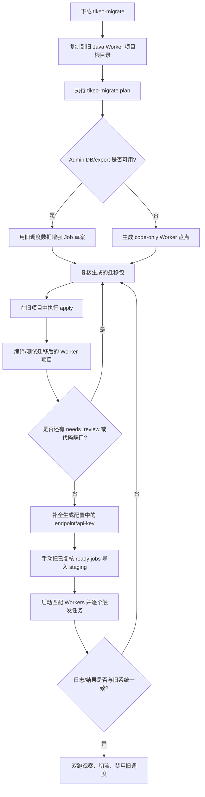
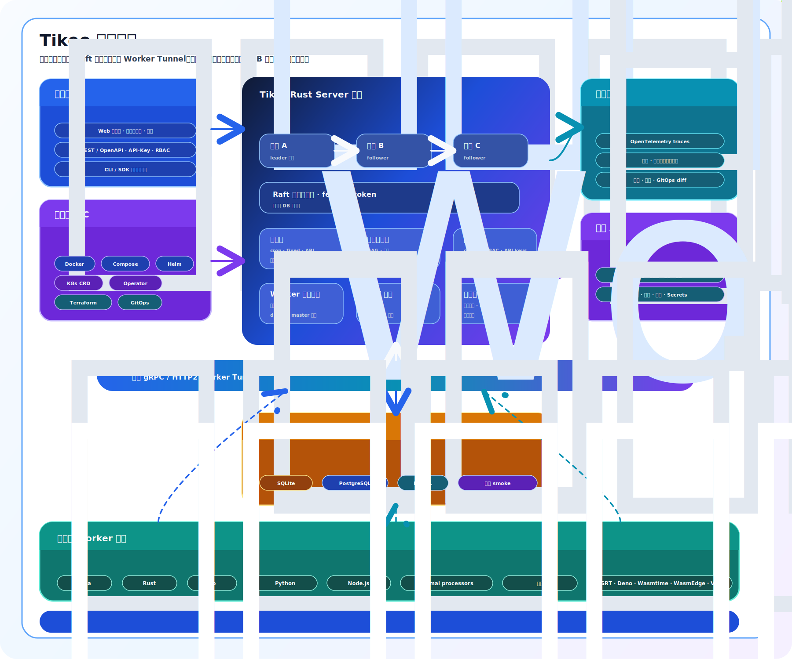

<p align="center">
  
</p>

<h1 align="center">Tikeo</h1>
<p align="center"><strong>面向已经超越传统任务调度器阶段团队的开源任务编排平台。</strong></p>
<p align="center">
  <strong>读音：</strong><code>/ˈtɪ.ki.oʊ/</code> · <em>TIH-kee-oh</em><br />
  <strong>在本项目中的含义：</strong><strong>Ti</strong>me-aware orchestration（时间感知编排）+ <strong>Ke</strong>pt execution evidence（保留执行证据）+ <strong>O</strong>pen worker ecosystem（开放 Worker 生态）——让每一次任务调度都成为可追踪、可治理的平台事件。
</p>

<p align="center">
  <a href="https://docs.tikeo.net/zh-CN/">📚 文档站</a> ·
  <a href="README.md">🇺🇸 English</a> ·
  <a href="deploy/compose/README.md">🐳 Docker Compose</a> ·
  <a href="sdks/README.md">🧩 SDKs</a> ·
  <a href="examples/README.md">🚀 Examples</a> ·
  <a href="deploy/terraform/README.md">🌍 Terraform</a> ·
  <a href="deploy/k8s/operator/README.md">☸️ Operator</a>
</p>

<p align="center">
  <a href="https://github.com/yhyzgn/tikeo/actions/workflows/ci.yml"></a>
  <a href="https://github.com/yhyzgn/tikeo/releases"></a>
  <a href="https://codecov.io/gh/yhyzgn/tikeo"></a>
  <a href="LICENSE"></a>
</p>


<p align="center">
  <strong>无需暴露 Worker 入站端口。</strong> 多语言 Worker、工作流画布、受治理脚本与可审计执行证据。
</p>

<p align="center">
  
</p>

<p align="center">
  <a href="#快速开始">快速开始</a> ·
  <a href="#tikeo-vs-xxl-job-vs-powerjob">对比 XXL-Job / PowerJob</a> ·
  <a href="https://docs.tikeo.net/zh-CN/docs/development/product-readiness-acceptance">验收清单</a> ·
  <a href="examples/README.md">运行 Worker Demo</a> ·
  <a href="assets/docs/tikeo-architecture.zh-CN.svg">架构图</a>
</p>

<p align="center">
  <a href="sdks/java/README.md"></a>
  <a href="sdks/rust/tikeo/README.md"></a>
  <a href="sdks/go/tikeo/README.md"></a>
  <a href="sdks/python/tikeo/README.md"></a>
  <a href="sdks/nodejs/tikeo/README.md"></a>
</p>

<p align="center">
  <a href="https://central.sonatype.com/artifact/net.tikeo/tikeo"></a>
  <a href="https://central.sonatype.com/artifact/net.tikeo/tikeo-spring"></a>
  <a href="https://central.sonatype.com/artifact/net.tikeo/tikeo-spring6"></a>
  <a href="https://central.sonatype.com/artifact/net.tikeo/tikeo-spring5"></a>
  <a href="https://central.sonatype.com/artifact/net.tikeo/tikeo-spring-boot-starter"></a>
  <a href="https://central.sonatype.com/artifact/net.tikeo/tikeo-spring-boot3-starter"></a>
  <a href="https://central.sonatype.com/artifact/net.tikeo/tikeo-spring-boot2-starter"></a>
</p>

<p align="center">
  <a href="https://crates.io/crates/tikeo"></a>
  <a href="https://pkg.go.dev/github.com/yhyzgn/tikeo/sdks/go/tikeo"></a>
  <a href="https://pypi.org/project/tikeo/"></a>
  <a href="https://www.npmjs.com/package/@yhyzgn/tikeo"></a>
</p>

<p align="center">
  <a href="https://hub.docker.com/r/yhyzgn/tikeo-server"></a>
  <a href="https://hub.docker.com/r/yhyzgn/tikeo-web"></a>
  <a href="https://hub.docker.com/r/yhyzgn/tikeo-docs"></a>
  
  
  
  
</p>

---

## 不要再选择“只会调度”的调度器

XXL-Job 和 PowerJob 推动了实用型分布式任务执行的普及。Tikeo 面向下一个阶段：平台团队需要的不只是调度器，而是一个调度器、工作流引擎、Worker 集群控制面、脚本治理层和可发布 SDK 共同组成的统一开源系统。

Tikeo 的目标，是在有人提出下面这个问题时，成为默认答案：

> “云原生任务调度、工作流编排、脚本任务、Worker 治理，以及可观测执行证据，我们应该选什么？”

## 10 秒速览：为什么值得关注

| 信号 | 为什么重要 |
| --- | --- |
| **5 条生产级 SDK 轨道** | **Java · Rust · Go · Python · Node.js** Worker 遵循同一份契约，同一组 Worker 集群也可以混合多种语言，而不是只能围绕 Java-first 执行器模型建设。 |
| **出站 Worker Tunnel** | Worker 主动连接服务端；生产业务服务不需要暴露入站任务执行端口。 |
| **结构化能力路由** | 调度匹配类型化的 **Normal Processor**、**插件 Processor** 和 **脚本 Runner**，不再依赖魔法字符串解析。 |
| **沙箱优先的脚本任务** | `auto` 对原生脚本选择 **SRT**，对 JS/TS 选择 **Deno**，同时也支持显式使用 **WASM/V8/container** 路径。 |
| **工作流 + 拓扑 UX** | 可视化工作流画布、依赖拓扑、影响分析、回放数据，以及广播任务的按 Worker 结果。 |
| **灰度安全门禁** | Jobs 可把显式触发路由到灰度目标，基于已持久化 canary 实例失败率做指标门禁，并自动把流量回滚到 `0%`。 |
| **运维级执行证据** | **重试**、**Misfire 策略**、**灰度回滚证据**、**任务日志**、**审计日志**、**OpenTelemetry**、指标与文件日志一起回答“到底发生了什么”。 |
| **多 DB 部署自由度** | 本地从 **SQLite** 快速启动，生产可用 **PostgreSQL** 或 **MySQL**，并配套 Compose profiles 与迁移兼容验证。 |
| **云原生发布面** | Docker、Compose、Helm、Kubernetes CRD/operator、Terraform provider、GitOps diff 和跨平台 release assets。 |
| **实时运维驾驶舱** | Web Dashboard 在一个页面中聚合 KPI 卡片、12 小时执行趋势、实例状态分布、任务计划轨道、队列压力、通知投递、HA/网关诊断、审计活动、Worker Mesh 分布、能力覆盖和风险信号。 |

<p align="center">
  <strong>关键词：</strong>
  <kbd>Rust control plane</kbd>
  <kbd>Worker Tunnel</kbd>
  <kbd>Structured Capabilities</kbd>
  <kbd>Script Sandbox</kbd>
  <kbd>Workflow Canvas</kbd>
  <kbd>RBAC</kbd>
  <kbd>OpenTelemetry</kbd>
  <kbd>Terraform</kbd>
  <kbd>K8s Operator</kbd>
</p>

## 产品承诺

| 承诺 | 在实践中意味着什么 |
| --- | --- |
| 🧠 **一个编排大脑** | **Cron**、**fixed-rate**、**API 触发**、**广播**、**工作流**、**脚本**、**插件** 和 **SDK** 任务共享同一个受治理的实例模型。 |
| 🔌 **无需暴露执行器端口** | Worker 通过 **出站 gRPC tunnel** 主动连接；业务服务保持在正常网络边界之后。 |
| 🧱 **类型化调度，不靠传说约定** | 路由使用结构化 **normal processors**、**plugin processor types**、**script languages**、**sandbox backends**、标签和选举字段。 |
| 🛡️ **脚本就是受治理的工作负载** | 不可变版本、摘要校验、审批元数据、策略限制、任务级日志和沙箱自动选择都是一等能力。 |
| 🧩 **SDK 天生对齐** | **Java/Rust/Go/Python/Node.js** 在 Worker 注册、任务日志、重试、Management API、沙箱行为和诊断上保持一致。 |
| 📈 **证据优先的运维体验** | 实例结果、重试日志、广播 Worker 分组、终端风格日志、审计轨迹、OTel trace、指标和 GitOps diff 都是内建能力。 |
| 🧭 **Dashboard 就是运维驾驶舱** | `/dashboard` 页面读取实例、Worker、调度队列、通知投递、集群诊断和审计数据；SSE 保持实时刷新，并以 3 秒轮询兜底。 |

## 创新地图

| 创新点 | Tikeo 优势 | 它消除了哪些传统痛点 |
| --- | --- | --- |
| **Worker Tunnel** | Worker 通过带 lease/fencing 元数据的出站 tunnel 拉取任务。 | 入站执行器暴露和脆弱的回调假设。 |
| **Raft FSOD 集群** | Raft 提供一个带 fencing 的控制面权威，shard ownership 让 active Server Pod 分摊派发，durable outbox 在 Worker Tunnel 故障切换时保留派发事实。 | active-passive 调度资源浪费、Redis/DB lock 所有权不清、Pod 本地派发状态丢失。 |
| **Capability Graph** | Worker 能力是类型化图：normal processors、plugins、scripts、tags、election domains。 | 模糊字符串约定，以及“为什么这个 Worker 收到这个任务”的排障困难。 |
| **Sandbox Auto Strategy** | `auto` 选择最安全且实用的运行时路径：原生脚本走 SRT，JS/TS 走 Deno，适当时走 Wasmtime/WASM。 | 把脚本当普通 shell command 执行，隔离边界不清。 |
| **Execution Evidence Model** | 每次 attempt、retry、worker result、broadcast child 和 task log 都可检查。 | 只能看状态、无法解释失败原因的控制台。 |
| **Open Platform Surface** | SDKs、Docker、Helm、Terraform、CRD/operator、GitOps diff、OpenAPI、OTel。 | 调度器因缺少集成面而阻碍落地。 |


## Web 运维驾驶舱

Web 控制台不只是配置界面。Dashboard 被设计成部署前后和日常巡检时的运维驾驶舱：

| Dashboard 区域 | 数据来源 | 帮助判断什么 |
| --- | --- | --- |
| KPI 条 | Jobs、instances、Workers | 启用任务数、活跃/失败实例数，以及是否有在线 Worker。 |
| 12 小时执行趋势 | `/api/v1/instances/stream` 和 Job instance 历史 | 失败或突增是近期、孤立，还是已经形成趋势。 |
| 实例状态分布 | 持久化 instance status/result | 当前实例主要处于等待、运行、成功、失败、重试还是取消。 |
| 任务计划轨道 | Job schedule 元数据 | 哪些 Cron/fixed/API 任务是当前最值得检查的计划。 |
| 队列压力 | `/api/v1/dispatch-queue` 与 `/api/v1/dispatch-queue/stream` | 继续触发任务前，dispatch backlog 是否正在增长。 |
| 通知投递 | `/api/v1/alert-delivery-attempts:queue-status` | 通知是已投递、等待重试、失败，还是进入死信。 |
| HA / 网关面板 | `/api/v1/cluster/diagnostics` | Raft/Smart Gateway、本地/远端 Worker 数和 outbox 总量是否健康。 |
| Worker Mesh 与能力覆盖 | `/api/v1/workers` 与 `/api/v1/workers/stream` | 哪些 namespace/app 有在线容量，以及真实广告了哪些能力。 |
| 审计活动与风险信号 | `/api/v1/audit-logs`、队列、通知、实例和集群数据 | 当前控制台状态是否适合继续操作，还是应该先进入事故排查。 |

Dashboard 的实时区域优先使用 SSE，并以 3 秒刷新兜底，因此部署代理必须支持流式响应。参见 [Dashboard 用户指南](docs/i18n/zh-CN/docusaurus-plugin-content-docs/current/user-guide/dashboard.md) 与 [SSE 实时刷新部署注意事项](docs/i18n/zh-CN/docusaurus-plugin-content-docs/current/deployment/sse-realtime.md)。

## 验收与交接清单

发布签核或开发交接时，使用文档站中的[产品就绪验收清单](https://docs.tikeo.net/zh-CN/docs/development/product-readiness-acceptance)。如果要查看 `v0.3.10` 的具体证据包，使用 [v0.3.10 发布验收包](https://docs.tikeo.net/zh-CN/docs/development/release-acceptance-packet-v0.3.10)。验收清单把最容易停留在“看起来能用”的三块能力统一成证据门槛：

- **通知中心**：provider 测试发送、模板渲染、policy materialization、retry/DLQ 可见性和脱敏证明。
- **旧调度器迁移 CLI**：无副作用的 `tikeo-migrate plan`、在旧 Worker 项目中本地原地 `apply`、已复核 bundle、预发手动导入和 release assets。
- **Raft FSOD Server HA**：StatefulSet/外部 DB 部署形态、单一 fenced scheduler、active shard ownership、durable outbox 恢复、跨 Pod API 一致性、Worker gateway failover 和 Kind/预发证据。

证据包应随 release 或交接记录保存：命令或 UI 动作、检查的路由/文件、观察到的结果和产物路径。`v0.3.10` 的证据包记录了 31 个已上传 release assets、Kind HA 指标，以及用于 release-candidate 验证的跨语言 Worker soak gate。

如果本地没有 SaaS provider 凭据或真实云 Kubernetes 目标，可以先用以下命令收集可复现交接证据包：

```bash
./scripts/release-readiness-evidence.sh
```

该聚合脚本会运行 `scripts/notification-provider-e2e-smoke.sh`，在提供真实渠道输入时执行 `scripts/notification-real-provider-acceptance.sh`、否则记录真实 provider 边界，再运行 `scripts/migration-cli-full-chain-smoke.sh`；只有设置了 `TIKEO_CLOUD_HA_SERVER_URL` 时才会继续执行 `scripts/cloud-raft-ha-acceptance.sh`，否则会生成明确的 provider/云环境边界报告，并关联本地证据。

## 为什么评估者应该优先把 Tikeo 放进候选名单

### 1. 它覆盖的是更完整的真实平台问题

传统调度器往往停留在“在执行器上触发一个任务”。Tikeo 覆盖生产团队迟早会需要的外围能力：RBAC、owner 初始化、app 作用域 API Key、租户范围、插件处理器、脚本沙箱、拓扑、可回放日志、GitOps drift review、Terraform、Kubernetes CRD、Helm、Docker 镜像和 SDK 发布。

### 2. 它避开了约定式路由的隐性成本

依赖魔法字符串的调度器最终会变得难以运维。Tikeo 使用结构化能力声明进行路由。Worker 明确声明自己能运行什么，服务端显式匹配类型化 normal processors、plugin processor types，以及脚本语言/后端。

### 3. 它把脚本执行当成安全产品，而不是一个勾选项

Tikeo 的脚本模型默认假设脚本强大且有风险。平台区分脚本类型与沙箱后端，支持 `auto` 沙箱选择，并能解析 SRT/Deno/WASM 相关路径；除非明确指定，否则不会默认走重量级 Docker/Podman。

### 4. 它面向开源采用和中央包仓库发布而建设

仓库包含独立 SDK 包、示例、Compose 栈、Helm/K8s/Terraform 资产、发布流水线和文档入口。它是给真实团队消费的产品，而不是只能研究的 demo。

## 决策摘要

| 当你需要……就选择 Tikeo | 为什么这是决定性因素 |
| --- | --- |
| **一个平台，而不是一个定时器** | Jobs、workflows、workers、scripts、plugins、RBAC、audit 和 IaC 被统一设计。 |
| **多语言 Worker 采用** | 团队可以继续用 Java、Rust、Go、Python 或 Node.js 写业务代码，同时保持平台一致性。 |
| **安全意识更强的脚本执行** | 脚本治理和沙箱选择是模型的一部分，而不是事后补丁。 |
| **云原生运维模型** | Kubernetes、Terraform、Docker、OTel 和 release assets 是项目的一等入口。 |
| **清晰的失败取证** | 任务日志、重试日志、Worker attempts、审计轨迹和拓扑让失败可复盘。 |

## Tikeo vs. XXL-Job vs. PowerJob

这不是“功能数量炫耀”。这是传统 Java 任务调度器和云原生编排控制面之间的差异。Tikeo 最初设计时就对 XXL-Job 与 PowerJob 做过架构级拆解，并刻意替换掉它们最难平台化的限制：执行器入站端口、DB 锁选主、Java-first 运行时假设、弱脚本隔离，以及只能回答状态而很难解释事故的运维模型。

### 高级能力评估雷达

| 高级能力 | Tikeo 优势 | XXL-Job / PowerJob 取舍 |
| --- | --- | --- |
| ☁️ **云原生公共服务模型** | **Server 与 Worker 可以部署在不同容器、namespace、集群、VPC 或云厂商中。** Worker 通过 gRPC/HTTP2 tunnel 主动拨出；业务 Pod 不需要开放入站执行端口。 | XXL-Job Admin 回调 Executor；PowerJob Server 调 Worker 上报地址。遇到 NAT、服务网格、私有 Pod、跨集群时会变得别扭。 |
| 🐳 **部署与发布面** | **Docker、Compose、Helm、K8s CRD/operator、Terraform provider、GitOps diff、systemd、裸机配置、跨平台 release assets** 都是一等维护入口。 | 能部署，但不是 IaC/GitOps-first 的平台产品设计。 |
| 🗳️ **集群协调** | **Server 侧 Raft/fencing 调度所有权** + 结构化 Worker domain master election，避免全局 DB 调度锁，并让所有权可观测。 | XXL-Job 偏 DB lock；PowerJob 混合 DB lock/currentServer/PING 类选举，不是 durable consensus-first。 |
| 🔌 **Worker 网络模型** | **出站 Worker Tunnel** 在一个受控通道中承载注册、派发、心跳、任务日志和结果。默认不需要给 Worker 创建 Service/port。 | Executor/Worker 侧必须可被访问、配置和保护成入站服务。 |
| ⚡ **性能与资源取向** | **Rust native control plane + gRPC/protobuf + Tokio + 紧凑容器**，目标是低启动延迟、稳定内存、无 JVM 预热和高效长驻服务。 | JVM 平台成熟，但天然存在 JVM 内存底座、预热行为、更大的镜像和更重依赖树。 |
| 🧠 **统一编排模型** | Cron、fixed-rate、API 触发、工作流、广播、脚本、插件、retry/misfire、日志和审计共享同一套实例/证据模型。 | 能力通常散落在调度路径、执行器回调、本地 Worker 状态或插件约定中。 |
| 🛡️ **脚本与插件治理** | 脚本类型与沙箱后端分离。`auto` 默认优先轻量 SRT/Deno/WASM 路径；Docker/Podman/container 在明确需要时显式启用。不可变版本、摘要校验、审批、grant 和运行日志是一等能力。 | 脚本执行存在，但通常更像宿主侧代码执行或处理器扩展，不是完整沙箱治理产品。 |
| 🧩 **跨语言 Worker 集群** | Java、Rust、Go、Python、Node.js Worker 遵循同一套 tunnel、结构化能力、retry、日志、沙箱和 Management API 契约。**同一组 Worker 集群可以混合不同语言实现**，调度仍然基于类型化能力，而不是语言孤岛。 | 主要是 Java-first 采用模型；混合语言 fleet 往往需要额外自研集成。 |
| 🗄️ **多 DB 引擎兼容** | 开发可直接使用 SQLite，生产可运行 PostgreSQL 或 MySQL，并具备迁移/repository 兼容 smoke 覆盖和 Compose profiles。 | 通常更紧地绑定到某一个主要关系型后端和部署假设。 |
| 🔍 **证据优先运维** | 终端风格实例日志、按 Worker 分组的广播结果、retry attempts、审计轨迹、工作流 replay bundle、metrics、文件日志和 OpenTelemetry trace 都面向事故复盘设计。 | 传统调度器通常更容易回答“状态是什么”，但很难回答“到底为什么发生”。 |

### 详细产品矩阵

| 评估维度 | Tikeo | XXL-Job | PowerJob |
| --- | --- | --- | --- |
| **平台定位** | ✅ **完整编排平台**：jobs、workflows、workers、scripts、plugins、RBAC、observability、IaC。 | 成熟的 Java 任务调度器。 | 成熟的 Java 分布式任务平台。 |
| **Worker 连接模型** | ✅ 带 lease、generation、fencing、结构化注册、任务日志和结果的 **出站 gRPC/HTTP2 Worker Tunnel**。 | Admin/executor 回调模型；executor 可达性很关键。 | Worker server/address 模型；worker 可达性很关键。 |
| **Worker 入站端口** | ✅ 业务 Worker 默认 **不需要开放入站端口**；只有 Tikeo server 暴露管理面和 tunnel 入口。 | 通常需要 executor 入站端口。 | 通常需要 worker 入站端口。 |
| **云原生部署** | ✅ **Docker、Compose、Helm、K8s CRD/operator、Terraform provider、GitOps diff**，并提供 systemd/裸机模板。 | 可部署，但不是 GitOps/IaC-first。 | 可部署，但不是 GitOps/IaC-first。 |
| **集群所有权** | ✅ Server 侧 **Raft + fencing token** 调度所有权；Worker 侧结构化 worker-cluster master election 支持有序派发域。 | MySQL lock 风格协调。 | DB lock + server election 机制，不是 durable consensus-first 设计。 |
| **资源画像** | ✅ **Rust native control plane**，面向紧凑镜像、快速启动、可预测内存和无 JVM 预热。 | Java/Spring 运行时资源占用。 | Java/Spring/Akka/Vert.x 风格资源占用和多组件运行时。 |
| **路由契约** | ✅ **类型化 SDK/plugin/script capabilities**，不解析魔法字符串。 | 偏名称/字符串。 | 偏名称/tag。 |
| **语言生态** | ✅ **Java · Rust · Go · Python · Node.js** SDK 对齐；同一个逻辑 Worker 集群可以包含不同语言写成的 Worker。 | 主要是 Java 生态。 | 主要是 Java 生态。 |
| **数据库引擎** | ✅ **本地/开发用 SQLite，生产用 PostgreSQL 或 MySQL**，并有 migration/repository 兼容 smoke 覆盖。 | 主要偏 MySQL 部署。 | 主要偏 MySQL/H2 部署。 |
| **脚本执行** | ✅ **受治理版本 + 摘要校验 + SRT/Deno/WASM/V8/container** 策略。 | 有脚本执行，但不是完整的沙箱治理产品。 | 偏 Processor；沙箱治理不是核心。 |
| **工作流 UX** | ✅ **工作流画布 + 拓扑 + 影响分析 + 可回放执行数据。** | 以调度为中心的基础视图。 | 支持工作流，但较少聚焦类型化沙箱 + SDK 对齐。 |
| **安全模型** | ✅ **Owner 初始化、RBAC 矩阵、不透明 session、API keys、租户范围、审计轨迹、TLS/mTLS readiness。** | 管理员/用户模型。 | 管理员/用户模型。 |
| **安全态势中心** | ✅ **安全策略中心** 展示基于证据的态势：脚本默认拒绝策略、发布签名、通知目标脱敏、传输 TLS/mTLS、Raft transport token readiness 和最近策略拒绝。详见 [安全策略中心](https://docs.tikeo.net/zh-CN/docs/user-guide/security-policy-center)。 | 通常分散在管理员设置、日志和部署文档中。 | 通常分散在管理员设置、日志和部署文档中。 |
| **可观测性** | ✅ **OpenTelemetry、metrics、task logs、file logs、audit logs、worker grouping、replay bundle。** | 传统运维/日志。 | 传统运维/日志。 |
| **最佳适用场景** | 建设内部编排平台的团队，而不只是替换 cron。 | 希望使用熟悉调度器的 Java 团队。 | 希望使用分布式任务执行的 Java 团队。 |

**简短结论：** 当你想要现代编排控制面时选择 Tikeo；只有当你明确只想要更窄的 Java-first 调度器时，才选择传统调度器。

## 从 XXL-JOB 或 PowerJob 迁移

Tikeo 提供独立的 `tikeo-migrate` CLI 做迁移评估。请把它当成 **review-first 的迁移助手**，而不是盲目一键转换器。它的自动模式从旧 Java/Spring Worker 项目出发：先探测 XXL-JOB 或 PowerJob 代码/配置，再把旧 Admin 数据库视为可选增强。很多业务仓库本来就只是执行器/Worker，没有 Admin DB；这种情况不会失败，而是继续生成 code-only 盘点和代码迁移计划。

最简单的路径是“约定优先”：

```bash
cd ./legacy-worker
# 先自动探测 Java 项目和旧框架；Admin DB/export 是可选增强。
tikeo-migrate plan

# 在旧 Worker 项目目录中直接应用代码/配置改造。
tikeo-migrate apply --bundle ./.tikeo-migration

# 编译/测试迁移后的项目，然后人工补全生成配置中的 endpoint/api-key 占位符。
# 已复核的 jobs.tikeo.json/data-import-plan.json 通过控制台、API 或 GitOps 手动导入。
```

如果旧项目没有暴露 Spring datasource，可显式传旧调度器数据库：`--legacy-db-url jdbc:mysql://host:3306/xxl_job --legacy-db-user <user> --legacy-db-password <password>`。显式 DB 参数表示“现在就导出这个库”，失败会被报告；未显式指定 DB 时，Admin DB 缺失或不可达不是阻塞项。Worker-only 仓库会兜底扫描 XXL-JOB handler 或 PowerJob `BasicProcessor` 类，生成 **code-only** 草案；这些 Job 会被刻意标记为 `needs_review`，因为 schedule、路由、重试、参数和启用状态仍需和旧调度器核对。只有离线 JSON 审计文件才使用 `--input ./exports/jobs.json`。其他覆盖参数用于非标准目录：`--from xxl-job`、`--project ./legacy-worker`、`--output-dir ./migration-bundle`、`--namespace ops`、`--app billing`。

自动导出只需要旧库的只读 `SELECT` 权限，会依次尝试已知调度器表：XXL-JOB 的 `xxl_job_info` / `XXL_JOB_INFO` / `job_info`，以及 PowerJob 的 `pj_job_info` / `job_info` / `powerjob_job_info`。生产 URL 可使用 `jdbc:mysql://...`、`jdbc:postgresql://...`、`mysql://...`、`postgres://...` 或 `postgresql://...`；SQLite URL 只用于 `examples/migration/legacy-scheduler-fixtures` 下的本地 demo/CI fixture。

Release 会提供可直接运行、未压缩的 `tikeo-migrate` 二进制，覆盖 Linux x86_64/arm64、macOS Intel/Apple Silicon、Windows x86_64/arm64。用户从 GitHub Release 下载 `tikeo-migrate-${TIKEO_VERSION}-<target>` 或 `tikeo-migrate-${TIKEO_VERSION}-<target>.exe`；Unix 平台如有需要先 `chmod +x`，然后把二进制放进 `PATH`，或直接复制到旧项目根目录即可。



迁移阶段：

| 阶段 | 目标 | 主要命令 / 产物 | 进入下一阶段的条件 |
| --- | --- | --- | --- |
| 0. 准备 | 明确 namespace/app、staging Server URL、API key 负责人、回滚负责人和 Worker processor 命名。 | 内部迁移计划。 | 已有 staging Tikeo Server 和匹配 Worker 方案。 |
| 1. 探测/导出 | 把旧调度器状态保存为审计输入。 | `tikeo-migrate plan` 先探测 Worker 代码，再可选读取 Spring datasource / `--legacy-db-url` 增强，或读取 `--input` 兜底 JSON；Worker-only 仓库会做 code-only handler 扫描。 | 生成的 `manifest.json` 记录 `legacy-db:...`、`json-file:...` 或 `code-only:...` input origin 和用于复核的 source snapshots。 |
| 2. 规划 | 生成非破坏性迁移包。 | `tikeo-migrate plan` → `.tikeo-migration/`。 | 已复核 `manifest.json`、`jobs.tikeo.md`、`data-import-plan.json`、`CHECKLIST.md`。 |
| 3. 消解差异 | 不假装旧语义完全等价，而是显式翻译。 | 复核 `needs_review`、Java patch guidance、unsupported-feature warnings。 | broadcast/map-reduce/routing/blocking/pinning/glue 等语义已有明确处理方案。 |
| 4. 代码改造 | 直接在旧项目中添加 Tikeo Worker 依赖、就地 Spring 配置占位符、processor 注解或适配器。 | `tikeo-migrate apply --bundle ./.tikeo-migration` + 编译/测试。 | 项目已在迁移分支中被修改；迁移后可编译，原旧调度器配置文件中已包含 Tikeo 占位配置，processor name 与 job 草案匹配。 |
| 5. 导入 | 只在代码迁移和复核完成后导入。 | 使用 Tikeo 控制台、Management API 或 GitOps 流程消费 `jobs.tikeo.json` / `data-import-plan.json`。 | 只导入已复核 ready jobs；endpoint/api-key 在迁移 CLI 外补全。 |
| 6. 验证切流 | 切流前逐项对比行为。 | 逐个触发任务；对比 Tikeo instance logs/results 和旧系统。 | 双跑证据通过，回滚步骤已记录。 |

生成的迁移包刻意保守：`plan` 不改旧源码、不写 Tikeo 数据；它可能用只读连接读取旧调度器数据库来增强复核包。本地 `apply` 会直接修改旧 Worker 项目，生成 `code-apply-evidence.json` 与 `CODE_MIGRATION_REPORT.md`，并把完整的 `tikeo.worker.*` / `tikeo.management.*` 占位配置追加到原来已经包含 XXL-JOB 或 PowerJob 配置的 `application*` / `bootstrap*` 文件中。它不会创建单独的迁移 profile，不会复制项目，也不会调用 Tikeo Server；导入已复核任务时，在补全部署配置后手动执行。完整说明见[旧调度器迁移指南](https://docs.tikeo.net/zh-CN/docs/integrations/migrating-from-legacy-schedulers)。

## 评估清单

如果你的调度器候选清单包含下面这些要求，Tikeo 应该被放到最前面：

- [x] **Worker 不能开放入站端口**，因为它们运行在 K8s namespace、私有 VPC、NAT、服务网格或客户网络中。
- [x] **Docker/Compose/K8s/Helm/Terraform/GitOps** 必须是产品的一部分，而不是后补示例。
- [x] **Server 调度所有权不能依赖全局 DB 锁**；你需要 Raft/fencing 风格的所有权证据。
- [x] **Worker 服务集群需要确定性 master election**，以便在不引入额外分布式锁的前提下保证有序派发。
- [x] **多语言 Worker** 必须在 Java、Rust、Go、Python、Node.js 之间共享一套平台契约，即使它们位于同一组 Worker fleet 中。
- [x] **多 DB 引擎兼容** 是硬要求：SQLite 用于快速本地启动，PostgreSQL/MySQL 用于生产和团队环境。
- [x] **脚本沙箱治理** 必须支持轻量默认策略和显式运行时策略，而不是“直接在宿主机跑 shell”。
- [x] **性能和资源占用很重要**：native server、紧凑镜像、无 JVM 预热、稳定内存行为。
- [x] **工作流 + 拓扑可视化** 应该展示依赖、影响分析、回放数据和按 Worker 分组的广播结果。
- [x] **RBAC + API-Key + audit + OTel + durable logs** 是真实平台运维的基本要求。

## 架构

<p align="center">
  
</p>

服务端负责调度、持久化、治理、RBAC、工作流和派发决策。Worker 负责执行，并声明自己能安全运行什么。脚本以不可变版本派发，只会由暴露兼容沙箱 runner 的 Worker 执行。

### 核心流程

| 流程 | 发生了什么 |
| --- | --- |
| **任务调度** | Cron/fixed/API triggers 创建实例，应用 retry/misfire 策略，并入队派发工作。 |
| **Worker 注册** | Worker 拨入 tunnel，发送结构化能力，接收权威 `worker_id`，并续约 lease。 |
| **派发** | 服务端在分配任务前匹配 namespace/app、worker state、master election 和类型化能力。 |
| **执行证据** | Worker 发送任务级日志和结果 payload；广播模式存储按 Worker 的 attempts 和 outcomes。 |
| **治理** | RBAC、API keys、tenant scopes、script approvals、audit logs 和 GitOps diff 让变更可复盘。 |

## 快速开始

### 1. 启动控制面

```bash
./scripts/dev.sh
```

这会启动 Rust server 和 React web console，把日志流式输出到终端，同时也把本地日志写入 `.dev/`。

打开 <http://127.0.0.1:5173>。全新数据库会进入首次 owner 设置页面。owner 创建完成后注册入口关闭，用户和角色在控制台内部管理。

### 2. 写入真实评估数据

```bash
./scripts/dev-seed.sh
```

种子数据会提供 namespaces、apps、示例任务、脚本、工作流、审计记录和实例日志，让你可以立即评估控制台，而不是面对空产品。

### 3. 用你偏好的语言启动 Worker

```bash
# Rust
(cd examples/rust/worker-demo && cargo run)

# Go
(cd examples/go/worker-demo && go run .)

# Python
(cd examples/python/worker-demo && python -m pip install -e ../../../sdks/python/tikeo -e . && python -m tikeo_python_worker_demo)

# Node.js / Bun
(cd examples/nodejs/worker-demo && bun install && bun start)

# Java / Spring Boot 4
(cd examples/java/spring-boot4-worker-demo && ./scripts/run-demo-worker.sh)
```

### 4. 触发并检查

在 Web 控制台中：

1. 打开 **Workers**，确认 Worker 已出现并显示结构化能力。
2. 打开 **Jobs**，触发一个种子 SDK/script/plugin 任务。
3. 打开 **Instances**，检查状态、重试 attempts、按 Worker 的广播结果和终端风格日志。
4. 打开 **Topology** 或 **Workflows**，检查依赖关系和可视化编排。

这条路径会验证完整价值主张：**control plane**、**worker tunnel**、**SDK execution**、**capability matching**、**task logs**、**retry/result evidence** 和 **visual operations**。

快速开始后的预期证据点：

| 证据点 | 在哪里查看 |
| --- | --- |
| **Worker 已连接** | Workers 页面显示已注册 Worker 和结构化能力。 |
| **派发是结构化的** | 任务触发时按 namespace/app 和类型化 processor/script/plugin capability 选择 Worker。 |
| **执行可解释** | Instances 页面显示状态、重试进度、worker id、结果和终端日志。 |
| **灰度可回滚** | Jobs 页面配置灰度目标、比例和指标门禁；触发响应会显示是否命中灰度或被失败率门禁自动回滚。 |
| **工作流可见** | Workflow 和 topology 页面显示依赖，而不是把编排隐藏在代码里。 |

## 你可以用 Tikeo 构建什么

这些不是需要你再拼装的独立产品。它们都是 Tikeo 的运行模式。

| 场景 | 高价值关键词 | Tikeo 如何帮助 |
| --- | --- | --- |
| **内部平台调度器** | `Worker Tunnel` · `RBAC` · `API-Key` | 让每个服务团队以受治理方式注册 processors 和触发任务，同时不开放入站端口。 |
| **数据与对账任务** | `Retry` · `Misfire` · `Task Logs` | 通过 retries、logs、app scopes 和多语言 SDK 运行周期性或 API 触发任务。 |
| **脚本运维中心** | `SRT` · `Deno` · `WASM` · `Digest` | 审批脚本、发布不可变版本、在声明沙箱中运行，并把输出绑定到实例。 |
| **工作流自动化** | `Canvas` · `Topology` · `Replay` | 将任务组合成可视化工作流，并在修改依赖前检查拓扑/影响。 |
| **Kubernetes 平台集成** | `Helm` · `CRD` · `Terraform` | 使用 Helm、CRDs、operator status、Terraform diff 和 Docker images，无需重写调度器。 |
| **可审计运维** | `Audit` · `OTel` · `Worker Results` | 追踪谁改了什么、哪个 Worker 运行了什么、为什么派发失败，以及每次重试发生了什么。 |

## 运维真正需要的配置

配置文件位于 `config/`。Docker/Compose 部署中，应直接编辑并挂载对应配置文件，不要把服务配置分散到环境变量里。完整默认值表见文档站 [配置参考](https://docs.tikeo.net/zh-CN/docs/reference/configuration)；新增运行时配置时以该页面作为运维检查清单。

```yaml
storage:
  database:
    type: postgres
    host: postgres
    port: 5432
    username: tikeo
    password: "p@ss/word:with#chars"
    database: tikeo
    params:
      sslmode: disable

cluster:
  mode: standalone
  scheduler_shard_map_version: 1
  scheduler_shard_count: 64

notification_delivery:
  enabled: true
  interval_seconds: 60
  batch_size: 50
  max_attempts: 3
  backoff_seconds: 300

observability:
  logging:
    level: info
    log_dir: ./logs
  tracing:
    enabled: true
    otlp_endpoint: "http://otel-collector:4318/v1/traces"
```

存储支持：

| Backend | 推荐用途 |
| --- | --- |
| SQLite | 本地开发、demo、单节点 smoke validation。 |
| PostgreSQL | 生产和共享环境。 |
| MySQL | 生产环境中 MySQL 是平台标准时。 |
| CockroachDB-compatible PostgreSQL wire | 使用 PostgreSQL 协议兼容能力的分布式 SQL 环境。 |

## 行为一致的 SDK

| Language | Package | 运行时要求 | 适合什么 | 日志契约 |
| --- | --- | --- | --- | --- |
| Java | `net.tikeo:tikeo`, Spring Boot starters | **Java 17+**；CI 使用 Temurin 21 验证。 | 企业 Spring Worker 和管理自动化。 | SLF4J diagnostics；任务日志通过 `TaskContext`。 |
| Rust | `tikeo` | **Rust 1.95+**（`rust-version = "1.95"`）。 | 原生 Worker、高性能运行时、具备沙箱能力的服务。 | `SdkLogConfig`，console + 可选 `tikeo-sdk.log`。 |
| Go | Go module | **Go 1.26+**（`go 1.26`）。 | 平台服务、operators、云原生 Worker。 | `Logger` bridge，console + 可选 `tikeo-sdk.log`。 |
| Python | `tikeo` | **Python 3.11+**；CI 使用 Python 3.12 验证。 | 数据任务、自动化、脚本友好 Worker。 | stdlib `logging`，console + 可选 `tikeo-sdk.log`。 |
| Node.js | `@yhyzgn/tikeo` | **Node.js 24+**；仓库构建/测试脚本使用 Bun。 | JS/TS Worker 和 Web 平台自动化。 | `configureSdkLogging`，console + 可选 `tikeo-sdk.log`。 |

所有 SDK 遵循同一条规则：SDK diagnostics 描述 Worker/runtime 生命周期；task logs 描述某个具体任务实例。这个分离能防止无关进程噪音污染执行日志。

## 从中央仓库安装 SDK

每个 Worker 服务只引入 **一个** SDK 依赖。不要手动显式引用上游/传递的 Tikeo 模块：Gradle、Maven、
Cargo、Go、pip、npm、pnpm、Bun 都会从你选择的单个依赖中解析所需的上游包。

本节版本占位符规则：

- 将 `${TIKEO_VERSION}` 替换为 README 顶部对应徽标显示的版本号，例如 `release`、`Java core`、
  `Boot 3 starter`、`Rust SDK`、`Node.js SDK` 等徽标。
- Go module 命令使用 tag 语法，因此写作 `v${TIKEO_VERSION}`。
- npm、PyPI、crates.io、Maven Central 使用不带 `v` 的 `${TIKEO_VERSION}`。

| Language | 中央仓库 | Package name | 运行时要求 | 安装目标 |
| --- | --- | --- | --- | --- |
| Java | Maven Central | `net.tikeo:*` | Java 17+ | 一个 `net.tikeo` artifact，版本为 `${TIKEO_VERSION}`。默认：`tikeo-spring-boot-starter`。 |
| Rust | crates.io | `tikeo` | Rust 1.95+ | `${TIKEO_VERSION}` |
| Go | Go module proxy | `github.com/yhyzgn/tikeo/sdks/go/tikeo` | Go 1.26+ | tag `v${TIKEO_VERSION}` |
| Python | PyPI | `tikeo` | Python 3.11+ | `${TIKEO_VERSION}` |
| Node.js | npm | `@yhyzgn/tikeo` | Node.js 24+ | `${TIKEO_VERSION}` |

### Java / Maven Central

新 Java 服务默认选择 **Spring Boot 4** 的 `net.tikeo:tikeo-spring-boot-starter`。
每个应用只选择 **一个** artifact。Spring Boot starter 会传递引入匹配的 core SDK 和 Spring adapter，
因此不要再额外声明 `tikeo` 或 `tikeo-spring*`，除非你在做手动依赖治理。

| Artifact | 什么时候只添加这个依赖 | Gradle Kotlin DSL 写法 |
| --- | --- | --- |
| `net.tikeo:tikeo-spring-boot-starter` | 新 Java 服务默认选择：Spring Boot 4 / Spring Framework 7 自动配置。 | `implementation("net.tikeo:tikeo-spring-boot-starter:${TIKEO_VERSION}")` |
| `net.tikeo:tikeo-spring-boot3-starter` | Spring Boot 3 / Spring Framework 6 自动配置。 | `implementation("net.tikeo:tikeo-spring-boot3-starter:${TIKEO_VERSION}")` |
| `net.tikeo:tikeo-spring-boot2-starter` | Spring Boot 2 / Spring Framework 5 自动配置。 | `implementation("net.tikeo:tikeo-spring-boot2-starter:${TIKEO_VERSION}")` |
| `net.tikeo:tikeo` | 原生 Java Worker、management client、sandbox tooling 或低层 Worker Tunnel 集成。 | `implementation("net.tikeo:tikeo:${TIKEO_VERSION}")` |
| `net.tikeo:tikeo-spring` | 不使用 Boot starter，手动接线 Spring Framework 7 adapter。 | `implementation("net.tikeo:tikeo-spring:${TIKEO_VERSION}")` |
| `net.tikeo:tikeo-spring6` | 不使用 Boot starter，手动接线 Spring Framework 6 adapter。 | `implementation("net.tikeo:tikeo-spring6:${TIKEO_VERSION}")` |
| `net.tikeo:tikeo-spring5` | 不使用 Boot starter，手动接线 Spring Framework 5 adapter。 | `implementation("net.tikeo:tikeo-spring5:${TIKEO_VERSION}")` |

Gradle Kotlin DSL 示例：

```kotlin
repositories {
    mavenCentral()
}

dependencies {
    // 新 Java 服务默认：Spring Boot 4。
    implementation("net.tikeo:tikeo-spring-boot-starter:${TIKEO_VERSION}")

    // 运行时需要时，从下面替代项里只选择一个：
    // implementation("net.tikeo:tikeo-spring-boot3-starter:${TIKEO_VERSION}") // Spring Boot 3
    // implementation("net.tikeo:tikeo-spring-boot2-starter:${TIKEO_VERSION}") // Spring Boot 2
    // implementation("net.tikeo:tikeo:${TIKEO_VERSION}")                      // 原生 Java
    // implementation("net.tikeo:tikeo-spring:${TIKEO_VERSION}")               // 手动 Spring Framework 7
    // implementation("net.tikeo:tikeo-spring6:${TIKEO_VERSION}")              // 手动 Spring Framework 6
    // implementation("net.tikeo:tikeo-spring5:${TIKEO_VERSION}")              // 手动 Spring Framework 5
}
```

Maven POM 示例——只复制 **一个** dependency block：

```xml
<dependencies>
  <!-- 新 Java 服务默认：Spring Boot 4 / Spring Framework 7。 -->
  <dependency>
    <groupId>net.tikeo</groupId>
    <artifactId>tikeo-spring-boot-starter</artifactId>
    <version>${TIKEO_VERSION}</version>
  </dependency>

  <!-- Spring Boot 3 / Spring Framework 6。 -->
  <!--
  <dependency>
    <groupId>net.tikeo</groupId>
    <artifactId>tikeo-spring-boot3-starter</artifactId>
    <version>${TIKEO_VERSION}</version>
  </dependency>
  -->

  <!-- Spring Boot 2 / Spring Framework 5。 -->
  <!--
  <dependency>
    <groupId>net.tikeo</groupId>
    <artifactId>tikeo-spring-boot2-starter</artifactId>
    <version>${TIKEO_VERSION}</version>
  </dependency>
  -->

  <!-- 原生 Java core SDK。 -->
  <!--
  <dependency>
    <groupId>net.tikeo</groupId>
    <artifactId>tikeo</artifactId>
    <version>${TIKEO_VERSION}</version>
  </dependency>
  -->

  <!-- 非 Boot 手动 Spring Framework 7 adapter。 -->
  <!--
  <dependency>
    <groupId>net.tikeo</groupId>
    <artifactId>tikeo-spring</artifactId>
    <version>${TIKEO_VERSION}</version>
  </dependency>
  -->

  <!-- 非 Boot 手动 Spring Framework 6 adapter。 -->
  <!--
  <dependency>
    <groupId>net.tikeo</groupId>
    <artifactId>tikeo-spring6</artifactId>
    <version>${TIKEO_VERSION}</version>
  </dependency>
  -->

  <!-- 非 Boot 手动 Spring Framework 5 adapter。 -->
  <!--
  <dependency>
    <groupId>net.tikeo</groupId>
    <artifactId>tikeo-spring5</artifactId>
    <version>${TIKEO_VERSION}</version>
  </dependency>
  -->
</dependencies>
```

#### Spring Boot starter 配置

Boot starter 使用属性配置。它会创建 processor registry、Worker Tunnel client、生命周期 hook、sandbox runner registry 和可选 management client。

```yaml
tikeo:
  worker:
    enabled: true
    auto-startup: true
    dry-run: ${TIKEO_WORKER_DRY_RUN:false}
    endpoint: ${TIKEO_WORKER_ENDPOINT:http://127.0.0.1:9998}
    client-instance-id: ${TIKEO_WORKER_CLIENT_INSTANCE_ID:}
    state-dir: ${TIKEO_WORKER_STATE_DIR:}
    namespace: ${TIKEO_WORKER_NAMESPACE:default}
    app: ${TIKEO_WORKER_APP:default}
    cluster: ${TIKEO_WORKER_CLUSTER:default}
    region: ${TIKEO_WORKER_REGION:default}
    capabilities: [java, spring-boot]
    labels:
      worker_pool: ${TIKEO_WORKER_POOL:java-blue}
      runtime: java

  management:
    enabled: ${TIKEO_MANAGEMENT_ENABLED:false}
    endpoint: ${TIKEO_MANAGEMENT_ENDPOINT:http://127.0.0.1:9090}
    api-key: ${TIKEO_MANAGEMENT_API_KEY:}
    namespace: ${TIKEO_MANAGEMENT_NAMESPACE:default}
    app: ${TIKEO_MANAGEMENT_APP:default}
```

```java
import net.tikeo.processor.TaskContext;
import net.tikeo.processor.TaskOutcome;
import net.tikeo.processor.TikeoProcessor;
import org.springframework.stereotype.Component;

@Component
public final class BillingProcessors {
    @TikeoProcessor("billing.reconcile")
    public TaskOutcome reconcile(TaskContext context, String payload) {
        context.logInfo("billing reconcile started");
        return new TaskOutcome(true, "processed:" + payload);
    }
}
```

#### 原生 Java core SDK 配置

原生 Java 不使用 `application.yml`。你需要自己构造 `WorkerRegistration`、提供 `TaskProcessor`，并启动 `GrpcTikeoWorkerClient`。

```java
import net.tikeo.processor.TaskOutcome;
import net.tikeo.processor.TaskProcessor;
import net.tikeo.worker.WorkerCapabilitySet;
import net.tikeo.worker.WorkerClusterElection;
import net.tikeo.worker.WorkerRegistration;
import net.tikeo.worker.client.GrpcTikeoWorkerClient;
import java.time.Duration;
import java.util.List;
import java.util.Map;

public final class TikeoPlainJavaWorker {
    public static void main(String[] args) {
        var registration = new WorkerRegistration(
            "orders-java-1",
            "default",
            "orders",
            "local",
            "local",
            List.of("java"),
            new WorkerCapabilitySet(
                List.of("java"),
                List.of("billing.reconcile"),
                List.of(),
                List.of()
            ),
            WorkerClusterElection.enabledByDefault(),
            Map.of("worker_pool", "java-core")
        );

        TaskProcessor processor = context -> {
            context.logInfo("plain Java task started");
            return new TaskOutcome(true, "ok:" + context.processorName());
        };

        var client = new GrpcTikeoWorkerClient(
            System.getenv().getOrDefault("TIKEO_WORKER_ENDPOINT", "http://127.0.0.1:9998"),
            registration,
            processor,
            Duration.ofSeconds(10)
        );
        Runtime.getRuntime().addShutdownHook(new Thread(client::close));
        client.start();
    }
}
```

原生 Java 使用 Management API 时，直接创建 `HttpTikeoJobClient(endpoint, apiKey, namespace, app)`，API key 从 Secret store 注入。

#### 非 Boot Spring Framework 配置

已有 Spring Framework 应用但不使用 Boot auto-configuration 时，选择 `tikeo-spring`、`tikeo-spring6` 或 `tikeo-spring5`。
你需要自己定义 registry 和 Worker client bean。

```java
import net.tikeo.spring.processor.TikeoProcessorRegistry;
import net.tikeo.spring.worker.SpringTikeoTaskProcessor;
import net.tikeo.worker.WorkerClusterElection;
import net.tikeo.worker.WorkerRegistration;
import net.tikeo.worker.client.GrpcTikeoWorkerClient;
import net.tikeo.worker.client.TikeoWorkerClient;
import java.time.Duration;
import java.util.List;
import java.util.Map;
import org.springframework.context.ApplicationContext;
import org.springframework.context.annotation.Bean;
import org.springframework.context.annotation.Configuration;

@Configuration
class TikeoSpringWorkerConfiguration {
    @Bean
    TikeoProcessorRegistry tikeoProcessorRegistry() {
        return new TikeoProcessorRegistry();
    }

    @Bean(initMethod = "start", destroyMethod = "close")
    TikeoWorkerClient tikeoWorkerClient(
        ApplicationContext applicationContext,
        TikeoProcessorRegistry registry
    ) {
        registry.scanExistingBeans(applicationContext);
        var registration = new WorkerRegistration(
            "orders-spring-1",
            "default",
            "orders",
            "local",
            "local",
            List.of("java", "spring"),
            registry.workerCapabilities(),
            WorkerClusterElection.enabledByDefault(),
            Map.of("worker_pool", "spring-manual")
        );
        return new GrpcTikeoWorkerClient(
            System.getenv().getOrDefault("TIKEO_WORKER_ENDPOINT", "http://127.0.0.1:9998"),
            registration,
            new SpringTikeoTaskProcessor(registry),
            Duration.ofSeconds(10)
        );
    }
}
```

### Rust / crates.io

```bash
cargo add tikeo@${TIKEO_VERSION}
```

```toml
[dependencies]
tikeo = "${TIKEO_VERSION}"
```

### Go / Go module proxy

```bash
go get github.com/yhyzgn/tikeo/sdks/go/tikeo@v${TIKEO_VERSION}
```

```go
import "github.com/yhyzgn/tikeo/sdks/go/tikeo"
```

### Python / PyPI

```bash
python -m pip install "tikeo==${TIKEO_VERSION}"
```

```python
from tikeo import Client, local_config
```

### Node.js / npm

```bash
bun add @yhyzgn/tikeo@${TIKEO_VERSION}
npm install @yhyzgn/tikeo@${TIKEO_VERSION}
pnpm add @yhyzgn/tikeo@${TIKEO_VERSION}
```

```ts
import { Client, WorkerConfig } from "@yhyzgn/tikeo";
```

### 所有 SDK 通用的 Worker 配置参考

Worker 服务使用 SDK 侧配置，和 Server 配置是两套入口。Java Spring Boot 暴露为 `tikeo.worker.*`；其他 SDK 暴露为等价的 `WorkerConfig` 字段或 demo 环境变量。

| 配置项 / SDK 字段 | 环境变量 | 是否必填 | 默认值 | 说明 |
| --- | --- | --- | --- | --- |
| `tikeo.worker.enabled` | `TIKEO_WORKER_ENABLED` | 否 | `true` | Spring Boot 自动配置开关；核心 SDK 没有这个全局开关。 |
| `tikeo.worker.auto-startup` | `TIKEO_WORKER_AUTO_STARTUP` | 否 | `true` | Spring Boot 生命周期自动启动开关。Tikeo Server / Worker Tunnel 临时不可达时，Boot starter 只记录 warning，不阻塞业务应用启动，Worker client 会继续后台重连。 |
| `endpoint` / `tikeo.worker.endpoint` | `TIKEO_WORKER_ENDPOINT` | 真实连接时必填 | demo 通常是 `http://127.0.0.1:9998` | Worker 进程可访问的 Worker Tunnel 地址；客户端 URL 不要写 `0.0.0.0`。 |
| `dry-run` | `TIKEO_WORKER_DRY_RUN` | 否 | `false` | 不建立真实 Worker Tunnel，适合测试和示例。 |
| `heartbeatEvery` / `heartbeat-interval-millis` | `TIKEO_WORKER_HEARTBEAT_INTERVAL_MILLIS` | 否 | `10000` ms / `10s` | Worker lease 续约周期，必须大于 0。 |
| `clientInstanceId` / `client-instance-id` | `TIKEO_WORKER_CLIENT_INSTANCE_ID` | 核心 SDK 必填；Boot 可空 | Boot 为空时生成并持久化 | 稳定客户端 hint；服务端仍分配权威 `worker_id`。 |
| `state-dir` | `TIKEO_WORKER_STATE_DIR` | 否 | Boot identity helper 使用 `~/.tikeo/workers` | 生成 client instance id 和本地沙箱工具缓存目录。 |
| `namespace` | `TIKEO_WORKER_NAMESPACE` | 否 | `default` | 派发和管理 scope 的租户/环境命名空间。 |
| `app` | `TIKEO_WORKER_APP` | 否 | `default` | 路由和管理操作的应用 scope。 |
| `cluster` | `TIKEO_WORKER_CLUSTER` | 否 | Java Boot `default`；其他 helper `local` | Worker 集群或环境分片。 |
| `region` | `TIKEO_WORKER_REGION` | 否 | Java Boot `default`；其他 helper `local` | Worker region/zone。 |
| `name` | `TIKEO_WORKER_NAME` | 否 | 通常为 client instance id | 运维可见 worker 名称。 |
| `version` | `TIKEO_WORKER_VERSION` | 否 | Go/Python/Node helper 为 `dev` | Worker/应用构建版本。 |
| `capabilities` | `TIKEO_WORKER_CAPABILITIES` | 否 | `[]` | 旧式/运维 metadata；支持 structured capabilities 时路由以 structured 为准。 |
| `labels` | `TIKEO_WORKER_LABELS` | 否 | `{}` | demo 使用逗号分隔 `key=value`；Spring Boot 使用 map。 |
| `structured.normalProcessors` | `TIKEO_WORKER_NORMAL_PROCESSORS`（兼容环境变量名） | 否 | 随 demo 而定 | 对外声明可派发的 normal processor 名称。 |
| `structured.scriptRunners` | `TIKEO_WORKER_SCRIPT_LANGUAGES` / SDK API | 否 | 随 demo 而定 | 对外声明可派发的脚本语言和沙箱 backend。 |
| `election.enabled` | `TIKEO_WORKER_ELECTION_ENABLED` | 否 | `true` | registration 中的 worker-cluster master election 开关。 |
| `election.domain` | `TIKEO_WORKER_ELECTION_DOMAIN` | 否 | 空 | 空表示 `namespace/app/cluster/region`。 |
| `election.priority` | `TIKEO_WORKER_ELECTION_PRIORITY` | 否 | `100` | 确定性选主优先级；数值越小越优先。 |
| `wasm.auto-install` | `TIKEO_WORKER_WASM_AUTO_INSTALL` | 否 | `true` | Wasmtime 不存在时自动安装。 |
| `wasm.install-version` | `TIKEO_WORKER_WASM_INSTALL_VERSION` | 否 | `latest` | Wasmtime 安装版本。 |
| `wasm.install-dir` | `TIKEO_WORKER_WASM_INSTALL_DIR` | 否 | `~/.tikeo/sandbox-tools/wasmtime` | 可选安装目录。 |
| `wasm.installer-url` | `TIKEO_WORKER_WASM_INSTALLER_URL` | 否 | `https://wasmtime.dev/install.sh` | Wasmtime installer URL。 |
| `wasm.install-timeout-millis` | `TIKEO_WORKER_WASM_INSTALL_TIMEOUT_MILLIS` | 否 | `120000` | Wasmtime 安装超时。 |
| `scripts.enabled` | `TIKEO_WORKER_SCRIPTS_ENABLED` | 否 | `true` | 启用动态脚本执行。 |
| `scripts.container-enabled` | `TIKEO_WORKER_SCRIPTS_CONTAINER_ENABLED` | 否 | `false` | 启用容器方式的 shell/python/node/powershell runner。 |
| `scripts.availability-check` | `TIKEO_WORKER_SCRIPTS_AVAILABILITY_CHECK` | 否 | `true` | 声明非 WASM 脚本能力前先探测 runtime。 |
| `scripts.runtime-command` | `TIKEO_WORKER_SCRIPTS_RUNTIME_COMMAND` | 否 | 空 | 显式 Docker 兼容 runtime 命令，例如 `docker` 或 `podman`。 |
| `scripts.runtime-args` | `TIKEO_WORKER_SCRIPTS_RUNTIME_ARGS` | 否 | `[]` | 镜像名前附加的 runtime 参数。 |
| `scripts.auto-install-tools` | `TIKEO_WORKER_SCRIPTS_AUTO_INSTALL_TOOLS` | 否 | `true` | 本地开发工具缺失时自动安装。 |
| `scripts.strict-sandbox-isolation` | `TIKEO_SANDBOX_STRICT_ISOLATION` / Boot: `TIKEO_WORKER_SCRIPTS_STRICT_SANDBOX_ISOLATION` | 否 | `false` | 严格沙箱隔离开关；开启后跳过宿主 `PATH` 工具/解释器，只使用 `TIKEO_SANDBOX_TOOLS_DIR` / `~/.tikeo/sandbox-tools` 中的二进制。 |
| `scripts.*-install-version` | `TIKEO_WORKER_SCRIPT_*_INSTALL_VERSION` | 否 | 各工具为 `latest` 或空 | SRT、ripgrep、Deno、Rhai、PowerShell、WasmEdge、V8 等工具版本。 |
| `scripts.*-install-dir` | `TIKEO_WORKER_SCRIPT_*_INSTALL_DIR` | 否 | `~/.tikeo/sandbox-tools/<tool>` | 工具安装/缓存目录。 |
| `scripts.*-installer-url` | `TIKEO_WORKER_SCRIPT_*_INSTALLER_URL` | 否 | 工具默认值 | Deno/WasmEdge 等 installer URL。 |
| `scripts.tool-install-timeout-millis` | `TIKEO_WORKER_SCRIPT_TOOL_INSTALL_TIMEOUT_MILLIS` | 否 | `120000` | 脚本工具安装超时。 |
| `scripts.images.*` | `TIKEO_WORKER_SCRIPT_IMAGE_*` | 否 | 空 | 每种语言的可选容器镜像；空表示不声明对应容器 runner。 |


### Sandbox 工具安装策略

- 自动安装只是**后台预热**，不会阻塞 Worker 启动、Spring Boot Context 启动或 SDK Client 构造。
- 默认模式可复用宿主 `PATH` 中可用的工具，但每个任务仍使用 sandbox `cwd`、`HOME`、`TMPDIR`、`DENO_DIR` 和 PowerShell/.NET 缓存目录。
- 如需强隔离，设置 `TIKEO_SANDBOX_STRICT_ISOLATION=1`（Java Boot：`tikeo.worker.scripts.strict-sandbox-isolation=true`）。开启后 SDK 只使用 `TIKEO_SANDBOX_TOOLS_DIR` / `~/.tikeo/sandbox-tools` 中的二进制。
- 工具缺失时不会声明对应脚本能力；任务仍命中不可用 runner 时会 fail-closed 并输出诊断，不会让业务进程崩溃。
- 生产建议把 SRT、Deno、ripgrep、Rhai、PowerShell、Wasmtime、WasmEdge 等工具预装到 Worker 镜像或宿主机。完整来源清单、手动安装方式和 Debian/Ubuntu、RHEL/UBI/Fedora、Alpine、Distroless Dockerfile 示例见[文档站：Worker 沙箱工具与 Dockerfile](docs/i18n/zh-CN/docusaurus-plugin-content-docs/current/deployment/worker-sandbox-tools.md)。


### Server 配置参考

Server 配置加载顺序是默认值、配置文件、`TIKEO__...` 环境变量覆盖。Docker/Compose 中优先编辑挂载的 `/config/tikeo.yml`；`TIKEO__...` 更适合 Kubernetes Secret、紧急覆盖或不方便挂载文件的平台。

| 配置项 | 环境变量 | 是否必填 | 默认值 | 说明 |
| --- | --- | --- | --- | --- |
| `server.listen_addr` | `TIKEO__SERVER__LISTEN_ADDR` | 否 | `0.0.0.0:9090` | HTTP API、健康检查、metrics、OpenAPI、Web API 目标的绑定地址。 |
| `server.worker_tunnel_addr` | `TIKEO__SERVER__WORKER_TUNNEL_ADDR` | 否 | `0.0.0.0:9998` | gRPC/HTTP2 Worker Tunnel 绑定地址；Worker 主动拨入。 |
| `storage.database.type` | `TIKEO__STORAGE__DATABASE__TYPE` | 否 | `sqlite` | `sqlite`、`postgres`、`mysql` 或 `cockroachdb`。 |
| `storage.database.path` | `TIKEO__STORAGE__DATABASE__PATH` | SQLite 模式 | `.dev/tikeo-dev.db`；生产模板 `/data/tikeo.db` | SQLite 文件路径，容器中要持久化 `/data`。 |
| `storage.database.host` | `TIKEO__STORAGE__DATABASE__HOST` | PostgreSQL/MySQL/CockroachDB | 省略时 `127.0.0.1` | 网络数据库 host。 |
| `storage.database.port` | `TIKEO__STORAGE__DATABASE__PORT` | 否 | Postgres `5432`、MySQL `3306` | 网络数据库端口。 |
| `storage.database.username` | `TIKEO__STORAGE__DATABASE__USERNAME` | 网络数据库通常必填 | 未设置 | 数据库用户名。 |
| `storage.database.password` | `TIKEO__STORAGE__DATABASE__PASSWORD` | 网络数据库通常必填 | 未设置 | 数据库密码，可包含 `@`、`/`、`:`、`#`；Tikeo 会对内部 URL 自动转义。 |
| `storage.database.database` | `TIKEO__STORAGE__DATABASE__DATABASE` | 网络数据库 | 省略时 `tikeo` | 数据库/schema 名。 |
| `storage.database.params.*` | 建议放配置文件 | 否 | SQLite 参数为空时使用 `mode=rwc` | 查询参数，例如 `sslmode=disable` 或 SQLite `mode=rwc`。 |
| `storage.timestamp_offset` | `TIKEO__STORAGE__TIMESTAMP_OFFSET` | 否 | `+00:00` | 写入 DB 时间戳时使用的 offset。 |
| `cluster.mode` | `TIKEO__CLUSTER__MODE` | 否 | `standalone` | `standalone` 或 `raft`；多 Pod Server HA 使用 raft。 |
| `cluster.node_id` | `TIKEO__CLUSTER__NODE_ID` | Raft 必填 | `standalone` | 稳定节点 id；Kubernetes 中用 pod name。 |
| `cluster.peers` | `TIKEO__CLUSTER__PEERS` | Raft 必填 | `[]` | 静态 peer 列表；数组结构建议放配置文件或 Helm values。 |
| `cluster.transport_token` | `TIKEO__CLUSTER__TRANSPORT_TOKEN` | Raft 必填 | 未设置 | 内部 Raft/relay 通信共享 token；放 Secret。 |
| `cluster.scheduler_shard_map_version` | `TIKEO__CLUSTER__SCHEDULER_SHARD_MAP_VERSION` | 否 | `1` | 调度 shard map 版本。 |
| `cluster.scheduler_shard_count` | `TIKEO__CLUSTER__SCHEDULER_SHARD_COUNT` | 否 | `64` | 逻辑调度 shard 数；同一 map version 内保持稳定。 |
| `auth.local_login_enabled` | `TIKEO__AUTH__LOCAL_LOGIN_ENABLED` | 否 | `true` | 本地用户名密码登录开关。 |
| `auth.api_tokens.default_ttl_seconds` | `TIKEO__AUTH__API_TOKENS__DEFAULT_TTL_SECONDS` | 否 | `43200` | API token 默认 TTL。 |
| `auth.api_tokens.min_ttl_seconds` | `TIKEO__AUTH__API_TOKENS__MIN_TTL_SECONDS` | 否 | `300` | 可申请的最小 token TTL。 |
| `auth.api_tokens.max_ttl_seconds` | `TIKEO__AUTH__API_TOKENS__MAX_TTL_SECONDS` | 否 | `2592000` | 可申请的最大 token TTL。 |
| `auth.oidc.enabled` | `TIKEO__AUTH__OIDC__ENABLED` | 否 | `false` | 启用 OIDC 登录。 |
| `auth.oidc.issuer_url` | `TIKEO__AUTH__OIDC__ISSUER_URL` | OIDC 启用时 | 未设置 | OIDC issuer URL。 |
| `auth.oidc.client_id` | `TIKEO__AUTH__OIDC__CLIENT_ID` | OIDC 启用时 | 未设置 | OIDC client id。 |
| `auth.oidc.client_secret` | `TIKEO__AUTH__OIDC__CLIENT_SECRET` | OIDC 启用时 | 未设置 | OIDC client secret。 |
| `auth.oidc.scopes` | `TIKEO__AUTH__OIDC__SCOPES` | 否 | `openid,profile,email` | 列表结构建议放配置文件。 |
| `transport_security.http.*` | `TIKEO__TRANSPORT_SECURITY__HTTP__*` | 启用时 | TLS/mTLS 关闭 | HTTP listener TLS/mTLS 和证书、私钥、client CA 路径。 |
| `transport_security.worker_tunnel.*` | `TIKEO__TRANSPORT_SECURITY__WORKER_TUNNEL__*` | 启用时 | TLS/mTLS 关闭 | Worker Tunnel TLS/mTLS 和证书、私钥、client CA 路径。 |
| `observability.logging.level` | `TIKEO__OBSERVABILITY__LOGGING__LEVEL` | 否 | `info` | 未设置 `RUST_LOG` 时的默认日志级别。 |
| `observability.logging.log_dir` | `TIKEO__OBSERVABILITY__LOGGING__LOG_DIR` | 否 | 未设置；生产模板 `/logs` | 除 stdout 外额外写 `tikeo.log`；容器中启用时挂载 `/logs`。 |
| `observability.tracing.enabled` | `TIKEO__OBSERVABILITY__TRACING__ENABLED` | 否 | `false` | 启用 OTLP trace 导出。 |
| `observability.tracing.otlp_endpoint` | `TIKEO__OBSERVABILITY__TRACING__OTLP_ENDPOINT` | tracing 启用时 | 未设置 | OTLP collector endpoint。 |
| `observability.tracing.headers` | `TIKEO__OBSERVABILITY__TRACING__HEADERS` | 否 | `[]` | exporter 认证/租户 header 名；值不进入 status API。 |
| `alert_retry.*` | `TIKEO__ALERT_RETRY__*` | 否 | 开启、`60s`、批量 `50`、尝试 `3`、退避 `300s` | Alert delivery retry worker 配置。 |
| `notification_delivery.*` | `TIKEO__NOTIFICATION_DELIVERY__*` | 否 | 开启、`60s`、批量 `50`、尝试 `3`、退避 `300s` | 通知中心通用投递 worker 配置；卡片链接要设置 `public_console_base_url`。 |
| `alert_secrets.allow_env_refs` | `TIKEO__ALERT_SECRETS__ALLOW_ENV_REFS` | 否 | `true` | 允许 alert/channel secret 使用 `env:NAME` 引用。 |
| `alert_secrets.env_prefix` | `TIKEO__ALERT_SECRETS__ENV_PREFIX` | 否 | `TIKEO_ALERT_SECRET_` | 期望的 env secret 前缀。 |
| `script_governance.release_signature_secret_ref` | `TIKEO__SCRIPT_GOVERNANCE__RELEASE_SIGNATURE_SECRET_REF` | 开启签名门禁时 | 未设置 | 脚本发布签名校验使用的 `env:NAME` secret ref。 |

## 运行 Tikeo 服务

Tikeo 可以作为 Docker Compose 服务、传统服务器上的直接二进制、systemd 服务，或者 Kubernetes workload 运行。服务端在 `9090` 暴露 HTTP API/Web proxy 目标，在 `9998` 暴露 Worker Tunnel；Web 控制台容器内部监听 `80`。

### 部署挂载目录：config、log、data/db

部署时请把运行时文件拆成三类来管理：**配置**是期望状态，**data/db** 是业务持久状态，**日志**是运维证据。不要把环境专属数据库、TLS 路径或通知密钥烘进镜像；应挂载并编辑 `config/tikeo.yml`。

| 对象 | 容器内推荐路径 | VM/systemd 路径 | 需要挂载或持久化的内容 | 是否必须 |
| --- | --- | --- | --- | --- |
| Server 配置 | `/config/tikeo.yml`（推荐外部挂载；镜像内也预置同路径默认文件） | `/etc/tikeo/tikeo.yml` | 只读 YAML 文件，通过 `tikeo serve --config <path>` 或 `TIKEO_CONFIG` 选择。 | 非 demo 部署建议必须有。 |
| SQLite data/db | `/data/tikeo.db` | `/var/lib/tikeo/tikeo.db` 或其他本地路径 | 持久化整个 `/data` 或数据目录。 | 使用 SQLite 且数据不能丢时必须。 |
| PostgreSQL 数据 | 不在 Server 容器内 | 托管数据库或数据库主机 volume | 自建 PostgreSQL 时持久化 `/var/lib/postgresql/data`；托管数据库使用平台备份。 | 自建 PostgreSQL 时必须。 |
| MySQL 数据 | 不在 Server 容器内 | 托管数据库或数据库主机 volume | 自建 MySQL 时持久化 `/var/lib/mysql`；托管数据库使用平台备份。 | 自建 MySQL 时必须。 |
| 文件日志 | `/logs/tikeo.log`（`observability.logging.log_dir=/logs`） | `/var/log/tikeo/tikeo.log` | 可选日志 volume；stdout 始终输出。 | 需要文件留存时开启。 |
| TLS 证书 | `/config/tls` | `/etc/tikeo/tls` | `transport_security.*.*_path` 引用的只读证书、私钥、CA。 | 仅启用进程内 TLS/mTLS 时需要。 |
| Web / Docs 镜像 | 无 | 无 | 静态 nginx bundle，通常没有持久化数据。 | 不需要。 |

配置加载顺序是默认值、YAML 配置文件、环境变量覆盖。Docker/Compose 中，Tikeo 服务配置统一放在 `config/tikeo.yml`；`.env` 只放镜像 tag、宿主机端口、volume 名、数据库容器凭据、时区和容器内存策略。

| 文件或配置面 | 应该放这些值 | 不建议放这些值 |
| --- | --- | --- |
| `config/tikeo.yml` | Server 监听、结构化数据库、认证、日志、TLS、集群、重试、通知投递等 Tikeo 服务配置。 | Docker 镜像 tag、宿主机端口、Docker volume 名。 |
| Compose `.env` | `TIKEO_IMAGE`、`TIKEO_WEB_IMAGE`、端口、volume 名、数据库容器密码、时区、mimalloc 策略、本地 worker-demo 辅助值。 | `storage.database.*`、`notification_delivery.public_console_base_url` 等服务配置。 |
| Compose `environment` | 容器运行时值，例如 `TZ` 和 mimalloc 参数。 | 任何 Tikeo 服务覆盖项；优先写进 `config/tikeo.yml`。 |

最小 Docker run 示例：

```bash
mkdir -p ./tikeo/config/tls ./tikeo/data ./tikeo/logs
cp config/tikeo.yml ./tikeo/config/tikeo.yml
# 需要调整服务行为时，直接编辑 ./tikeo/config/tikeo.yml。

docker run -d --name tikeo-server \
  -p 9090:9090 -p 9998:9998 \
  -v "$PWD/tikeo/config/tikeo.yml:/config/tikeo.yml:ro" \
  -v "$PWD/tikeo/config/tls:/config/tls:ro" \
  -v "$PWD/tikeo/data:/data" \
  -v "$PWD/tikeo/logs:/logs" \
  yhyzgn/tikeo-server:latest \
  serve --config /config/tikeo.yml
```

仓库内置 Docker Compose 文件已经显式挂载 `./config/tikeo.yml:/config/tikeo.yml:ro`、`./config/tls:/config/tls:ro`、`tikeo-data:/data`、`tikeo-logs:/logs`。PostgreSQL/MySQL stack 的数据库持久化仍在数据库服务 volume 中；Server 同样挂载 `/data` 以保持运行时目录一致。使用内置数据库容器时，先改 `.env` 中数据库容器凭据，再把 `config/tikeo.yml` 的 `storage.database` 切换到 `postgres` 或 `mysql` 并填入相同的 host/user/password/database。

Kubernetes 和 Helm 中，Server 配置从 ConfigMap/Secret 挂到 `/config/tikeo.yml`，SQLite 模式挂 PVC 到 `/data`；外部数据库模式从 Secret 注入结构化数据库字段。集群日志优先走 stdout；如果启用 `observability.logging.log_dir`，必须额外挂载 volume/PVC。

### 实时控制台流与代理配置

Tikeo Web 使用 Server-Sent Events（SSE）刷新 workflow 时间线、实例日志、Worker 集群状态和调度队列。当 HTTP API 位于 nginx、负载均衡、WAF、CDN 或 Kubernetes Ingress 后面时，网络层必须允许长连接 `text/event-stream` 响应：

- 对 `/api/v1/**/stream` 关闭 response buffering、proxy cache 和 gzip/compression 缓冲；
- read/idle timeout 必须明显高于 15 秒 SSE keep-alive；`60s` 是实用下限，运维控制台建议 `300s+`；
- 不要用 SSE endpoint 做健康检查；探针使用 `/readyz` 或 `/healthz`；
- 允许没有 `Content-Length` 的认证长连接 `GET` 响应；
- 在代理/LB/WAF 日志中脱敏 `token` query 参数，因为浏览器 `EventSource` 不能发送 `Authorization` header，Web 控制台会使用 `?token=...` fallback。

nginx、负载均衡、WAF 与 Kubernetes Ingress 示例见 [SSE 实时刷新部署注意事项](docs/i18n/zh-CN/docusaurus-plugin-content-docs/current/deployment/sse-realtime.md)。

### Docker Compose：SQLite 默认模式

```bash
cp deploy/compose/tikeo.env.example .env
# Docker 参数改 .env；Tikeo 服务配置改 config/tikeo.yml。
docker compose --env-file .env pull
docker compose --env-file .env up -d
curl -fsS http://127.0.0.1:${TIKEO_HTTP_PORT:-9090}/readyz
open http://127.0.0.1:${TIKEO_WEB_PORT:-8080}
```

### Docker Compose：PostgreSQL

```bash
cp deploy/compose/tikeo.env.example .env
# 改 .env 数据库容器凭据，然后把 config/tikeo.yml storage.database 切到 postgres 并匹配 host/user/password/database。
docker compose --env-file .env -f docker-compose.postgres.yml pull
docker compose --env-file .env -f docker-compose.postgres.yml up -d
curl -fsS http://127.0.0.1:${TIKEO_HTTP_PORT:-9090}/readyz
```

### Docker Compose：MySQL

```bash
cp deploy/compose/tikeo.env.example .env
# 改 .env 数据库容器凭据，然后把 config/tikeo.yml storage.database 切到 mysql 并匹配 host/user/password/database。
docker compose --env-file .env -f docker-compose.mysql.yml pull
docker compose --env-file .env -f docker-compose.mysql.yml up -d
curl -fsS http://127.0.0.1:${TIKEO_HTTP_PORT:-9090}/readyz
```

### 不使用 Compose 的 Docker 运行

```bash
docker network create tikeo || true
docker volume create tikeo-data
docker volume create tikeo-logs
mkdir -p ./tikeo/config/tls
cp config/tikeo.yml ./tikeo/config/tikeo.yml
# 服务行为改 ./tikeo/config/tikeo.yml；.env 只放部署差异。

docker run -d --name tikeo-server --network tikeo \
  -p 9090:9090 -p 9998:9998 \
  -v "$PWD/tikeo/config/tikeo.yml:/config/tikeo.yml:ro" \
  -v "$PWD/tikeo/config/tls:/config/tls:ro" \
  -v tikeo-data:/data \
  -v tikeo-logs:/logs \
  yhyzgn/tikeo-server:latest serve --config /config/tikeo.yml

docker run -d --name tikeo-web --network tikeo \
  -p 8080:80 \
  yhyzgn/tikeo-web:latest

curl -fsS http://127.0.0.1:9090/readyz
```

PostgreSQL/MySQL 场景下，修改挂载 YAML 中的 `storage.database` 字段即可；密码中有 `@` 等特殊符号不需要手动 URL encode。

### 非 Docker 二进制 / VM / 裸机

```bash
cargo build --release --bin tikeo
install -d ./var/lib/tikeo ./logs
cp config/tikeo.yml ./tikeo.yml
# 编辑 ./tikeo.yml，例如设置 observability.logging.log_dir = "./logs"。
./target/release/tikeo serve --config ./tikeo.yml
curl -fsS http://127.0.0.1:9090/readyz
```

systemd 部署使用仓库内置 unit 文件：

```bash
sudo useradd --system --home /var/lib/tikeo --shell /usr/sbin/nologin tikeo || true
sudo install -d -o tikeo -g tikeo /opt/tikeo/bin /var/lib/tikeo /var/log/tikeo /etc/tikeo
sudo install -m 0755 target/release/tikeo /opt/tikeo/bin/tikeo
sudo install -m 0644 config/tikeo.yml /etc/tikeo/tikeo.yml
sudo install -m 0644 deploy/systemd/tikeo.env /etc/tikeo/tikeo.env
sudo install -m 0644 deploy/systemd/tikeo.service /etc/systemd/system/tikeo.service
sudo systemctl daemon-reload
sudo systemctl enable --now tikeo
systemctl status tikeo --no-pager
```

### Kubernetes manifests 与 Operator

当控制面需要运行在集群内，并且 Worker 从业务 namespace 或外部服务连接时使用 Kubernetes。常规安装优先使用 Helm；需要通过 `TikeoManifest` 做 GitOps drift review 时使用 CRD/operator 路径。

```bash
kubectl create namespace tikeo --dry-run=client -o yaml | kubectl apply -f -
kubectl apply -f deploy/k8s/crd/tikeo-manifest-crd.yaml
kubectl get crd | grep tikeo
```

如果不使用 Helm，也可以应用仓库中的基础 Kubernetes smoke manifest：

```bash
kubectl apply -f deploy/k8s/tikeo.yaml
kubectl -n tikeo rollout status deploy/tikeo-server
kubectl -n tikeo rollout status deploy/tikeo-web
```

Operator 目录包含 GitOps diff flow 所需的 controller 实现、RBAC sample 和 `TikeoManifest` sample：

```bash
kubectl apply -f deploy/k8s/crd/tikeo-manifest-crd.yaml
kubectl -n tikeo apply -f deploy/k8s/operator/config/rbac/role.yaml
kubectl -n tikeo apply -f deploy/k8s/operator/config/samples/tikeo-manifest.yaml
```

Controller 运行方式参考 `deploy/k8s/operator/README.md`，或将其打包为你的集群 release operator image。

### Helm

开发阶段从本地 chart 安装：

```bash
helm upgrade --install tikeo ./deploy/helm/tikeo \
  --namespace tikeo \
  --create-namespace
kubectl -n tikeo rollout status deploy/tikeo-server
kubectl -n tikeo rollout status deploy/tikeo-web
```

安装指定 release 镜像：

```bash
helm upgrade --install tikeo ./deploy/helm/tikeo \
  --namespace tikeo \
  --create-namespace \
  --set server.image.repository=yhyzgn/tikeo-server \
  --set server.image.tag=v${TIKEO_VERSION} \
  --set web.image.repository=yhyzgn/tikeo-web \
  --set web.image.tag=v${TIKEO_VERSION}
```

生产集群应通过 values 文件覆盖数据库、ingress/TLS、secret references、resource requests、日志采集和 OpenTelemetry endpoints：

```bash
helm upgrade --install tikeo ./deploy/helm/tikeo \
  --namespace tikeo \
  --create-namespace \
  --values ./my-tikeo-values.yaml
```

Tikeo 的生产多 Pod 设计叫 **Raft FSOD 集群**（Fenced Slot Outbox Dispatch，有栅栏的分片出站派发）：这是一套不依赖外部分布式锁来保证调度正确性的 Server HA 架构。它把 Leader fencing、shard ownership 投影、durable outbox dispatch 和 Worker Tunnel gateway relay 组合成闭环，让 API/Web 流量可以落到任意 Pod，同时任务派发保持有栅栏、可恢复。

部署前请先阅读独立指南：[Server 高可用与 Raft FSOD 集群](https://docs.tikeo.net/zh-CN/docs/deployment/server-ha)。其中包含部署架构图、模式选择、优缺点、配置要求、FSOD 派发持久化、多 owner scheduler shard dispatch、Worker Tunnel gateway relay 和故障切换验收。

Raft FSOD 集群生产语义：

| 主题 | 当前行为 | 运维含义 |
| --- | --- | --- |
| Server HA | Raft 选出一个带 fencing 的控制面 Leader，然后按健康感知、最小迁移策略把 scheduler shard ownership 投影给 active members，并提供跨 Pod diagnostics probe。 | 更多 Server Pod 会提升故障切换、Worker Tunnel 连接分布和 owned shard 派发吞吐；membership 变化时不会无意义地全量 remap。 |
| 派发持久化 | FSOD 会先把派发意图写入 `worker_dispatch_outbox`，再尝试 stream 投递。 | gateway、relay 或 Worker stream 短暂断开时，queued/delivered outbox 记录可以 reroute 或 requeue，不会只丢在 Pod 内存里。 |
| Shard ownership | 运行时会把 scheduler shards、owner epoch 和 fencing token 投影到 `cluster_shard_ownership`。 | Follower shard owner 只能 claim 自己 shard 下的 job queue、workflow-node materialization 和 broadcast attempt；非 owner fail closed。 |
| Worker Tunnel | Worker 可以连接任意 Server Pod；session 记录 `gateway_node_id`，任一 shard owner 都可本地投递或通过持有连接的 gateway 做 internal relay hint。 | Worker Tunnel 暴露链路必须支持 gRPC/HTTP2；内部 peer endpoint 和 `cluster.transport_token` 必须配置好用于 relay。 |
| Smart Gateway 诊断 | `/api/v1/cluster/diagnostics` 返回 `smartGateway`：本地 gateway node、online/local/remote Worker 数、outbox backlog、queued/reroute-pending 行数和 oldest queued age。 | 这是安全的 locality/可观测性优化，不是调度正确性来源；正确性仍来自 Raft fencing、shard ownership、durable outbox 和 DB terminal-state fencing。 |
| 外部分布式锁 | 核心调度所有权不使用 Redis/Dragonfly lock。 | 可选缓存只能加速周边能力；调度正确性来自 Raft fencing、shard ownership、durable outbox 和 DB terminal-state fencing。 |

```bash
kubectl -n tikeo create secret generic tikeo-raft-transport \
  --from-literal=transport-token="$(openssl rand -hex 32)"
helm upgrade --install tikeo ./deploy/helm/tikeo \
  --namespace tikeo \
  --create-namespace \
  --values deploy/helm/tikeo/examples/values-external-postgres.yaml \
  --values deploy/helm/tikeo/examples/values-raft-ha.yaml
kubectl -n tikeo rollout status statefulset/tikeo-server

# 非破坏性 rollout/rollback gate：一个 scheduler、active ownership、skew/age 在阈值内。
TIKEO_SERVER_URL="https://tikeo.example.com" \
TIKEO_MANAGEMENT_API_KEY="$TIKEO_MANAGEMENT_API_KEY" \
TIKEO_EXPECTED_SERVER_REPLICAS=3 \
TIKEO_MAX_SHARD_SKEW=1 \
scripts/verify-raft-ha-rollout.sh

# 可选预发 fault drill：默认 dry-run，只有 TIKEO_FAULT_MODE=apply 才会变更集群。
scripts/raft-ha-fault-injection-drill.sh

# 本地单机 Kubernetes 验收：Kind 四 Server Pod、API Pod != Worker gateway Pod、
# 删除 Leader、failover 前后各触发一次任务。
TIKEO_KIND_E2E_KEEP=0 TIKEO_KIND_E2E_REBUILD_SERVER=1 scripts/kind-raft-ha-e2e.sh
```

Kind 运行会把可验收证据写到 `.dev/reports/<run-id>/`：cluster diagnostics、FSOD metrics、DB 快照、Worker 日志、instance 结果、Kubernetes events 和 fault-drill 报告。Kind 足够在本地验证 StatefulSet/headless Service/Worker Tunnel 的 Kubernetes 语义；生产前仍需补充云厂商 ingress/LB/WAF/TLS/数据库 HA 检查。

跨语言 Worker soak 是单元 parity 之后的本地运行时门禁。它复用 `deploy/smoke/cross-language-worker-parity-smoke.sh`；普通 CI 默认不启用 soak，发布候选版本可以通过手动 workflow `.github/workflows/release-candidate-worker-soak.yml` 启用，或在本地显式运行 Go/Rust/Python/Node 的多轮派发和 metrics 采样：

```bash
TIKEO_CROSS_SKIP_WEB=1 \
TIKEO_CROSS_REBUILD_SERVER=0 \
TIKEO_CROSS_SOAK_SECONDS=120 \
TIKEO_CROSS_SOAK_INTERVAL_SECONDS=10 \
deploy/smoke/cross-language-worker-parity-smoke.sh
```

soak 证据会和 parity report 写在同一目录，并由手动 RC workflow 作为 `cross-language-worker-soak` artifact 上传：`*-soak-summary.json`、`*-soak-summary.csv` 和 `*-soak-metrics.jsonl`。有价值的 release-candidate 运行应显示 `failed=0`、`workersOnline` 稳定、`queuePending` 有界，并且 `outboxPending` 不持续增长。

### 部署路径

| 路径 | 适用时机 |
| --- | --- |
| `docker-compose.yml` | 想用 SQLite 最快完成本地产品评估。 |
| `docker-compose.postgres.yml` / `docker-compose.mysql.yml` | 想直接启动 PostgreSQL 或 MySQL 的完整 server + web + database 栈。 |
| `deploy/systemd/` | 在 VM 或裸机主机上运行 Tikeo。 |
| `deploy/helm/tikeo/` | 将控制面部署到 Kubernetes。 |
| `deploy/k8s/operator/` | 希望使用 CRD-based GitOps drift review。 |
| `deploy/terraform/provider/` | 希望在 Terraform 工作流中导出/对比 manifest。 |

## 可观测性与故障排查

Tikeo 的设计目标，是让运维人员能回答真正重要的问题：

- **为什么这个实例派发了或没有派发？** 查看实例日志和 capability/governance 消息。
- **哪个 Worker 执行了任务？** 检查实例结果和广播 Worker 分组。
- **脚本输出了什么？** 阅读任务级终端日志，而不是泛化进程日志。
- **失败前发生了什么变更？** 使用审计日志、GitOps diff 和 job/workflow versions。
- **延迟来自哪里？** 使用 OpenTelemetry、metrics 和 SDK/server diagnostics。

## 仓库地图

```text
crates/            Rust server crates, scheduling, storage, worker tunnel, HTTP API
web/               React + Ant Design management console
sdks/              Java, Rust, Go, Python, and Node.js SDKs
examples/          Runnable worker demos per language
deploy/            Compose, Helm, K8s operator, Terraform provider, systemd, smoke tests
docs/              Operations, reports, localized docs, and README assets
design/            Architecture and roadmap records
scripts/           Development, seeding, release, and verification helpers
```

## 验证

```bash
cargo test --workspace
(cd web && bun run typecheck && bun run build)
(cd sdks/java && ./gradlew test --no-daemon)
(cd sdks/rust/tikeo && cargo test --all-features)
(cd sdks/go/tikeo && go test ./...)
(cd sdks/python/tikeo && python -m pytest)
(cd sdks/nodejs/tikeo && bun test && bun run build)
```

## 支持 Tikeo

如果 Tikeo 帮你节省了评估时间，或者让你的团队看到了更清晰的任务编排路径，欢迎给仓库点一个 ⭐。这能帮助更多平台工程师发现这个项目。

## Star History

[](https://www.star-history.com/#yhyzgn/tikeo&Date)

## License

MIT。大胆构建，谨慎运维，并让执行证据保持精确。
