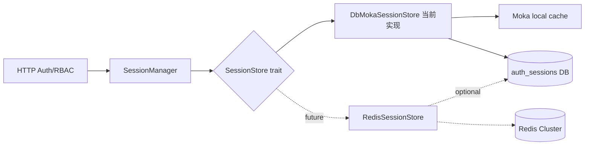
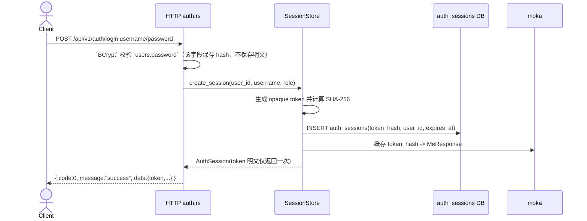
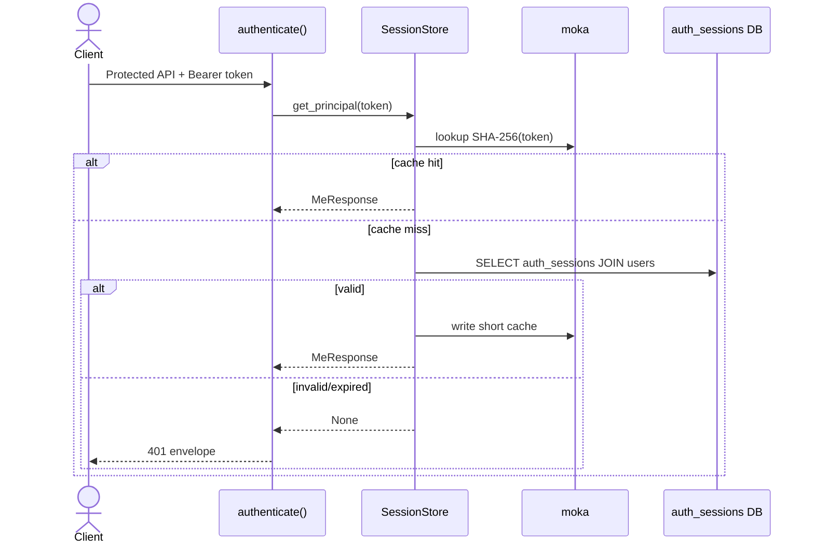

# scheduler 安全设计：可插拔 SessionStore 与 DB+moka 会话管理

本设计文档定义 `scheduler` 用户登录会话方案。当前阶段已落地 **DB + moka 本地短缓存** 实现；同时必须通过 `SessionStore` 抽象隔离 session 管理细节，后续可以无侵入扩展为 **Redis 分布式 SessionStore**，支撑 scheduler server 多节点集群部署。

---

## 1. 核心目标

1. **Opaque Access Token**：客户端拿到的是不透明令牌（当前形如 `atk_<uuid>`），令牌不包含用户名、角色等可解码业务信息。
2. **Token 单向哈希存储**：数据库和缓存都以 `SHA-256(token)` 作为索引，不保存 token 明文。
3. **SessionStore 抽象层**：HTTP 鉴权、登录、登出、用户变更失效逻辑只依赖 `SessionStore` trait，不直接依赖 moka、DB 或未来 Redis。
4. **当前实现 DB+moka**：DB `auth_sessions` 表是权威状态；moka 只是单进程短缓存，用于降低高频鉴权数据库压力。
5. **可扩展到 Redis**：未来多 server 节点部署时，新增 `RedisSessionStore` 实现同一个 trait，HTTP 层不需要重写。
6. **主动撤销能力**：登出、用户密码变更、角色变更、删除用户时，可以立即删除权威 session 记录，并清理本地缓存。
7. **过期物理删除**：DB+moka 当前实现每次创建/读取 session 前会清理 `expires_at <= now` 的过期 `auth_sessions` 行；命中过期 token 时也会按 token hash 懒删除。
8. **禁止数据库外键**：`auth_sessions.user_id` 只能软关联 `users.id`，不得创建 `FOREIGN KEY`。
9. **API 响应规范保持不变**：所有业务 HTTP API 继续返回 `{ code, message, data }`，`data` 必须存在。

---

## 2. SessionStore 分层架构



### 2.1 Rust 抽象契约

代码位置：`crates/scheduler-server/src/http/session.rs`

```rust
#[async_trait]
pub trait SessionStore: Send + Sync {
    async fn create_session(&self, input: SessionCreate) -> Result<AuthSession, ApiError>;
    async fn get_principal(&self, token: &str) -> Result<Option<MeResponse>, ApiError>;
    async fn revoke_token(&self, token: &str) -> Result<(), ApiError>;
    async fn revoke_user_sessions(&self, username: &str) -> Result<(), ApiError>;
}
```

`AppState` 只持有 `SessionManager(Arc<dyn SessionStore>)`：

```rust
pub struct AppState {
    users: UserRepository,
    sessions: SessionManager,
}
```

### 2.2 当前实现：DbMokaSessionStore

- `AuthSessionRepository`：负责 `auth_sessions` 表持久化、查询、删除。
- `moka::future::Cache<String, MeResponse>`：key 为 `SHA-256(token)`，value 为当前 principal 快照。
- session TTL：当前默认 12 小时；moka 缓存 TTL 是短周期优化，不能作为权威状态。

鉴权顺序：

1. 从 `Authorization: Bearer <token>` 提取 token。
2. 计算 `token_hash = SHA-256(token)`。
3. 先查 moka；命中则返回 principal。
4. 未命中则查 DB：不存在或过期返回 401；存在则回写 moka 并放行。

---

## 3. 登录、鉴权、撤销时序

### 3.1 登录



### 3.2 鉴权



### 3.3 撤销

| 场景 | 行为 |
| --- | --- |
| `POST /api/v1/auth/logout` | `revoke_token(token)` 删除 DB 行并 invalidate 对应 moka key |
| 修改用户密码 | `revoke_user_sessions(username)` 删除该用户全部会话 |
| 修改用户角色 | `revoke_user_sessions(username)` 强制重新登录以刷新权限 |
| 删除用户 | DB 外键级联删除会话，SessionStore 同步清理本地缓存 |

---

## 4. 数据库设计

当前已落地表结构：

```sql
CREATE TABLE auth_sessions (
    id varchar NOT NULL PRIMARY KEY,
    user_id varchar NOT NULL,
    token_hash varchar NOT NULL UNIQUE,
    device_id varchar NULL,
    device_name varchar NULL,
    expires_at varchar NOT NULL,
    created_at varchar NOT NULL,
    updated_at varchar NOT NULL,
    );

CREATE UNIQUE INDEX idx_auth_sessions_token_hash ON auth_sessions(token_hash);
CREATE INDEX idx_auth_sessions_user ON auth_sessions(user_id);
```

说明：

- 当前仅实现 access token；refresh token、IP、UA、设备互踢等字段可后续增量迁移。
- `device_id`、`device_name` 已预留为 nullable，便于 Web/SDK 后续上报设备信息。
- SQLite 旧开发库通过兼容逻辑补齐 `users` 与 `auth_sessions` 表，避免已有 dev DB 因 migration 已标记执行而缺列/缺表。

---

## 5. Redis 扩展方案

未来新增 `RedisSessionStore` 时保持 trait 不变：

```rust
pub struct RedisSessionStore {
    redis: RedisPool,
    fallback_repo: Option<AuthSessionRepository>,
}
```

建议 key 设计：

| Key | Value | TTL |
| --- | --- | --- |
| `sess:token:{sha256}` | principal/session JSON | access token 剩余有效期 |
| `sess:user:{user_id}` | token hash set | 与最长 session 对齐 |
| `sess:username:{username}` | user_id 或 token hash set | 与最长 session 对齐 |

Redis 实现要点：

1. `create_session` 使用 Redis 原子写入 token key + user session set。
2. `get_principal` 直接读 Redis；必要时可保留 DB fallback 用于审计。
3. `revoke_token` 删除 token key，并从用户 set 移除。
4. `revoke_user_sessions` 遍历用户 set 删除所有 token key。
5. 多节点无需依赖本地缓存一致性；可选仍保留超短本地缓存，但必须订阅撤销事件或使用极短 TTL。

---

## 6. 当前开发约束

- 禁止使用 Swagger UI；仅保留 `/api-docs/openapi.json`。
- 后端仍保持 workspace + crates 解耦，server 主入口不放入 `crates`。
- Web 管理端继续使用 React + Ant Design + Bun。
- 每次推进后需要更新 `.memory` 和 `.prompt`，并在验证通过后提交推送。
