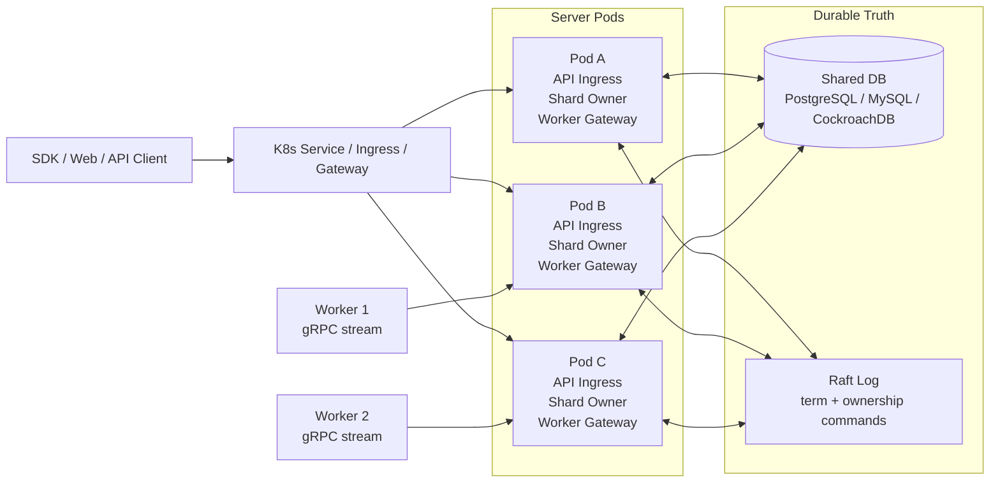
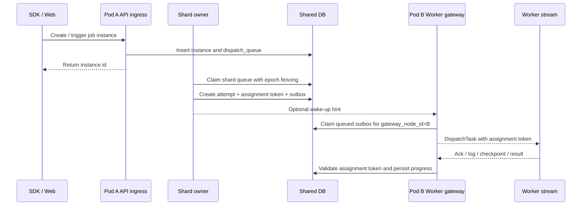
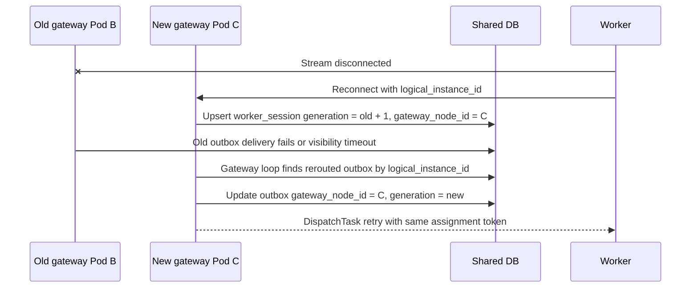
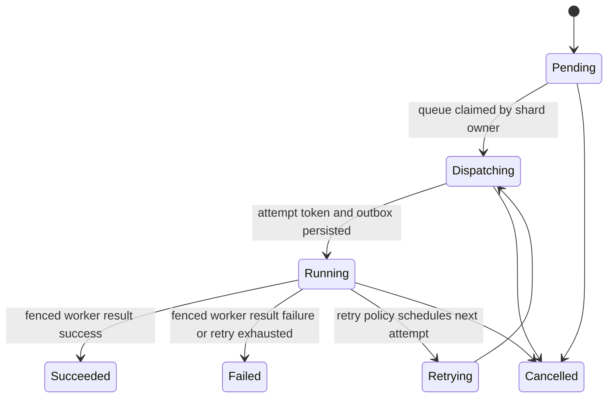
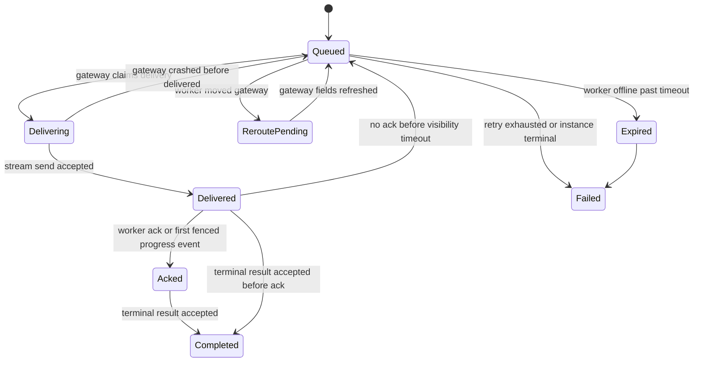
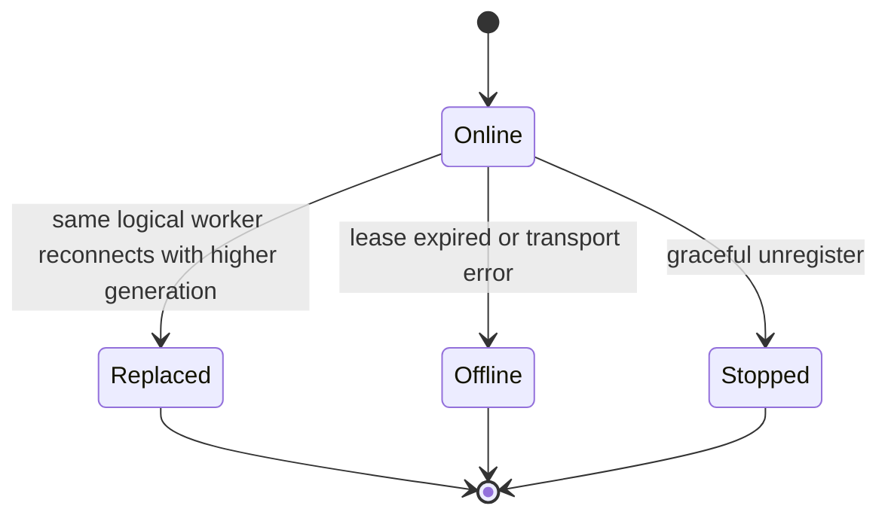

# Tikeo 高性能无中心锁分布式调度终态设计

> 目标：把外部概念稿收敛成 Tikeo 可落地的生产级架构规范。
>
> 本文不是“再造一个分布式系统概念 PPT”，而是面向 Tikeo 当前代码与部署模型的终态设计：Worker 仍然主动出站建立长连接；Server 可以多 Pod 高可用；Web/API 可以打任意 Pod；调度正确性由 Raft epoch、分片所有权、持久化 outbox 和 assignment fencing 共同保证；Redis、Etcd、NATS 只能作为加速组件，不能成为正确性前提。

## 0. 评分与结论

如果按“能否指导真实实现、测试、运维和故障恢复”评分，原始外部概念稿大约只能到 **6.5-7 分**：方向上抓到了“不要让所有能力都压在单 Leader 上”，但有两个明显问题：

1. **和 Tikeo 当前产品边界不完全贴合**：把 Redis/Etcd/网关路由等外部组件放得太靠前，容易打破项目早期确定的“无需外部分布式锁即可成立”的设计目标。
2. **概念化偏多、落库状态机偏少**：没有把“谁拥有调度权、派发意图如何恢复、Worker 重连如何 reroute、旧 owner 如何被拒绝、Web 请求打不同 Pod 如何一致”说成可编码、可测试、可排障的闭环。

本文优化后的目标分数是 **9.5+/10**。仍不写成 10/10，是因为真正的 10 分必须来自后续压测、故障注入和线上数据；但本文已经把关键不变量、数据模型、状态机、算法、迁移路径、测试矩阵和运维观测面全部落到可实现层面。

## 1. 设计立场：不是“没有协调”，而是“没有全局抢锁”

本文中的“无锁”不是指系统完全不使用协调。真正的生产调度系统不可能没有 owner、epoch、fencing、持久化条件更新和失败恢复。

Tikeo 的无中心锁定义如下：

- 不使用 Redis lock、Dragonfly lock、DB advisory lock、`SELECT FOR UPDATE` 抢“全局调度权”作为核心机制。
- 调度权来自 **Raft committed ownership + epoch + fencing token**。
- 一个分片在一个 epoch 内只有一个 owner；该 owner 是这个分片的 single writer。
- 跨 Pod、跨进程、跨长连接的副作用，必须先变成可恢复的持久化意图，再由持有 Worker stream 的 gateway 投递。
- 系统接受 at-least-once dispatch；最终一致性依靠 assignment token、attempt idempotency、outbox visibility timeout 和 worker result fencing 保证。

一句话：

> Tikeo 不追求“幻想中的零协调”，而追求“无全局抢锁、所有权可证明、状态可恢复、投递可重试、重复副作用可消除”。

## 2. 当前状态与终态目标

### 2.1 当前方案 B 的位置

当前已经实现的方案 B 是正确的中间形态：

1. Worker 可以连接任意 Server Pod。
2. Worker session 持久化 `gateway_node_id`。
3. Raft Leader 统一调度。
4. 如果目标 Worker 连接在非 Leader Pod，Leader 通过 internal relay 把 `DispatchTask` 转给 gateway Pod。
5. assignment token 在派发前持久化，Worker result/log/checkpoint 通过 token fencing 校验。
6. Web/API 普通业务数据从共享 DB 读取，节点本地视角通过 `x-tikeo-node-id`、`respondingNode` 明确标识。

这已经解决了“Worker 连接到非 Leader 后无法被调度”的核心问题。但它还不是终态，因为：

- Leader 同步 relay 仍在派发关键路径上，gateway 短暂不可达会影响当次 dispatch。
- “已经决定派给谁、但尚未投递成功”的状态没有独立 durable outbox，排障和恢复粒度不够细。
- 调度并行度仍是单 Leader，没有把 shard ownership 放进运行时主路径。
- Worker gateway 重连、relay 失败、delivery ack 缺失等场景缺少统一状态机表达。

### 2.2 终态目标

终态必须满足：

- **Web/API 可打任意 Pod**：业务事实读写共享 DB；节点本地状态显式标识响应 Pod。
- **Worker 可连任意 Pod**：gateway Pod 只持有 transport stream，不拥有调度决策。
- **调度可横向扩展**：从单 Leader owner 演进到 Raft shard ownership，多 owner 并行推进不同 shard。
- **不引入 Redis/Etcd 强依赖**：默认只依赖现有 DB + Raft；外部 broker/cache 只能加速，不能兜底正确性。
- **派发可恢复**：owner 写 durable dispatch outbox；gateway 投递 outbox；任何进程崩溃后都可从 DB 恢复。
- **重复可控**：所有 Worker result/log/checkpoint 必须带 assignment token；重复或旧 token 被幂等吸收或拒绝。
- **运维可解释**：任意 instance 卡住时，能从 `job_instances`、`job_instance_attempts`、`dispatch_queue`、`worker_dispatch_outbox`、`worker_sessions`、`cluster_shard_ownership` 和 cluster diagnostics 查出卡在哪一环。

## 3. 不变量：后续实现不能破坏的契约

### I1. 分片所有权唯一

对于任意 `shard_id`，在同一个 `ownership_epoch` 内，最多只有一个 Server Pod 拥有调度写权。

```text
(shard_id, ownership_epoch) -> owner_node_id
```

### I2. assignment token 先持久化，后投递

任何 `DispatchTask` 发到 Worker 之前，必须先持久化：

- `job_instance_attempts.assignment_token`
- `worker_dispatch_outbox.assignment_token`
- `instance_id / attempt_id / worker_id`
- `gateway_node_id / gateway_generation`
- `owner_epoch / owner_fencing_token`

Worker 很快回 result/log/checkpoint 也不能跑在 token 落库前面。

### I3. gateway sender 只能是 transport cache

gRPC sender、stream handle、channel handle 永远只能是进程内内存对象，不能作为业务事实。

业务事实只能来自持久化表：

- `worker_sessions`
- `job_instances`
- `job_instance_attempts`
- `dispatch_queue`
- `worker_dispatch_outbox`
- `cluster_shard_ownership`

### I4. Worker result 只能通过 fencing 改状态

Worker 上报 result/log/checkpoint 时必须校验：

```text
(instance_id, attempt_id, worker_id, assignment_token)
```

不匹配则拒绝；重复 terminal result 幂等处理；旧 attempt 不允许覆盖新 attempt。

### I5. 跨 Pod 投递至少一次，不承诺 exactly once

系统不承诺 exactly-once dispatch。系统承诺：

- 持久化 dispatch intent 不丢。
- 重复投递被 assignment token 和 attempt idempotency 吸收。
- stale owner、stale gateway、stale worker generation 不能改变最终状态。

### I6. API ingress 不等于调度 owner

任意 Server Pod 都可以接收 Web/SDK API 请求，但它只负责写入 durable intent。真正推进调度的是对应 shard owner。

## 4. 总体架构



每个 Server Pod 同时具备三种角色，但三者逻辑边界必须清晰：

| 角色 | 负责什么 | 不负责什么 |
| --- | --- | --- |
| API ingress | 接收 Web/SDK 请求，写 DB intent，返回 instance/diagnostics | 不直接决定跨 shard 调度权 |
| Shard owner | 对自己拥有的 shard 扫描队列、选择 Worker、创建 attempt 与 outbox | 不依赖本地 sender 是否存在 |
| Worker gateway | 持有 Worker stream，投递属于自己的 outbox，持久化 Worker 上报 | 不决定调度分配策略 |

## 5. 数据模型

### 5.1 `cluster_shard_ownership`

记录当前 shard owner。该表是 Raft ownership command 的 DB 投影，不是随便抢写的锁表。

| 字段 | 说明 |
| --- | --- |
| `shard_id` | 调度分片 id |
| `owner_node_id` | 当前 owner Server Pod |
| `epoch` | 所有权 epoch，单调递增 |
| `raft_term` | 产生该 ownership 的 Raft term |
| `fencing_token` | owner 写状态时必须携带 |
| `status` | `active / transferring / revoked` |
| `lease_expires_at` | 可选，辅助检测卡死 owner；不替代 Raft |
| `updated_at` | 更新时间 |

唯一约束：

```text
unique(shard_id)
```

更新必须满足 epoch 单调：

```sql
UPDATE cluster_shard_ownership
SET owner_node_id = :new_owner,
    epoch = :new_epoch,
    raft_term = :raft_term,
    fencing_token = :new_token,
    status = 'active',
    updated_at = :now
WHERE shard_id = :shard_id
  AND epoch < :new_epoch;
```

### 5.2 `dispatch_queue`

`dispatch_queue` 继续作为待调度队列，但需要显式绑定 shard 与 owner epoch。

| 字段 | 说明 |
| --- | --- |
| `instance_id` | 任务实例 |
| `shard_id` | 由稳定业务 key 计算得到 |
| `status` | `pending / claimed / running / done / failed / cancelled` |
| `lease_owner` | 当前推进 owner |
| `owner_epoch` | claim 时的 ownership epoch |
| `owner_fencing_token` | claim 时的 fencing token |
| `next_run_at` | 可调度时间 |
| `claim_expires_at` | owner 崩溃后的回收时间 |

claim 必须带 owner 条件：

```sql
UPDATE dispatch_queue
SET status = 'claimed',
    lease_owner = :node_id,
    owner_epoch = :epoch,
    owner_fencing_token = :token,
    claim_expires_at = :deadline
WHERE id = :queue_id
  AND shard_id = :shard_id
  AND status = 'pending'
  AND next_run_at <= :now;
```

### 5.3 `worker_sessions`

该表是 Worker 在线和 gateway 归属的持久化真相。

| 字段 | 说明 |
| --- | --- |
| `worker_id` | 当前 session id |
| `logical_instance_id` | 稳定逻辑 Worker，重连不变 |
| `gateway_node_id` | 持有当前 stream 的 Server Pod |
| `generation` | 同一个 logical Worker 每次重连递增 |
| `fencing_token_hash` | session fencing |
| `lease_expires_at` | 在线 lease |
| `status` | `online / offline / replaced / stopped` |
| `capabilities_json` | 能力描述 |
| `structured_capabilities_json` | 结构化能力 |
| `labels_json` | namespace/app/pool/region/zone 等标签 |

### 5.4 `worker_dispatch_outbox`

这是从当前方案 B 升级到终态的核心表。

| 字段 | 说明 |
| --- | --- |
| `id` | outbox id |
| `instance_id` | 任务实例 |
| `attempt_id` | attempt id |
| `worker_id` | 目标 Worker session |
| `logical_instance_id` | 逻辑 Worker，用于重连 reroute |
| `gateway_node_id` | 当前目标 gateway |
| `gateway_generation` | 创建 outbox 时的 Worker generation |
| `assignment_token` | 已持久化 assignment token |
| `dispatch_payload` | 待投递 payload，JSON 或 protobuf bytes |
| `shard_id` | 所属调度 shard |
| `owner_node_id` | 创建该 outbox 的 owner |
| `owner_epoch` | 创建该 intent 的 ownership epoch |
| `owner_fencing_token` | owner fencing token |
| `status` | `queued / delivering / delivered / acked / completed / reroute_pending / expired / failed` |
| `delivery_attempts` | 投递次数 |
| `next_delivery_at` | 下次投递时间 |
| `visibility_deadline` | delivered 后等待 ack/result 的超时时间 |
| `last_error` | 最近错误 |
| `created_at / updated_at` | 时间 |

建议约束：

```text
unique(instance_id, attempt_id)
unique(instance_id, worker_id, assignment_token)
index(gateway_node_id, status, next_delivery_at)
index(logical_instance_id, status)
index(shard_id, owner_epoch, status)
```

Outbox 是调度 owner 和 gateway 之间的 durable handoff。只要 outbox 存在且未 terminal，系统就有明确恢复路径。

## 6. 核心算法：FSOD（Fenced Slot Outbox Dispatch）

FSOD 是本文为 Tikeo 收敛出的终态算法。它不是论文式新名词，而是把 Tikeo 已有能力组织成可实现闭环：

```text
Fenced    -> 所有 owner/gateway/worker 写状态都带 epoch/token/generation
Slot      -> 每个 shard 是可迁移的调度 slot
Outbox    -> 跨 Pod dispatch 先落 durable intent
Dispatch  -> gateway 只投递自己持有 stream 的 outbox
```

### 6.1 Shard 选择

不要直接按随机 `instance_id` 分片。Tikeo 应该用稳定业务维度：

```text
shard_key = namespace + "/" + app + "/" + job_id
shard_id = xxhash64(shard_key) % SHARD_COUNT
```

理由：

- 同一个 job 的顺序、misfire、retry、calendar 更容易治理。
- namespace/app quota 更容易聚合。
- canary 和 worker pool 策略更稳定。
- 不会因为每次 instance id 不同导致同一 job 在 shard 间跳动。

默认建议：

```text
SHARD_COUNT = 1024
```

`SHARD_COUNT` 后续可以扩容，但扩容必须走 migration：新增 shard map version，逐步把旧 shard key 映射迁移到新版本，不能在运行中直接改 hash 取模。

### 6.2 Owner 调度主循环

每个 Pod 只扫描自己拥有的 shard：

```pseudo
loop every scheduler_tick:
  owned = load_active_ownership(node_id = self.node_id)

  for shard in owned:
    rows = claim_pending_dispatch_queue(
      shard_id = shard.id,
      owner_epoch = shard.epoch,
      fencing_token = shard.fencing_token,
      limit = batch_size
    )

    for queue_row in rows:
      worker = select_worker(queue_row, shard)
      if worker is None:
        release_or_delay_queue(queue_row)
        continue

      token = new_assignment_token()
      attempt = create_attempt(instance_id, worker.worker_id, token)
      outbox = create_worker_dispatch_outbox(
        instance_id,
        attempt.id,
        worker.worker_id,
        worker.logical_instance_id,
        worker.gateway_node_id,
        worker.generation,
        token,
        shard.id,
        shard.epoch,
        shard.fencing_token,
        payload
      )
      mark_queue_running(queue_row, attempt.id, outbox.id)
```

关键点：

- owner 不直接依赖本地 memory sender。
- owner 的职责是“决定 + 持久化 intent”，不是“保证同步写到 stream”。
- `attempt`、`assignment_token`、`outbox`、`queue running` 必须在同一个事务或可证明的补偿事务中完成。

### 6.3 Gateway 投递主循环

每个 Pod 只投递属于自己的 outbox：

```pseudo
loop every 100ms..500ms:
  rows = claim_outbox_rows(
    gateway_node_id = self.node_id,
    status in ['queued', 'reroute_pending'],
    next_delivery_at <= now,
    limit = delivery_batch_size
  )

  for row in rows:
    current = load_current_worker_session(row.logical_instance_id)

    if current is None or current.status != 'online':
      backoff_or_expire(row)
      continue

    if current.generation > row.gateway_generation:
      reroute(row, current.gateway_node_id, current.worker_id, current.generation)
      continue

    if not local_stream_exists(row.worker_id):
      mark_reroute_pending_or_backoff(row)
      continue

    mark_delivering(row)
    send_dispatch_task(row.worker_id, row.dispatch_payload, row.assignment_token)
    mark_delivered(row, visibility_deadline = now + ack_timeout)
```

如果 Worker 已重连到新 Pod：

```pseudo
current = worker_sessions.get_online_current(logical_instance_id)
if current.generation > outbox.gateway_generation:
  outbox.gateway_node_id = current.gateway_node_id
  outbox.worker_id = current.worker_id
  outbox.gateway_generation = current.generation
  outbox.status = 'queued'
  outbox.next_delivery_at = now
```

### 6.4 Ack 与 visibility timeout

`delivered` 只表示 gateway 已把 `DispatchTask` 写入本地 stream，不表示 Worker 已开始执行。

建议 Worker 在收到 `DispatchTask` 后尽快上报轻量 ack，或用第一条 log/checkpoint/result 作为隐式 ack：

```text
Delivered -> Acked      : worker ack/log/checkpoint with assignment_token
Delivered -> Queued     : visibility_deadline reached and no ack/result
Acked     -> Completed  : terminal result accepted
```

没有 ack 的 `delivered` 必须可重投。重复执行风险由 assignment token 和 Worker SDK 幂等处理共同吸收。

### 6.5 Worker 选择：LASSO 评分

为了兼顾性能与公平性，建议把 worker scoring 明确化为 LASSO：Locality、Affinity、Saturation、Stability、Opportunity。

```text
score(worker) =
  +1000 if worker.gateway_node_id == owner_node_id          # Locality
  +300  if worker.region == owner.region                    # Locality
  +250  if job.required_pool == worker.pool                 # Affinity
  +capability_match_score                                  # Affinity
  -load_penalty(active_tasks, max_concurrency)              # Saturation
  -recent_failure_penalty(worker/job pair)                  # Stability
  +fairness_credit(namespace/app/worker logical id)          # Opportunity
```

本地 Worker 优先，但不能绕过 outbox。即使 owner 与 gateway 是同一个 Pod，也必须写 outbox；gateway loop 可以立即投递，从而同时获得低延迟和可恢复性。

### 6.6 Optional Fast Relay

当前方案 B 的 internal relay 可以保留，但必须降级为 wake-up hint：

1. owner 先写 outbox。
2. 如果目标 gateway 在线，owner 发一个 `wake_outbox(outbox_id)` 或沿用 relay hint。
3. gateway 收到 hint 后立即扫描/投递该 outbox。
4. hint/relay 失败不影响正确性，gateway loop 会补偿。

这让 relay 从“唯一投递路径”变成“低延迟优化”。

## 7. 关键时序

### 7.1 API 请求打 PodA，Worker 在 PodB



### 7.2 Worker 重连导致 gateway 迁移



## 8. 状态机

### 8.1 Instance 状态



### 8.2 Outbox 状态



### 8.3 Worker Session 状态



## 9. 异常恢复矩阵

| 场景 | 现象 | 处理 | 不变量 |
| --- | --- | --- | --- |
| API 请求打到非 owner Pod | 请求成功但本 Pod 不调度 | API 只写 DB intent；owner 异步推进 | I6 |
| Shard owner 崩溃 | queue 停在 claimed/running | 新 owner 通过更高 epoch 接管；旧 fencing 更新失败；超时 queue requeue | I1/I4 |
| Gateway Pod 崩溃 | outbox 停在 queued/delivering/delivered | Worker stream 断开；session lease 过期或重连；outbox reroute 或 visibility timeout 重投 | I3/I5 |
| Worker 重连到新 Pod | old gateway_node_id stale | `worker_sessions.generation` 递增；outbox reroute 到新 gateway | I3 |
| Worker 收到任务后立刻 result | result 早于 UI 刷新 | assignment token 已先持久化，result 可通过 fencing | I2/I4 |
| Worker 重复执行同一 DispatchTask | 多次 result/log | attempt result 以 assignment token 幂等写入；终态只接受一次 | I4/I5 |
| 旧 owner Full GC 后恢复 | 旧进程尝试写状态 | DB 条件更新检查 epoch/fencing，拒绝 | I1/I4 |
| DB 短暂不可用 | owner/gateway 写失败 | 不发送未持久化 dispatch；恢复后继续扫描 | I2/I5 |
| Web 请求轮询不同 Pod | `/cluster` 本地视角不同 | 业务页面读 DB；cluster UI 使用 diagnostics + respondingNode | I6 |
| Raft split brain 网络抖动 | 两边都以为可调度 | 只有 committed ownership epoch 的 DB fencing 可写成功；旧 token 失败 | I1 |
| Outbox delivered 但 Worker 实际未收到 | 无 ack/result | visibility timeout 后重投 | I5 |

## 10. Web/API 负载均衡语义

Web/API 请求可以被 K8s Service、LB、Ingress 分发到任意 Pod。设计上不要求 sticky session。

### 10.1 必须读共享事实的接口

以下接口不能依赖 Pod 本地内存：

- jobs
- instances
- attempts
- logs
- workers list
- dispatch queue
- notifications
- audit events
- business metrics summary
- task notification bindings

### 10.2 节点本地状态接口

以下接口是响应 Pod 本地视角：

- `/api/v1/cluster`
- `/metrics`
- debug/runtime local endpoints

必须返回或携带：

```text
x-tikeo-node-id: <responding-node-id>
```

### 10.3 集群 UI

集群 UI 只能使用：

- `/api/v1/cluster/diagnostics`
- `respondingNode`
- `nodes[]`
- `x-tikeo-node-id`

不能把 `/api/v1/cluster` 当作全局真相。

## 11. Smart Gateway：后期优化，不是正确性前提

Smart Gateway 可以提高延迟和 locality，但不应成为第一阶段必须组件。

### 11.1 基础模式

```text
Client -> K8s Service -> Any Pod -> DB intent -> Shard owner dispatch
```

优点：简单、可靠、不要求 Gateway 插件，最符合当前 Tikeo 部署边界。

### 11.2 Smart Gateway 模式

```text
Client -> Topology-aware Gateway -> Shard owner Pod
```

Gateway 可缓存：

- shard map
- owner epoch
- owner endpoint

失败 fallback：

- shard map 过期：转普通 K8s Service。
- owner 不可达：转任意 Pod 写 DB intent。
- hash key 不明确：转任意 Pod。
- Gateway 插件故障：旁路到基础模式。

Smart Gateway 只能优化延迟和减少跨 Pod hop，不能决定任务状态、不能替代 Raft ownership、不能替代 DB durable truth。

## 12. 与 Redis、Etcd、NATS 的关系

### 12.1 默认不引入

Tikeo 默认不需要 Redis、Etcd、NATS 来保证调度正确性。这是产品部署复杂度和可靠性边界上的重要取舍。

### 12.2 可选增强

| 组件 | 可选用途 | 不承担什么 |
| --- | --- | --- |
| Redis / Dragonfly | cache worker gateway mapping、短期 topology cache | 不做 lock，不决定唯一调度权 |
| NATS JetStream | outbox wake-up event bus、降低扫描延迟 | 不替代 DB outbox 和 terminal truth |
| Etcd | 外部 topology watch、非 Tikeo Raft 部署下的只读发现 | 不替代 Raft ownership/fencing |
| Envoy Gateway | shard-aware routing、HTTP/gRPC route hint | 不决定任务状态 |

原则：外部组件挂了，系统可以变慢，但不能变错。

## 13. 迁移路线与验收清单

### Phase 0：当前方案 B（已完成）

- [x] Worker gateway relay。
- [x] `gateway_node_id` 持久化。
- [x] assignment token 先落库后发送。
- [x] Web/API 响应 Pod 标识。

### Phase 1：Durable Dispatch Outbox

- [ ] 新增 `worker_dispatch_outbox` migration、entity、repository。
- [ ] dispatcher 在选择 Worker 后写 outbox。
- [ ] gateway loop 投递 outbox。
- [ ] 当前 internal relay 改为 wake-up hint。
- [ ] outbox 指标、管理 API、排障日志可见。

验收：kill gateway 或 relay 失败后，未投递任务不丢，恢复后继续投递。

### Phase 2：Outbox Reroute 与 Visibility Timeout

- [ ] Worker 重连后 outbox 自动 reroute。
- [ ] delivered 未 ack 超时重投。
- [ ] gateway crash 后恢复扫描。
- [ ] duplicate dispatch/result 幂等测试。

验收：Worker 在 dispatch 前后重连，任务最终只产生一个 terminal result。

### Phase 3：Raft Shard Ownership

- [ ] 新增 `cluster_shard_ownership` migration、entity、repository。
- [ ] Leader 计算 shard 分配并通过 Raft commit。
- [ ] 每个 owner 只扫描自己 shard。
- [ ] epoch/fencing 条件更新覆盖 queue、attempt、outbox。
- [ ] owner failover 后 stale owner 写入被拒绝。

验收：3 Pod 同时拥有不同 shard，强制 kill 任一 owner 后对应 shard 被新 owner 接管，无重复终态。

### Phase 4：Locality-Aware Scoring

- [ ] worker scoring 引入 LASSO。
- [ ] 本地 Worker 优先，但不绕过 outbox。
- [ ] namespace/app/pool quota 与 fairness 指标可解释。

验收：本地可用 Worker 占优时跨 Pod dispatch 明显减少；没有 worker starvation。

### Phase 5：Smart Gateway（可选）

- [ ] 发布 shard map diagnostics。
- [ ] Gateway 订阅或定期拉取 shard map。
- [ ] route hint 失败 fallback 到基础模式。
- [ ] 压测证明收益大于复杂度后再默认启用。

验收：Gateway 故障或 shard map 过期时，只退化为多一跳，不影响正确性。

## 14. 测试计划

### 14.1 单元测试

- shard key 稳定映射与 shard map version。
- epoch fencing 拒绝旧 owner。
- assignment token 先持久化。
- outbox 状态机转换。
- delivered visibility timeout 重投。
- duplicate result 幂等。
- stale gateway reroute。
- LASSO scoring 的 locality/fairness 边界。

### 14.2 集成测试

- Worker 连 PodB，owner PodA，outbox 投递成功。
- gateway PodB 崩溃，Worker 重连 PodC，outbox reroute 成功。
- owner PodA 崩溃，PodC 接管 shard 后继续调度。
- delivered 未 ack 后 visibility timeout 重投。
- relay hint 失败但 gateway loop 补偿成功。
- Web LB round-robin 下业务列表稳定，cluster diagnostics 标明 responding node。

### 14.3 K8s E2E

至少覆盖：

```text
3 Server Pods
1 external DB
3+ Worker processes
random Worker gateway connection
forced owner failover
forced gateway failover
LB round-robin Web/API
```

验收标准：

- 无重复 terminal result。
- 无永久 pending outbox。
- Worker 重连后 `gateway_node_id` 更新。
- 每个 shard epoch 只有一个 owner。
- Web 页面不因请求打到不同 Pod 而业务数据跳变。
- kill 任意非 DB 单点后，系统在可配置时间内恢复调度。

## 15. 可观测性与排障

### 15.1 指标

建议新增或强化：

```text
tikeo_scheduler_owned_shards{node_id}
tikeo_scheduler_claim_total{node_id, shard_id, result}
tikeo_worker_outbox_rows{status, gateway_node_id}
tikeo_worker_outbox_delivery_total{gateway_node_id, result}
tikeo_worker_outbox_delivery_latency_seconds{gateway_node_id}
tikeo_worker_outbox_reroute_total{from_gateway, to_gateway}
tikeo_worker_assignment_fencing_reject_total{reason}
tikeo_cluster_shard_epoch{shard_id, owner_node_id}
```

### 15.2 Diagnostics API

建议在现有 cluster diagnostics 基础上扩展：

```json
{
  "respondingNode": { "nodeId": "tikeo-server-1", "canSchedule": true },
  "shards": [
    { "shardId": 12, "ownerNodeId": "tikeo-server-1", "epoch": 44, "status": "active" }
  ],
  "outbox": {
    "queued": 12,
    "delivering": 1,
    "delivered": 5,
    "reroutePending": 0,
    "oldestQueuedMs": 240
  }
}
```

### 15.3 排障路径

当用户反馈“任务一直不执行”时，排障顺序应固定：

1. 查 `job_instances`：实例是否创建、是否 terminal。
2. 查 `dispatch_queue`：是否 pending、claimed、running，属于哪个 shard。
3. 查 `cluster_shard_ownership`：该 shard owner 是否 active，epoch 是否最新。
4. 查 `job_instance_attempts`：是否已有 assignment token。
5. 查 `worker_dispatch_outbox`：是否 queued/delivered/reroute/failed。
6. 查 `worker_sessions`：目标 Worker 是否 online，gateway/generation 是否匹配。
7. 查 gateway 日志与 `x-tikeo-node-id`：确认请求与投递分别落在哪个 Pod。

## 16. 风险与边界

| 风险 | 说明 | 控制方式 |
| --- | --- | --- |
| Outbox 表膨胀 | 高频任务会产生大量 outbox 行 | terminal 行 TTL、分区表、归档任务 |
| 重复 dispatch 导致 Worker 侧副作用 | at-least-once 下 Worker 可能重复收到 | SDK 提供 assignment token 幂等钩子；文档要求业务侧幂等 |
| Shard 热点 | 某些 namespace/app/job 特别热 | shard key 可引入 job sub-shard，但必须保持可治理 |
| DB 成为瓶颈 | 所有 truth 都在 DB | 批量 claim、批量 outbox、索引、分区、读写压测 |
| 过早引入 Smart Gateway | 增加部署复杂度 | 默认基础模式；压测证明收益后再启用 |
| 多 owner 实现复杂 | 比单 Leader 更难验证 | 按 Phase 逐步上线，每阶段有故障注入验收 |

## 17. 为什么这个方案接近 10 分

它比原始概念稿更强在：

1. 把“无锁”从口号改成“无全局抢锁 + Raft/fencing 所有权”的可验证定义。
2. 不把 Redis/Etcd 作为正确性必需依赖，符合 Tikeo 当前部署目标。
3. 不让 Leader 同步 relay 成为唯一投递路径，避免 RPC side effect 丢失。
4. 用 durable outbox 把跨 Pod dispatch 变成可恢复状态机。
5. 保留当前方案 B 的可用价值，迁移不是推倒重来。
6. 明确定义 Worker gateway、API ingress、Shard owner 三种角色边界。
7. 明确定义 Web/LB 多 Pod 访问语义，不把节点本地状态误当全局状态。
8. 每个失败场景都有恢复路径、表状态和测试用例。
9. 多活调度通过 shard ownership 渐进开启，而不是一上来靠多个 Pod 抢队列。
10. 外部加速组件全部是 optional accelerator，挂掉只影响延迟，不影响正确性。

## 18. 最终一句话架构

> Tikeo 的终态不是“用 Redis 锁抢任务”，也不是“Leader 同步转发所有 Worker stream”，而是：Raft/fencing 决定 shard owner，owner 写 durable dispatch outbox，gateway 投递自己持有的 Worker stream，Worker result 通过 assignment token 幂等落库，Web/API 任意 Pod 入口只读写共享事实，节点本地状态显式标识响应 Pod。
