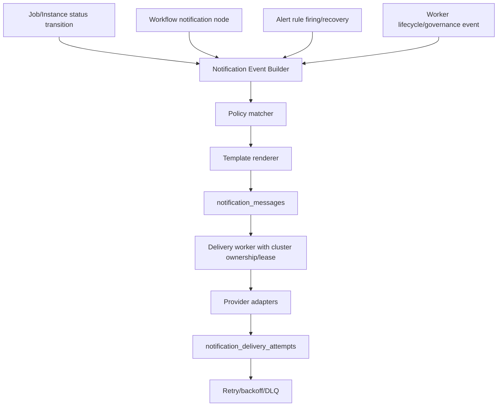

# Tikeo Notification Center and Alerting Boundary Plan

> Status: planning artifact created during the functional/module acceptance phase on 2026-06-11.
> Scope: make notification channels configurable, make job/runtime status notifications configurable, and remove ambiguity with the existing alerting module.

## 1. Current source-backed facts

The current codebase already has a real alerting foundation, but it is alert-centric rather than a reusable notification center.

| Area | Current fact | Evidence |
| --- | --- | --- |
| Alert rule persistence | `alert_rules` stores `condition_json` and inline `channels_json` per rule. | `crates/tikeo-storage/src/entities/alert_rule.rs:7-20` |
| Alert event persistence | `alert_events` stores rule, severity, status, event/resource, failure class, message, dedupe key, and creation time. | `crates/tikeo-storage/src/entities/alert_event.rs:7-23` |
| Alert delivery history | `alert_delivery_attempts` is alert-specific and records event/rule/provider/redacted target/status/retry state. | `crates/tikeo-storage/src/entities/alert_delivery_attempt.rs:5-33` |
| Built-in providers | `NotificationChannel` already supports generic webhook, Slack, DingTalk, Feishu/Lark, WeChat Work/WeCom, PagerDuty, plugin webhook, and Email. | `crates/tikeo-server/src/alert.rs:68-142` |
| Delivery execution | `AlertDispatcher` posts provider-specific payloads and enforces production-safe URL policy. | `crates/tikeo-server/src/alert.rs:414-599`, `crates/tikeo-server/src/alert.rs:709-734` |
| Retry/DLQ | Alert retry worker scans `retry_pending`, appends retry attempts, and dead-letters exhausted/missing contexts. | `crates/tikeo-server/src/alert/retry.rs:13-29`, `crates/tikeo-server/src/alert/retry.rs:117-260` |
| Alert API | Management API exposes alert rules, alert events, alert delivery attempts, queue status, and retry-due routes. | `crates/tikeo-server/src/http/routes/alerts.rs:51-118`, `crates/tikeo-server/src/http/routes/alerts.rs:301-420`, `crates/tikeo-server/src/http/router.rs:376-402` |
| Job/instance status source | Job instance lifecycle statuses are `pending`, `dispatching`, `running`, `succeeded`, `partial_failed`, `failed`, and `cancelled`. | `crates/tikeo-core/src/lib.rs:246-303` |
| Runtime transitions | Worker task results and built-in processor outcomes update instance status and schedule/exhaust retries. | `crates/tikeo-server/src/tunnel/service.rs:424-683`, `crates/tikeo-server/src/tunnel/dispatcher.rs:398-465` |
| Workflow notification node | Workflow UI already has a `notification` node kind with channel/target/template config, but it is not yet a shared delivery engine contract. | `web/src/pages/WorkflowsPage.tsx:76`, `web/src/pages/WorkflowsPage.tsx:204`, `web/src/pages/WorkflowsPage.tsx:748-755`, `docs/docs/user-guide/workflows.md:11` |
| Plugin extension | Plugin registry can define custom alert channel types, currently named as alert-specific extension metadata. | `crates/tikeo-storage/src/entities/plugin.rs`, `crates/tikeo-storage/src/repository/plugin.rs`, `crates/tikeo-server/src/http/routes/plugins.rs` |

## 2. Problem statement

The platform needs three related but different capabilities:

1. **Alerting**: detect abnormal or risk states, dedupe/silence/escalate them, and keep an incident-like event history.
2. **Notifications**: deliver outbound messages to configured channels regardless of whether the source is an alert, a normal job lifecycle event, a workflow notification node, or an audit/governance event.
3. **Job/workflow subscriptions**: let operators configure which execution states or workflow events should emit what message type to which channel.

The current implementation mixes these concepts because alert rules embed channels directly in `channels_json`. That works for script-governance alerts but does not scale to:

- shared channel reuse across many jobs/rules/workflows;
- channel test/readiness independent from an alert rule;
- job-level “on failed / on retry exhausted / on succeeded / on cancelled” notifications;
- workflow `notification` nodes that should use the same providers and retry ledger;
- provider secret rotation without editing every alert rule;
- a clean UI distinction between “this is an incident rule” and “this is a delivery destination”.

## 3. Canonical vocabulary and boundary

Use these terms consistently in code, API, UI, docs, and migrations.

| Term | Meaning | Not this |
| --- | --- | --- |
| **Notification Channel** | A reusable outbound destination: Slack robot, Feishu robot, DingTalk robot, WeCom robot, PagerDuty integration, generic webhook, SMTP email, or plugin-provided webhook-compatible target. | Not an alert rule. Not an inbound webhook event source. |
| **Notification Template** | Provider-aware message shape and rendering rules for a specific event family. | Not the delivery target or credentials. |
| **Notification Policy / Subscription** | Binds event filters to templates and channels. Example: job `job-1` final `failed` -> critical template -> Ops Feishu + PagerDuty. | Not a condition evaluator by itself. |
| **Notification Message** | A normalized outbound message created from a source event and policy before provider delivery. | Not necessarily an alert. |
| **Notification Delivery Attempt** | One attempt to deliver one message to one channel/provider target; owns retry/DLQ status. | Should not be alert-only long term. |
| **Alert Rule** | Evaluates abnormal conditions and creates alert events with severity/dedupe/silence/escalation semantics. | Does not own provider credentials directly after migration. |
| **Alert Event** | Incident/risk event generated by an alert rule, such as `firing`, `suppressed`, `silenced`, `recovered`. | Not every job completion notification. |
| **Inbound Webhook Event Source** | External system triggers a Tikeo job through an HTTP ingress endpoint. | Not an outbound notification channel. |

### Boundary decision

**Alerting must become a producer of notification messages, not the owner of notification channels.**

Existing `alert_rules`, `alert_events`, and `alert_delivery_attempts` should be preserved for compatibility and current evidence. The new design introduces a generic Notification Center and gradually migrates alert delivery to it. Alert rules keep evaluating conditions; Notification Center owns channels, templates, outbound delivery, retries, and DLQ.

## 4. Target domain model

No database-level foreign keys. Follow the existing soft-link convention and explicit repository checks.

### 4.1 Notification channel

`notification_channels`

| Column | Purpose |
| --- | --- |
| `id` | Stable `notification-channel-*` id. |
| `scope_type` | `global`, `namespace`, `app`, or `worker_pool`. |
| `namespace_id`, `app_id`, `worker_pool_id` | Optional soft links for scoped visibility and RBAC. |
| `name` | Operator-facing unique name within scope. |
| `provider` | `webhook`, `slack`, `dingtalk`, `feishu`, `wechat_work`, `pagerduty`, `email`, or plugin type. |
| `enabled` | Disabled channels do not deliver; policy validation flags them. |
| `config_json` | Provider config without raw secrets where possible. URLs may exist but operator responses must redact. |
| `secret_refs_json` | Secret references such as `env:...` or future secret ids. Do not store raw tokens/passwords in plain API responses. |
| `target_redacted` | Cached redacted target for list pages and attempts. |
| `safety_policy_json` | Overrides such as local loopback smoke allowance; production default remains HTTPS/public-only. |
| `created_at`, `updated_at`, `created_by`, `updated_by` | Audit-friendly metadata. |

### 4.2 Notification template

`notification_templates`

| Column | Purpose |
| --- | --- |
| `id`, `name`, `scope_type`, scope ids | Template identity and visibility. |
| `event_family` | `job_instance`, `workflow`, `alert`, `worker`, `script_governance`, etc. |
| `provider` | Optional provider-specific override; `generic` applies to all. |
| `locale` | `default`, `en-US`, `zh-CN`. |
| `subject_template`, `body_template`, `payload_template_json` | Rendered message. Provider adapters may map generic fields to provider-specific JSON. |
| `variables_schema_json` | Allowed variables and types. Fail closed on unknown unsafe expressions. |
| `enabled`, timestamps | Lifecycle. |

Rendering should start with a minimal safe token replacer equivalent to existing plugin webhook replacement, then evolve to a restricted template engine only after an explicit security review.

### 4.3 Notification policy / subscription

`notification_policies`

| Column | Purpose |
| --- | --- |
| `id`, `name`, `enabled` | Policy identity. |
| `owner_type` | `global`, `namespace`, `app`, `job`, `workflow`, `workflow_node`, `alert_rule`, `worker_pool`. |
| `owner_id` | Soft-linked owner id when applicable. |
| `event_family` | Which event stream this policy consumes. |
| `event_filter_json` | Structured filter, e.g. statuses, severity, worker pool, failure class. |
| `channel_refs_json` | Ordered channel ids plus per-channel overrides. |
| `template_ref` | Optional template id; otherwise built-in default template by event family/provider. |
| `severity` | Notification severity independent from alert severity, default derived from event. |
| `dedupe_seconds`, `throttle_json`, `quiet_hours_json` | Noise control. |
| `escalation_json` | Delayed fan-out/escalation rules for critical cases. |
| `created_at`, `updated_at`, actor fields | Lifecycle. |

Job UI can expose this as “Notifications” on the job, but storage should stay separate so policies can also apply to namespace/app/global scopes and avoid bloating `jobs` or `job_versions` immediately.

### 4.4 Notification event/message/outbox

`notification_messages`

| Column | Purpose |
| --- | --- |
| `id` | Message id. |
| `source_type`, `source_id` | `alert_event`, `job_instance`, `workflow_node_instance`, `worker_session`, etc. |
| `policy_id` | Policy that created the message. |
| `event_type` | Stable event, e.g. `job_instance.failed`, `job_instance.retry_exhausted`, `alert.firing`. |
| `resource_type`, `resource_id` | Resource displayed to operators. |
| `severity`, `subject`, `body`, `payload_json` | Rendered normalized message. |
| `dedupe_key`, `trace_id` | Idempotency and observability. |
| `status` | `pending`, `delivering`, `delivered`, `partial_failed`, `failed`, `suppressed`, `dead_letter`. |
| `created_at`, `updated_at` | Timeline. |

`notification_delivery_attempts`

| Column | Purpose |
| --- | --- |
| `id`, `message_id`, `policy_id`, `channel_id` | Soft links. |
| `provider`, `target_redacted` | Provider identity without secrets. |
| `attempt`, `delivered`, `status_code`, `error`, `retry_state`, `next_retry_at`, `created_at` | Same semantics as current alert delivery attempts but generic. |

Optional `notification_outbox` can be used if immediate message insert and delivery lease need a separate work queue. If the first implementation can use `notification_messages.status=pending` with lease fields safely, a separate outbox can wait.

### 4.5 Alert compatibility fields

Keep `alert_rules.channels_json` for backward compatibility during migration, but add one of these migration-safe options:

1. `alert_rules.notification_policy_id` as the preferred new path; or
2. `alert_rules.channel_refs_json` and `template_ref` if a full policy table is delayed.

Preferred: use `notification_policies(owner_type='alert_rule', owner_id=<alert_rule.id>)` so Alerting uses the same policy machinery as jobs/workflows.

## 5. Trigger/event contract

### 5.1 Job instance event types

The policy filter should use stable event names, not raw English message strings.

| Event type | Emitted when | Default recommended delivery |
| --- | --- | --- |
| `job_instance.created` | Instance row is created. | Off by default. |
| `job_instance.dispatching` | Dispatcher claims pending instance for assignment. | Off by default. |
| `job_instance.running` | Worker or built-in executor starts/accepts execution. | Off by default. |
| `job_instance.retry_scheduled` | Failure happened but retry policy requeued it. | Optional warning. |
| `job_instance.retry_exhausted` | Failure happened and no retry remains. | On by default for opted-in failure policy. |
| `job_instance.succeeded` | Final success. | Optional success notification. |
| `job_instance.failed` | Final failure. | On for failure policies. |
| `job_instance.partial_failed` | Broadcast completed with at least one failed child. | On for broadcast policies. |
| `job_instance.cancelled` | User/system cancelled instance. | Optional warning. |
| `job_instance.no_eligible_worker` | Dispatcher failed because no structured worker capability matched. | On for governance/operations policies. |
| `job_instance.script_governance_failure` | Script policy/capability/runtime governance failure materialized. | Continue feeding Alerting and also allow direct notifications. |

Important retry semantic: do **not** send `job_instance.failed` for every failed attempt if a retry is still scheduled. Emit `retry_scheduled` first and reserve `failed`/`retry_exhausted` for the final terminal failure. This prevents duplicate incident noise.

### 5.2 Alert event types

Alert event statuses remain: `firing`, `suppressed`, `silenced`, `recovered`. A Notification policy for an alert rule maps these to:

- `alert.firing`
- `alert.suppressed`
- `alert.silenced`
- `alert.recovered`

By default, only `firing` and `recovered` deliver. `suppressed` and `silenced` are retained in history/metrics unless explicitly subscribed.

### 5.3 Workflow event types

- `workflow_instance.started`
- `workflow_instance.succeeded`
- `workflow_instance.failed`
- `workflow_node.succeeded`
- `workflow_node.failed`
- `workflow_node.approval_requested`
- `workflow_node.notification_requested`

The existing workflow `notification` node should compile to `workflow_node.notification_requested` and then call Notification Center with explicit channel/template references. Its current `channel`, `target`, and `template` UI fields are a temporary local shape and should migrate to channel/template selectors.

## 6. API plan

All routes use the standard `{code,message,data}` envelope and RBAC. Suggested new resource/action: `notifications:read`, `notifications:manage`, `notifications:test`.

### 6.1 Channel APIs

| Method/path | Purpose |
| --- | --- |
| `GET /api/v1/notification-channel-types` | Built-in provider metadata plus plugin-provided notification channel types. Keep plugin `alertChannelTypes` as compatibility alias while adding generic `notificationChannelTypes`. |
| `GET /api/v1/notification-channels` | List channels visible to caller scope, redacted targets only. |
| `POST /api/v1/notification-channels` | Create channel. Validate provider config and secret refs; never echo raw secrets. |
| `GET /api/v1/notification-channels/{id}` | Redacted detail/readiness. |
| `PATCH /api/v1/notification-channels/{id}` | Update config, enabled, safety policy, secret refs. |
| `DELETE /api/v1/notification-channels/{id}` | Refuse delete if referenced by enabled policies unless `force=false` dry-run says safe. |
| `POST /api/v1/notification-channels/{id}:test` | Send an operator-requested test message and persist attempts. Requires `notifications:test`; returns redacted result. |

### 6.2 Template APIs

| Method/path | Purpose |
| --- | --- |
| `GET/POST /api/v1/notification-templates` | List/create templates. |
| `GET/PATCH/DELETE /api/v1/notification-templates/{id}` | Manage templates. |
| `POST /api/v1/notification-templates/{id}:render` | Dry-run render with sample context; no delivery. |

### 6.3 Policy APIs

| Method/path | Purpose |
| --- | --- |
| `GET/POST /api/v1/notification-policies` | List/create policies; filters: owner_type, owner_id, event_family, enabled. |
| `GET/PATCH/DELETE /api/v1/notification-policies/{id}` | Manage policies. |
| `POST /api/v1/notification-policies/{id}:validate` | Validate filters, channels, templates, scope access, and provider readiness. |
| `GET/PUT /api/v1/jobs/{job}/notification-policies` | Job-focused convenience endpoint used by the Jobs UI. Internally reads/writes `notification_policies`. |
| `GET/PUT /api/v1/workflows/{workflow}/notification-policies` | Workflow-focused convenience endpoint. |

### 6.4 Message/delivery APIs

| Method/path | Purpose |
| --- | --- |
| `GET /api/v1/notification-messages` | Delivery timeline across all source types. Filters: source, resource, policy, severity, status, time range. |
| `GET /api/v1/notification-delivery-attempts` | Generic delivery attempt list. |
| `GET /api/v1/notification-delivery-attempts:queue-status` | Generic retry/DLQ summary. |
| `POST /api/v1/notification-delivery-attempts:retry-due` | Retry pending attempts, ownership-gated like current alert retry worker. |

Existing alert routes remain for compatibility:

- `/api/v1/alert-rules`
- `/api/v1/alert-events`
- `/api/v1/alert-delivery-attempts`

After migration, `/api/v1/alert-delivery-attempts` can read from the generic attempts table filtered by `source_type=alert_event`, or continue serving old rows plus new rows during a transition period.

## 7. Runtime architecture

Design rules:

1. **Status updates and event creation should be atomic where practical.** When a repository/service updates a final job status, it should also enqueue the corresponding notification event/message or record enough durable transition data for a scanner to create it idempotently.
2. **Delivery is asynchronous by default.** Request paths and worker result handling should not block on Slack/Feishu/PagerDuty latency.
3. **Cluster ownership gates delivery workers.** Reuse the current alert retry pattern that checks `can_schedule` before processing shared retry state.
4. **Provider adapters are reused, not duplicated.** Move provider-specific code from `crates/tikeo-server/src/alert.rs` into a notification provider module, then have Alerting call into it.
5. **Deduplication happens before delivery.** Dedupe keys include event family, owner, resource id, status, and optional failure class.
6. **Secrets never appear in operator responses, logs, attempts, audit records, or rendered templates.**

## 8. UI plan

### 8.1 Navigation

Split the current ambiguous `/alerts` surface into two first-class concepts:

- **Notifications**: Channels, templates, policies, delivery history, retry/DLQ, test sends.
- **Alerts**: Alert rules, alert events/incidents, silences, recovery, escalation view.

The existing `AlertDeliveryPage` can become `Notifications > Delivery` or stay as a compatibility link that redirects to the generic delivery page.

### 8.2 Channel management page

Operators need to:

- create/edit channels by provider;
- see redacted target and readiness;
- test a channel with a safe sample message;
- rotate secret refs without editing jobs or alert rules;
- see which policies/rules/jobs reference a channel before deletion.

### 8.3 Job create/edit integration

Add a **Notifications** section/tab in Jobs:

- status checklist: `succeeded`, `failed`, `partial_failed`, `cancelled`, `retry_scheduled`, `retry_exhausted`, `no_eligible_worker`, `script_governance_failure`;
- channel multi-select with scope-filtered channels;
- template select / default template preview;
- dedupe/throttle options;
- preview sample message for this job;
- policy validation before save.

### 8.4 Workflow integration

Replace free-form notification node `channel/target/template` with:

- channel selector;
- template selector or inline workflow-scoped template;
- event context preview;
- delivery behavior: blocking/non-blocking, fail workflow on delivery failure or continue and record failure.

Default should be non-blocking and record delivery failure unless the operator explicitly makes notification delivery a workflow gate.

### 8.5 Alerts integration

Alert rule editor should reference channels/policies instead of embedding raw provider JSON. It still owns condition/severity/silence/escalation. Delivery readiness should show linked channel readiness and policy validation.

## 9. Migration plan

### Phase N1 — Generic notification storage and read APIs

- Add explicit SeaORM migration for `notification_channels`, `notification_templates`, `notification_policies`, `notification_messages`, and `notification_delivery_attempts`.
- Add entities/repositories split by responsibility; keep files under source-size limit.
- Add read/list/create/update APIs for channels and policies with redaction and validation.
- Add built-in provider metadata endpoint.
- Verification: storage tests for soft-link scope, redaction, validation; HTTP tests for envelopes/RBAC/OpenAPI.

### Phase N2 — Provider adapter extraction and dual-write delivery

- Move provider delivery code from `alert.rs` to a generic notification provider module.
- Alert delivery still works through existing alert APIs.
- For new alert firing events, write both legacy `alert_delivery_attempts` and generic `notification_delivery_attempts` until the UI/API migration is complete.
- Verification: existing alert tests remain green; new generic delivery tests cover webhook/provider/email local loopback policies.

### Phase N3 — Alert rule channel migration

- Backfill reusable channels from existing `alert_rules.channels_json` with deterministic names like `Migrated from alert rule <rule_name> #<n>`.
- Create `notification_policies(owner_type='alert_rule', owner_id=<rule_id>)` for each rule.
- Preserve `channels_json` as read-only compatibility data for older API clients until a documented breaking release.
- Verification: migration test against a fixture with webhook/email/plugin channels; delivery-status remains redacted and compatible.

### Phase N4 — Job status notification policies

- Add job-focused policy endpoints and UI controls.
- Emit notification messages from durable job transitions: final success/failure, partial failure, cancellation, retry scheduled/exhausted, no eligible worker, and script governance failure.
- Ensure retries do not emit final failure until exhausted.
- Verification: backend RED->GREEN tests around `handle_task_result`, built-in HTTP/gRPC processor outcome, dispatcher no-eligible-worker failure, and cancellation route; local webhook smoke proves touchability.

### Phase N5 — Workflow notification node runtime

- Compile workflow notification nodes to Notification Center messages.
- Support non-blocking default and explicit blocking mode.
- Add UI selectors/previews.
- Verification: workflow run test with notification node creates `notification_messages` and attempts; blocking mode failure changes workflow semantics only when explicitly configured.

### Phase N6 — Operations hardening

- Generic retry/DLQ worker and queue status replace alert-specific UI.
- Add quiet hours, escalation, channel usage graph, and audit events.
- Add docs runbooks and Docusaurus reference pages for channels, job policies, templates, and delivery troubleshooting.
- Optional live provider smoke remains external/credential-gated and must be marked as such.

## 2026-06-11 implementation status

Implemented in the current Notification Center slice:

- Explicit SeaORM migration/entity/repository coverage for `notification_channels`, `notification_policies`, `notification_messages`, and `notification_delivery_attempts`.
- Management API and OpenAPI coverage for channel types, channels, policies, policy validation, normalized messages, delivery attempts, queue status, and retry-due processing under `/api/v1/notification-*`.
- RBAC/menu integration for `notifications:read`, `notifications:manage`, and `notifications:test`; `/notifications` is visible to owner/operator/viewer according to read permission, while mutations remain permission-gated.
- Web `/notifications` console for provider metadata, redacted channels, policy CRUD/validation, messages, retry/DLQ queue status, and retry-due operations.
- Job lifecycle materialization for `job_instance.succeeded`, `failed`, `partial_failed`, `cancelled`, `retry_scheduled`, `retry_exhausted`, `no_eligible_worker`, and `script_governance_failure` through reusable notification policies.
- Generic provider delivery/retry/DLQ path reusing the existing provider semantics for webhook-style, Slack, DingTalk, Feishu/Lark, WeCom, PagerDuty, Email, and plugin webhook-compatible channels.
- Secret and target safety fixes: `secretRefsJson` is never serialized, `config.headers` values are redacted in summaries, `secretRefs.headers` and `secretRefs.authorization` resolve at delivery time, email accepts metadata-aligned `secretRefs.password`, and Notification Center secret resolution is documented as env-backed only.
- Retry event semantics were tightened: non-retrying failures emit `job_instance.failed`; `job_instance.retry_exhausted` is emitted only after a configured retry policy with at least one retry is exhausted.

Still intentionally not implemented in this slice:

- `notification_templates` table/API/render endpoint. `templateRef` is persisted as a soft link for forward compatibility, but current materialization uses built-in rendering.
- Alert-rule backfill/dual-write migration from `alert_rules.channels_json` into `notification_policies(owner_type='alert_rule')` is implemented and tested; `channels_json` remains a compatibility field until a documented breaking release.
- Runtime migration of workflow `notification` nodes from raw `channel/target/template` fields to registered channel/template references.
- A real channel test-send endpoint; provider metadata correctly reports `supportsTestSend=false` and the UI exposes retry-due processing instead of fake test-send.

## 10. Acceptance criteria

1. A reusable channel can be created once and referenced by multiple alert rules, jobs, and workflows without duplicating provider credentials.
2. Channel list/detail/test responses never expose raw webhook tokens, SMTP passwords, PagerDuty keys, or secret values.
3. A job can configure distinct policies for `succeeded`, `failed`, `partial_failed`, `cancelled`, `retry_scheduled`, and `retry_exhausted`.
4. A retried failure emits `retry_scheduled` when subscribed but does not emit final `failed` until retries are exhausted.
5. A no-eligible-worker dispatch failure can reach a configured operations channel.
6. Alert rules continue to create alert events and can deliver through the same notification channel registry.
7. Existing alert routes remain compatible during migration.
8. Workflow notification nodes use registered channels/templates rather than raw target strings.
9. Delivery attempts are persisted, redacted, retryable, and visible in a generic delivery page.
10. All implementation slices include storage, HTTP, Web, docs, tests, and memory/prompt updates; no new schema is hidden in startup compatibility patches.

## 11. Risks and mitigations

| Risk | Mitigation |
| --- | --- |
| Alert/notification naming confusion persists. | Enforce vocabulary above in API paths, UI labels, docs, and code modules. Keep Alerts for rule/incidents; Notifications for channels/messages/delivery. |
| Duplicate deliveries during retry/failure transitions. | Introduce stable event types and dedupe keys; model `retry_scheduled` separately from terminal `failed`. |
| Secrets leak through generic channel APIs. | Store secret refs separately, redact targets, and add contract tests for response bodies/logs/audit payloads. |
| Workflow notification node blocks workflows unexpectedly. | Non-blocking default; blocking delivery must be explicit per node. |
| Migration breaks existing alert rules. | Dual-write and compatibility reads; keep `channels_json` until a documented breaking release. |
| Generic notification engine becomes a monolith. | Split storage, API, provider adapters, policy matcher, renderer, runtime worker, and Web pages by responsibility. |
| External provider live smoke cannot run in CI. | Use local loopback webhook/SMTP for deterministic tests; mark live provider smoke credential-gated. |
