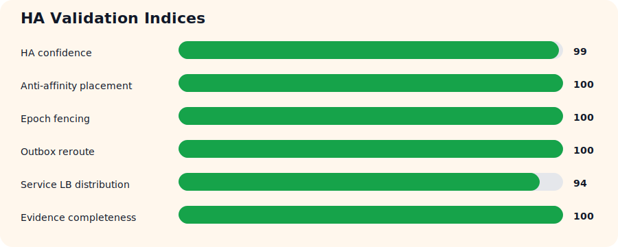
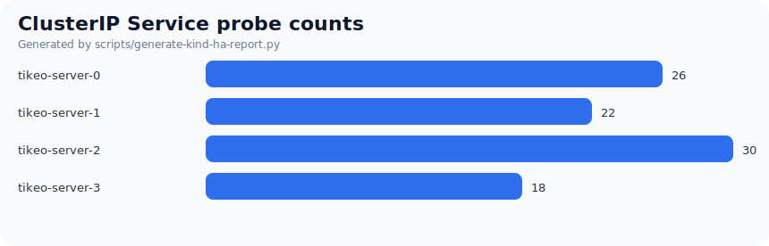
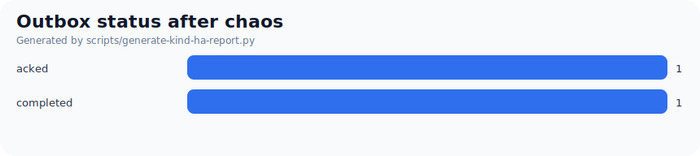
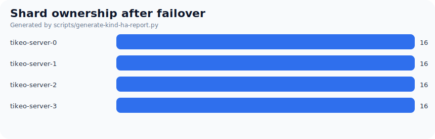

# Tikeo Kind Raft FSOD HA Validation Report

- Generated at: `2026-06-22T04:08:29.804394+00:00`
- Evidence directory: `/home/neo/Projects/neo/pub/tikeo/.dev/reports/kind-raft-ha-e2e-20260622T040236Z-260434`
- Verdict: **通过**
- HA confidence index: **99/100**

## 1. Test narrative

本次验证在单机上创建多节点 Kind 集群，通过 required Pod Anti-Affinity 和 topology spread 将 4 个 Tikeo Server Pod 分散到 4 个不同 Kind worker node，以尽量逼近生产 Kubernetes 的故障域调度语义。测试覆盖 Raft owner failover、旧 owner/僵死恢复的 Epoch Fencing、API Service 负载均衡轮询、Worker Gateway 强杀后的 Worker 重连以及 durable Outbox reroute。

Kind 无法完全等价于云厂商多可用区、云 LB、真实 WAF/Ingress 或远端持久盘故障，但它可以真实运行 Kubernetes 调度器、Service、Pod 生命周期、强制删除、StatefulSet 重建、PDB 等对象语义；因此该报告定位为个人开发者本地近生产 HA 验收，而非最终云环境验收。

## 2. Environment

- Kind cluster: `tikeo-raft-ha`
- Kind node image: `kindest/node:v1.33.1`
- Namespace: `tikeo-kind-ha`
- Kind worker nodes: `4`
- Server replicas: `4`
- API pod: `tikeo-server-1`
- Worker gateway before poweroff: `tikeo-server-2`
- Worker gateway after poweroff: `tikeo-server-0`

## 3. Checklist results

| Status | ID | Item | Actual output | Evidence |
| --- | --- | --- | --- | --- |
| ✅ | T00 | Preflight/tool install | Kind cluster reachable; local tools resolved/installed; Kind cluster is reachable | `kind-cluster-ready` |
| ✅ | T01 | Multi-node Kind topology | worker nodes=4; server replicas=4; Kind cluster is reachable | `kind-cluster-ready` |
| ✅ | T02 | Pod anti-affinity/topology spread | initial unique nodes=4; after gateway unique nodes=4; server pods are spread across 4 distinct Kind nodes | `pod-anti-affinity-initial` |
| ✅ | T03 | Raft bootstrap/rollout gate | owners before=4; fencing rows after=64; rollout gate passed for 4 pods | `rollout-before-failover` |
| ✅ | T04 | API pod != Worker gateway pod | apiPod=tikeo-server-1; gateway=tikeo-server-0; API requests and Worker Tunnel are pinned to different non-leader pods | `pod-selection` |
| ✅ | T05 | Pre-failover dispatch | demo.echo completed before failover; SDK/API key request entered tikeo-server-1; worker connected to tikeo-server-2; job succeeded before failover | `pre-failover-dispatch` |
| ✅ | T06 | Old Owner Full GC/zombie recovery approximation | leaderBefore=tikeo-server-0; leaderAfter=tikeo-server-2; epoch 1->5; leader pod was deleted and rollout gate recovered | `fault-drill` |
| ✅ | C01 | Chaos: old owner zombie simulation | leader pod delete plus rollout gate validates recovery path; leader pod was deleted and rollout gate recovered | `fault-drill` |
| ✅ | T07 | Web/API Service LB rotation | requests=96; unique nodes=4; skew=6.00; in-cluster client called the ClusterIP API service repeatedly | `incluster-service-probe-after-failover` |
| ✅ | T08 | Gateway disconnect + Worker reconnect reroute | old=tikeo-server-2; new=tikeo-server-0; reroute=True; gateway pod was force deleted; worker reconnected and durable outbox rows moved to new gateway | `gateway-poweroff-reroute` |
| ✅ | C02 | Chaos: force-kill gateway node | kubectl force delete approximates sudden gateway poweroff; gateway pod was force deleted; worker reconnected and durable outbox rows moved to new gateway | `gateway-poweroff-reroute` |
| ✅ | T09 | Post-chaos dispatch | demo.echo completed after leader and gateway chaos; job succeeded after deleting initial leader pod | `post-failover-dispatch` |
| ✅ | T10 | Evidence/report bundle | Markdown/JSON/CSV/SVG generated; generated final Kind HA validation evidence bundle | `kind-final-report` |

## 4. Numeric metrics

| Metric | Value |
| --- | ---: |
| `server_replicas` | `4` |
| `kind_worker_nodes` | `4` |
| `initial_unique_server_nodes` | `4` |
| `after_gateway_unique_server_nodes` | `4` |
| `service_probe_requests` | `96` |
| `service_probe_unique_nodes` | `4` |
| `service_probe_coverage_ratio` | `1.0` |
| `service_probe_max_abs_skew` | `6.0` |
| `ownership_rows_before` | `64` |
| `ownership_rows_after` | `64` |
| `ownership_unique_owners_before` | `4` |
| `ownership_unique_owners_after` | `4` |
| `ownership_max_epoch_before` | `1` |
| `ownership_max_epoch_after` | `5` |
| `outbox_rows_after_gateway` | `2` |
| `gateway_reroute_observed` | `1` |
| `passed_cases` | `26` |
| `failed_cases` | `0` |
| `index_ha_confidence` | `99` |
| `index_anti_affinity_placement` | `100` |
| `index_epoch_fencing` | `100` |
| `index_outbox_reroute` | `100` |
| `index_service_lb_distribution` | `94` |
| `index_evidence_completeness` | `100` |

## 5. Indices

| Index | Score | Meaning |
| --- | ---: | --- |
| HA confidence | 99 | 综合 Anti-Affinity、Epoch Fencing、Outbox Reroute、Service LB、证据完整性 |
| Anti-affinity placement | 100 | Server Pod 是否分散到独立 Kind worker node |
| Epoch fencing | 100 | 旧 owner 失效/恢复后 stale token 是否被拒绝，且新 owner 可继续调度 |
| Outbox reroute | 100 | Gateway 强杀后 durable Outbox 是否移动到 Worker 新会话 |
| Service LB distribution | 94 | ClusterIP API 请求是否覆盖多个 Server Pod 且偏斜可接受 |
| Evidence completeness | 100 | 关键原始证据文件是否齐全 |



## 6. Charts







## 7. Key evidence files

- ✅ `kind-config.yaml`
- ✅ `server-pod-placement-initial-summary.json`
- ✅ `service-probe-initial-summary.json`
- ✅ `service-probe-after-failover-summary.json`
- ✅ `gateway-reroute-summary.json`
- ✅ `db-evidence-before-failover.json`
- ✅ `db-evidence-after-failover.json`
- ✅ `fault-drill.log`
- ✅ `summary.stdout.json`
- ✅ `gateway-reroute-summary.json`
- ✅ `kind-ha-metrics.csv`
- ✅ `kind-raft-ha-e2e-20260622-assets/chart-service-lb.svg`
- ✅ `kind-raft-ha-e2e-20260622-assets/chart-outbox-status.svg`
- ✅ `kind-raft-ha-e2e-20260622-assets/chart-shard-ownership.svg`
- ✅ `kind-raft-ha-e2e-20260622-assets/chart-ha-indices.svg`

## 8. Raw summaries

### Pod placement

```json
{
  "initial": {
    "serverReplicas": 4,
    "scheduledPods": 4,
    "uniqueNodes": 4,
    "antiAffinitySatisfied": true,
    "nodes": [
      "tikeo-raft-ha-worker",
      "tikeo-raft-ha-worker2",
      "tikeo-raft-ha-worker3",
      "tikeo-raft-ha-worker4"
    ],
    "placements": [
      {
        "pod": "tikeo-server-0",
        "node": "tikeo-raft-ha-worker3",
        "phase": "Running",
        "podIP": "10.244.4.2"
      },
      {
        "pod": "tikeo-server-1",
        "node": "tikeo-raft-ha-worker4",
        "phase": "Running",
        "podIP": "10.244.3.2"
      },
      {
        "pod": "tikeo-server-2",
        "node": "tikeo-raft-ha-worker",
        "phase": "Running",
        "podIP": "10.244.2.2"
      },
      {
        "pod": "tikeo-server-3",
        "node": "tikeo-raft-ha-worker2",
        "phase": "Running",
        "podIP": "10.244.1.3"
      }
    ]
  },
  "afterGatewayPoweroff": {
    "serverReplicas": 4,
    "scheduledPods": 4,
    "uniqueNodes": 4,
    "antiAffinitySatisfied": true,
    "nodes": [
      "tikeo-raft-ha-worker",
      "tikeo-raft-ha-worker2",
      "tikeo-raft-ha-worker3",
      "tikeo-raft-ha-worker4"
    ],
    "placements": [
      {
        "pod": "tikeo-server-0",
        "node": "tikeo-raft-ha-worker3",
        "phase": "Running",
        "podIP": "10.244.4.3"
      },
      {
        "pod": "tikeo-server-1",
        "node": "tikeo-raft-ha-worker4",
        "phase": "Running",
        "podIP": "10.244.3.2"
      },
      {
        "pod": "tikeo-server-2",
        "node": "tikeo-raft-ha-worker",
        "phase": "Running",
        "podIP": "10.244.2.4"
      },
      {
        "pod": "tikeo-server-3",
        "node": "tikeo-raft-ha-worker2",
        "phase": "Running",
        "podIP": "10.244.1.3"
      }
    ]
  }
}
```

### Service probe

```json
{
  "initial": {
    "requests": 48,
    "uniqueRespondingNodes": 4,
    "serverReplicas": 4,
    "countsByNode": {
      "tikeo-server-0": 16,
      "tikeo-server-1": 7,
      "tikeo-server-2": 13,
      "tikeo-server-3": 12
    },
    "expectedPerNode": 12.0,
    "maxAbsoluteSkew": 5.0,
    "coverageRatio": 1.0,
    "passed": true
  },
  "afterFailover": {
    "requests": 48,
    "uniqueRespondingNodes": 4,
    "serverReplicas": 4,
    "countsByNode": {
      "tikeo-server-0": 10,
      "tikeo-server-1": 15,
      "tikeo-server-2": 17,
      "tikeo-server-3": 6
    },
    "expectedPerNode": 12.0,
    "maxAbsoluteSkew": 6.0,
    "coverageRatio": 1.0,
    "passed": true
  }
}
```

### Gateway reroute

```json
{
  "oldGateway": "tikeo-server-2",
  "newGateway": "tikeo-server-0",
  "oldGatewayNonTerminalBefore": 1,
  "newGatewayRowsAfter": 1,
  "completedRowsAfter": 1,
  "rerouteObserved": true,
  "statusByGatewayAfter": {
    "tikeo-server-2": {
      "completed": 1
    },
    "tikeo-server-0": {
      "acked": 1
    }
  }
}
```

### Outbox statuses

```json
{
  "beforeFailover": {
    "completed": 1
  },
  "afterGatewayReroute": {
    "acked": 1,
    "completed": 1
  },
  "afterFailover": {
    "completed": 3
  }
}
```

## 9. Limitations

- Kind 的多节点运行在同一台物理机上，不能证明跨机器、跨机架、跨 AZ 网络和磁盘故障模型。
- `kubectl delete pod --force --grace-period=0` 能逼近进程/节点突然消失，但不是云主机真实断电的完整等价物。
- 本报告验证 Kubernetes 对象语义、调度分散、Raft failover、Outbox 状态机和 Worker reconnect；真实云环境仍需补充云 LB/Ingress/WAF、存储 HA、网络抖动和资源压力测试。
