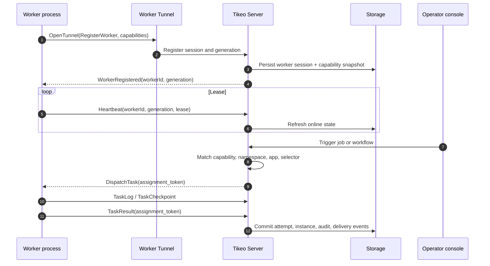
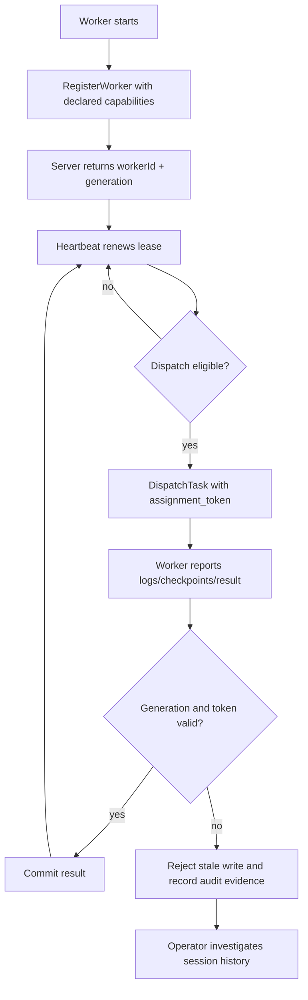

# Server, Worker, and Worker Tunnel

The Worker Tunnel is the most important runtime boundary in Tikeo. The Server owns scheduling, identity, governance, audit, and Management API state. Workers own business execution: normal processors, approved scripts, plugin processors, HTTP calls, SQL processors, and other controlled runtimes. The two sides are connected by an outbound long-lived gRPC/HTTP2 tunnel opened by the Worker. This means a Worker can run in a private subnet, Kubernetes cluster, VM, or systemd service without exposing an inbound business execution endpoint.

## Reader outcome

After this page you should be able to explain why Tikeo does not call into random Worker URLs, what evidence a healthy tunnel produces, how stale Workers are fenced, and which screen or log to inspect when an instance is pending, retrying, failed, or apparently lost. A complete evaluation is never just “the port is open”; it proves identity, lease, dispatch, execution, logs, result, notification, and audit.

## Closed-loop runtime flow

The Server assigns authoritative identity during registration. A human-readable Worker name is useful for filtering, but it is not the security boundary. The session generation and assignment token are what prevent an older process from reporting a result after a replacement Worker has already taken over the logical slot.

## Component responsibilities

| Component | Owns | Must not own | Operator evidence |
| --- | --- | --- | --- |
| Server | Schedules instances, stores state, validates API requests, checks RBAC, issues dispatch, fences stale writes | Arbitrary user code execution inside the Server process | Jobs, Instances, Audit, Notification delivery attempts |
| Worker Tunnel | Registration, heartbeat, dispatch stream, logs, checkpoints, results, cancellation | Business policy decisions that belong to Server | Worker session history, transport errors, lost reason |
| Worker | normal processors, script runner, plugin processor, external service calls, stdout/stderr capture | Scope-wide authorization or unreviewed Server mutations | Capability snapshot, task logs, result payload, runtime error stack |
| Storage | Durable definitions, instances, attempts, logs, sessions, audit | In-memory-only source of truth | Replayable incident trail after restarts |

## Identity, lease, and fencing

A Worker can disappear without crashing: the network path may be broken, a pod may be drained, a gateway may reset HTTP/2 streams, or credentials may rotate. Tikeo therefore treats “online”, “lost”, “replaced”, and “unregistered” as operational states with evidence, not as a single boolean. When a lease expires, the Server must protect instance state first, then decide whether another eligible Worker can retry.

## Recovery loop

Recovery is a loop, not a one-shot reconnect. The Server detects missed heartbeat or transport errors, classifies the lost reason, fences stale generation writes, reschedules according to retry policy and selector, preserves logs/checkpoints, sends configured notifications, and leaves an audit trail. This is why the Instances page and Workers page must be read together during incidents.

## Scheduling implications

Capability snapshots are part of scheduling. A Job does not become runnable because a Worker has a similar display name; it becomes runnable when at least one online Worker advertises the required processor, namespace/app permissions, tags, region, cluster, or broadcast selector. When no Worker matches, the useful question is “which eligibility rule rejected all Workers?” rather than “is the Server up?”

## Evaluation runbook

1. Start the Server and one Worker with `TIKEO_WORKER_CONNECT=1`.
2. Confirm the Worker appears online in the Workers guide page and has the expected processor capabilities.
3. Trigger an API Job from the Jobs page or Management API.
4. Open the Instance detail page and confirm status transitions, attempt number, worker id, assignment token, logs, result, and audit entry.
5. Stop the Worker during execution and verify the session becomes lost, stale writes are not accepted, retry behavior follows the Job policy, and notifications mention the correct instance id.
6. Restart the Worker and confirm it registers with a fresh generation instead of silently reusing an unsafe stale session.

## Verify

A tunnel implementation is acceptable only when you can prove registration, heartbeat, dispatch, task logs, task result, generation fencing, reconnect, and audit persistence. For a production environment, also prove the public URL used in notification buttons points to the console, not a relative path.

## Troubleshooting

| Symptom | Likely cause | What to inspect |
| --- | --- | --- |
| Worker is not visible | Wrong server address, invalid token, TLS/HTTP2 proxy issue | Worker logs, Server tunnel logs, ingress/gateway config |
| Job stays pending | No Worker capability matches processor or selector | Workers page capability matrix, Jobs scheduling advice |
| Instance shows retrying repeatedly | Worker can start but runtime fails | Instance attempts, stdout/stderr, exception stack |
| Result rejected | Old generation or wrong assignment token | Worker session history and audit entry |
| Notification link is relative | Platform public URL not configured | Settings / platform URL and notification template variables |

## Production checklist

- [ ] Worker Tunnel endpoint is reachable from Workers but Workers do not expose inbound execution ports.
- [ ] TLS/mTLS, API keys, and rotation procedure are documented.
- [ ] Worker capability names are intentional and reviewed before Jobs depend on them.
- [ ] Instance logs and audit entries survive Server restarts.
- [ ] Lost Worker and retry notifications are routed to an owned channel.
