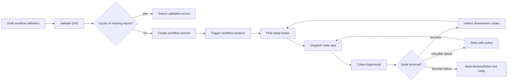
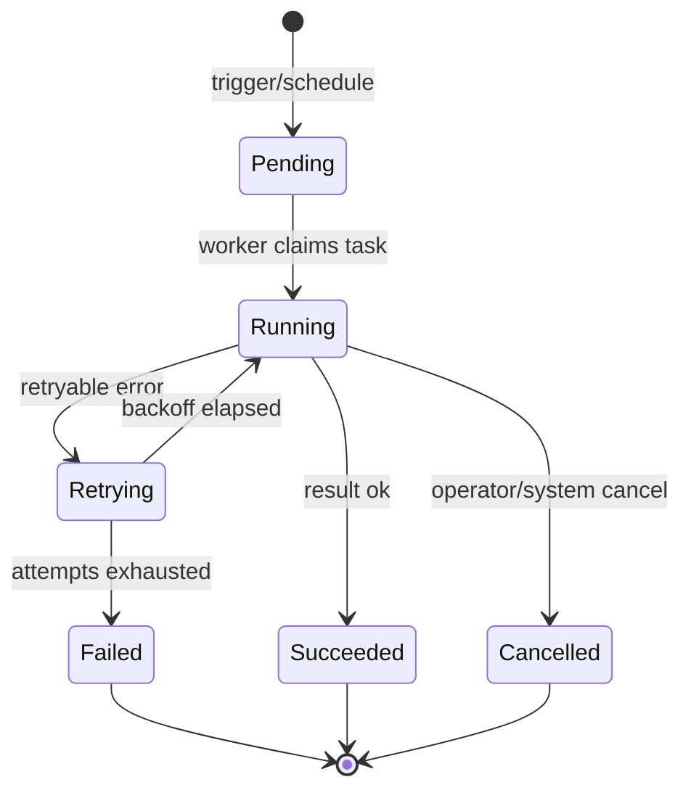

# Workflow DAG model

Tikeo supports simple Jobs and multi-step Workflows. A Job is a reusable execution contract. A Workflow is a directed acyclic graph (DAG) that composes execution nodes, dependency edges, input/output mappings, retry rules, notifications, and replay evidence. The goal is not just to draw a graph; it is to make every operational question answerable: what should run, why it was ready, who triggered it, which Worker executed it, what failed, which retry happened, and which downstream nodes were blocked.

## Reader outcome

After this page you should understand where Jobs stop and Workflows begin, how a DAG reaches a runnable node, how instance and node attempts are related, why replay evidence matters, and how notifications fit without becoming a separate hidden workflow engine.

## Closed-loop DAG flow

This loop keeps the current环节 closed: definition validation prevents impossible graphs, execution only starts from ready nodes, every node attempt creates evidence, and the result feeds the next scheduling decision. A Workflow without replayable evidence is not operationally complete because humans cannot prove what happened after the graph becomes large.

## Job, instance, node, and attempt

| Term | Meaning | Operational question |
| --- | --- | --- |
| Job | Reusable single execution contract: processor, schedule, retry, selector, notification binding | “What can run and where?” |
| Workflow | Versioned DAG made of nodes and edges | “Which steps depend on which other steps?” |
| Workflow instance | One triggered run of a workflow version | “What happened in this run?” |
| Node instance | One node execution inside a workflow instance | “Which step is ready, running, failed, or skipped?” |
| Attempt | One try for a job or node | “Which retry produced this log/result?” |
| Replay bundle | Timeline, inputs, outputs, logs, attempts, operator actions, delivery attempts | “Can we reconstruct the incident?” |

## Instance lifecycle and retry semantics

Retrying is a first-class state in operator language. It is different from Pending because a failed attempt already exists, and it is different from Running because no Worker may currently be executing during backoff. Notification policies should be able to distinguish initial running, retrying, terminal failure, success, and always events.

## Notification and alert boundary

Workflow notifications answer “tell someone about this execution event.” Alerts answer “a rule observed an unhealthy condition and may fire/recover/silence.” A workflow node can send a notification, and an alert can use the same Notification Center channel, template, and delivery pipeline, but the semantics are different. Keep this boundary explicit to avoid duplicate delivery and confusing ownership.

## Replay and incident review

A replay view should show graph version, trigger source, operator, node order, instance IDs, attempt numbers, Worker IDs, logs, results, notification delivery attempts, and audit actions. Without that evidence, a Workflow UI becomes decoration. With it, operators can answer whether a failure came from dependency readiness, Worker eligibility, runtime exception, business exception, secret/config error, or downstream system failure.

## Verify

Create or inspect a small DAG with three nodes: extract, transform, notify. Validate it, run it, force one retryable failure, confirm the node enters retrying, then succeeds or fails terminally according to policy. Open the instance console and verify every node has an attempt record, logs, Worker identity, timestamps, and notification delivery result.

## Troubleshooting

| Symptom | Likely cause | What to inspect |
| --- | --- | --- |
| Node never starts | Upstream dependency failed or inputs missing | DAG readiness panel and node dependency table |
| Workflow succeeds too early | Edge or terminal condition is wrong | Version diff and validation output |
| Retry storms | Retry policy too aggressive or business failure marked retryable | Attempt timeline and error classification |
| Notification missing | Policy not bound to workflow/node event, channel disabled, template render failed | Notification delivery attempts and template render preview |
| Replay lacks detail | Logs/checkpoints not emitted by Worker or script runtime | Worker SDK instrumentation and script runner capture |

## Production checklist

- [ ] Workflows are versioned and changes are reviewed with a diff.
- [ ] Every node has explicit retry, timeout, and downstream failure behavior.
- [ ] Notifications are bound to clear execution events and templates include instance IDs.
- [ ] Replay evidence is part of acceptance testing, not a later debugging wish.
- [ ] High-risk Workflows have rollback or manual recovery instructions.
