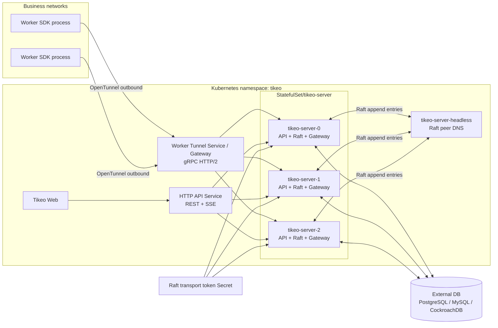
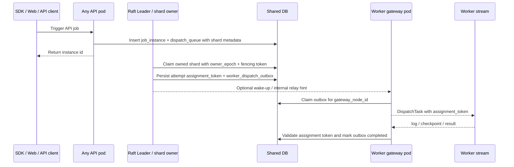
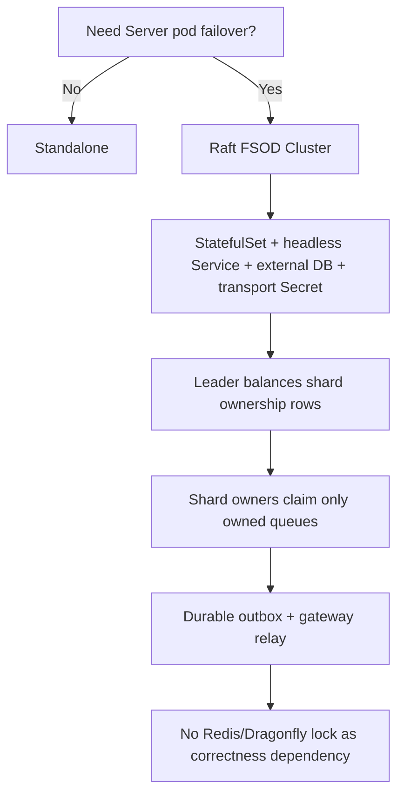
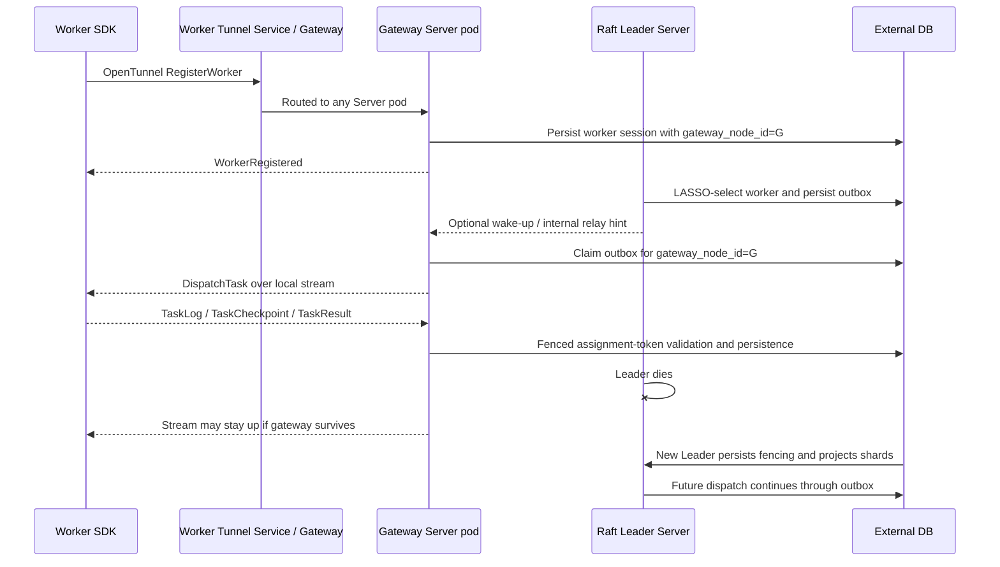

# Server HA and Raft FSOD Cluster

The formal name for Tikeo's production multi-pod Server architecture is **Raft FSOD Cluster**. FSOD means **Fenced Slot Outbox Dispatch**: a dispatch model where Raft provides a fenced control-plane authority, scheduler queues are partitioned into stable slots, every Worker dispatch intent is persisted in an outbox before stream delivery, and gateway pods deliver only the streams they actually own.

In Kubernetes Raft mode, Server pods form a Raft group, the elected Leader persists a fencing token, projects scheduler shard ownership into the shared database, and dispatches through a durable `worker_dispatch_outbox`. Worker Tunnel streams may land on any Server pod; the pod that owns the stream acts as a gateway and delivers outbox rows for its `gateway_node_id`. The goal is practical HA without making Redis, Dragonfly, or SQL advisory locks a scheduler-correctness dependency.


## Why this is an innovation

Raft FSOD Cluster is not a passive standby design and not a distributed-lock wrapper around a legacy scheduler. It combines several independently useful mechanisms into one closed dispatch loop:

| Building block | Role in the cluster | Innovation value |
| --- | --- | --- |
| Raft fencing | Establishes one control-plane authority for terms, global timer/retry loops, and ownership projection. | Prevents split-brain scheduler decisions without asking every dispatch path to acquire an external lock. |
| Shard ownership projection | Maps stable scheduler slots to active Server pods with owner epoch and fencing token. | Lets non-Leader pods actively dispatch their own shards, so extra pods improve failover and dispatch throughput instead of sitting idle. |
| Durable outbox | Persists the selected Worker/attempt before stream delivery. | Removes pod-local memory as the source of truth; relay, reconnect, and visibility-timeout recovery can continue after gateway changes. |
| Worker Tunnel gateway relay | Allows Workers to connect to any Server pod while the owning gateway claims only its outbox rows. | Keeps the outbound-only Worker model and avoids exposing business Workers even in multi-pod Server deployments. |
| LASSO worker scoring | Prefers local gateway delivery, then worker authority, rendezvous spread, and stable tie-breakers. | Reduces cross-pod relay when possible without weakening durable dispatch or fencing. |

Operator-facing result: API and Web requests may be load-balanced across Server pods, Worker streams may land on different pods, and task dispatch still has a durable, fenced path from trigger to terminal result.

This release uses a multi-owner scheduler path. Raft still elects exactly one control-plane Leader, but that Leader projects scheduler shards across active members only. Follower Pods can actively dispatch only the shards they own, and each claim is fenced by the persisted owner epoch/token. If no membership rows exist yet during bootstrap, projection uses the configured peer set; once membership rows exist, removed or non-active members are excluded instead of receiving fallback shards.

## Deployment architecture



## FSOD dispatch flow



FSOD invariants:

1. **Fenced**: scheduler ownership, queue claims, outbox rows, and Worker progress use epoch/token checks.
2. **Slot**: every job dispatch queue row carries `shard_id`, `shard_map_version`, and `shard_count`.
3. **Outbox**: `DispatchTask` is never the only copy of intent; `worker_dispatch_outbox` is persisted before stream delivery.
4. **Dispatch**: gateway pods only deliver rows for streams they own; sender handles are process-local cache, not truth.

## What is implemented now

| Capability | Current behavior |
| --- | --- |
| Multi-pod Server deployment | Helm `server.cluster.mode=raft` renders a `StatefulSet`, stable pod names, and `tikeo-server-headless`. |
| Consensus and fencing | Raft runtime elects one Leader; only a node with a persisted leader fencing token reports `canSchedule=true`. |
| Shard ownership projection | The Leader projects configured scheduler shards into `cluster_shard_ownership` for **active** Raft members only. Existing healthy ownership is preserved first, and the rebalancer moves only removed/unhealthy/over-target shards needed to restore balance. Rows include `shard_map_version`, `shard_count`, `epoch`, `raft_term`, owner node, and fencing token. |
| Multi-owner dispatch | Any Pod with active ownership rows may dispatch job-instance queues, workflow-node materialization, and broadcast attempts for its owned shards. Non-owners and stale tokens fail closed. |
| Dispatch queue fencing | API/job/workflow dispatch queue rows persist shard map fields. Claims bind to `owner_epoch` and `owner_fencing_token`; stale owner tokens are rejected. |
| Durable Worker dispatch | Dispatch creates an assignment token and `worker_dispatch_outbox` row before stream delivery or internal relay hint. |
| Outbox recovery | Gateway delivery scans by `gateway_node_id`; delivered rows without ack/result are requeued by visibility timeout; Worker reconnect can reroute rows by `logical_instance_id` + generation. |
| LASSO worker scoring | Candidate ordering prefers local gateway, then Worker authority, then stable rendezvous spread by dispatch key, then worker id tie-break. |
| Worker Tunnel gateways | Any Server pod may accept Worker Tunnel registration. `worker_sessions.gateway_node_id` records the gateway that owns the live stream. |
| Smart Gateway diagnostics | `/api/v1/cluster/diagnostics` includes `smartGateway` with local gateway id, online/local/remote Worker counts, outbox backlog, queued/reroute-pending count, oldest queued age, and an explicit safety boundary. |
| Web/API load balancing | Business data reads shared storage and is stable across pods. `/api/v1/cluster/diagnostics` now probes every active member endpoint and reports `probeStatus`, `observedRole`, `observedCanSchedule`, and `probeLatencyMs` so operators can distinguish local truth from cross-pod health. |
| External locks | Redis/Dragonfly/SQL advisory locks are not required for core scheduler correctness. |

## Smart Gateway diagnostics

Smart Gateway is an optimization and observability surface, not a new correctness authority. The response field `smartGateway` is intentionally diagnostic-safe: it reports whether the current pod has local Worker streams, how many online Workers are on remote gateways, whether durable outbox rows are queued or waiting for reroute, and the age of the oldest pending delivery. Operators can use it to spot gateway imbalance, missing HTTP/2 Worker Tunnel paths, or outbox recovery pressure before those become user-visible incidents.

The safety boundary is strict: dispatch correctness still depends on Raft fencing, shard ownership rows, `worker_dispatch_outbox`, assignment tokens, Worker generation, and database terminal-state checks. If Smart Gateway data says `ready`, that means locality and delivery pressure look healthy from this pod; it does not grant scheduling ownership or bypass persisted outbox delivery.

| Field | Meaning | Typical action |
| --- | --- | --- |
| `localGatewayNodeId` | Server node id used by this pod for Worker Tunnel sessions. | Match it with `worker_sessions.gateway_node_id` and pod logs. |
| `onlineWorkers`, `localGatewayWorkers`, `remoteGatewayWorkers` | Current durable online Worker distribution from lifecycle tables. | Check load-balancing/locality and whether a pod has lost Worker streams. |
| `outboxTotal`, `queuedOrReroutePending`, `oldestQueuedAgeSeconds` | Durable dispatch backlog pressure. | Investigate gateway delivery, relay, Worker reconnect, or shard-owner health when age grows. |
| `status` | `idle`, `ready`, or `degraded` health summary. | Treat `degraded` as an operator investigation signal, not as a replacement for queue/SLO alerts. |

## Mode selection



| Mode | How to run it | Use when | Do not use when |
| --- | --- | --- | --- |
| Standalone | `cluster.mode=standalone`, one Server process/pod | Local dev, demos, small single-node VM installs | You need Server pod failover |
| Raft FSOD Cluster | `server.cluster.mode=raft`, StatefulSet, external DB, transport token | Production Kubernetes HA, durable outbox dispatch, Worker gateway failover, multi-owner shard dispatch | You only changed `server.replicas` on a standalone Deployment |
| Multi-owner shard balancing | Enabled by Raft shard ownership projection | Scheduler throughput across Server Pods, workflow node materialization, broadcast fan-out | You cannot keep shard map version/count stable across all Pods |
| Redis/Dragonfly lock scheduling | Not a Tikeo core mode | Optional cache/accelerator only | Core scheduler ownership |

## Advantages and innovation value

| Advantage | Why it matters |
| --- | --- |
| Recoverable dispatch intent | A gateway or internal relay failure does not erase the selected Worker/attempt; outbox rows remain queryable and retryable. |
| Strong fencing | Raft term, owner epoch, queue owner fencing, assignment token, and Worker generation prevent stale writers from changing terminal state. |
| Worker connection locality | LASSO prefers local gateway delivery without bypassing outbox, reducing unnecessary cross-pod relay while preserving recovery. |
| No external lock dependency | Operators do not need Redis/Dragonfly just to make scheduler ownership correct. |
| Web/API safe behind normal Services | Any pod can serve REST/SSE pages because business truth lives in DB; node-local views are explicitly labeled. |
| Active horizontal dispatch | Once shard rows are projected, non-Leader Pods can safely dispatch their owned shards instead of sitting idle. |
| Minimal-movement rebalancing | Adding/removing a healthy Server Pod does not remap every shard; Tikeo keeps current owner rows where possible and only moves the minimum needed to reach the target skew. |

## Limitations and trade-offs

| Limitation | Operational meaning | Mitigation |
| --- | --- | --- |
| Shard ownership changes during rollout | Ownership can move when Raft term/membership projection changes; stale owner tokens are rejected. Minimal-movement planning reduces churn but does not make stale tokens valid. | Keep `cluster.scheduler_shard_map_version` and `cluster.scheduler_shard_count` identical across Pods and roll updates conservatively. |
| Workflow and broadcast are also sharded | Workflow node queues and broadcast attempts use deterministic shard ownership. | Monitor queue age per owner and outbox age to spot an unhealthy shard owner or gateway. |
| Failover is not instantaneous | During Raft election, scheduling pauses until a new Leader persists fencing and projects shards. | Use retry policies, monitor queue age/outbox age, and run failover smoke after upgrades. |
| Requires stable identities | Raft mode needs StatefulSet pod names and headless peer DNS. | Use Helm Raft overlay or `deploy/k8s/tikeo-raft-ha.yaml`, not a plain Deployment replica bump. |
| Requires external DB | Multi-pod HA cannot use pod-local SQLite. | Use PostgreSQL, MySQL, or CockroachDB-compatible storage shared by all pods. |
| Long-lived network paths matter | Worker Tunnel uses gRPC/HTTP2 and Web uses SSE. | Configure ingress/LB/WAF per [SSE realtime deployment notes](./sse-realtime) and keep Worker Tunnel HTTP/2 capable. |

## Configuration reference

These are the minimum deployment requirements for the Raft FSOD Cluster. All Server pods in the same cluster must agree on mode, peer set, storage, shard map version, and shard count; drift in any of those fields should be treated as a rollout blocker.

| Config / env | Default | Production guidance |
| --- | --- | --- |
| `cluster.mode` / `TIKEO__CLUSTER__MODE` | `standalone` | Set to `raft` for multi-pod Server HA. |
| `cluster.node_id` / `TIKEO__CLUSTER__NODE_ID` | `tikeo-standalone` | In Kubernetes Raft mode, use the StatefulSet pod name via `metadata.name`. |
| `cluster.peers[]` | empty | Include every StatefulSet peer endpoint, for example `http://tikeo-server-0.tikeo-server-headless:9090`. |
| `cluster.transport_token` / `TIKEO__CLUSTER__TRANSPORT_TOKEN` | empty | Required for internal Raft/relay routes; store in a Kubernetes Secret. |
| `cluster.scheduler_shard_map_version` | `1` | Change only through a planned shard-map migration. |
| `cluster.scheduler_shard_count` | `64` | Must stay stable across all pods for a map version. |
| `storage.database.*` / `TIKEO__STORAGE__DATABASE__HOST / TIKEO__STORAGE__DATABASE__PASSWORD` | SQLite dev path | Use external PostgreSQL/MySQL/CockroachDB for Raft HA. |
| `server.worker_tunnel_addr` | `0.0.0.0:9998` | Expose through a Service/Gateway that preserves gRPC/HTTP2; do not route it through an HTTP/1-only proxy. |
| API/SSE ingress path | deployment-specific | Browser/API traffic can be load-balanced across pods, but SSE paths must disable proxy buffering and use long idle/read timeouts. See [SSE realtime deployment notes](./sse-realtime). |
| Worker Tunnel Service | deployment-specific | May load-balance initial Worker connections across pods; reconnect changes `worker_sessions.gateway_node_id` and outbox reroute handles later delivery. |

## Prerequisites

Before enabling Raft FSOD Cluster, prepare these dependencies:

- External PostgreSQL, MySQL, or CockroachDB-compatible storage shared by every Server pod.
- StatefulSet identities and a headless peer Service; a plain Deployment replica bump is not enough.
- `tikeo-raft-transport` Secret mounted as `TIKEO__CLUSTER__TRANSPORT_TOKEN`.
- gRPC/HTTP2-capable Worker Tunnel networking.
- SSE-safe API networking for Web realtime pages.
- A real Worker for failover verification, not only Kubernetes readiness checks.

## Verify

Render the Helm overlay first:

```bash
helm template tikeo ./deploy/helm/tikeo \
  --namespace tikeo \
  -f deploy/helm/tikeo/examples/values-external-postgres.yaml \
  -f deploy/helm/tikeo/examples/values-raft-ha.yaml \
  | grep -E 'kind: StatefulSet|tikeo-server-headless|TIKEO__CLUSTER__MODE|TIKEO__CLUSTER__TRANSPORT_TOKEN'
```

After install or upgrade:

```bash
kubectl -n tikeo rollout status statefulset/tikeo-server
kubectl -n tikeo get pods -l app.kubernetes.io/component=server -o wide
kubectl -n tikeo get svc tikeo-server-headless
```

Check diagnostics and FSOD metrics:

```bash
curl -fsS "$TIKEO_SERVER_URL/api/v1/cluster/diagnostics" \
  -H "x-tikeo-api-key: $TIKEO_MANAGEMENT_API_KEY" \
  | jq '{respondingNode: .data.respondingNode.nodeId, nodes: [.data.nodes[] | {nodeId, canSchedule, currentTerm}]}'

curl -fsS "$TIKEO_SERVER_URL/api/v1/metrics/summary" \
  -H "x-tikeo-api-key: $TIKEO_MANAGEMENT_API_KEY" \
  | jq '{queue: .data.queue, outbox: .data.outbox, shardOwnership: .data.shard_ownership}'
```

Expected evidence:

- exactly one node reports `canSchedule=true`;
- `shardOwnership.active` is greater than zero;
- `shardOwnership.activeOwnerCount` matches the current healthy owner set;
- `shardOwnership.ownershipSkew` is normally `0` or `1` after projection;
- `queue.pendingByShardOwner` and `queue.oldestPendingAgeByShardOwner` show which owner is accumulating work;
- `outbox.total` increases after dispatch and terminal rows eventually become completed;
- `queue.blockedByQuota` is observable when worker-pool quota backpressure is active.

For non-mutating rollout/rollback gates against an already deployed environment, run:

```bash
TIKEO_SERVER_URL="https://tikeo.example.com" \
TIKEO_MANAGEMENT_API_KEY="$TIKEO_MANAGEMENT_API_KEY" \
TIKEO_EXPECTED_SERVER_REPLICAS=3 \
TIKEO_MAX_SHARD_SKEW=1 \
TIKEO_MAX_PENDING_AGE_SECONDS=120 \
TIKEO_MAX_OUTBOX_AGE_SECONDS=120 \
TIKEO_ROLLOUT_REPORT=.dev/reports/raft-ha-rollout.json \
scripts/verify-raft-ha-rollout.sh
```

This script calls only `/api/v1/cluster/diagnostics` and `/api/v1/metrics/summary`; it does not mutate jobs, workers, DB rows, or Kubernetes resources. It also fails when any remote member probe reports `unreachable`, `http_error`, or invalid JSON. Use it before declaring a rollout healthy and again after `helm rollback` to prove the restored revision has one scheduler, active shard ownership, acceptable skew, bounded queue/outbox age, and reachable peer status endpoints.

For controlled Kubernetes fault injection, dry-run first and then explicitly opt in to mutation:

```bash
# No mutation; records selected target and next apply command.
TIKEO_SERVER_URL="https://tikeo.example.com" \
TIKEO_MANAGEMENT_API_KEY="$TIKEO_MANAGEMENT_API_KEY" \
TIKEO_EXPECTED_SERVER_REPLICAS=3 \
scripts/raft-ha-fault-injection-drill.sh

# Mutating drill: deletes the observed schedulable Server pod, waits for StatefulSet recovery,
# then reruns scripts/verify-raft-ha-rollout.sh until healthy or timeout.
TIKEO_FAULT_MODE=apply \
TIKEO_FAULT=leader-pod-delete \
TIKEO_SERVER_URL="https://tikeo.example.com" \
TIKEO_MANAGEMENT_API_KEY="$TIKEO_MANAGEMENT_API_KEY" \
TIKEO_EXPECTED_SERVER_REPLICAS=3 \
scripts/raft-ha-fault-injection-drill.sh
```

For local end-to-end evidence without Kubernetes, run:

```bash
TIKEO_RAFT_WORKER_E2E_KEEP=0 \
TIKEO_RAFT_WORKER_E2E_REBUILD_SERVER=0 \
scripts/raft-worker-failover-e2e.sh
```

### Cloud/staging Raft FSOD acceptance gate

Kind proves the Kubernetes object model locally, but a cloud or staging environment still needs a read-only acceptance run against the real network path. Use `scripts/cloud-raft-ha-acceptance.sh` after rollout, after rollback, and before publishing a release note that claims production HA readiness. The script is intentionally non-mutating: it does not delete pods, create jobs, write DB rows, or change Kubernetes objects. It collects API, metrics, SSE, Worker Tunnel, and optional `kubectl` evidence into one report directory.

```bash
TIKEO_CLOUD_HA_SERVER_URL="https://tikeo.example.com" \
TIKEO_CLOUD_HA_API_KEY="$TIKEO_MANAGEMENT_API_KEY" \
TIKEO_CLOUD_HA_EXPECTED_REPLICAS=4 \
TIKEO_CLOUD_HA_NAMESPACE=tikeo \
TIKEO_CLOUD_HA_WORKER_TUNNEL_HOST="worker-tunnel.example.com" \
TIKEO_CLOUD_HA_WORKER_TUNNEL_PORT=9998 \
scripts/cloud-raft-ha-acceptance.sh
```

Acceptance scope:

| Check | Why it matters | Evidence file |
| --- | --- | --- |
| `/api/v1/cluster` and `/api/v1/cluster/diagnostics` | Confirms Raft mode, member count, peer probes, one visible schedulable authority, and leader fencing. | `cluster.json`, `cluster-diagnostics.json` |
| `/api/v1/metrics/summary` | Confirms active shard ownership, ownership skew, dispatch queue age, outbox age, and Smart Gateway health. | `metrics-summary.json`, `summary.json` |
| SSE endpoint probe | Catches ingress/LB/WAF buffering or auth-shape regressions for realtime Web pages. | `sse-headers.txt`, `sse-sample.txt` |
| Worker Tunnel TCP probe | Confirms the public or private Worker Tunnel endpoint is reachable on the expected gRPC/HTTP2 port. | `worker-tunnel-tcp.json` |
| Optional `kubectl` evidence | Records pod placement, StatefulSet/Service/Ingress/Gateway shape, and recent events from the actual cluster. | `kubectl-pods.txt`, `kubectl-networking.txt`, `kubectl-events.txt` |

Important environment variables:

| Variable | Default | Notes |
| --- | --- | --- |
| `TIKEO_CLOUD_HA_SERVER_URL` | required | Public or private Server API base URL. You may also pass it as the first argument. |
| `TIKEO_CLOUD_HA_API_KEY` | empty | Sent as `x-tikeo-api-key` when your endpoints require auth. |
| `TIKEO_CLOUD_HA_EXPECTED_REPLICAS` | `4` | Minimum diagnostics node count expected in the report. |
| `TIKEO_CLOUD_HA_NAMESPACE` | `tikeo` | Namespace used for optional `kubectl` evidence. |
| `TIKEO_CLOUD_HA_APP_LABEL_SELECTOR` | `app.kubernetes.io/name=tikeo` | Pod selector for optional placement evidence. |
| `TIKEO_CLOUD_HA_WORKER_TUNNEL_HOST` | empty | Set to probe the Worker Tunnel network path. |
| `TIKEO_CLOUD_HA_WORKER_TUNNEL_PORT` | `9998` | Worker Tunnel TCP port. |
| `TIKEO_STREAM_TOKEN` | empty | Appended to the SSE URL when stream token auth is enabled. |
| `TIKEO_CLOUD_HA_REPORT_DIR` | `.dev/reports/cloud-raft-ha-acceptance-<timestamp>` | Evidence directory. |
| `TIKEO_CLOUD_HA_MUTATING` | `0` | Any non-zero value fails fast. Use explicit chaos scripts for destructive drills. |

A passing cloud report should show: `mode=raft`, diagnostics nodes at least equal to the expected replicas, at most one schedulable node, a leader fencing token when scheduling is enabled, `shardOwnership.active > 0`, no stale queue/outbox backlog over 300 seconds, Smart Gateway diagnostics present, and an SSE endpoint that either streams `text/event-stream` or fails closed with an auth status. Archive `REPORT.md`, `summary.json`, and the raw JSON/header files with the release or staging sign-off.

### Local Kind 4-Pod Kubernetes E2E

When you do not have a real multi-node Kubernetes cluster, use Kind to exercise the Kubernetes-specific part of the HA design on one machine. This is the recommended local acceptance test before claiming the four-Pod Raft path works.

What the Kind harness does:

1. creates or reuses a local Kind cluster with one control-plane node and four worker nodes;
2. uses required Pod Anti-Affinity plus topology spread so each Server pod lands on a different Kind worker node;
3. builds `target/debug/tikeo` and packages it as a fast local Docker image;
4. deploys PostgreSQL plus a four-replica `tikeo-server` StatefulSet with headless peer DNS, API Service, and Worker Tunnel Service;
5. bootstraps an admin user and an app-scoped `x-tikeo-api-key`;
6. pins management/API requests to one non-Leader pod and pins the Worker Tunnel long connection to a different non-Leader pod;
7. verifies `/api/v1/cluster/diagnostics`, `/api/v1/metrics/summary`, in-cluster Service access, and durable DB evidence;
8. triggers an API job before failover;
9. deletes the currently schedulable Leader pod through `scripts/raft-ha-fault-injection-drill.sh`;
10. triggers a slow Worker job, force-deletes the current Worker gateway pod, waits for Worker reconnect, and verifies durable outbox reroute;
11. waits for StatefulSet recovery and triggers another API job after failover.

Run it from the repository root:

```bash
# Installs kind/kubectl into .dev/tools/bin when they are not already available.
TIKEO_KIND_E2E_KEEP=0 \
TIKEO_KIND_E2E_REBUILD_SERVER=1 \
TIKEO_KIND_WORKER_NODES=4 \
scripts/kind-raft-ha-e2e.sh
```

Useful options:

| Environment variable | Default | Use |
| --- | --- | --- |
| `TIKEO_KIND_CLUSTER_NAME` | `tikeo-raft-ha` | Reuse or isolate a Kind cluster name. |
| `TIKEO_KIND_NAMESPACE` | `tikeo-kind-ha` | Kubernetes namespace used by the harness. |
| `TIKEO_KIND_SERVER_REPLICAS` | `4` | Keep at `4` for the acceptance test; lower values reduce coverage. |
| `TIKEO_KIND_WORKER_NODES` | `4` | Kind worker-node count. Keep at least the Server replica count so required Anti-Affinity can place one Server pod per node. |
| `TIKEO_KIND_E2E_KEEP` | `0` | Set to `1` to keep the Kind cluster and port-forward evidence for manual inspection. |
| `TIKEO_KIND_E2E_REPORT_DIR` | `.dev/reports/<run-id>` | Evidence output directory. |
| `TIKEO_KIND_E2E_INSTALL_TOOLS` | `1` | Set to `0` to require preinstalled `kind` and `kubectl`. |
| `TIKEO_KIND_E2E_REBUILD_SERVER` | `1` | Set to `0` to reuse an existing `target/debug/tikeo` binary. |

A passing run writes `.dev/reports/<run-id>/<run-id>.json` and supporting evidence such as:

- `cluster-diagnostics-*.json` and `metrics-summary-*.json`;
- `rollout-*.json` and `fault-drill/*`;
- `db-evidence-*.json` with `cluster_shard_ownership`, `worker_sessions`, `worker_dispatch_outbox`, and `dispatch_queue`;
- `instance-result-before-failover.json` and `instance-result-after-failover.json`;
- `worker.log`, pod logs, Kubernetes events, and the generated manifest.

Kind validates Kubernetes object semantics, stable StatefulSet identities, headless DNS, Service routing inside the cluster, Worker Tunnel gateway separation, and Leader-pod deletion recovery. It does **not** replace production validation for multi-node zone failure, cloud load balancer idle timeouts, WAF behavior, TLS certificates, real ingress controllers, or real external database HA.

#### 2026-06-22 local Kind HA acceptance result

The 2026-06-22 run used the current harness with **four Kind worker nodes**, **four Tikeo Server replicas**, required Pod Anti-Affinity, and topology spread to approximate production failure domains on a single developer machine. The full checked-in report is stored in the repository at `design/reports/kind-raft-ha-e2e-20260622.md`; raw run artifacts were generated under `.dev/reports/kind-raft-ha-e2e-20260622T040236Z-260434/`.

| Acceptance area | Result | Evidence meaning |
| --- | ---: | --- |
| Overall verdict | ✅ Passed | All required local HA cases completed. |
| Passed / failed cases | `26 / 0` | Case ledger covered preflight, placement, Raft rollout, fault drills, Worker reconnect, DB evidence, and report generation. |
| HA confidence index | `99/100` | Weighted score across placement, fencing, outbox reroute, Service distribution, and evidence completeness. |
| Anti-Affinity placement | `100/100` | Initial and post-gateway-failure placements both had `4 / 4` Server pods on distinct Kind worker nodes. |
| Server replicas / Kind worker nodes | `4 / 4` | The test intentionally avoids a single-node Kind topology. |
| Raft shard ownership | `64` active rows, `4` owners | Rollout gate observed ownership skew `0` before failover. |
| Epoch fencing | `100/100` | Targeted stale-token unit evidence plus Leader Pod deletion recovery; owner epoch advanced from `1` to `5`. |
| Worker gateway reroute | `100/100` | Old gateway `tikeo-server-2` was force-deleted; Worker reconnected through `tikeo-server-0`; durable outbox reroute was observed. |
| API Service load balancing | `96` requests, `4 / 4` pods reached | In-cluster ClusterIP probes reached every Server pod; coverage ratio `1.0`, distribution index `94/100`. |
| Evidence completeness | `100/100` | Markdown, JSON, CSV, SVG charts, DB snapshots, pod logs, Worker logs, and Kubernetes events were produced. |

The run specifically covered these chaos paths:

- **Old owner Full-GC/zombie approximation / Epoch Fencing**: delete the currently schedulable Leader pod, wait for StatefulSet recovery, verify rollout health and post-failover dispatch.
- **Gateway poweroff approximation / Outbox Reroute**: force-delete the Server pod that owns the Worker Tunnel stream while a slow Worker task is in flight, then verify Worker reconnect and durable outbox reroute to the newer Worker session/gateway generation.
- **Web/API load-balanced reads**: run repeated in-cluster ClusterIP requests and confirm all four Server pods answer through `x-tikeo-node-id` evidence.

Interpretation: this is strong local Kubernetes evidence for StatefulSet identity, required Anti-Affinity, headless peer DNS, Raft failover, shard ownership, Service rotation, Worker Tunnel reconnect, and FSOD outbox recovery. It is still not a substitute for final cloud validation of real multi-AZ node loss, cloud LB idle timeouts, WAF behavior, ingress-controller specifics, TLS/mTLS certificates, and external database HA.


The script writes an evidence directory under `.dev/reports/<run-id>/` containing:

- `<run-id>.json` final smoke report;
- `*-cases.jsonl` case-by-case pass/fail records;
- `fsod-db-*.json` snapshots of `cluster_shard_ownership`, `worker_sessions`, `worker_dispatch_outbox`, and `dispatch_queue`;
- `metrics-*.json` snapshots of `/api/v1/metrics/summary`;
- `cluster-diagnostics-*.json` snapshots of `/api/v1/cluster/diagnostics`;
- Server, Worker, and TCP proxy logs.

## Kubernetes install summary

```bash
kubectl -n tikeo create secret generic tikeo-raft-transport \
  --from-literal=transport-token="$(openssl rand -hex 32)"

helm upgrade --install tikeo ./deploy/helm/tikeo \
  --namespace tikeo --create-namespace \
  -f deploy/helm/tikeo/examples/values-external-postgres.yaml \
  -f deploy/helm/tikeo/examples/values-raft-ha.yaml

kubectl -n tikeo rollout status statefulset/tikeo-server
```

Expected rendered shape:

- `StatefulSet/tikeo-server`, not `Deployment/tikeo-server`.
- `Service/tikeo-server-headless` with stable peer DNS.
- `TIKEO__CLUSTER__MODE=raft`.
- `TIKEO__CLUSTER__NODE_ID` from the pod name.
- `TIKEO__CLUSTER__TRANSPORT_TOKEN` from a Secret.
- External DB Secret shared by all Server pods.

## Worker Tunnel gateway and failover behavior



If the Worker gateway pod fails, the SDK reconnects, `worker_sessions.generation` increases, and outbox reroute updates the row to the new `gateway_node_id` before delivery retry.

## Troubleshooting

| Symptom | Likely cause | What to check |
| --- | --- | --- |
| More than one pod reports `canSchedule=true` | Broken Raft fencing or mixed config | Stop rollout; inspect `TIKEO__CLUSTER__MODE`, pod node IDs, Raft term, metadata rows, and shared DB URL. |
| No pod reports `canSchedule=true` | Raft cannot elect or persist ownership | Check headless DNS, peer addresses, transport token, DB connectivity, and server logs. |
| `shardOwnership.active` is zero | Leader has not projected shard ownership | Check `/api/v1/cluster`, Raft term, `cluster.scheduler_shard_count`, migration state, and DB write errors. |
| `shardOwnership.ownershipSkew` stays high | A member is unhealthy/removed, configs differ, or projection cannot persist | Check active Raft members, `cluster.scheduler_shard_map_version`, `cluster.scheduler_shard_count`, DB write errors, and `tikeo_cluster_shard_ownership_skew`. |
| One owner accumulates pending work | Shard owner cannot dispatch or reach Worker gateway | Check `queue.pendingByShardOwner`, `queue.oldestPendingAgeByShardOwner`, Worker sessions for that gateway, and relay logs. |
| Jobs queue after failover | New Leader not elected/projected, outbox cannot reach gateway, or Worker lost session | Inspect `cluster-diagnostics`, `metrics.summary`, `fsod-db-*.json`, `worker_sessions.gateway_node_id`, and Server logs. |
| Outbox rows stay `delivered` | Worker did not ack/log/result before visibility timeout | Wait for requeue, verify Worker connectivity, assignment token validation, and delivery loop logs. |
| Worker keeps reconnecting | Worker Tunnel HTTP/2/gRPC path broken | Check Gateway/Ingress protocol, LB idle timeouts, TLS/mTLS, and SDK reconnect logs. |
| API pages differ by pod | Reading node-local endpoint as global truth | Use DB-backed business APIs and `/api/v1/cluster/diagnostics`; treat `/api/v1/cluster` as local view. |
| SSE dashboards disconnect | Proxy buffering or idle timeout | Apply [SSE realtime deployment notes](./sse-realtime). |

## Production checklist

- [ ] Use `standalone` for one Server only.
- [ ] Use `raft` + StatefulSet + external DB for multi-pod Server HA.
- [ ] Keep `cluster.scheduler_shard_map_version` and `cluster.scheduler_shard_count` identical across all pods.
- [ ] Do not use Redis/Dragonfly locks for core scheduler ownership.
- [ ] Confirm exactly one node reports `canSchedule=true`.
- [ ] Confirm `/api/v1/metrics/summary` exposes queue, outbox, shard ownership, owner count, skew, and per-owner queue age data.
- [ ] Run `scripts/verify-raft-ha-rollout.sh` before rollout sign-off and after rollback drills.
- [ ] Import `observability/grafana/tikeo-phase3-dashboard.json` and load both `observability/prometheus/tikeo-recording-rules.yml` and `observability/prometheus/tikeo-alert-rules.yml`.
- [ ] Run `scripts/raft-ha-fault-injection-drill.sh` in dry-run first; only use `TIKEO_FAULT_MODE=apply` in an approved test/staging cluster.
- [ ] Run `scripts/raft-worker-failover-e2e.sh` and archive its `.dev/reports/<run-id>/` evidence before rollout sign-off.
- [ ] Verify at least one real Worker can reconnect and finish a job after Leader failover.
