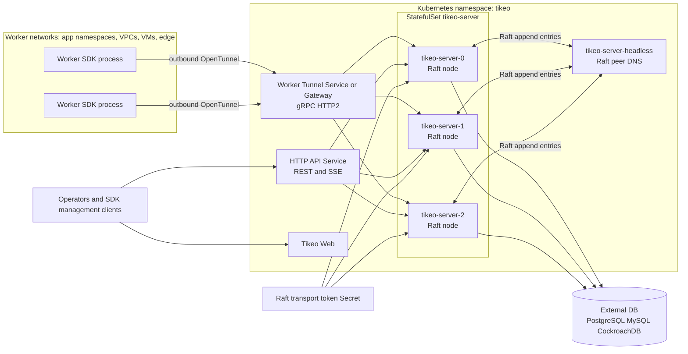
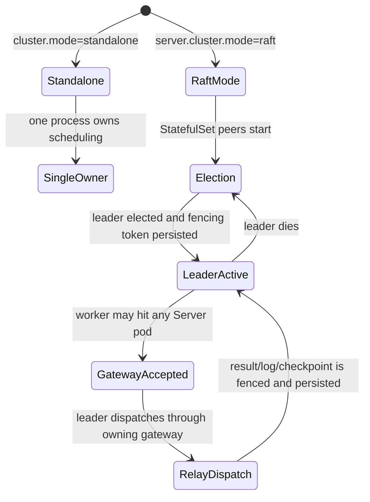
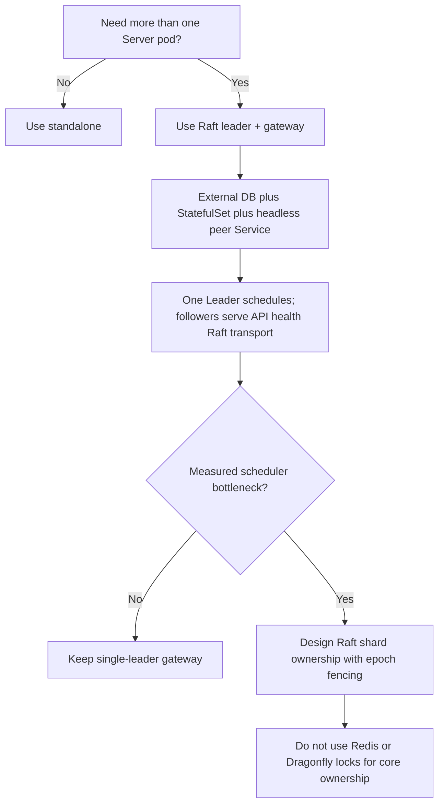
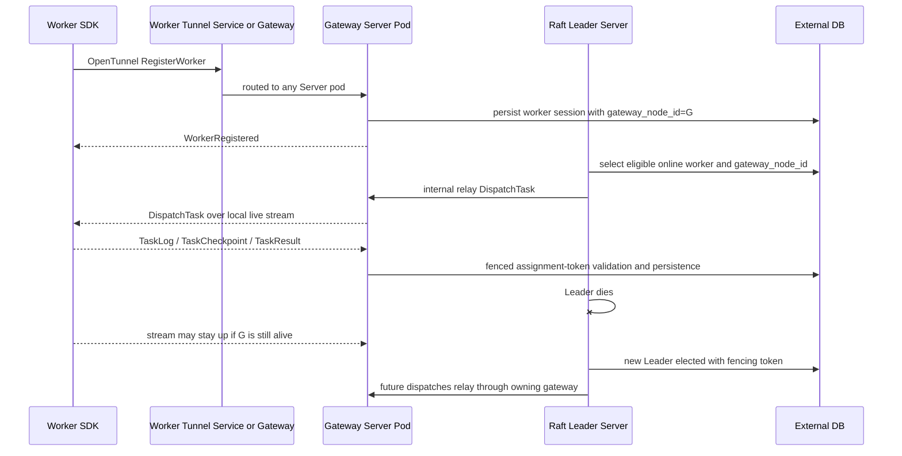

# Server HA and cluster modes

Tikeo Server HA uses **Raft single-leader scheduling with multi-pod Worker Tunnel gateways**. You can run multiple Server pods for control-plane availability, and Workers may connect to any Server pod; only the elected Leader makes scheduling decisions. If the selected Worker is connected to another pod, the Leader relays the dispatch through that gateway pod.

This page is the source of truth for the trade-off. Read it before increasing `server.replicas` or adding an external lock service.

## Deployment architecture



The important detail in this diagram is not the number of pods. The important detail is ownership: all Server pods are live control-plane and Worker Tunnel gateway members, but exactly one Raft Leader owns scheduling decisions at a time.



## Cluster mode decision



## What is implemented now

| Capability | Current behavior |
| --- | --- |
| Multi-pod Server deployment | Helm `server.cluster.mode=raft` renders a `StatefulSet` with stable pod names and a headless peer Service. |
| Consensus and ownership | Server pods form a Raft group. Only the elected Leader with a persisted fencing token reports `canSchedule=true`. |
| Scheduling loops | Only the scheduling Leader runs schedule, dispatch, retry, notification-delivery ownership, and other ownership-sensitive loops. Followers skip those loops. |
| Worker Tunnel registration | In Raft mode, any Server pod may accept Worker Tunnel registration as a gateway. The session records `gateway_node_id` so the scheduling Leader can route dispatch to the pod that owns the live stream. |
| Worker execution | Workers still run outside the Server chart and connect outbound to the Worker Tunnel. No inbound Worker Service is required; cross-pod dispatch uses internal server-to-server relay. |
| External locks | Redis/Dragonfly/SQL advisory locks are not used for core scheduler ownership. |
| Multi-active scheduling | Not enabled today. A pure Raft/fencing shard-decision model exists for future gated work, but runtime shard scheduling is intentionally off until a measured bottleneck justifies it. |

## Why single-leader gateway first

Tikeo has two independent HA questions:

1. **Control-plane availability**: can the API/cluster recover when one Server pod dies?
2. **Scheduling parallelism**: can multiple Server pods safely claim different work at the same time?

The current feature solves the first question and keeps the second deliberately conservative. This avoids the most dangerous scheduler failure modes: duplicate dispatch, split-brain ownership, stale leases, and “two pods think they own the same queue” bugs.

## Advantages

| Advantage | Why it matters |
| --- | --- |
| Strong ownership semantics | Raft term + persisted fencing token gives observable ownership evidence instead of an implicit best-effort DB lock. |
| Safer failover | A dead Leader stops owning dispatch; a new Leader must be elected and fenced before scheduling resumes. |
| Simpler operations | Operators deploy one `StatefulSet`, a headless Service, an external DB, and a transport-token Secret. No Redis/Dragonfly cluster is required just to coordinate ownership. |
| Fewer duplicate-dispatch risks | Only one Server owns schedule/dispatch loops, so queue claims do not rely on several active schedulers racing correctly. |
| Clear Worker Tunnel model | The Leader owns dispatch decisions; every pod may own live Worker streams as a gateway. The persisted `gateway_node_id` plus internal relay keeps process-local senders out of scheduling truth. |
| Upgrade path remains open | If throughput later requires multi-active scheduling, shard ownership can be added inside the same Raft/fencing model. |

## Limitations and trade-offs

| Limitation | Operational meaning | Mitigation |
| --- | --- | --- |
| One active scheduler | Additional Server pods improve HA but do not linearly increase scheduling throughput. | Measure queue pressure first. Add Raft shard ownership only when the single Leader is the bottleneck. |
| Followers are gateways, not schedulers | Followers can hold Worker Tunnel streams, but they do not claim queues or make scheduling decisions. | Expose Worker Tunnel through a gRPC/HTTP2 Service/Gateway; keep internal peer endpoints reachable for relay. |
| Failover is not instantaneous | During election, scheduling pauses until a new Leader has a persisted fencing token. | Use normal retry policies and monitor cluster status/queue age. |
| Requires stable identities | Raft pods need stable names and peer DNS; a plain `Deployment` is not enough for production multi-pod Server HA. | Use the Helm Raft overlay or raw `deploy/k8s/tikeo-raft-ha.yaml`. |
| Requires external DB | Multi-pod HA cannot rely on a single pod-local SQLite file. | Use PostgreSQL, MySQL, or CockroachDB-compatible external storage. |
| Internal relay behavior matters | A Worker may be connected to a different pod from the Leader. | Configure `cluster.peers[].endpoint` and `cluster.transport_token`; allow pod-to-pod HTTP relay on the management API path. |

## Deployment modes

| Mode | How to run it | Use when | Do not use when |
| --- | --- | --- | --- |
| Standalone | `cluster.mode=standalone`, one Server process/pod | Local dev, demos, small single-node VM installs | You need Server pod failover |
| Raft leader + gateway | `server.cluster.mode=raft`, `StatefulSet`, external DB, transport token | Production Kubernetes HA and safe Server failover | You expect every pod to schedule a share of jobs |
| Future Raft shard ownership | Not currently runtime-enabled | A measured bottleneck proves the Leader cannot schedule/dispatch fast enough | You only want generic “more pods” without proving throughput pressure |
| Redis/Dragonfly lock based scheduling | Not a Tikeo core scheduler mode | N/A | Core scheduling ownership; it breaks the Raft/fencing design goal |

## Prerequisites

Before enabling Raft Server HA, prepare these production dependencies instead of only changing the replica count:

- **External database**: PostgreSQL, MySQL, or CockroachDB-compatible storage reachable by every Server pod through the same schema. Do not use pod-local SQLite for multi-pod HA.
- **Stable Server identities**: run Server as a `StatefulSet` with stable pod names and a headless peer Service. A plain Kubernetes `Deployment` does not provide the peer identity model Raft needs.
- **Raft transport Secret**: create a high-entropy `tikeo-raft-transport` Secret and mount it as `TIKEO__CLUSTER__TRANSPORT_TOKEN` for every Server pod.
- **Worker Tunnel networking**: expose Worker Tunnel through a gRPC/HTTP2-capable Service, Gateway, or ingress path. The API path may carry REST and SSE, but the Worker Tunnel stream must not be downgraded to HTTP/1.1.
- **Network-layer behavior**: configure nginx, LB, WAF, and Kubernetes ingress/gateway controllers so they do not buffer, rewrite, or prematurely close long-lived SSE and gRPC streams. Use the dedicated [SSE realtime deployment notes](./sse-realtime) for the REST/SSE API path and the Kubernetes controller runbook for ingress-specific annotations.
- **Worker reconnect policy**: use an SDK version that reconnects after stream drops or Server pod failover. Followers no longer reject registration only because they are followers; they act as Worker Tunnel gateways.
- **Operational smoke test**: keep at least one real Worker available during rollout so failover can be tested end to end, not only by checking pod readiness.

## Verify

Use both rendered-manifest checks and runtime checks. A green rollout alone only proves pods started; it does not prove scheduling ownership is safe.

Render the Helm output first:

```bash
helm template tikeo ./deploy/helm/tikeo \
  --namespace tikeo \
  -f deploy/helm/tikeo/examples/values-external-postgres.yaml \
  -f deploy/helm/tikeo/examples/values-raft-ha.yaml \
  | grep -E 'kind: StatefulSet|tikeo-server-headless|TIKEO__CLUSTER__MODE|TIKEO__CLUSTER__TRANSPORT_TOKEN'
```

After install or upgrade:

```bash
kubectl -n tikeo rollout status statefulset/tikeo-server
kubectl -n tikeo get pods -l app.kubernetes.io/component=server -o wide
kubectl -n tikeo get svc tikeo-server-headless
```

Then verify cluster ownership from the management/API endpoint. Exactly one Server should report `canSchedule=true`; followers should be present but not scheduling:

```bash
curl -fsS "$TIKEO_SERVER_URL/api/v1/cluster" \
  -H "x-tikeo-api-key: $TIKEO_MANAGEMENT_API_KEY" \
  | jq '.data.nodes[] | {nodeId, role, canSchedule, raftTerm}'
```

Finally, verify Worker Tunnel behavior with a real Worker. In local/e2e environments, the failover smoke can be reused without rebuilding already-built binaries:

```bash
TIKEO_RAFT_WORKER_E2E_KEEP=0 \
TIKEO_RAFT_WORKER_E2E_REBUILD_SERVER=0 \
scripts/raft-worker-failover-e2e.sh
```

The expected result is: worker registers through any Server pod, a pre-failover job succeeds, the Leader is killed, a new Leader is elected, dispatch is relayed to the Worker gateway when needed, and a post-failover job succeeds.

## Kubernetes install summary

Use the committed overlay instead of only raising `server.replicas`:

```bash
kubectl -n tikeo create secret generic tikeo-raft-transport \
  --from-literal=transport-token="$(openssl rand -hex 32)"

helm upgrade --install tikeo ./deploy/helm/tikeo \
  --namespace tikeo \
  --create-namespace \
  -f deploy/helm/tikeo/examples/values-external-postgres.yaml \
  -f deploy/helm/tikeo/examples/values-raft-ha.yaml

kubectl -n tikeo rollout status statefulset/tikeo-server
```

Expected rendered shape:

- `StatefulSet/tikeo-server`, not `Deployment/tikeo-server`.
- `Service/tikeo-server-headless` with stable peer DNS.
- `TIKEO__CLUSTER__MODE=raft`.
- `TIKEO__CLUSTER__NODE_ID` from the pod name.
- `TIKEO__CLUSTER__TRANSPORT_TOKEN` from a Secret.
- external DB Secret for all pods.

## Worker Tunnel gateway and failover behavior

In Raft mode, Worker Tunnel is a gateway surface, not a Leader-only surface:



1. Worker opens an outbound gRPC/HTTP2 stream to the Worker Tunnel endpoint.
2. The Service/Gateway may route that stream to any Server pod, including a follower.
3. The gateway pod persists the session with `gateway_node_id`, generation, lease, and fencing token.
4. Only the Raft Leader claims queue work and chooses assignments.
5. If the chosen Worker is connected to a different pod, the Leader calls the internal relay endpoint on that gateway pod and the gateway writes the `DispatchTask` to its local gRPC stream.
6. Task logs, checkpoints, and results are accepted only with the persisted assignment token/fencing checks before state changes are materialized.
7. If the Leader fails but the Worker gateway pod stays alive, the Worker stream does not need to move; the new Leader continues dispatching through the recorded gateway. If the gateway pod fails, the Worker SDK reconnects and a new `gateway_node_id` is persisted.

This is why `cluster.peers[].endpoint` and `cluster.transport_token` are part of the Worker Tunnel HA path, not only the Raft transport path. The endpoints must be reachable pod-to-pod, and the internal relay route must not be exposed without the transport token.

## When to consider shard ownership later

Do not add shard scheduling just because multiple pods exist. Add it only when production evidence shows the single scheduling Leader is the bottleneck, for example:

- queue age grows while workers are available;
- dispatch loop CPU or DB claim latency is saturated on the Leader;
- API/Web/Worker Tunnel capacity is fine, but scheduling claim throughput is not.

A future shard implementation must remain Raft/fencing based:

- deterministic shard key such as `hash(namespace/app/job_or_workflow_id) % shard_count`;
- Raft-applied assignment command with monotonic epoch;
- per-shard fencing token;
- stale-token rejection after failover/rebalance;
- observable rebalance events and rollback path.

## Troubleshooting

| Symptom | Likely cause | What to check |
| --- | --- | --- |
| More than one pod reports `canSchedule=true` | Broken fencing or mixed configuration | Stop the rollout, inspect `TIKEO__CLUSTER__MODE`, node IDs, Raft term, DB fencing rows, and make sure all pods share the same external DB. |
| No pod reports `canSchedule=true` | Raft cannot elect or persist ownership | Check headless DNS, peer addresses, transport token, external DB connectivity, and pod logs for election or persistence errors. |
| Workers keep reconnecting and never register | Worker Tunnel gRPC is broken by the network layer or gateway pods cannot persist sessions | Check Service/Gateway endpoints, HTTP/2 support, ingress annotations, LB health checks, DB connectivity, and Worker SDK reconnect logs. |
| Jobs remain queued after failover | New Leader is not fenced, relay cannot reach the recorded gateway, or workers lost sessions | Query `/api/v1/cluster`, inspect queue age, confirm `worker_sessions.gateway_node_id`, check internal relay token/endpoints, and run one management trigger smoke. |
| Works with one pod but fails with three | Local SQLite, plain Deployment, or missing headless peer Service | Confirm external DB, `StatefulSet/tikeo-server`, stable pod names, and `tikeo-server-headless`. |
| API SSE dashboards disconnect repeatedly | Proxy buffering, WAF idle timeout, or HTTP/1.1 downgrade | Apply the SSE realtime network settings and separate API/SSE behavior from Worker Tunnel gRPC checks. |

## Production checklist

- [ ] Use `standalone` for one Server only.
- [ ] Use `raft` + StatefulSet + external DB for production multi-pod Server HA.
- [ ] Do not use Redis/Dragonfly locks for core scheduler ownership.
- [ ] Confirm exactly one node reports `canSchedule=true`.
- [ ] Verify at least one real Worker can stay connected to any gateway Pod and receive dispatch from the Leader after failover.
- [ ] Monitor queue age before considering shard ownership.
