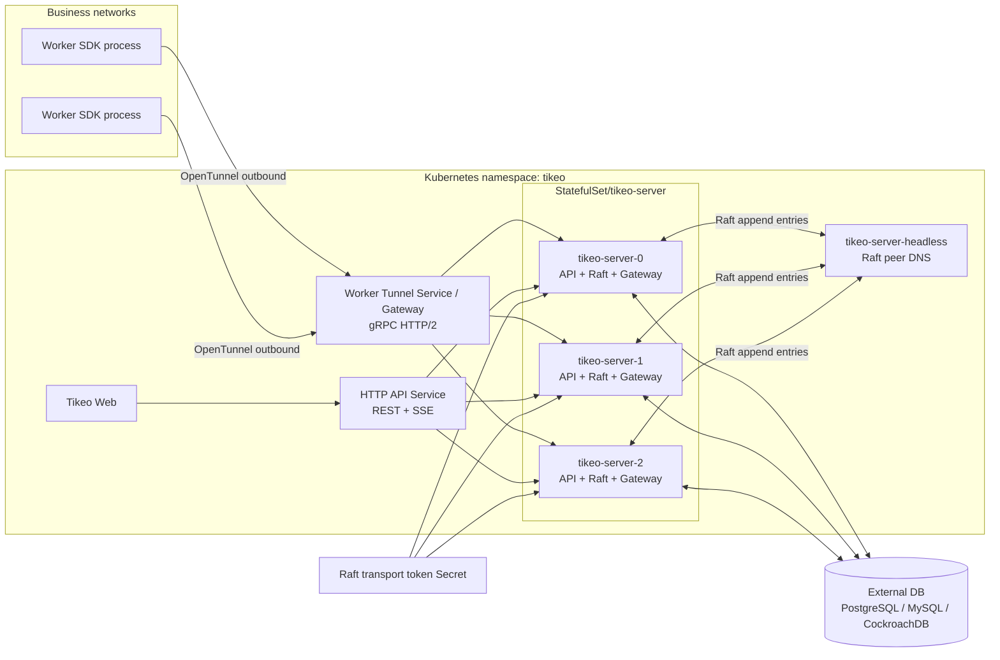
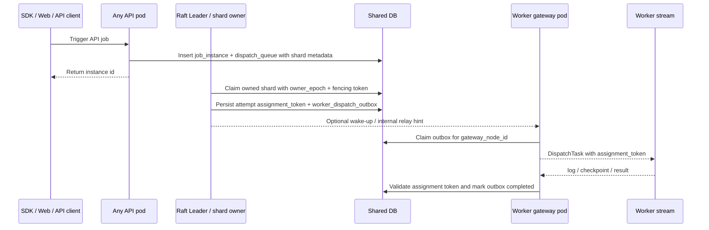
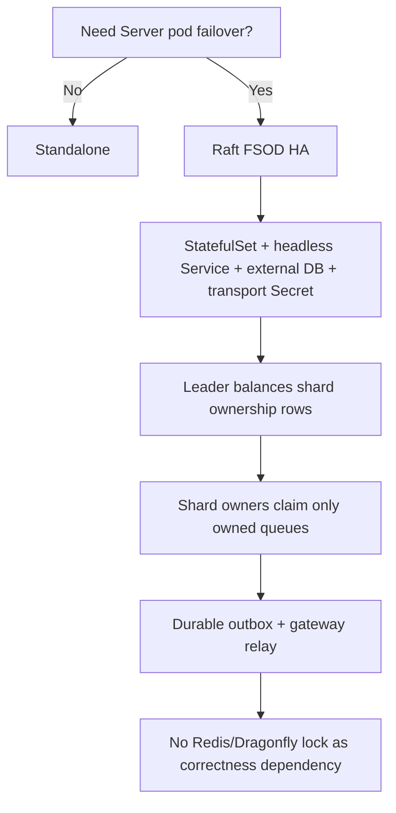
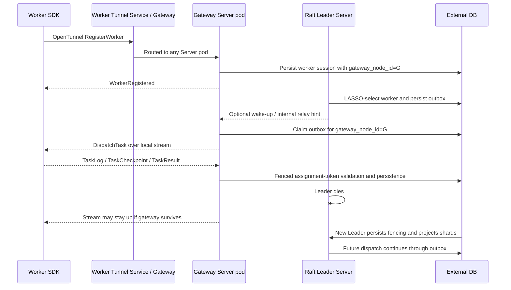

# Server HA and FSOD cluster mode

Tikeo Server HA is built around **FSOD: Fenced Slot Outbox Dispatch**. In Kubernetes Raft mode, Server pods form a Raft group, the elected Leader persists a fencing token, projects scheduler shard ownership into the shared database, and dispatches through a durable `worker_dispatch_outbox`. Worker Tunnel streams may land on any Server pod; the pod that owns the stream acts as a gateway and delivers outbox rows for its `gateway_node_id`.

This release uses a multi-owner scheduler path. Raft still elects exactly one control-plane Leader, but that Leader projects scheduler shards across active/configured members. Follower Pods can actively dispatch only the shards they own, and each claim is fenced by the persisted owner epoch/token. If membership health cannot be read yet, projection falls back to the configured peer set; if only one member is configured, behavior naturally becomes single-owner.

## Deployment architecture



## FSOD dispatch flow



FSOD invariants:

1. **Fenced**: scheduler ownership, queue claims, outbox rows, and Worker progress use epoch/token checks.
2. **Slot**: every job dispatch queue row carries `shard_id`, `shard_map_version`, and `shard_count`.
3. **Outbox**: `DispatchTask` is never the only copy of intent; `worker_dispatch_outbox` is persisted before stream delivery.
4. **Dispatch**: gateway pods only deliver rows for streams they own; sender handles are process-local cache, not truth.

## What is implemented now

| Capability | Current behavior |
| --- | --- |
| Multi-pod Server deployment | Helm `server.cluster.mode=raft` renders a `StatefulSet`, stable pod names, and `tikeo-server-headless`. |
| Consensus and fencing | Raft runtime elects one Leader; only a node with a persisted leader fencing token reports `canSchedule=true`. |
| Shard ownership projection | The Leader balances configured scheduler shards into `cluster_shard_ownership` with `shard_map_version`, `shard_count`, `epoch`, `raft_term`, owner node, and fencing token. |
| Multi-owner dispatch | Any Pod with active ownership rows may dispatch job-instance queues, workflow-node materialization, and broadcast attempts for its owned shards. Non-owners and stale tokens fail closed. |
| Dispatch queue fencing | API/job/workflow dispatch queue rows persist shard map fields. Claims bind to `owner_epoch` and `owner_fencing_token`; stale owner tokens are rejected. |
| Durable Worker dispatch | Dispatch creates an assignment token and `worker_dispatch_outbox` row before stream delivery or internal relay hint. |
| Outbox recovery | Gateway delivery scans by `gateway_node_id`; delivered rows without ack/result are requeued by visibility timeout; Worker reconnect can reroute rows by `logical_instance_id` + generation. |
| LASSO worker scoring | Candidate ordering prefers local gateway, then Worker authority, then stable rendezvous spread by dispatch key, then worker id tie-break. |
| Worker Tunnel gateways | Any Server pod may accept Worker Tunnel registration. `worker_sessions.gateway_node_id` records the gateway that owns the live stream. |
| Web/API load balancing | Business data reads shared storage and is stable across pods. Node-local endpoints expose responding node metadata. |
| External locks | Redis/Dragonfly/SQL advisory locks are not required for core scheduler correctness. |

## Mode selection



| Mode | How to run it | Use when | Do not use when |
| --- | --- | --- | --- |
| Standalone | `cluster.mode=standalone`, one Server process/pod | Local dev, demos, small single-node VM installs | You need Server pod failover |
| Raft FSOD HA | `server.cluster.mode=raft`, StatefulSet, external DB, transport token | Production Kubernetes HA, durable outbox dispatch, Worker gateway failover | You only changed `server.replicas` on a standalone Deployment |
| Multi-owner shard balancing | Enabled by Raft shard ownership projection | Scheduler throughput across Server Pods, workflow node materialization, broadcast fan-out | You cannot keep shard map version/count stable across all Pods |
| Redis/Dragonfly lock scheduling | Not a Tikeo core mode | Optional cache/accelerator only | Core scheduler ownership |

## Advantages

| Advantage | Why it matters |
| --- | --- |
| Recoverable dispatch intent | A gateway or internal relay failure does not erase the selected Worker/attempt; outbox rows remain queryable and retryable. |
| Strong fencing | Raft term, owner epoch, queue owner fencing, assignment token, and Worker generation prevent stale writers from changing terminal state. |
| Worker connection locality | LASSO prefers local gateway delivery without bypassing outbox, reducing unnecessary cross-pod relay while preserving recovery. |
| No external lock dependency | Operators do not need Redis/Dragonfly just to make scheduler ownership correct. |
| Web/API safe behind normal Services | Any pod can serve REST/SSE pages because business truth lives in DB; node-local views are explicitly labeled. |
| Active horizontal dispatch | Once shard rows are projected, non-Leader Pods can safely dispatch their owned shards instead of sitting idle. |

## Limitations and trade-offs

| Limitation | Operational meaning | Mitigation |
| --- | --- | --- |
| Shard ownership changes during rollout | Ownership can move when Raft term/membership projection changes; stale owner tokens are rejected. | Keep `cluster.scheduler_shard_map_version` and `cluster.scheduler_shard_count` identical across Pods and roll updates conservatively. |
| Workflow and broadcast are also sharded | Workflow node queues and broadcast attempts use deterministic shard ownership. | Monitor queue age per owner and outbox age to spot an unhealthy shard owner or gateway. |
| Failover is not instantaneous | During Raft election, scheduling pauses until a new Leader persists fencing and projects shards. | Use retry policies, monitor queue age/outbox age, and run failover smoke after upgrades. |
| Requires stable identities | Raft mode needs StatefulSet pod names and headless peer DNS. | Use Helm Raft overlay or `deploy/k8s/tikeo-raft-ha.yaml`, not a plain Deployment replica bump. |
| Requires external DB | Multi-pod HA cannot use pod-local SQLite. | Use PostgreSQL, MySQL, or CockroachDB-compatible storage shared by all pods. |
| Long-lived network paths matter | Worker Tunnel uses gRPC/HTTP2 and Web uses SSE. | Configure ingress/LB/WAF per [SSE realtime deployment notes](./sse-realtime) and keep Worker Tunnel HTTP/2 capable. |

## Configuration reference

| Config / env | Default | Production guidance |
| --- | --- | --- |
| `cluster.mode` / `TIKEO__CLUSTER__MODE` | `standalone` | Set to `raft` for multi-pod Server HA. |
| `cluster.node_id` / `TIKEO__CLUSTER__NODE_ID` | `tikeo-standalone` | In Kubernetes Raft mode, use the StatefulSet pod name via `metadata.name`. |
| `cluster.peers[]` | empty | Include every StatefulSet peer endpoint, for example `http://tikeo-server-0.tikeo-server-headless:9090`. |
| `cluster.transport_token` / `TIKEO__CLUSTER__TRANSPORT_TOKEN` | empty | Required for internal Raft/relay routes; store in a Kubernetes Secret. |
| `cluster.scheduler_shard_map_version` | `1` | Change only through a planned shard-map migration. |
| `cluster.scheduler_shard_count` | `64` | Must stay stable across all pods for a map version. |
| `storage.database_url` / `TIKEO__STORAGE__DATABASE_URL` | SQLite dev path | Use external PostgreSQL/MySQL/CockroachDB for Raft HA. |
| `server.worker_tunnel_addr` | `0.0.0.0:9998` | Expose through gRPC/HTTP2-capable Service/Gateway. |

## Prerequisites

Before enabling Raft FSOD HA, prepare these dependencies:

- External PostgreSQL, MySQL, or CockroachDB-compatible storage shared by every Server pod.
- StatefulSet identities and a headless peer Service; a plain Deployment replica bump is not enough.
- `tikeo-raft-transport` Secret mounted as `TIKEO__CLUSTER__TRANSPORT_TOKEN`.
- gRPC/HTTP2-capable Worker Tunnel networking.
- SSE-safe API networking for Web realtime pages.
- A real Worker for failover verification, not only Kubernetes readiness checks.

## Verify

Render the Helm overlay first:

```bash
helm template tikeo ./deploy/helm/tikeo \
  --namespace tikeo \
  -f deploy/helm/tikeo/examples/values-external-postgres.yaml \
  -f deploy/helm/tikeo/examples/values-raft-ha.yaml \
  | grep -E 'kind: StatefulSet|tikeo-server-headless|TIKEO__CLUSTER__MODE|TIKEO__CLUSTER__TRANSPORT_TOKEN'
```

After install or upgrade:

```bash
kubectl -n tikeo rollout status statefulset/tikeo-server
kubectl -n tikeo get pods -l app.kubernetes.io/component=server -o wide
kubectl -n tikeo get svc tikeo-server-headless
```

Check diagnostics and FSOD metrics:

```bash
curl -fsS "$TIKEO_SERVER_URL/api/v1/cluster/diagnostics" \
  -H "x-tikeo-api-key: $TIKEO_MANAGEMENT_API_KEY" \
  | jq '{respondingNode: .data.respondingNode.nodeId, nodes: [.data.nodes[] | {nodeId, canSchedule, currentTerm}]}'

curl -fsS "$TIKEO_SERVER_URL/api/v1/metrics/summary" \
  -H "x-tikeo-api-key: $TIKEO_MANAGEMENT_API_KEY" \
  | jq '{queue: .data.queue, outbox: .data.outbox, shardOwnership: .data.shard_ownership}'
```

Expected evidence:

- exactly one node reports `canSchedule=true`;
- `shardOwnership.active` is greater than zero;
- `outbox.total` increases after dispatch and terminal rows eventually become completed;
- `queue.blockedByQuota` is observable when worker-pool quota backpressure is active.

For local end-to-end evidence, run:

```bash
TIKEO_RAFT_WORKER_E2E_KEEP=0 \
TIKEO_RAFT_WORKER_E2E_REBUILD_SERVER=0 \
scripts/raft-worker-failover-e2e.sh
```

The script writes an evidence directory under `.dev/reports/<run-id>/` containing:

- `<run-id>.json` final smoke report;
- `*-cases.jsonl` case-by-case pass/fail records;
- `fsod-db-*.json` snapshots of `cluster_shard_ownership`, `worker_sessions`, `worker_dispatch_outbox`, and `dispatch_queue`;
- `metrics-*.json` snapshots of `/api/v1/metrics/summary`;
- `cluster-diagnostics-*.json` snapshots of `/api/v1/cluster/diagnostics`;
- Server, Worker, and TCP proxy logs.

## Kubernetes install summary

```bash
kubectl -n tikeo create secret generic tikeo-raft-transport \
  --from-literal=transport-token="$(openssl rand -hex 32)"

helm upgrade --install tikeo ./deploy/helm/tikeo \
  --namespace tikeo --create-namespace \
  -f deploy/helm/tikeo/examples/values-external-postgres.yaml \
  -f deploy/helm/tikeo/examples/values-raft-ha.yaml

kubectl -n tikeo rollout status statefulset/tikeo-server
```

Expected rendered shape:

- `StatefulSet/tikeo-server`, not `Deployment/tikeo-server`.
- `Service/tikeo-server-headless` with stable peer DNS.
- `TIKEO__CLUSTER__MODE=raft`.
- `TIKEO__CLUSTER__NODE_ID` from the pod name.
- `TIKEO__CLUSTER__TRANSPORT_TOKEN` from a Secret.
- External DB Secret shared by all Server pods.

## Worker Tunnel gateway and failover behavior



If the Worker gateway pod fails, the SDK reconnects, `worker_sessions.generation` increases, and outbox reroute updates the row to the new `gateway_node_id` before delivery retry.

## Troubleshooting

| Symptom | Likely cause | What to check |
| --- | --- | --- |
| More than one pod reports `canSchedule=true` | Broken Raft fencing or mixed config | Stop rollout; inspect `TIKEO__CLUSTER__MODE`, pod node IDs, Raft term, metadata rows, and shared DB URL. |
| No pod reports `canSchedule=true` | Raft cannot elect or persist ownership | Check headless DNS, peer addresses, transport token, DB connectivity, and server logs. |
| `shardOwnership.active` is zero | Leader has not projected shard ownership | Check `/api/v1/cluster`, Raft term, `cluster.scheduler_shard_count`, migration state, and DB write errors. |
| Jobs queue after failover | New Leader not elected/projected, outbox cannot reach gateway, or Worker lost session | Inspect `cluster-diagnostics`, `metrics.summary`, `fsod-db-*.json`, `worker_sessions.gateway_node_id`, and Server logs. |
| Outbox rows stay `delivered` | Worker did not ack/log/result before visibility timeout | Wait for requeue, verify Worker connectivity, assignment token validation, and delivery loop logs. |
| Worker keeps reconnecting | Worker Tunnel HTTP/2/gRPC path broken | Check Gateway/Ingress protocol, LB idle timeouts, TLS/mTLS, and SDK reconnect logs. |
| API pages differ by pod | Reading node-local endpoint as global truth | Use DB-backed business APIs and `/api/v1/cluster/diagnostics`; treat `/api/v1/cluster` as local view. |
| SSE dashboards disconnect | Proxy buffering or idle timeout | Apply [SSE realtime deployment notes](./sse-realtime). |

## Production checklist

- [ ] Use `standalone` for one Server only.
- [ ] Use `raft` + StatefulSet + external DB for multi-pod Server HA.
- [ ] Keep `cluster.scheduler_shard_map_version` and `cluster.scheduler_shard_count` identical across all pods.
- [ ] Do not use Redis/Dragonfly locks for core scheduler ownership.
- [ ] Confirm exactly one node reports `canSchedule=true`.
- [ ] Confirm `/api/v1/metrics/summary` exposes queue, outbox, and shard ownership data.
- [ ] Run `scripts/raft-worker-failover-e2e.sh` and archive its `.dev/reports/<run-id>/` evidence before rollout sign-off.
- [ ] Verify at least one real Worker can reconnect and finish a job after Leader failover.
