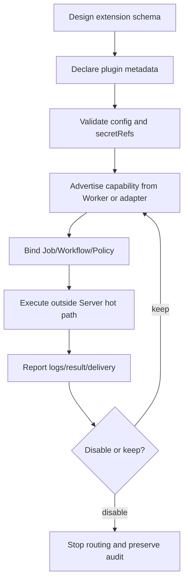

# Plugin development

Tikeo plugin development is a governed extension model. A plugin declares capabilities, provider metadata, processor names, message templates, or webhook adapters that the platform can validate and display. It does not mean arbitrary unreviewed code is hot-loaded into the Server. Runtime execution still belongs on Workers or explicitly configured external adapters, and all outputs must return through normal instance, notification, and audit evidence.

## Prerequisites

- A clear extension point: processor, notification provider adapter, message renderer, or integration webhook.
- A schema for configuration, secrets, inputs, and outputs.
- Worker or adapter deployment plan for any executable code.
- Tests that prove validation, redaction, execution evidence, and disable behavior.

## When to build a plugin

Build a plugin when you need a repeatable capability that multiple Jobs, Workflows, or Notification policies can reuse. Do not build a plugin just to bypass missing core validation. If the extension changes scheduling, security, RBAC, audit, or storage semantics, it probably belongs in core code first.

## Capability lifecycle

The boundary is deliberate: a plugin can make a capability visible to the platform, but the Server should still validate inputs, redact secret references, and persist evidence. If a plugin fails, operators should diagnose it with the same tools they use for built-in processors: Instance console, delivery attempts, Worker capabilities, and Audit.

## Extension surfaces

| Surface | Typical plugin data | Runtime location | Evidence |
| --- | --- | --- | --- |
| Job processor | Processor name, input schema, output schema, retry hints | Worker | Instance attempts, logs, results |
| Workflow node | Node type, input/output mapping, validation messages | Worker or workflow adapter | Node replay bundle |
| Notification provider | Provider id, message types, channel config schema, secretRefs | Server renderer plus sender/adapter, or plugin webhook | Delivery attempts and provider response |
| Webhook adapter | Target schema, signing rules, retry mapping | External adapter or Worker | Delivery attempts, audit, redacted config |

## Schema and secret rules

- Use explicit fields rather than free-form “options” blobs where possible.
- Store secrets by reference and return redacted summaries.
- Validate provider-specific message families such as `blockKit`, `actionCard`, `feedCard`, `interactive`, `share_chat`, `markdown_v2`, and `template_card` before saving.
- Keep unsupported fields visible as validation errors, not as ignored data.

## Typical workflow

1. Write the capability schema and decide which surface it extends.
2. Implement validation and redaction before building the happy-path sender or processor.
3. Add Worker or adapter registration so the capability appears in the console.
4. Bind a small Job, Workflow node, or Notification policy to the plugin.
5. Trigger a real instance or test delivery and inspect evidence.
6. Disable the plugin and confirm routing stops without deleting historical records.

## Verify

- Invalid config is rejected with a field-level error.
- Secret values are never returned in API summaries.
- The capability appears in the relevant drawer only when a Worker/adapter advertises it or the provider is enabled.
- Execution produces standard logs, result, delivery attempts, and audit records.
- Disabling the plugin prevents new routing but keeps old evidence readable.

## Troubleshooting

| Symptom | Response |
| --- | --- |
| Plugin option missing from UI | Check provider/Worker capability registration and RBAC scope. |
| Test send works but Job delivery fails | Compare template variables, event type, policy binding, and instance payload. |
| Raw secret appears | Stop rollout and fix redaction before using the plugin in production. |
| Worker can execute but scheduler cannot pick it | Align processor name, tags, region, cluster, and broadcast selector. |
| Disable has no effect | Confirm Jobs/Policies reference the plugin capability and routing cache is refreshed. |

## Production checklist

- [ ] Extension schema, validation, redaction, and tests are complete.
- [ ] Runtime code executes outside arbitrary Server hot-loading.
- [ ] UI explains provider-specific fields and message types.
- [ ] Evidence is visible through Instances, Notifications, Workers, or Audit.
- [ ] Disable and rollback behavior are tested before production use.
