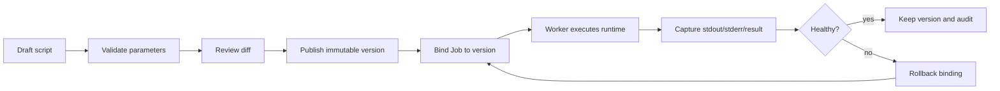

# Script support

Tikeo script support is for small operational executors that need review, versioning, rollback, stdout/stderr capture, and job binding without forcing every team to publish a compiled SDK processor. A script is not a hidden shell escape in the Server. The Server stores metadata, versions, RBAC, audit, and bindings; Workers run the approved version through an allowed runtime and report normal instance evidence.

## Prerequisites

- A Worker runtime that explicitly advertises script support and the supported language/runtime.
- RBAC permission to create, review, publish, and bind scripts in the target namespace/app.
- A clear input/output contract for the script.
- A Job that can bind to an immutable published version.

## When to use

Use a script when the logic is short, operational, and benefits from fast review. Examples: cleanup, health probe, data export handoff, or a simple integration call. Prefer an SDK processor when the logic is large, performance-sensitive, requires complex dependencies, or should be tested and released as normal application code.

## Closed-loop release flow

The important rule is immutability. Editing a draft is safe because no production Job should be bound to the draft. Publishing creates a version that can be referenced, audited, compared, and rolled back. Production Jobs should always bind to a published version id, not to “latest draft”.

## Runtime boundary

| Concern | Server responsibility | Worker responsibility |
| --- | --- | --- |
| Draft and version metadata | Store, validate, authorize, audit | Read assigned version only through dispatch |
| Runtime execution | Never execute arbitrary script text inside Server | Resolve allowed runtime and enforce limits |
| Evidence | Store logs, result, attempt, audit, delivery | Capture stdout, stderr, exit code, exception stack |
| Rollback | Rebind Job to previous version and record audit | Execute newly assigned version on next run |
| Unsupported backend | Return clear validation error | Report unsupported tool path at runtime if misconfigured |

## Configuration pattern

Scripts should be configured by version, runtime, parameters, timeout, and resource limits. Avoid embedding secrets in source text. Use secret references or environment injection controlled by the Worker runtime. A script failure should preserve both business failure payload and runtime exception stack when available.

## Typical workflow

1. Open **Scripts** and create a draft in the correct namespace/app.
2. Add parameters and expected output description before writing runtime-specific code.
3. Save the draft and inspect the generated diff against the previous published version.
4. Publish an immutable version only after review.
5. Bind a Job to the version id and trigger one small run.
6. Open the Instance console and verify stdout, stderr, exit code, exception stack, and result payload.
7. If the run fails, rollback by rebinding to the previous version instead of editing the published version.

## Verify

- The script page shows a draft, a published version, and a diff.
- The Job references a specific version id.
- A failed script produces instance logs and a visible exception/exit-code record.
- Audit shows who published and who changed the Job binding.

## Troubleshooting

| Symptom | Response |
| --- | --- |
| Script cannot be published | Check validation errors, RBAC, namespace/app, and required parameters. |
| Job cannot see the script | Confirm the Job and script are in compatible scope and the Worker advertises script support. |
| Runtime not found | Install or configure the runtime on Worker nodes; do not move script execution into Server. |
| Output is missing | Ensure the runner captures stdout/stderr and reports checkpoints before process exit. |
| Rollback did not change behavior | Confirm the Job binding changed to an older immutable version id and trigger a new instance. |

## Production checklist

- [ ] Scripts are reviewed through diff before publishing.
- [ ] Production Jobs bind immutable version ids.
- [ ] Runtime limits, timeout, and secret injection rules are documented.
- [ ] Failure scenarios capture stdout, stderr, exit code, business error, and stack trace.
- [ ] Rollback procedure is tested with a real Job instance.
