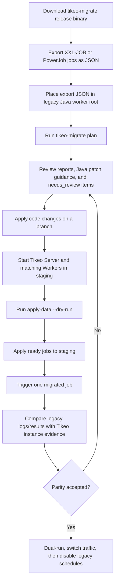

# Migration process from XXL-JOB or PowerJob

Tikeo provides a dedicated `tikeo-migrate` CLI for teams moving from XXL-JOB or PowerJob. The default command, `plan`, is non-destructive: it reads a JSON export, maps source jobs into Tikeo `create job` drafts, optionally scans a Java/Spring worker project, and writes a migration bundle with reports, Java dependency guidance, handler annotation patches, unsupported features, and manual follow-up items.

For normal users, the intended distribution path is the GitHub Release assets page. Each release publishes ready-to-run `tikeo-migrate` archives for Linux, macOS Intel, macOS Apple Silicon, and Windows, so a migration operator does not need Rust installed on the old project machine.

:::tip Migration starts here
If you are replacing XXL-JOB or PowerJob, start with this chapter first: download `tikeo-migrate`, export jobs as JSON, run `tikeo-migrate plan` from the old Java worker project root, review the generated bundle, then import only reviewed jobs into staging.
:::

## What this migration chapter covers

Use it before production migration to answer three questions:

1. Which source jobs can be created as Tikeo Jobs directly?
2. Which jobs need review because legacy routing, blocking, broadcast, map-reduce, or worker pinning semantics do not map one-to-one?
3. What processor names, schedules, retry policy drafts, and namespace/app targets will be used in Tikeo?

## Migration process overview

### End-to-end flow



### Detailed operator checklist

| Step | Action | Evidence to keep | Notes |
| --- | --- | --- | --- |
| 1 | Download the matching archive from the GitHub Release, for example `tikeo-migrate-${TIKEO_VERSION}-x86_64-unknown-linux-gnu.tar.gz` or `tikeo-migrate-${TIKEO_VERSION}-x86_64-pc-windows-msvc.zip`. | Release asset name and checksum/provenance evidence from your internal process. | Use Linux for most CI/bastion runs, macOS for local operator machines, and Windows zip for Windows-based migration workstations. |
| 2 | Extract the archive and put `tikeo-migrate` on `PATH`, or copy the binary into the legacy Java worker project root. | `tikeo-migrate --help` output. | No server process is started by this CLI. |
| 3 | Export jobs from XXL-JOB or PowerJob as JSON. | Raw export file committed to a private migration branch or stored in a controlled evidence bucket. | Do not edit the raw export; keep it as the audit source. |
| 4 | Put the export JSON in the legacy project root using a detectable name such as `xxl-job-export.json` or `powerjob-export.json`. | File path and hash. | If the name is non-standard, use `--input` and optionally `--from`. |
| 5 | Run `tikeo-migrate plan`. | `.tikeo-migration/manifest.json`, `jobs.tikeo.md`, `data-import-plan.json`, `java-project-plan.md`, `CHECKLIST.md`. | This step is non-destructive: no source edits, no legacy DB access, no Tikeo API writes. |
| 6 | Review `needs_review` jobs and generated Java patch guidance. | Review notes or PR comments. | Legacy broadcast, map-reduce, routing, blocking, worker pinning, or custom glue semantics need explicit design decisions. |
| 7 | Apply Java dependency/handler changes on a branch and run the old project tests. | PR diff and test output. | Generated patches are guidance, not blind auto-edits. |
| 8 | Start Tikeo Server and matching Workers in staging. | Worker registration and processor/capability evidence. | Processor names must match generated job drafts. |
| 9 | Run `tikeo-migrate apply-data --endpoint <staging> --api-key <key> --dry-run`. | `apply-evidence.json`. | Dry-run proves the request set before live writes. |
| 10 | Remove `--dry-run` only for reviewed ready jobs, then trigger one migrated job at a time. | Tikeo instance logs/results and legacy comparison notes. | Keep legacy schedules enabled until behavior is accepted. |
| 11 | Dual-run, switch traffic, and disable legacy schedules after parity is accepted. | Cutover record and rollback notes. | Keep the migration bundle for audit. |


## Command

### Recommended convention-first flow

Put the legacy export JSON in the legacy worker project root and run the tool from that directory. In this layout the migration planner needs no manual discovery parameters:

```bash
cd ./legacy-worker

# Build a complete non-destructive migration bundle in ./.tikeo-migration
tikeo-migrate plan

# Review the generated bundle, then dry-run API application.
# apply-data also defaults --bundle to ./.tikeo-migration.
tikeo-migrate apply-data \
  --endpoint http://127.0.0.1:9090 \
  --api-key "$TIKEO_MIGRATION_API_KEY" \
  --dry-run
```

Auto-detection rules:

| Input | Convention |
| --- | --- |
| Project root | The current directory when it contains `pom.xml`, `build.gradle`, or `build.gradle.kts`. |
| Export file | One clear JSON file named like `xxl-job-export.json`, `xxljob-export.json`, `powerjob-export.json`, `power-job-export.json`, `jobs-export.json`, or a matching JSON file under `export/`, `exports/`, or `migration/`. |
| Source scheduler | File name first, then JSON content such as XXL-JOB `executorHandler`/`jobDesc`/`scheduleConf` or PowerJob `processorInfo`/`timeExpressionType`/`instanceRetryNum`. |
| Bundle output | `./.tikeo-migration`. |

If more than one possible export file is found, or the source cannot be inferred safely, the command fails with an explicit message instead of guessing.

### Override flags for non-standard layouts

```bash
tikeo-migrate plan \
  --from xxl-job \
  --input ./exports/jobs.json \
  --project ./legacy-worker \
  --output-dir ./migration-bundle \
  --namespace ops \
  --app billing

tikeo-migrate apply-data \
  --bundle ./migration-bundle \
  --endpoint http://127.0.0.1:9090 \
  --api-key "$TIKEO_MIGRATION_API_KEY" \
  --dry-run
```

`--from` accepts:

| Value | Source |
| --- | --- |
| `xxl-job` | XXL-JOB job export records. |
| `powerjob` | PowerJob job export records. `power-job` is accepted as an alias. |

Accepted JSON shapes:

- an array of job objects;
- `{ "jobs": [...] }`;
- `{ "data": [...] }`;
- `{ "data": { "jobs": [...] } }`;
- `{ "content": [...] }`;
- one standalone job object.

## What is generated

The bundle contains:

| Field | Meaning |
| --- | --- |
| `manifest.json` | Complete bundle manifest with data, code, and checklist sections. |
| `jobs.tikeo.json` / `jobs.tikeo.md` | Job migration report with total, ready, needs-review, and skipped records. |
| `data-import-plan.json` | Ready and needs-review Tikeo job drafts split for controlled application. |
| `java-project-plan.json` / `.md` | Detected build system, Spring Boot major version, recommended Tikeo artifact, handler candidates, and review notes. |
| `java-patches/*.patch` | Review-first dependency and handler annotation patch guidance. |
| `CHECKLIST.md` | Human acceptance flow for branch review, staging import, one-job trigger, and dual-run comparison. |

## Mapping rules

### XXL-JOB

| Source field | Tikeo draft field |
| --- | --- |
| `jobDesc` | `name` |
| `executorAppName` | `app` |
| `executorHandler` | `processorName` |
| `scheduleType=CRON` + `scheduleConf` | `scheduleType=cron`, `scheduleExpr=scheduleConf` |
| `scheduleType=FIX_RATE` | `scheduleType=fixed_rate` |
| `scheduleType=NONE` | `scheduleType=api` |
| `executorFailRetryCount` | `retryPolicy.maxAttempts = retry + 1` |
| `triggerStatus=0` | `enabled=false` |

The planner flags these for review instead of pretending they are identical: `glueType`, `executorRouteStrategy`, and `executorBlockStrategy`.

### PowerJob

| Source field | Tikeo draft field |
| --- | --- |
| `jobName` | `name` |
| `appName` | `app` |
| `processorInfo` | `processorName` |
| `timeExpressionType=2` or `CRON` | `scheduleType=cron` |
| `timeExpressionType=3` or fixed-rate names | `scheduleType=fixed_rate` |
| `timeExpressionType=4` or fixed-delay names | `scheduleType=fixed_delay` |
| `timeExpressionType=1` or `API` | `scheduleType=api` |
| `instanceRetryNum` | `retryPolicy.maxAttempts = retry + 1` |
| `status=0` | `enabled=false` |

The planner flags these for review: `executeType`, `designatedWorkers`, and `maxInstanceNum`.

## Review workflow

1. Export legacy scheduler jobs to JSON and place the file in the legacy worker project root when possible.
2. From that project root, run `tikeo-migrate plan`. Use `--input`, `--from`, `--project`, or `--output-dir` only as overrides for non-standard layouts.
3. Review every `needs_review` item. Translate legacy routing/blocking/pinning semantics to Tikeo Worker labels, capabilities, workflow fan-out, or concurrency policy.
4. Apply generated Java patches on a branch, add the recommended starter dependency, and adapt complex handler signatures manually.
5. Run `tikeo-migrate apply-data --dry-run`, then apply ready jobs to staging without `--dry-run`.
6. Start Workers with matching `processorName` values.
7. Trigger one job at a time and compare instance logs/results with legacy behavior before switching traffic.

## Boundaries

This MVP is intentionally conservative:

- `plan` does not connect to XXL-JOB or PowerJob databases.
- `plan` does not create Tikeo Jobs or edit legacy source files.
- `apply-data` is the only command that can call the Tikeo Management API, and it supports `--dry-run`.
- Generated Java patches cover dependency insertion and handler annotation guidance; arbitrary executor/business code still requires review.
- It does not claim broadcast/map-reduce/blocking/routing semantics are equivalent.
- It keeps source snapshots in the report so humans can audit every decision.

Treat the bundle as a controlled migration plan and evidence package, not as blind one-click migration.
