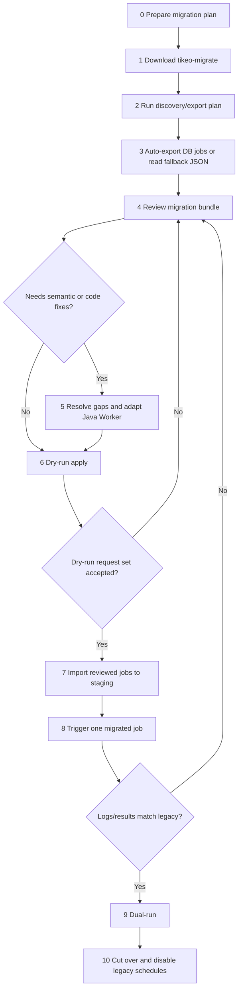

# Migration process from XXL-JOB or PowerJob

Tikeo provides a dedicated `tikeo-migrate` CLI for teams moving from XXL-JOB or PowerJob. Treat it as a **review-first migration assistant**: from the legacy Java/Spring Worker project root, automatic mode detects the old Worker code first, optionally enriches the plan from Admin database/export data when available, and writes a migration bundle that operators review before any API write happens. Worker-only repositories with no Admin DB are normal; they continue as code-only inventory instead of failing. Offline JSON input remains supported, but it is a fallback rather than the primary path.

`plan` is deliberately non-destructive. It does **not** edit legacy source files or create Tikeo jobs. It may read the legacy scheduler database to build the review bundle. `apply` is also local-only: it copies and rewrites the Java Worker project into an isolated output directory, writes Tikeo configuration placeholders into the same Spring configuration files that already contained XXL-JOB or PowerJob settings, and never calls the Tikeo Server.

:::tip Start here
If you are replacing XXL-JOB or PowerJob, follow the phases below in order. Do not start by importing jobs. First run the non-destructive discovery/export plan, review the migration bundle, resolve semantic gaps, adapt Workers, fill deployment config, then import and validate in staging.
:::

## Mental model

A scheduler migration has two different tracks that must converge before cutover:

| Track | What moves | Why it matters |
| --- | --- | --- |
| Data track | Job definitions, schedule expressions, retry policy drafts, enabled/disabled state, namespace/app target. | These become Tikeo job drafts and are imported manually through the Tikeo console, Management API, or GitOps only after review. |
| Code track | Java dependencies, legacy handler annotations/interfaces, processor names, method signatures, worker configuration. | Tikeo can only dispatch successfully when a running Worker exposes matching processor names and capabilities. |

The migration is complete only when both tracks are validated together: a migrated Tikeo job must dispatch to a matching Worker and produce behavior that matches the legacy job evidence.

## End-to-end flow



## Phase 0: prepare before running the tool

Before touching any export, decide the migration target and success criteria.

| Decision | Recommended value / source | Why |
| --- | --- | --- |
| Target environment | Staging Tikeo Server first, production later. | Importing directly to production makes rollback and evidence review harder. |
| Namespace | Usually the team, tenant, or business domain. | Generated drafts need stable ownership and RBAC boundaries. |
| App | Existing legacy executor app name when available; otherwise a planned Tikeo app name. | Workers and job drafts need a shared routing boundary. |
| Processor naming | Prefer legacy handler names when they are stable and meaningful. | Reduces accidental mismatches between imported jobs and Worker code. |
| API key | A staging-scoped key with job create permissions. | `apply` should not use an unrestricted personal token. |
| Rollback owner | A named operator or team. | Cutover must have someone responsible for disabling Tikeo jobs or re-enabling legacy schedules. |

Continue only when staging Tikeo Server is available, the intended Worker project is known, and the team agrees what “behavior matches legacy” means: output records, logs, side effects, duration, retry behavior, and alerting expectations.

## Phase 1: download the migration CLI

Every release publishes ready-to-run `tikeo-migrate` archives on the GitHub Release page:

| Platform | Asset shape |
| --- | --- |
| Linux x86_64 | `tikeo-migrate-${TIKEO_VERSION}-x86_64-unknown-linux-gnu.tar.gz` |
| macOS Intel | `tikeo-migrate-${TIKEO_VERSION}-x86_64-apple-darwin.tar.gz` |
| macOS Apple Silicon | `tikeo-migrate-${TIKEO_VERSION}-aarch64-apple-darwin.tar.gz` |
| Windows x86_64 | `tikeo-migrate-${TIKEO_VERSION}-x86_64-pc-windows-msvc.zip` |

After extraction, either place the binary on `PATH` or copy it into the legacy Java worker project root.

```bash
tikeo-migrate --help
tikeo-migrate plan --help
tikeo-migrate apply --help
```

Expected evidence:

- The binary runs on the operator machine.
- The asset name and version are recorded in the migration notes.
- The operator knows where the generated `.tikeo-migration` directory will be written.

## Phase 2: let the CLI discover and export legacy jobs

Do **not** start by hand-crafting `xxl-job-export.json` or `powerjob-export.json`. The normal migration path is to run `tikeo-migrate plan` from the legacy Java worker project root and let the CLI discover as much as possible:

1. detect the Java/Spring project from `pom.xml`, `build.gradle`, or `build.gradle.kts`;
2. detect XXL-JOB or PowerJob from dependencies, annotations, and source code;
3. detect Spring datasource settings from `application.properties`, `application.yml`, `application.yaml`, `bootstrap.properties`, `bootstrap.yml`, or `bootstrap.yaml` when present;
4. optionally connect to the legacy scheduler Admin database and export known job tables such as `xxl_job_info` or `pj_job_info`;
5. fall back to Worker code-only inventory when no Admin DB/export exists;
6. store source snapshots inside the generated migration bundle for audit and review.

If the repository is Worker-only and does not contain scheduler DB settings or an exported job list, the CLI uses a **code-only** scan: it detects XXL-JOB handlers and PowerJob processor classes from Java source, creates disabled API-style job drafts, and marks every generated job `needs_review`. This keeps the migration moving without inventing schedules, routes, retries, params, or enablement that only exist in the old scheduler control plane. A detected but unreachable Admin DB only stops the run when you explicitly pass `--legacy-db-url`; otherwise the CLI continues with Worker inventory.

The CLI supports MySQL/PostgreSQL JDBC URLs and native URLs. If the old project does not expose datasource settings, provide them explicitly without creating an intermediate JSON file:

```bash
tikeo-migrate plan \
  --from xxl-job \
  --legacy-db-url 'jdbc:mysql://legacy-db.example.com:3306/xxl_job' \
  --legacy-db-user "$LEGACY_DB_USER" \
  --legacy-db-password "$LEGACY_DB_PASSWORD"
```

### Database auto-export contract

| Item | Supported behavior |
| --- | --- |
| Production URL forms | `jdbc:mysql://...`, `jdbc:postgresql://...`, `mysql://...`, `postgres://...`, `postgresql://...`. |
| Demo/CI URL forms | `sqlite:/path/to.db`, `sqlite:///path/to.db`, `jdbc:sqlite:/path/to.db`, and Windows local fixture paths such as `sqlite:C:\path\legacy.db`. SQLite is for local fixtures and tests, not the recommended production scheduler DB. The CLI preserves the `sqlite:` file-path form so Windows drive letters are not parsed as URL hosts. |
| Credentials | Read from Spring datasource config, `--legacy-db-user` / `--legacy-db-password`, or `TIKEO_MIGRATE_LEGACY_DB_USER` / `TIKEO_MIGRATE_LEGACY_DB_PASSWORD`. Credentials embedded in the URL are also accepted. |
| Required permission | Read-only `SELECT` on the scheduler job table. Do not use an account that can mutate legacy scheduler state. |
| XXL-JOB table candidates | `xxl_job_info`, `XXL_JOB_INFO`, `job_info`. |
| PowerJob table candidates | `pj_job_info`, `job_info`, `powerjob_job_info`. |
| Recorded evidence | `manifest.json` records a redacted `legacy-db:...` origin for DB exports, `json-file:...` for offline files, or `code-only:...` for Worker-only source scans; credentials are not printed in the origin. |

If auto-export fails, read the error first: it includes the detected source family and the table candidates the CLI attempted. Common fixes are:

- pass `--from xxl-job` or `--from powerjob` when the project does not contain recognizable legacy dependencies/annotations;
- pass `--legacy-db-url`, `--legacy-db-user`, and `--legacy-db-password` when datasource settings are injected by a deployment system rather than committed in `application.*`;
- grant read-only `SELECT` on the known table names above;
- use `--input ./exports/jobs.json` only when the migration workstation cannot reach the legacy database.

### Worker-only / code-only fallback

Some real projects contain only PowerJob/XXL-JOB Worker code and obtain scheduler definitions from a separately deployed Admin service. In that case, running from the Worker project root still produces a review bundle:

```bash
cd ./legacy-worker-only

tikeo-migrate plan
```

The bundle records `code-only:<project-root>` as input origin. Treat this as a **processor inventory and code migration plan**, not as a complete schedule migration: each generated draft is disabled/review-required until an operator reconciles the old scheduler's cron/fixed-rate expression, route strategy, retry policy, parameters, concurrency/blocking semantics, and enablement state.

A local deterministic fixture is available under `examples/migration/legacy-scheduler-fixtures` for trying the full auto-export path without a real XXL-JOB or PowerJob database.

Use a pre-exported JSON file only for offline review, locked-down production networks, or vendors that will not allow the migration workstation to connect to the scheduler database. In that fallback mode, any clear path is acceptable; the fixed names below are just compatibility examples, not a user requirement:

```bash
tikeo-migrate plan \
  --from powerjob \
  --input ./exports/jobs.json
```

Accepted fallback JSON shapes:

- an array of job objects;
- `{ "jobs": [...] }`;
- `{ "data": [...] }`;
- `{ "data": { "jobs": [...] } }`;
- `{ "content": [...] }`;
- one standalone job object.

Continue only when `.tikeo-migration/manifest.json` records the input origin (`legacy-db:...`, `json-file:...`, or `code-only:...`) and the generated report contains the expected handler/job count.

## Phase 3: generate the migration bundle

### Convention-first command

From the legacy Java worker project root:

```bash
cd ./legacy-worker

tikeo-migrate plan
```

Auto-detection rules:

| Input | Convention |
| --- | --- |
| Project root | Current directory when it contains `pom.xml`, `build.gradle`, or `build.gradle.kts`. |
| Source scheduler | Detected from dependencies/source such as XXL-JOB `@XxlJob`, `xxl-job-core`, or PowerJob `BasicProcessor` / `tech.powerjob`. |
| Legacy database | Spring datasource URL/user/password from common `application.*` and `bootstrap.*` files, or explicit `--legacy-db-url`, `--legacy-db-user`, `--legacy-db-password`. |
| Admin DB / export enrichment | If Spring datasource or `--legacy-db-url` is available, the CLI exports known scheduler job tables. If not, migration still proceeds from Worker code. |
| Fallback JSON / code-only | One detectable JSON under the project root, `export/`, `exports/`, or `migration/`, explicit `--input`, or code-only handler scan when no JSON/Admin DB exists. |
| Bundle output | `./.tikeo-migration`. |

### Explicit command for non-standard layouts

```bash
tikeo-migrate plan \
  --from xxl-job \
  --legacy-db-url 'jdbc:mysql://legacy-db.example.com:3306/xxl_job' \
  --legacy-db-user "$LEGACY_DB_USER" \
  --legacy-db-password "$LEGACY_DB_PASSWORD" \
  --project ./legacy-worker \
  --output-dir ./migration-bundle \
  --namespace ops \
  --app billing
```

Use explicit flags when:

- the legacy scheduler cannot be inferred from the project;
- datasource settings are not present in the project or must come from a secret manager;
- the project root is not the current directory;
- the default namespace/app would be misleading;
- you want the bundle somewhere other than `.tikeo-migration`;
- you intentionally use offline JSON with `--input`.

Continue only when the output directory contains the expected files below.

## Phase 4: understand the generated bundle

The bundle is the central review artifact. Do not skip it.

| File | Purpose | What to check |
| --- | --- | --- |
| `manifest.json` | Complete machine-readable bundle: source, report, data import plan, Java project plan, checklist. | Keep it for audit and handoff. |
| `jobs.tikeo.json` | Structured migration report. | `summary.total`, `summary.ready`, `summary.needsReview`, `summary.skipped`. |
| `jobs.tikeo.md` | Human-readable job review report. | Each job status, schedule, processor name, warnings, unsupported features. |
| `data-import-plan.json` | Split of ready and needs-review job drafts. | Only reviewed jobs should be live-imported. |
| `java-project-plan.md` / `.json` | Build system, Spring Boot major, recommended Tikeo artifact, detected handlers, review notes. | Dependency recommendation and processor names. |
| `java-patches/*.patch` | Review-first patch guidance for dependencies and handler annotations. | Apply manually on a branch; do not treat as blind auto-edits. |
| `CHECKLIST.md` | Operator acceptance checklist. | Use it as the minimum migration gate list. |
| `code-apply-evidence.json` | Produced by `apply`; records source project, output project, changed files, skipped generated/build directories, and warnings. | Keep it with CI/PR evidence. |
| `CODE_MIGRATION_REPORT.md` | Produced by `apply`; written both to the bundle and the migrated output project. | Use it as handoff material for code review. |

Status meanings:

| Status | Meaning | Next action |
| --- | --- | --- |
| `ready` | The job draft has no known blocking issue. | Still review it, then import through the chosen operator workflow. |
| `needs_review` | The planner produced a draft but found non-equivalent or risky source semantics. | Translate the semantics manually before staging/production import. |
| `skipped` | Required fields were missing or no safe draft could be produced. | Fix the source export/manual mapping and rerun `plan`, or recreate manually in Tikeo. |

Continue only when every `needs_review` and `skipped` item has an explicit decision.

## Phase 5: resolve scheduler semantic gaps

Legacy schedulers contain semantics that are not always one-to-one with Tikeo jobs. The planner surfaces these instead of hiding them.

### XXL-JOB mapping and review points

| Source field | Tikeo draft field |
| --- | --- |
| `jobDesc` | `name` |
| `executorAppName` | `app` |
| `executorHandler` | `processorName` |
| `scheduleType=CRON` + `scheduleConf` | `scheduleType=cron`, `scheduleExpr=scheduleConf` |
| `scheduleType=FIX_RATE` | `scheduleType=fixed_rate` |
| `scheduleType=NONE` | `scheduleType=api` |
| `executorFailRetryCount` | `retryPolicy.maxAttempts = retry + 1` |
| `triggerStatus=0` | `enabled=false` |

Review carefully when the source uses:

| Legacy feature | Why review is needed | Typical Tikeo decision |
| --- | --- | --- |
| `executorRouteStrategy` | Routing strategy may imply shard/pinning/failover behavior. | Use Worker labels/capabilities, app boundaries, or explicit workflow fan-out. |
| `executorBlockStrategy` | Blocking strategy may imply concurrency or queueing semantics. | Configure Tikeo concurrency/trigger policy or redesign as workflow steps. |
| `glueType` | Glue/script execution may not match a typed Worker processor. | Migrate to governed Tikeo script runtime or a typed Worker processor. |

### PowerJob mapping and review points

| Source field | Tikeo draft field |
| --- | --- |
| `jobName` | `name` |
| `appName` | `app` |
| `processorInfo` | `processorName` |
| `timeExpressionType=2` or `CRON` | `scheduleType=cron` |
| `timeExpressionType=3` or fixed-rate names | `scheduleType=fixed_rate` |
| `timeExpressionType=4` or fixed-delay names | `scheduleType=fixed_delay` |
| `timeExpressionType=1` or `API` | `scheduleType=api` |
| `instanceRetryNum` | `retryPolicy.maxAttempts = retry + 1` |
| `status=0` | `enabled=false` |

Review carefully when the source uses:

| Legacy feature | Why review is needed | Typical Tikeo decision |
| --- | --- | --- |
| `executeType` | Broadcast/map-reduce semantics are not a single ordinary job dispatch. | Model as workflow fan-out, multiple Worker targets, or explicit business decomposition. |
| `designatedWorkers` | Worker pinning may depend on legacy worker identities. | Replace with labels/capabilities or a dedicated app/worker group. |
| `maxInstanceNum` | Instance concurrency can change side effects. | Configure concurrency rules or keep the job disabled until validated. |

## Phase 6: adapt Java Worker code

### Automatic code application to an isolated copy

`plan` is read-only. To perform the mechanical Java migration, run `apply` and point it at an output directory outside the original project:

```bash
tikeo-migrate apply \
  --bundle ./.tikeo-migration \
  --output-project ../legacy-worker-tikeo
```

What local `apply` does today:

- copies the source project while skipping generated/build state such as `.git`, `.gradle`, `target`, `build`, and `node_modules`;
- preserves wrapper/project files that are needed for validation, such as `mvnw` and `.mvn` when present;
- adds the Spring Boot appropriate Tikeo starter, using `${TIKEO_VERSION}` as the version placeholder;
- appends reviewed Tikeo Worker and Management placeholders to the existing Spring config file(s) that already contain XXL-JOB or PowerJob settings, while disabling legacy Worker flags in those same files;
- converts supported XXL-JOB `@XxlJob` handlers and PowerJob `BasicProcessor` processors to `@TikeoProcessor` methods where the transformation is compile-oriented and safe;
- writes `code-apply-evidence.json` and `CODE_MIGRATION_REPORT.md`.

Use `--force` only to replace an existing output copy. The original Worker project is not modified. After local `apply`, compile the migrated copy with the chosen SDK version, for example:

```bash
cd ../legacy-worker-tikeo
mvn -DTIKEO_VERSION=0.3.x -DskipTests compile
```

If the old project uses Maven Wrapper but does not commit `.mvn/wrapper/maven-wrapper.properties`, run system `mvn` or restore the wrapper metadata before validation.


The data import can succeed while execution still fails if Workers do not expose the expected processor names. Resolve code before production import.

Recommended flow:

1. Create a branch in the legacy worker project.
2. Add the recommended Tikeo Java dependency from `java-project-plan.md`.
3. Review `java-patches/*.patch` and add Tikeo processor annotations/adapters manually.
4. Preserve processor names generated in `jobs.tikeo.md`, unless you also update the job drafts.
5. Run the old project test suite.
6. Start the Worker against staging Tikeo Server.
7. Confirm registration shows the expected processors/capabilities.

Common code issues:

| Issue | Symptom | Fix |
| --- | --- | --- |
| Processor name mismatch | Job imports but dispatch cannot find a Worker processor. | Align `processorName` in the job draft and Worker annotation/registration. |
| Complex legacy method signature | Patch guidance is not enough to compile. | Add a small adapter method that accepts Tikeo-supported context/payload shapes and calls existing business code. |
| Legacy framework lifecycle dependency | Handler expects XXL-JOB/PowerJob runtime context. | Replace runtime context reads with Tikeo task context or explicit job parameters. |
| Broadcast/map-reduce processor | Single processor no longer represents the full behavior. | Model as workflow fan-out or multiple explicit jobs before import. |

Continue only when staging Workers can start and expose the processor names referenced by the migration bundle.

## Phase 7: fill deployment config and import reviewed data

`tikeo-migrate apply` does not have `--endpoint`, `--api-key`, or a server dry-run mode. Those values belong to the migrated application configuration and the operator import workflow, not to the local code-rewrite command.

After `apply`, open the config file(s) changed in the migrated copy, for example `src/main/resources/application.yml`, `application-dev.yml`, `application-prod.yml`, `bootstrap.yml`, or `bootstrap-prod.yml`. The CLI chooses files in this order:

1. every `application*` / `bootstrap*` `.yml`, `.yaml`, or `.properties` file under `src/main/resources` that contains `powerjob`, `power-job`, `xxl-job`, `xxl:`, or `xxl.job`;
2. if no legacy scheduler config file is found, the existing main `application.yml`, `application.yaml`, or `application.properties`;
3. if no Spring config file exists, a new `application.yml` in the migrated output copy.

The generated block reserves the full Worker and Management configuration surface, including:

- `tikeo.worker.enabled`, `auto-startup`, `endpoint`, `dry-run`, heartbeat, namespace/app/cluster/region, capabilities, labels, and election fields;
- `tikeo.worker.wasm.*` runtime installation fields;
- `tikeo.worker.scripts.*` sandbox/runtime/tool installation fields and per-language image fields;
- `tikeo.management.enabled`, `endpoint`, `api-key`, `namespace`, and `app`.

Fill the environment-backed placeholders for the target environment, especially `TIKEO_WORKER_ENDPOINT`, `TIKEO_MANAGEMENT_ENDPOINT`, and `TIKEO_MANAGEMENT_API_KEY`. Keep `tikeo.management.enabled=false` unless the migrated application intentionally uses the Management SDK at runtime.

Job data import is then a controlled operator action outside the migration CLI:

- use the Tikeo console, a reviewed Management API script, or a GitOps workflow;
- read from `.tikeo-migration/jobs.tikeo.json` or `.tikeo-migration/data-import-plan.json`;
- import reviewed `ready` jobs first;
- import or recreate `needs_review` jobs only after every semantic gap has an explicit decision;
- keep the import evidence with the migration bundle and `code-apply-evidence.json`.

Continue only when staging jobs match the reviewed bundle, deployment config values are explicit, and disabled/enabled states are intentional.

## Phase 8: validate in staging

Validate one migrated job at a time. Do not switch traffic just because import succeeded.

Minimum validation loop:

1. Confirm matching Worker is online.
2. Trigger one migrated job manually or wait for a safe schedule window.
3. Compare Tikeo instance status, logs, retry behavior, output records, and side effects with the legacy job.
4. Record differences in the migration bundle notes or PR.
5. Fix mapping/code/config and rerun from `plan` or code review if behavior differs.

Suggested evidence table:

| Evidence | Source |
| --- | --- |
| Tikeo job id and name | Tikeo job list / imported draft. |
| Worker id and processor name | Worker registration / diagnostics. |
| Trigger request or schedule timestamp | Tikeo instance record. |
| Logs and final status | Tikeo task logs and instance result. |
| Legacy comparison | Legacy logs, database rows, external side effect checks. |
| Decision | Accepted, needs code fix, needs mapping fix, or manual recreation. |

Continue only when the team accepts parity for every job selected for cutover.

## Phase 9: dual-run, cut over, and rollback

Recommended cutover sequence:

1. Keep legacy schedules enabled while staging validation is incomplete.
2. For production, import jobs disabled first when possible.
3. Enable a small set of low-risk jobs in Tikeo.
4. Run dual-run or shadow validation where side effects allow it.
5. Disable corresponding legacy schedules only after Tikeo behavior is accepted.
6. Keep the migration bundle, `code-apply-evidence.json`, and separate import evidence as the release evidence.

Rollback plan:

| Failure | Immediate rollback |
| --- | --- |
| Imported job is wrong | Disable or delete the Tikeo job; keep legacy schedule enabled. |
| Worker code fails | Roll back Worker deployment; leave job disabled or route to previous Worker version. |
| Schedule fires unexpectedly | Disable Tikeo job; compare enabled flags and schedule expression in the bundle. |
| Side effects differ | Stop Tikeo job, re-enable legacy schedule if disabled, and return to Phase 5/6. |

## Boundaries and non-goals

This migration tool is intentionally conservative:

- `plan` may connect to a legacy XXL-JOB or PowerJob database using read-only access to build the review bundle.
- `plan` does not edit legacy source files.
- `plan` does not create Tikeo Jobs.
- `apply` is local-only and never calls the Tikeo Management API; job import is done separately through the console, a reviewed Management API script, or GitOps.
- Generated Java patches cover dependency insertion and handler annotation guidance; arbitrary executor/business code still requires review.
- Broadcast, map-reduce, blocking, routing, pinning, and glue/script semantics are not claimed to be equivalent.
- Source snapshots remain in the report so humans can audit every decision.

Treat the bundle as a controlled migration plan and evidence package, not as blind one-click migration.
