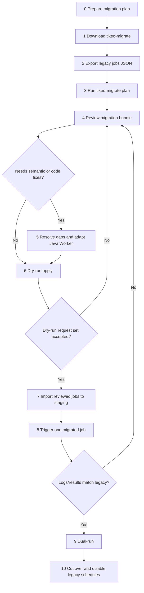

# Migration process from XXL-JOB or PowerJob

Tikeo provides a dedicated `tikeo-migrate` CLI for teams moving from XXL-JOB or PowerJob. Treat it as a **review-first migration assistant**: it reads a legacy scheduler JSON export, scans an optional Java/Spring worker project, and writes a migration bundle that operators review before any API write happens.

`plan` is deliberately non-destructive. It does **not** edit legacy source files, connect to legacy databases, or create Tikeo jobs. Live writes are isolated behind `apply`, and `apply --dry-run` should be the first command used against every staging or production target.

:::tip Start here
If you are replacing XXL-JOB or PowerJob, follow the phases below in order. Do not start by importing jobs. First preserve the legacy export, generate the migration bundle, review semantic gaps, adapt Workers, then dry-run and validate in staging.
:::

## Mental model

A scheduler migration has two different tracks that must converge before cutover:

| Track | What moves | Why it matters |
| --- | --- | --- |
| Data track | Job definitions, schedule expressions, retry policy drafts, enabled/disabled state, namespace/app target. | These become Tikeo job drafts and can be imported by `apply` only after review. |
| Code track | Java dependencies, legacy handler annotations/interfaces, processor names, method signatures, worker configuration. | Tikeo can only dispatch successfully when a running Worker exposes matching processor names and capabilities. |

The migration is complete only when both tracks are validated together: a migrated Tikeo job must dispatch to a matching Worker and produce behavior that matches the legacy job evidence.

## End-to-end flow



## Phase 0: prepare before running the tool

Before touching any export, decide the migration target and success criteria.

| Decision | Recommended value / source | Why |
| --- | --- | --- |
| Target environment | Staging Tikeo Server first, production later. | Importing directly to production makes rollback and evidence review harder. |
| Namespace | Usually the team, tenant, or business domain. | Generated drafts need stable ownership and RBAC boundaries. |
| App | Existing legacy executor app name when available; otherwise a planned Tikeo app name. | Workers and job drafts need a shared routing boundary. |
| Processor naming | Prefer legacy handler names when they are stable and meaningful. | Reduces accidental mismatches between imported jobs and Worker code. |
| API key | A staging-scoped key with job create permissions. | `apply` should not use an unrestricted personal token. |
| Rollback owner | A named operator or team. | Cutover must have someone responsible for disabling Tikeo jobs or re-enabling legacy schedules. |

Continue only when staging Tikeo Server is available, the intended Worker project is known, and the team agrees what “behavior matches legacy” means: output records, logs, side effects, duration, retry behavior, and alerting expectations.

## Phase 1: download the migration CLI

Every release publishes ready-to-run `tikeo-migrate` archives on the GitHub Release page:

| Platform | Asset shape |
| --- | --- |
| Linux x86_64 | `tikeo-migrate-${TIKEO_VERSION}-x86_64-unknown-linux-gnu.tar.gz` |
| macOS Intel | `tikeo-migrate-${TIKEO_VERSION}-x86_64-apple-darwin.tar.gz` |
| macOS Apple Silicon | `tikeo-migrate-${TIKEO_VERSION}-aarch64-apple-darwin.tar.gz` |
| Windows x86_64 | `tikeo-migrate-${TIKEO_VERSION}-x86_64-pc-windows-msvc.zip` |

After extraction, either place the binary on `PATH` or copy it into the legacy Java worker project root.

```bash
tikeo-migrate --help
tikeo-migrate plan --help
tikeo-migrate apply --help
```

Expected evidence:

- The binary runs on the operator machine.
- The asset name and version are recorded in the migration notes.
- The operator knows where the generated `.tikeo-migration` directory will be written.

## Phase 2: export legacy scheduler jobs

Export jobs from the legacy scheduler as JSON. Keep the raw export unchanged; it is the audit source for the generated migration bundle.

Recommended file names:

| Source | Recommended file name |
| --- | --- |
| XXL-JOB | `xxl-job-export.json` |
| PowerJob | `powerjob-export.json` |

Place the file in the legacy worker project root when possible:

```text
legacy-worker/
  build.gradle.kts          # or pom.xml / build.gradle
  src/main/java/...
  xxl-job-export.json       # or powerjob-export.json
```

Accepted JSON shapes:

- an array of job objects;
- `{ "jobs": [...] }`;
- `{ "data": [...] }`;
- `{ "data": { "jobs": [...] } }`;
- `{ "content": [...] }`;
- one standalone job object.

Continue only when the export is readable, stored unchanged, and has a known path. If the file name is non-standard or there are multiple possible JSON files, plan to pass `--input` and possibly `--from` explicitly.

## Phase 3: generate the migration bundle

### Convention-first command

From the legacy Java worker project root:

```bash
cd ./legacy-worker

tikeo-migrate plan
```

Auto-detection rules:

| Input | Convention |
| --- | --- |
| Project root | Current directory when it contains `pom.xml`, `build.gradle`, or `build.gradle.kts`. |
| Export file | One clear JSON file named like `xxl-job-export.json`, `xxljob-export.json`, `powerjob-export.json`, `power-job-export.json`, `jobs-export.json`, or a matching JSON file under `export/`, `exports/`, or `migration/`. |
| Source scheduler | File name first, then JSON content such as XXL-JOB `executorHandler`/`jobDesc`/`scheduleConf` or PowerJob `processorInfo`/`timeExpressionType`/`instanceRetryNum`. |
| Bundle output | `./.tikeo-migration`. |

### Explicit command for non-standard layouts

```bash
tikeo-migrate plan \
  --from xxl-job \
  --input ./exports/jobs.json \
  --project ./legacy-worker \
  --output-dir ./migration-bundle \
  --namespace ops \
  --app billing
```

Use explicit flags when:

- the export file does not use a detectable name;
- multiple possible JSON files exist;
- the project root is not the current directory;
- the default namespace/app would be misleading;
- you want the bundle somewhere other than `.tikeo-migration`.

Continue only when the output directory contains the expected files below.

## Phase 4: understand the generated bundle

The bundle is the central review artifact. Do not skip it.

| File | Purpose | What to check |
| --- | --- | --- |
| `manifest.json` | Complete machine-readable bundle: source, report, data import plan, Java project plan, checklist. | Keep it for audit and handoff. |
| `jobs.tikeo.json` | Structured migration report. | `summary.total`, `summary.ready`, `summary.needsReview`, `summary.skipped`. |
| `jobs.tikeo.md` | Human-readable job review report. | Each job status, schedule, processor name, warnings, unsupported features. |
| `data-import-plan.json` | Split of ready and needs-review job drafts. | Only reviewed jobs should be live-imported. |
| `java-project-plan.md` / `.json` | Build system, Spring Boot major, recommended Tikeo artifact, detected handlers, review notes. | Dependency recommendation and processor names. |
| `java-patches/*.patch` | Review-first patch guidance for dependencies and handler annotations. | Apply manually on a branch; do not treat as blind auto-edits. |
| `CHECKLIST.md` | Operator acceptance checklist. | Use it as the minimum migration gate list. |

Status meanings:

| Status | Meaning | Next action |
| --- | --- | --- |
| `ready` | The job draft has no known blocking issue. | Still review it, then dry-run import. |
| `needs_review` | The planner produced a draft but found non-equivalent or risky source semantics. | Translate the semantics manually before live import. |
| `skipped` | Required fields were missing or no safe draft could be produced. | Fix the source export/manual mapping and rerun `plan`, or recreate manually in Tikeo. |

Continue only when every `needs_review` and `skipped` item has an explicit decision.

## Phase 5: resolve scheduler semantic gaps

Legacy schedulers contain semantics that are not always one-to-one with Tikeo jobs. The planner surfaces these instead of hiding them.

### XXL-JOB mapping and review points

| Source field | Tikeo draft field |
| --- | --- |
| `jobDesc` | `name` |
| `executorAppName` | `app` |
| `executorHandler` | `processorName` |
| `scheduleType=CRON` + `scheduleConf` | `scheduleType=cron`, `scheduleExpr=scheduleConf` |
| `scheduleType=FIX_RATE` | `scheduleType=fixed_rate` |
| `scheduleType=NONE` | `scheduleType=api` |
| `executorFailRetryCount` | `retryPolicy.maxAttempts = retry + 1` |
| `triggerStatus=0` | `enabled=false` |

Review carefully when the source uses:

| Legacy feature | Why review is needed | Typical Tikeo decision |
| --- | --- | --- |
| `executorRouteStrategy` | Routing strategy may imply shard/pinning/failover behavior. | Use Worker labels/capabilities, app boundaries, or explicit workflow fan-out. |
| `executorBlockStrategy` | Blocking strategy may imply concurrency or queueing semantics. | Configure Tikeo concurrency/trigger policy or redesign as workflow steps. |
| `glueType` | Glue/script execution may not match a typed Worker processor. | Migrate to governed Tikeo script runtime or a typed Worker processor. |

### PowerJob mapping and review points

| Source field | Tikeo draft field |
| --- | --- |
| `jobName` | `name` |
| `appName` | `app` |
| `processorInfo` | `processorName` |
| `timeExpressionType=2` or `CRON` | `scheduleType=cron` |
| `timeExpressionType=3` or fixed-rate names | `scheduleType=fixed_rate` |
| `timeExpressionType=4` or fixed-delay names | `scheduleType=fixed_delay` |
| `timeExpressionType=1` or `API` | `scheduleType=api` |
| `instanceRetryNum` | `retryPolicy.maxAttempts = retry + 1` |
| `status=0` | `enabled=false` |

Review carefully when the source uses:

| Legacy feature | Why review is needed | Typical Tikeo decision |
| --- | --- | --- |
| `executeType` | Broadcast/map-reduce semantics are not a single ordinary job dispatch. | Model as workflow fan-out, multiple Worker targets, or explicit business decomposition. |
| `designatedWorkers` | Worker pinning may depend on legacy worker identities. | Replace with labels/capabilities or a dedicated app/worker group. |
| `maxInstanceNum` | Instance concurrency can change side effects. | Configure concurrency rules or keep the job disabled until validated. |

## Phase 6: adapt Java Worker code

The data import can succeed while execution still fails if Workers do not expose the expected processor names. Resolve code before production import.

Recommended flow:

1. Create a branch in the legacy worker project.
2. Add the recommended Tikeo Java dependency from `java-project-plan.md`.
3. Review `java-patches/*.patch` and add Tikeo processor annotations/adapters manually.
4. Preserve processor names generated in `jobs.tikeo.md`, unless you also update the job drafts.
5. Run the old project test suite.
6. Start the Worker against staging Tikeo Server.
7. Confirm registration shows the expected processors/capabilities.

Common code issues:

| Issue | Symptom | Fix |
| --- | --- | --- |
| Processor name mismatch | Job imports but dispatch cannot find a Worker processor. | Align `processorName` in the job draft and Worker annotation/registration. |
| Complex legacy method signature | Patch guidance is not enough to compile. | Add a small adapter method that accepts Tikeo-supported context/payload shapes and calls existing business code. |
| Legacy framework lifecycle dependency | Handler expects XXL-JOB/PowerJob runtime context. | Replace runtime context reads with Tikeo task context or explicit job parameters. |
| Broadcast/map-reduce processor | Single processor no longer represents the full behavior. | Model as workflow fan-out or multiple explicit jobs before import. |

Continue only when staging Workers can start and expose the processor names referenced by the migration bundle.

## Phase 7: dry-run and import data

Always dry-run first:

```bash
tikeo-migrate apply \
  --endpoint http://127.0.0.1:9090 \
  --api-key "$TIKEO_MIGRATION_API_KEY" \
  --dry-run
```

For a non-default bundle path:

```bash
tikeo-migrate apply \
  --bundle ./migration-bundle \
  --endpoint http://127.0.0.1:9090 \
  --api-key "$TIKEO_MIGRATION_API_KEY" \
  --dry-run
```

Review `apply-evidence.json` before live import. It should show the exact request set that would be sent.

Live import should be controlled:

```bash
# Default behavior imports ready jobs only.
tikeo-migrate apply \
  --endpoint https://tikeo-staging.example.com \
  --api-key "$TIKEO_MIGRATION_API_KEY"

# Use only after every needs_review job has an explicit decision.
tikeo-migrate apply \
  --endpoint https://tikeo-staging.example.com \
  --api-key "$TIKEO_MIGRATION_API_KEY" \
  --include-needs-review
```

Continue only when the imported staging jobs match the reviewed bundle, and disabled/enabled states are intentional.

## Phase 8: validate in staging

Validate one migrated job at a time. Do not switch traffic just because import succeeded.

Minimum validation loop:

1. Confirm matching Worker is online.
2. Trigger one migrated job manually or wait for a safe schedule window.
3. Compare Tikeo instance status, logs, retry behavior, output records, and side effects with the legacy job.
4. Record differences in the migration bundle notes or PR.
5. Fix mapping/code/config and rerun from `plan` or code review if behavior differs.

Suggested evidence table:

| Evidence | Source |
| --- | --- |
| Tikeo job id and name | Tikeo job list / imported draft. |
| Worker id and processor name | Worker registration / diagnostics. |
| Trigger request or schedule timestamp | Tikeo instance record. |
| Logs and final status | Tikeo task logs and instance result. |
| Legacy comparison | Legacy logs, database rows, external side effect checks. |
| Decision | Accepted, needs code fix, needs mapping fix, or manual recreation. |

Continue only when the team accepts parity for every job selected for cutover.

## Phase 9: dual-run, cut over, and rollback

Recommended cutover sequence:

1. Keep legacy schedules enabled while staging validation is incomplete.
2. For production, import jobs disabled first when possible.
3. Enable a small set of low-risk jobs in Tikeo.
4. Run dual-run or shadow validation where side effects allow it.
5. Disable corresponding legacy schedules only after Tikeo behavior is accepted.
6. Keep the migration bundle and `apply-evidence.json` as the release evidence.

Rollback plan:

| Failure | Immediate rollback |
| --- | --- |
| Imported job is wrong | Disable or delete the Tikeo job; keep legacy schedule enabled. |
| Worker code fails | Roll back Worker deployment; leave job disabled or route to previous Worker version. |
| Schedule fires unexpectedly | Disable Tikeo job; compare enabled flags and schedule expression in the bundle. |
| Side effects differ | Stop Tikeo job, re-enable legacy schedule if disabled, and return to Phase 5/6. |

## Boundaries and non-goals

This migration tool is intentionally conservative:

- `plan` does not connect to XXL-JOB or PowerJob databases.
- `plan` does not edit legacy source files.
- `plan` does not create Tikeo Jobs.
- `apply` is the only command that can call the Tikeo Management API.
- Generated Java patches cover dependency insertion and handler annotation guidance; arbitrary executor/business code still requires review.
- Broadcast, map-reduce, blocking, routing, pinning, and glue/script semantics are not claimed to be equivalent.
- Source snapshots remain in the report so humans can audit every decision.

Treat the bundle as a controlled migration plan and evidence package, not as blind one-click migration.
