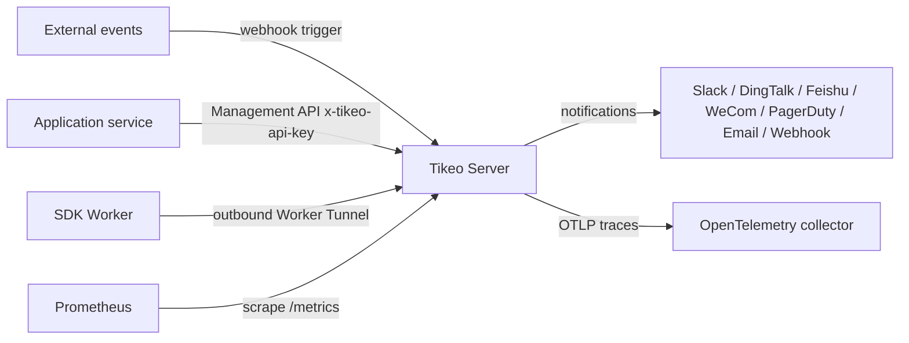

# Integrations overview

This page maps the integration surfaces. For SDK implementation details, start with [SDK and API integration guide](./sdk-and-api), then use the language page only for dependency and syntax differences.

## Prerequisites

| Need | Why it matters |
| --- | --- |
| Management HTTP endpoint | SDK Management clients and operators call `/api/v1` and `/api-docs/openapi.json`. |
| Worker Tunnel endpoint | Worker SDKs connect outbound to the tunnel listener. |
| Namespace/app model | SDK keys, Workers, jobs, and selectors share this scope. |
| Service-account process | SDKs need `x-tikeo-api-key`; human bearer tokens are not service credentials. |
| Worker pool naming | Selectors and runbooks need stable `worker_pool` labels. |

## Integration map

| Surface | Direction | Owner | Contract tokens | Main document |
| --- | --- | --- | --- | --- |
| SDK Worker | Worker → Worker Tunnel | Application team | `WorkerTunnelService`, `OpenTunnel`, `DispatchTask`, `TaskLog`, `TaskResult` | [SDK and API integration guide](./sdk-and-api) |
| SDK Management client | App service → Server HTTP API | Application team | `x-tikeo-api-key`, `/api/v1/jobs`, `/api/v1/jobs/{job}:trigger` | [Management OpenAPI reference](../reference/management-openapi) |
| Raw Management API | Operator/client → Server HTTP API | Platform/API team | `/api-docs/openapi.json`, `ApiResponse` | [Management OpenAPI reference](../reference/management-openapi) |
| Inbound webhooks | External system → Server | Event-source owner | `POST /api/v1/events/webhooks/{job}:trigger` | Event trigger section below |
| Notification Center | Server → external providers | Platform/notification owner | `/api/v1/notification-channels`, `/api/v1/notification-policies` | [Notification Center reference](../reference/notification-center) |
| Alerts | Server → incident workflow | Platform/on-call owner | `/api/v1/alert-rules`, `/api/v1/alert-events` | Alert user guide |
| Prometheus | Scraper → Server | Observability owner | `/metrics` | Deployment docs |
| OpenTelemetry | Server → collector | Observability owner | `observability.tracing.*` | Configuration reference |
| OIDC | Browser/API ↔ IdP/Server | Identity owner | `auth.oidc.*`, `/api/v1/auth/oidc/*` | Configuration reference |
| Terraform/GitOps | IaC runner → Server | Platform owner | `/api/v1/gitops/manifest`, `/api/v1/gitops/diff` | Deployment docs |
| Kubernetes/Helm | Cluster controller → workloads | Platform owner | `deploy/helm/tikeo/`, `TikeoManifest` | Kubernetes docs |

## Traffic direction model



Do not mix directions. Inbound webhooks start work. Worker Tunnel dispatches work to Workers. Notification channels send completed state or alerts out of Tikeo.

## SDK/API integration path

| Step | Owner | Output |
| --- | --- | --- |
| Pick SDK | Application team | Language page selected: Rust, Go, Java/Spring Boot, Python, or Node.js. |
| Configure Worker | Application team | Outbound Worker connects with namespace/app, labels, and processor names. |
| Configure Management client | Application team | App service sends `x-tikeo-api-key` to Management API. |
| Create API job | Application team | Job uses API schedule and processor binding. |
| Trigger job | Application team | Request uses `triggerType=api`; default helper uses `executionMode=single`. |
| Inspect evidence | Application/platform | Instance and logs prove Worker execution. |

## Inbound event triggers

Inbound event triggers are not SDK Management triggers. Use them when an external event should start a known Tikeo job:

```text
POST /api/v1/events/webhooks/{job}:trigger
```

The body can include `source`, `eventType`, `payload`, `signature`, `timestamp`, `nonce`, and `secretRef`. Supported deployments can also accept signing values through `x-tikeo-webhook-secret-ref`, `x-tikeo-webhook-signature`, `x-tikeo-webhook-timestamp`, and `x-tikeo-webhook-nonce` headers. If signature fields are present, Tikeo validates timestamp freshness, nonce replay, and a `secretRef` resolved from the Server environment.

## Outbound notification channels

Notification Center sends messages from Tikeo to external providers. Use it for Slack, DingTalk, Feishu/Lark, WeCom, PagerDuty, email, generic webhooks, and enabled plugin webhook-compatible providers.

| Route family | Purpose |
| --- | --- |
| `/api/v1/notification-channel-types` | Discover provider metadata. |
| `/api/v1/notification-channels` | Store redacted reusable channels. |
| `/api/v1/notification-templates` | Render provider-specific templates. |
| `/api/v1/notification-policies` | Subscribe owners/events to channels. |
| `/api/v1/notification-delivery-attempts` | Inspect retries, due work, and dead letters. |
| `/api/v1/jobs/{job}/notification-bindings` | Bind notifications to job-owned events. |

Store provider credentials in channel `secretRefs`, for example `env:TIKEO_NOTIFICATION_CHANNEL_BILLING_FEISHU_WEBHOOK_URL`. Do not put provider secrets into examples, templates, screenshots, or channel config JSON.

## Observability and identity integrations

| Surface | Verification signal |
| --- | --- |
| Prometheus | `/metrics` responds and the scraper records Server metrics. |
| OpenTelemetry | Server logs show tracing enabled and the collector receives spans. |
| OIDC | Bootstrap/login routes complete the callback and RBAC scopes are visible. |
| Audit | Management actions are visible in audit logs for operators. |

## Verify

| Integration | Minimal evidence |
| --- | --- |
| SDK Worker | Online Worker record with expected namespace/app and processor. |
| Management client | API-key call can list/create jobs in scope. |
| API trigger | Instance has `triggerType=api` and expected execution mode. |
| Worker execution | Instance logs include Worker-emitted task logs. |
| Notification | Delivery attempt shows provider response or retry/DLQ status. |
| Webhook | Event-created instance records the external event source. |

## Troubleshooting

| Symptom | Boundary to check |
| --- | --- |
| SDK calls return unauthorized | Service-account scope and `x-tikeo-api-key`. |
| Worker is online but not selected | Namespace/app, processor name, cluster/region, labels, and `worker_pool`. |
| Webhook creates no instance | Job id, webhook signature/nonce/timestamp, and `secretRef`. |
| Notification does not deliver | Channel enabled state, `secretRefs`, template rendering, and delivery attempts. |
| Metrics or traces are missing | Server config and collector/scraper reachability. |

## Production checklist

- [ ] SDK Worker traffic, Management API traffic, and notifications use separate credentials and routes.
- [ ] Language SDK pages are treated as syntax guides, not separate behavior contracts.
- [ ] Management automation uses `x-tikeo-api-key` and not human bearer tokens.
- [ ] Event triggers and notification channels have separate runbooks.
- [ ] Observability integrations produce operator-readable evidence before launch.
- [ ] Secrets are referenced through environment or secret-manager refs only.
