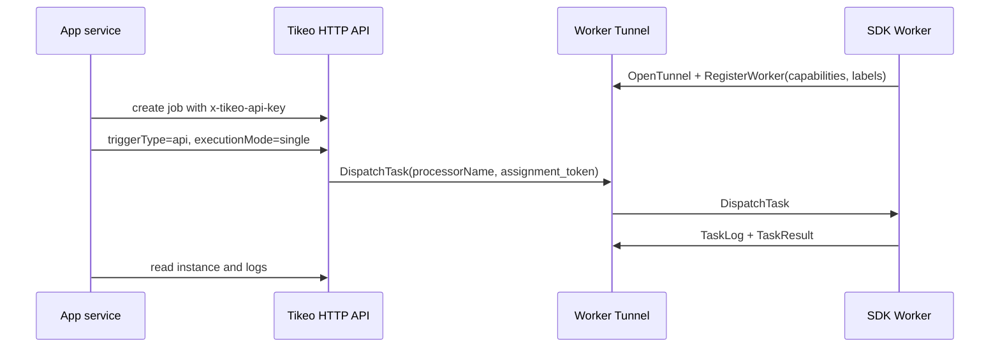

# SDK and API integration guide

Use this page as the shared contract for every Tikeo SDK. It defines the concepts and wire semantics once; the language pages only show dependency installation, a minimal Worker, exception capture, and the Management client syntax for that language.

## Prerequisites

| Value | Example | Used by | Notes |
| --- | --- | --- | --- |
| Management HTTP endpoint | `https://tikeo.example.com` | Management client | Base URL for `/api/v1` and `/api-docs/openapi.json`. |
| Worker Tunnel endpoint | `https://tikeo-worker.example.com` | Worker SDK | Outbound Worker target; local demos use `http://127.0.0.1:9998`. |
| `namespace` / `app` | `billing` / `invoices` | Both | Must match Worker registration, job scope, and API-key scope. |
| SDK API key | `TIKEO_MANAGEMENT_API_KEY` | Management client | Sent as `x-tikeo-api-key`; never use browser/OIDC sessions. |
| Processor name | `invoice.send-reminder` | Both | Job binding must match Worker-advertised normal processor. |
| Worker pool label | `worker_pool=blue` | Worker routing | Used by selectors, canary, and runbooks. |

## Common concepts

Tikeo integrations use two independent clients:

| Client | Direction | Credential | Responsibility |
| --- | --- | --- | --- |
| Worker SDK client | Worker → Worker Tunnel | Worker identity/config | Register capabilities, receive `DispatchTask`, stream `TaskLog`, return `TaskResult`. |
| Management SDK/API client | App service → Server HTTP API | `x-tikeo-api-key` | Create jobs, trigger jobs, read instances, inspect logs. |

Keep the boundary strict. Workers do not make management calls through the tunnel, and application services do not use Worker Tunnel assignment tokens.



## Unified configuration parameters

| Parameter | Rust | Go | Java/Spring Boot | Python | Node.js | Meaning |
| --- | --- | --- | --- | --- | --- | --- |
| Worker endpoint | `WorkerConfig::local(endpoint, ...)` | `LocalConfig(endpoint, ...)` | `tikeo.worker.endpoint` | `local_config(endpoint, ...)` | `localConfig(endpoint, ...)` | Worker Tunnel URL. |
| Management endpoint | `ManagementClient::new(endpoint, ...)` | `NewManagementClient(endpoint, ...)` | `HttpTikeoJobClient` / `tikeo.management.endpoint` | `ManagementClient(endpoint, ...)` | `new ManagementClient(endpoint, ...)` | Server HTTP URL, without `/api/v1`. |
| API key | `api_key` | `apiKey` | `tikeo.management.api-key` | `api_key` | `apiKey` | Sends `x-tikeo-api-key`; source from `TIKEO_MANAGEMENT_API_KEY`. |
| Namespace/app | `namespace`, `app` | `Namespace`, `App` | `tikeo.worker.*`, `tikeo.management.*` | `namespace`, `app` | `namespace`, `app` | Shared scope for key, Worker, job, and instance. |
| Client instance id | `client_instance_id` | `ClientInstanceID` | `tikeo.worker.client-instance-id` | `client_instance_id` | `clientInstanceId` | Stable Worker identity hint. |
| Labels | `labels` | `Labels` | `tikeo.worker.labels` | `labels` | `labels` | Include `worker_pool` when routing depends on it. |
| normal processors | `add_normal_processor` | `AddNormalProcessor` | `@TikeoProcessor` | `add_normal_processor` | `addNormalProcessor` | Advertised processor names. |

## Authentication and Management API semantics

Management SDK helpers are thin HTTP clients over the Management API. They authenticate with app-scoped service credentials, not human sessions.

| Rule | Contract |
| --- | --- |
| Header | Every SDK Management client sends `x-tikeo-api-key`. |
| Source | Load the key from `TIKEO_MANAGEMENT_API_KEY` or a secret manager. |
| Scope | Key is bound to namespace/app and optional worker-pool policy. |
| Response | HTTP routes return `ApiResponse` with `code`, `message`, and `data`. |
| Default helper behavior | Create helpers build API-scheduled jobs; trigger helpers send `triggerType=api` and default `executionMode=single`. |

Reference anchors used by the SDK pages:

| Operation | Reference anchor |
| --- | --- |
| Create job | [`POST /api/v1/jobs`](../reference/management-openapi#post-api-v1-jobs) |
| Trigger job | [`POST /api/v1/jobs/{job}:trigger`](../reference/management-openapi#post-api-v1-jobs-job-trigger) |
| Poll instance | [`GET /api/v1/instances/{instance}`](../reference/management-openapi#get-api-v1-instances-instance) |
| Inspect logs | [`GET /api/v1/instances/{instance}/logs`](../reference/management-openapi#get-api-v1-instances-instance-logs) |
| Worker dispatch | [`DispatchTask`](../reference/worker-tunnel-protobuf#dispatchtask) |

## Worker connection parameters

A Worker is outbound-only. It connects to the Worker Tunnel, registers metadata, and waits for work. Do not expose business processors as inbound HTTP routes just to let Tikeo reach them.

| Parameter | Dispatch impact | Good default |
| --- | --- | --- |
| `endpoint` | Must point at Worker Tunnel listener, not Management HTTP. | `http://127.0.0.1:9998` locally. |
| `namespace` + `app` | Job scope must match Worker scope. | Same as Management client scope. |
| `cluster` + `region` | Broadcast selector and operator filters can match them. | `local` for development. |
| `labels.worker_pool` | Common selector for pools, canary, and runbooks. | Explicit value per deployment. |
| normal processors | Scheduler routes normal processor jobs by processor name. | Add only implemented processors. |
| Script/plugin capabilities | Scheduler can route script/plugin jobs. | Advertise only when runtime exists. |

## Trigger types

| Trigger source | Who creates it | Request semantics | Execution mode |
| --- | --- | --- | --- |
| API/manual | SDK Management client or operator | `triggerType=api` | Default `executionMode=single`. |
| Broadcast API | SDK Management client, explicit fan-out | `triggerType=api` with `broadcastSelector` | `executionMode=broadcast`. |
| Webhook event | External event source route | Webhook route creates event-backed instance | Webhook semantics. |
| Cron/schedule | Server scheduler | Schedule expression wakes the job | Scheduler-selected. |

## Errors and retries

| Failure point | Where it appears | Retry owner | Inspect |
| --- | --- | --- | --- |
| Bad API key or scope | Management client exception/error | Caller | `x-tikeo-api-key`, namespace/app, service-account scopes. |
| Invalid job payload | Management client exception/error | Caller | Create/trigger request fields and OpenAPI anchor. |
| No matching Worker | Instance status and scheduler logs | Operator/deployment | Worker online state, processor name, labels, `worker_pool`. |
| Processor returns failure | Instance result and logs | Job retry policy | Worker task return value. |
| Processor throws exception | Instance result and logs | Job retry policy | Language exception capture and Worker logs. |
| Tunnel disconnect | Worker reconnect loop | Worker supervisor | Tunnel endpoint, network, heartbeat/lease logs. |

Create helpers in all SDKs attach the same default job retry policy: enabled, `maxAttempts=3`, `initialDelaySeconds=5`, `backoffMultiplier=2`, and `maxDelaySeconds=60`. `maxAttempts` includes the first execution.

## Language difference table

| Language | Dependency | Minimal Worker shape | Exception capture | Management client |
| --- | --- | --- | --- | --- |
| Rust | `tikeo` crate | Implement `TaskProcessor`, connect `WorkerClient`. | Return `TaskOutcome`; client errors use `WorkerSdkError`. | `ManagementClient::new`, `ManagementCreateJobRequest::api`, `ManagementTriggerJobRequest::api`, `ManagementTriggerJobRequest::broadcast_api`, `ManagementBroadcastSelectorRequest`. |
| Go | `github.com/yhyzgn/tikeo/sdks/go/tikeo` | `TaskProcessorFunc`, `NewClient`, `RegisterProcessor`. | Return `error` or failed `TaskOutcome`. | `NewManagementClient`, `APIJob`, `APITrigger`, `BroadcastAPITrigger`, `BroadcastSelectorRequest`. |
| Java/Spring Boot | `net.tikeo` artifacts | `@TikeoProcessor` or `GrpcTikeoWorkerClient`. | Throw exceptions or return failure model. | `HttpTikeoJobClient`, `CreateJobRequest.api`, `TriggerJobRequest.api`, `TriggerJobRequest.broadcastApi`, `BroadcastSelectorRequest`. |
| Python | `tikeo` package | Function processor with `Client`. | Raise exception or return `failed(...)`. | `ManagementClient`, `api_job`, `api_trigger`, `broadcast_api_trigger`, `BroadcastSelectorRequest`. |
| Node.js | `@yhyzgn/tikeo` package | `Client`, `localConfig`, processor function. | Throw `Error` or return `failed(...)`. | `ManagementClient`, `apiJob`, `apiTrigger`, `broadcastApiTrigger`, `BroadcastSelectorRequest`. |

## Verify

A complete SDK/API integration proves Worker registration, API job creation, trigger execution, Worker logs, and credential scope. Prefer the full smoke script over copied curl fragments:

```bash
TIKEO_MANAGEMENT_TRIGGER_REBUILD_SERVER=0 scripts/management-trigger-e2e-smoke.sh
```

The script creates service-account credentials, sets `TIKEO_MANAGEMENT_API_KEY`, starts a real Node.js Worker with `TIKEO_WORKER_CONNECT=1`, creates an API job, triggers it, and checks instance logs for `nodejs demo echo processed`.

## Troubleshooting

| Symptom | Likely cause | Fix |
| --- | --- | --- |
| Management calls return unauthorized | Wrong credential type or missing scope | Use `x-tikeo-api-key`, not a bearer token. |
| Job triggers but no Worker runs | Processor or scope mismatch | Compare job processor name, namespace/app, `worker_pool`, and Worker registration. |
| Broadcast reaches too many Workers | Selector too broad | Add `broadcastSelector` labels/tags/cluster/region. |
| Script/plugin job fails immediately | Capability advertised without runtime | Remove capability or install runtime before advertising it. |
| Worker reconnects repeatedly | Tunnel URL or network is wrong | Verify the Worker Tunnel endpoint, not just HTTP Management. |

## Production checklist

- [ ] Worker SDK and Management client use separate configuration blocks.
- [ ] API key is loaded from `TIKEO_MANAGEMENT_API_KEY` or a secret manager and sent as `x-tikeo-api-key`.
- [ ] API-created jobs use `triggerType=api`; default calls use `executionMode=single`.
- [ ] Broadcast calls require a reviewed `broadcastSelector`.
- [ ] Worker advertises only processors, scripts, and plugins it can execute.
- [ ] Retry policy is intentional for non-idempotent processors.
