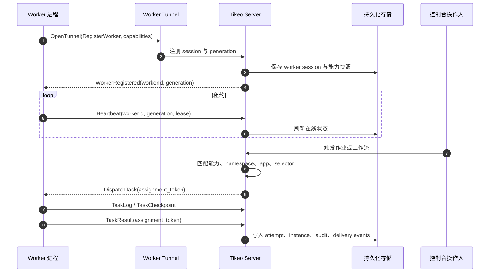
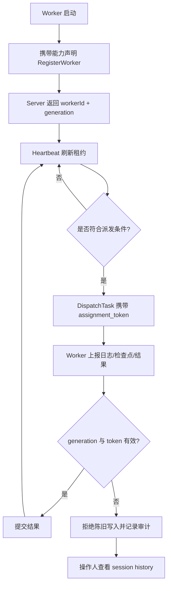

# Server、Worker 与 Worker Tunnel

Worker Tunnel 是 Tikeo 最关键的运行时边界。Server 负责调度、身份、治理、审计、Management API 和持久化状态；Worker 负责真正的业务执行，包括 SDK Processor、已发布脚本、插件 Processor、HTTP 调用、SQL Processor 与受控运行时。两者之间不是由 Server 随机回调某个 Worker URL，而是由 Worker 主动发起一条长生命周期 gRPC/HTTP2 隧道。因此 Worker 可以部署在私有子网、Kubernetes 集群、VM 或 systemd 服务中，不需要暴露业务执行入口。

## 阅读结果

读完本页后，你应该能说明：为什么 Tikeo 不做 Server 到执行器的任意回调；健康隧道应该留下哪些证据；旧 Worker 如何被 generation 与 assignment token 隔离；当实例处于等待、重试、失败或疑似丢失时，应该同时查看哪些页面与日志。完整验收不是“端口通了”，而是身份、租约、派发、执行、日志、结果、通知和审计都能闭环。

## 闭环运行流程

Server 在注册时分配权威身份。可读的 Worker 名称适合过滤和排查，但不是安全边界。真正保护状态的是 session generation 与 assignment token，它们阻止旧进程、断线残留进程或被替换的逻辑 Worker 把过期结果写回到新实例。

## 组件职责

| 组件 | 负责 | 不应负责 | 操作证据 |
| --- | --- | --- | --- |
| Server | 调度实例、保存状态、校验 API、执行 RBAC、派发任务、拒绝陈旧写入 | 在 Server 进程里运行任意用户代码 | Jobs、Instances、Audit、通知投递记录 |
| Worker Tunnel | 注册、心跳、派发流、日志、检查点、结果、取消 | 属于 Server 的租户级策略决策 | Worker session、transport error、lost reason |
| Worker | SDK Processor、脚本运行器、插件 Processor、外部服务调用、stdout/stderr 捕获 | 租户级授权或未审查的 Server 状态变更 | 能力快照、任务日志、结果 payload、异常堆栈 |
| Storage | 定义、实例、attempt、日志、session、审计的持久化 | 只存在内存里的事实来源 | 重启后仍可回放的事故证据 |

## 身份、租约与 fencing

Worker 失联不一定代表进程崩溃：网络路径可能中断，Pod 可能被驱逐，网关可能重置 HTTP/2 流，凭证也可能轮换。因此 Tikeo 把 online、lost、replaced、unregistered 当作有证据的运行状态，而不是一个简单布尔值。当租约过期时，Server 先保护实例状态，再按重试策略决定是否交给其他符合条件的 Worker。

## 恢复闭环

恢复不是单次重连，而是一个闭环：Server 检测心跳缺失或传输错误，归类 lost reason，隔离旧 generation 写入，按重试策略和 selector 重新调度，保留日志与检查点，发送配置好的通知，并留下审计记录。因此事故排查时不能只看 Instances，也要同时看 Workers 的 session history。

## 调度含义

能力快照是调度依据。Job 不是因为 Worker 名称相似就可运行，而是因为至少一个在线 Worker 声明了所需 processor、namespace/app 权限、标签、region、cluster 或 broadcastSelector。没有可用 Worker 时，正确问题是“哪条资格规则拒绝了所有 Worker”，而不是笼统地怀疑 Server 是否启动。

## 验收 runbook

1. 启动 Server 和一个设置 `TIKEO_WORKER_CONNECT=1` 的 Worker。
2. 在 Workers 页面确认 Worker 在线，并且能力矩阵包含预期 processor。
3. 从 Jobs 页面或 Management API 触发一个 API Job。
4. 打开 Instance 详情，确认状态流转、attempt、worker id、assignment token、日志、结果和审计记录。
5. 执行中停止 Worker，验证 session 变为 lost，旧写入被拒绝，重试行为符合 Job 策略，通知中包含正确 instance id。
6. 重启 Worker，确认它以新的 generation 注册，而不是复用不安全的旧 session。

## 验收 Verify

合格的隧道实现必须能证明注册、心跳、派发、任务日志、任务结果、generation fencing、重连与审计持久化。生产环境还要证明通知按钮使用平台公开 URL，而不是相对路径。

## 故障排查

| 现象 | 常见原因 | 查看位置 |
| --- | --- | --- |
| Worker 不显示 | Server 地址错误、Token 无效、TLS/HTTP2 代理问题 | Worker 日志、Server tunnel 日志、Ingress/Gateway 配置 |
| Job 一直等待 | 没有 Worker 能力匹配 processor 或 selector | Workers 能力矩阵、Jobs scheduling advice |
| Instance 反复重试 | Worker 能启动但运行时失败 | Instance attempts、stdout/stderr、异常堆栈 |
| 结果被拒绝 | 旧 generation 或 assignment token 不匹配 | Worker session history 与审计记录 |
| 通知按钮是相对路径 | 未配置平台公开 URL | Settings 中的平台 URL 与通知模板变量 |

## 生产检查清单

- [ ] Worker Tunnel 入口对 Worker 可达，但 Worker 不暴露入站执行端口。
- [ ] TLS/mTLS、API Key 与轮换流程已记录。
- [ ] Worker 能力名称经过评审，Job 依赖前已确认。
- [ ] Instance 日志与审计记录在 Server 重启后仍存在。
- [ ] Worker lost 与 retry 通知路由到有人负责的渠道。
