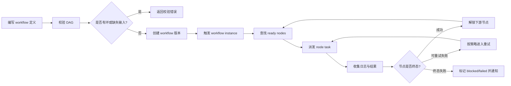
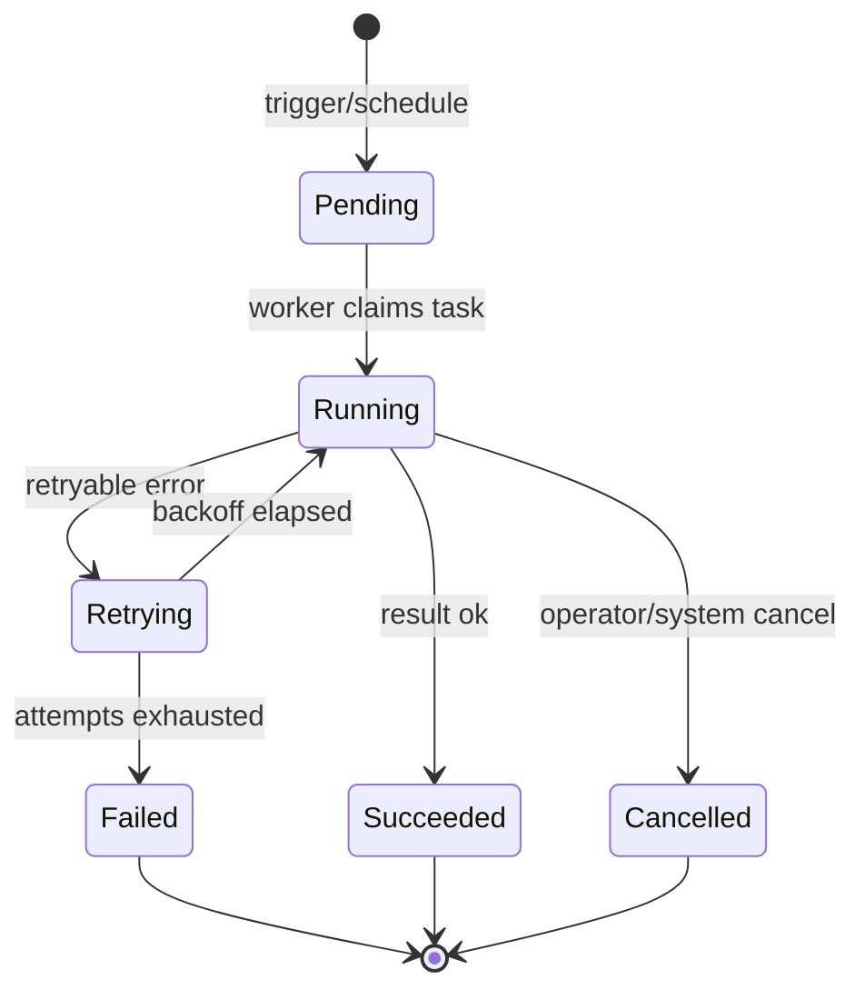

# Workflow DAG 模型

Tikeo 同时支持简单 Job 和多步骤 Workflow。Job 是可复用的单次执行契约；Workflow 是有向无环图（DAG），由执行节点、依赖边、输入输出映射、重试策略、通知和回放证据组成。目标不是把图画出来就结束，而是让每个运维问题都有答案：应该运行什么、为什么此节点已就绪、谁触发、哪个 Worker 执行、哪里失败、发生了哪次重试、哪些下游节点被阻塞。

## 阅读结果

读完本页后，你应该能区分 Job 与 Workflow 的边界，理解 DAG 如何产生可运行节点，知道 instance、node instance 与 attempt 的关系，明白为什么回放证据是生产能力的一部分，并且知道通知如何接入执行事件而不变成另一个隐藏工作流引擎。

## 闭环 DAG 流程

这个流程让当前环节闭环：定义校验阻止不可能执行的图，执行只从 ready node 开始，每个 node attempt 都产生证据，结果再驱动下一次调度判断。没有可回放证据的 Workflow 在生产上是不完整的，因为图一旦变大，人就无法证明到底发生了什么。

## Job、Instance、Node 与 Attempt

| 术语 | 含义 | 运维问题 |
| --- | --- | --- |
| Job | 可复用的单次执行契约：processor、schedule、retry、selector、通知绑定 | “什么能运行，运行在哪里？” |
| Workflow | 由节点和边组成的版本化 DAG | “哪些步骤依赖哪些步骤？” |
| Workflow instance | 某个 workflow 版本的一次触发运行 | “这次运行发生了什么？” |
| Node instance | workflow instance 内一个节点的执行 | “哪个步骤 ready、running、failed 或 skipped？” |
| Attempt | job 或 node 的一次尝试 | “哪次重试产生了这段日志/结果？” |
| Replay bundle | 时间线、输入输出、日志、attempt、操作人动作、通知投递记录 | “能否重建事故？” |

## 实例生命周期与重试语义

“重试中”是面向操作人的一等状态。它不同于 Pending，因为已经存在失败 attempt；也不同于 Running，因为 backoff 期间可能没有 Worker 正在执行。通知策略应该能区分首次运行、重试中、终态失败、成功和 always 事件。

## 通知与告警边界

Workflow 通知回答的是“把这个执行事件告诉某人”；告警回答的是“规则观察到不健康条件并触发、恢复或静默”。Workflow 节点可以发送通知，告警也可以复用同一个 Notification Center 的渠道、模板和投递管线，但语义不同。必须保持这个边界清晰，否则很容易出现重复通知和责任混乱。

## 回放与事故复盘

回放视图应展示 graph 版本、触发来源、操作人、节点顺序、实例 ID、attempt 编号、Worker ID、日志、结果、通知投递记录和审计动作。缺少这些证据时，Workflow UI 只是装饰；具备这些证据时，操作人才能判断失败来自依赖就绪、Worker 匹配、运行时异常、业务异常、密钥/配置错误还是下游系统故障。

## 验收 Verify

创建或查看一个三节点 DAG：extract、transform、notify。先校验，再运行，强制一次可重试失败，确认节点进入“重试中”，再按策略成功或终态失败。打开实例控制台，确认每个节点都有 attempt、日志、Worker 身份、时间戳和通知投递结果。

## 故障排查

| 现象 | 常见原因 | 查看位置 |
| --- | --- | --- |
| 节点一直不开始 | 上游依赖失败或输入缺失 | DAG readiness 面板和节点依赖表 |
| Workflow 过早成功 | 边或终止条件错误 | 版本 diff 与校验输出 |
| 重试风暴 | 重试策略过激或业务失败被标成可重试 | Attempt 时间线与错误分类 |
| 通知缺失 | 未绑定事件、渠道禁用、模板渲染失败 | 通知投递记录与模板预览 |
| 回放信息不足 | Worker 或脚本运行时没有输出日志/检查点 | Worker SDK instrumentation 与脚本 runner 捕获 |

## 生产检查清单

- [ ] Workflow 版本化，变更通过 diff 审查。
- [ ] 每个节点都有明确的重试、超时和下游失败行为。
- [ ] 通知绑定到清晰执行事件，模板包含 instance ID。
- [ ] 回放证据属于验收标准，而不是事后排障愿望。
- [ ] 高风险 Workflow 有回滚或人工恢复说明。
