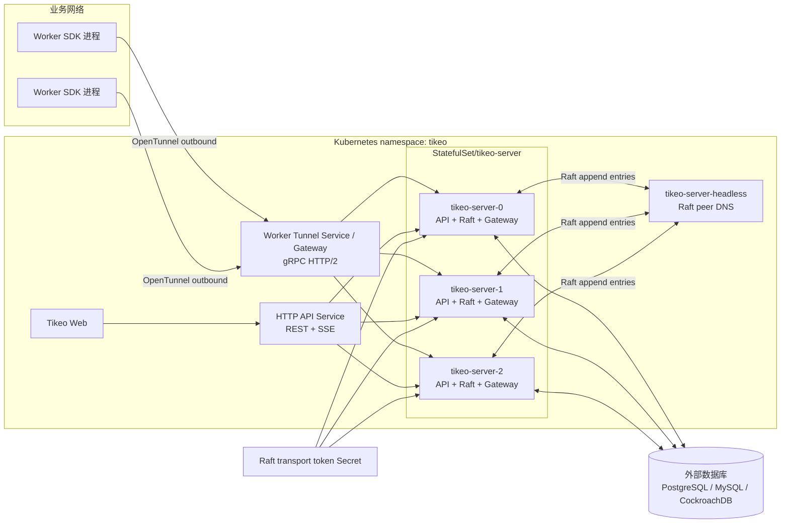
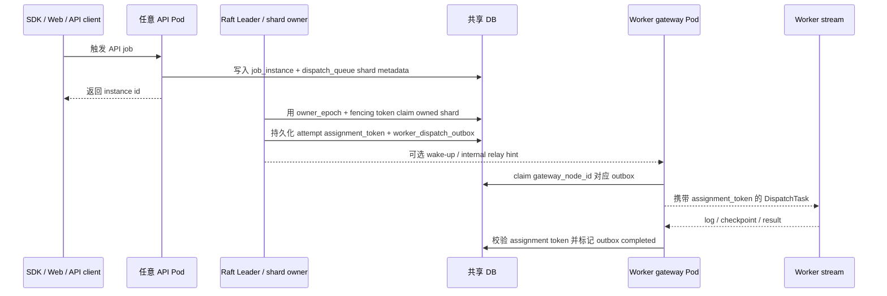
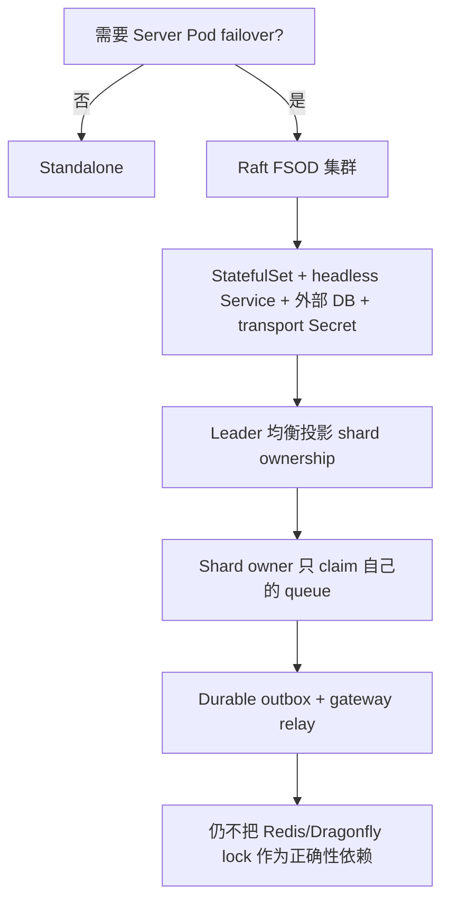
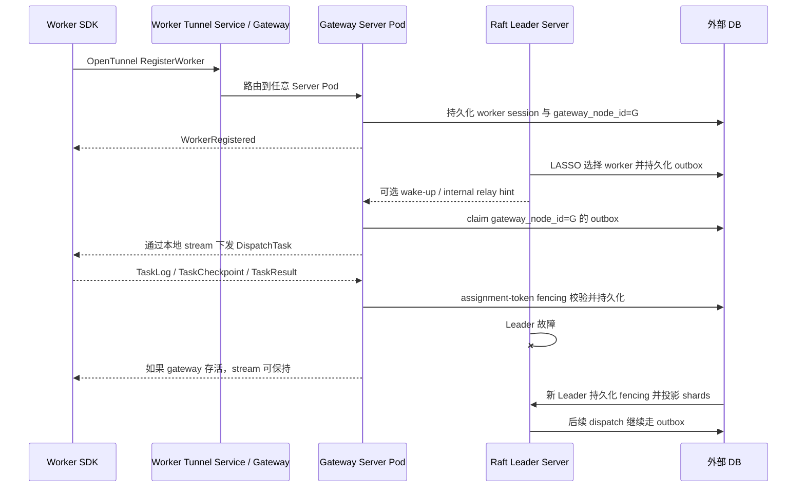

# Server 高可用与 Raft FSOD 集群

Tikeo 生产多 Pod Server 架构的正式名称是 **Raft FSOD 集群**。FSOD 是 **Fenced Slot Outbox Dispatch**，可以理解为“有栅栏的分片出站派发”：Raft 提供带 fencing 的控制面权威，调度队列被切成稳定 slots，每次 Worker 派发意图都会先写入 outbox，再由持有真实长连接的 gateway Pod 投递。

在 Kubernetes Raft 模式下，Server Pod 组成 Raft group；被选出的 Leader 持久化 fencing token，把调度 shard ownership 投影到共享数据库，并在派发 Worker 前先写入 `worker_dispatch_outbox`。Worker Tunnel 长连接可以落到任意 Server Pod；持有 stream 的 Pod 是 gateway，只投递属于自己 `gateway_node_id` 的 outbox 行。这个设计目标是：实现可落地的 Server HA，但不把 Redis、Dragonfly 或 SQL advisory lock 变成调度正确性的依赖。


## 为什么这是一个创新点

Raft FSOD 集群不是“主 Pod 干活、其他 Pod 旁观”的被动 standby，也不是在传统调度器外面套一层 Redis 锁。它把几个机制组合成一个完整派发闭环：

| 构件 | 在集群中的角色 | 创新价值 |
| --- | --- | --- |
| Raft fencing | 为 term、全局 timer/retry 循环和 ownership 投影建立唯一控制面权威。 | 避免 split-brain 调度决策，不要求每条派发路径都去抢外部分布式锁。 |
| Shard ownership 投影 | 把稳定 scheduler slots 映射到 active Server Pod，并写入 owner epoch/fencing token。 | 非 Leader Pod 也能主动派发自己拥有的 shards，扩 Pod 不只是待机，而是能提升故障切换和派发吞吐。 |
| Durable outbox | stream 投递前先持久化已选择的 Worker/attempt。 | 不再把 Pod 内存当派发事实；gateway 切换、Worker 重连和 visibility timeout 后仍可恢复。 |
| Worker Tunnel gateway relay | Worker 可以连接任意 Server Pod，gateway 只 claim 自己持有 stream 的 outbox。 | 保留 Worker 主动出站模型，多 Pod 部署时也不需要暴露业务 Worker。 |
| LASSO worker scoring | 优先本地 gateway，再看 Worker authority、rendezvous spread 和稳定 tie-break。 | 在不削弱 outbox/fencing 的前提下，尽量减少跨 Pod relay。 |

对运维来说，结果是：API/Web 请求可以在 Server Pod 间负载均衡，Worker 长连接可以落到不同 Pod，而任务派发从触发到终态仍有可恢复、有栅栏的持久化路径。

本版本使用 multi-owner scheduler 路径。Raft 仍只选出一个控制面 Leader，但 Leader 只会把 scheduler shards 投影到 active members；Follower Pod 只有在持有 active shard 且 owner epoch/token 匹配时，才能派发自己的 shard。bootstrap 阶段如果还没有任何 membership rows，投影使用配置的 peer set；一旦 membership rows 存在，removed 或非 active 成员不会再收到 fallback shards。

## 部署架构



## FSOD 派发流程



FSOD 不变量：

1. **Fenced**：调度所有权、queue claim、outbox、Worker progress 都带 epoch/token 校验。
2. **Slot**：每个 job dispatch queue 行都有 `shard_id`、`shard_map_version`、`shard_count`。
3. **Outbox**：`DispatchTask` 不是唯一派发事实；stream 投递前必须先持久化 `worker_dispatch_outbox`。
4. **Dispatch**：gateway 只投递自己持有 stream 的 outbox；sender handle 只是进程内缓存，不是业务事实。

## 当前已实现能力

| 能力 | 当前行为 |
| --- | --- |
| 多 Pod Server 部署 | Helm `server.cluster.mode=raft` 渲染 `StatefulSet`、稳定 Pod 名称和 `tikeo-server-headless`。 |
| Consensus 与 fencing | Raft runtime 选出一个 Leader；只有持久化 leader fencing token 的节点报告 `canSchedule=true`。 |
| Shard ownership 投影 | Leader 把配置的 scheduler shard 均衡写入 `cluster_shard_ownership`，包含 `shard_map_version`、`shard_count`、`epoch`、`raft_term`、owner node 和 fencing token。 |
| Multi-owner dispatch | 任一持有 active ownership row 的 Pod 都可以派发自己 shard 下的 job-instance queue、workflow-node materialization 和 broadcast attempt；非 owner 或旧 token fail closed。 |
| Dispatch queue fencing | API/job/workflow dispatch queue 行持久化 shard map 字段；claim 绑定 `owner_epoch` 与 `owner_fencing_token`，旧 token 会被拒绝。 |
| Durable Worker dispatch | 派发前先创建 assignment token 和 `worker_dispatch_outbox`，再做 stream delivery 或 internal relay hint。 |
| Outbox recovery | Gateway 按 `gateway_node_id` 扫描；无 ack/result 的 delivered 行通过 visibility timeout 重新 queued；Worker 重连可按 `logical_instance_id` + generation reroute。 |
| LASSO worker scoring | 候选 Worker 按 local gateway、Worker authority、dispatch key rendezvous spread、worker id tie-break 排序。 |
| Worker Tunnel gateway | 任意 Server Pod 都能接收 Worker Tunnel registration；`worker_sessions.gateway_node_id` 记录 live stream 所在 Pod。 |
| Web/API 负载均衡 | 业务数据从共享 DB 读取，在不同 Pod 间保持一致。`/api/v1/cluster/diagnostics` 会探测每个 active member endpoint，并返回 `probeStatus`、`observedRole`、`observedCanSchedule` 和 `probeLatencyMs`，方便区分本地视图与跨 Pod 健康状态。 |
| 外部锁 | 核心调度正确性不依赖 Redis/Dragonfly/SQL advisory lock。 |

## 模式选择



| 模式 | 运行方式 | 适用场景 | 不适用场景 |
| --- | --- | --- | --- |
| Standalone | `cluster.mode=standalone`，单 Server | 本地开发、demo、小型单节点 VM | 需要 Server Pod failover |
| Raft FSOD 集群 | `server.cluster.mode=raft`、StatefulSet、外部 DB、transport token | 生产 K8s HA、durable outbox dispatch、Worker gateway failover、multi-owner shard dispatch | 只是在 standalone Deployment 上扩副本 |
| Multi-owner shard balancing | 由 Raft shard ownership projection 启用 | Server Pod 横向分摊 scheduler 吞吐、workflow materialization、broadcast fan-out | 无法保证所有 Pod 的 shard map version/count 一致 |
| Redis/Dragonfly lock scheduling | 不是 Tikeo core mode | 只能作为可选缓存/加速 | 核心调度所有权 |

## 优势与创新价值

| 优势 | 意义 |
| --- | --- |
| 可恢复派发意图 | gateway 或 relay 失败不会丢失 Worker/attempt 选择，outbox 可查询、可重试。 |
| 强 fencing | Raft term、owner epoch、queue owner fencing、assignment token、Worker generation 共同拒绝旧写入。 |
| Worker 连接 locality | LASSO 优先本地 gateway，但不绕过 outbox，兼顾低延迟和可恢复性。 |
| 无外部锁依赖 | 不需要 Redis/Dragonfly 才能保证调度所有权正确。 |
| Web/API 可正常走 Service | 业务事实来自 DB；节点本地视图显式标识。 |
| 主动横向派发 | shard rows 投影后，非 Leader Pod 可以安全派发自己拥有的 shards，不再只是闲置。 |
| 最小迁移重平衡 | 新增/移除健康 Server Pod 不会全量 remap；Tikeo 尽量保留当前 owner rows，只移动恢复目标 skew 所必需的 shards。 |

## 限制与取舍

| 限制 | 运维含义 | 缓解方式 |
| --- | --- | --- |
| rollout 期间 shard ownership 变化 | Raft term/membership projection 变化时 ownership 仍可能迁移；最小迁移只降低 churn，不会让旧 token 继续有效。 | 保持所有 Pod 的 `cluster.scheduler_shard_map_version` 与 `cluster.scheduler_shard_count` 一致，并使用保守滚动更新。 |
| Workflow 与 broadcast 也已分片 | Workflow node queue 与 broadcast attempt 使用确定性 shard ownership。 | 监控每个 owner 的 queue age 与 outbox age，定位不健康 shard owner 或 gateway。 |
| Failover 不是瞬时 | Raft election 期间调度暂停，直到新 Leader 持久化 fencing 并投影 shard。 | 使用 retry policy，监控 queue/outbox age，升级后跑 failover smoke。 |
| 需要稳定身份 | Raft 需要 StatefulSet pod name 和 headless peer DNS。 | 使用 Helm Raft overlay 或 `deploy/k8s/tikeo-raft-ha.yaml`。 |
| 需要外部 DB | 多 Pod HA 不能用 Pod-local SQLite。 | 使用 PostgreSQL、MySQL 或 CockroachDB-compatible 存储。 |
| 长连接网络层很关键 | Worker Tunnel 是 gRPC/HTTP2，Web 使用 SSE。 | 按 [SSE 实时刷新部署注意事项](./sse-realtime) 配置 ingress/LB/WAF，并保证 Worker Tunnel 支持 HTTP/2。 |

## 配置参考

下面是 Raft FSOD 集群的最低部署配置要求。同一集群中的所有 Server Pod 必须在 mode、peer set、storage、shard map version 和 shard count 上保持一致；这些字段漂移应视为 rollout 阻断项。

| 配置 / 环境变量 | 默认值 | 生产建议 |
| --- | --- | --- |
| `cluster.mode` / `TIKEO__CLUSTER__MODE` | `standalone` | 多 Pod HA 设置为 `raft`。 |
| `cluster.node_id` / `TIKEO__CLUSTER__NODE_ID` | `tikeo-standalone` | K8s Raft 模式使用 StatefulSet Pod 名。 |
| `cluster.peers[]` | 空 | 配置所有 StatefulSet peer endpoint，例如 `http://tikeo-server-0.tikeo-server-headless:9090`。 |
| `cluster.transport_token` / `TIKEO__CLUSTER__TRANSPORT_TOKEN` | 空 | 内部 Raft/relay route 必需，放入 K8s Secret。 |
| `cluster.scheduler_shard_map_version` | `1` | 只能通过计划内 shard-map migration 变更。 |
| `cluster.scheduler_shard_count` | `64` | 同一 map version 下所有 Pod 必须一致。 |
| `storage.database_url` / `TIKEO__STORAGE__DATABASE_URL` | SQLite dev path | Raft HA 使用外部 PostgreSQL/MySQL/CockroachDB。 |
| `server.worker_tunnel_addr` | `0.0.0.0:9998` | 通过保持 gRPC/HTTP2 的 Service/Gateway 暴露；不要走只支持 HTTP/1 的代理。 |
| API/SSE ingress path | 与部署相关 | Browser/API 流量可以在 Pod 间负载均衡，但 SSE path 必须关闭 proxy buffering，并设置足够长的 idle/read timeout。见 [SSE 实时刷新部署注意事项](./sse-realtime)。 |
| Worker Tunnel Service | 与部署相关 | 初始 Worker 连接可以负载均衡到任意 Pod；重连会改变 `worker_sessions.gateway_node_id`，后续 delivery 由 outbox reroute 处理。 |

## 前置条件

启用 Raft FSOD 集群前请准备：

- 所有 Server Pod 共享的外部 PostgreSQL、MySQL 或 CockroachDB-compatible 存储。
- StatefulSet 稳定身份和 headless peer Service；不能只扩普通 Deployment 副本。
- `tikeo-raft-transport` Secret，并以 `TIKEO__CLUSTER__TRANSPORT_TOKEN` 注入。
- 支持 gRPC/HTTP2 的 Worker Tunnel 网络路径。
- 对 Web 实时页面友好的 SSE API 网络路径。
- 至少一个真实 Worker 用于 failover 验收，而不只看 Kubernetes readiness。

## 验收

渲染 Helm overlay：

```bash
helm template tikeo ./deploy/helm/tikeo   --namespace tikeo   -f deploy/helm/tikeo/examples/values-external-postgres.yaml   -f deploy/helm/tikeo/examples/values-raft-ha.yaml   | grep -E 'kind: StatefulSet|tikeo-server-headless|TIKEO__CLUSTER__MODE|TIKEO__CLUSTER__TRANSPORT_TOKEN'
```

安装或升级后：

```bash
kubectl -n tikeo rollout status statefulset/tikeo-server
kubectl -n tikeo get pods -l app.kubernetes.io/component=server -o wide
kubectl -n tikeo get svc tikeo-server-headless
```

检查 diagnostics 与 FSOD metrics：

```bash
curl -fsS "$TIKEO_SERVER_URL/api/v1/cluster/diagnostics"   -H "x-tikeo-api-key: $TIKEO_MANAGEMENT_API_KEY"   | jq '{respondingNode: .data.respondingNode.nodeId, nodes: [.data.nodes[] | {nodeId, canSchedule, currentTerm}]}'

curl -fsS "$TIKEO_SERVER_URL/api/v1/metrics/summary"   -H "x-tikeo-api-key: $TIKEO_MANAGEMENT_API_KEY"   | jq '{queue: .data.queue, outbox: .data.outbox, shardOwnership: .data.shard_ownership}'
```

期望证据：

- 只有一个节点报告 `canSchedule=true`；
- `shardOwnership.active` 大于 0；
- `shardOwnership.activeOwnerCount` 与当前健康 owner 集合匹配；
- `shardOwnership.ownershipSkew` 投影后通常为 `0` 或 `1`；
- `queue.pendingByShardOwner` 和 `queue.oldestPendingAgeByShardOwner` 能定位哪一个 owner 积压；
- dispatch 后 `outbox.total` 增加，terminal 行最终进入 completed；
- worker-pool quota backpressure 时能看到 `queue.blockedByQuota`。

对已部署环境做非破坏性 rollout/rollback gate：

```bash
TIKEO_SERVER_URL="https://tikeo.example.com" \
TIKEO_MANAGEMENT_API_KEY="$TIKEO_MANAGEMENT_API_KEY" \
TIKEO_EXPECTED_SERVER_REPLICAS=3 \
TIKEO_MAX_SHARD_SKEW=1 \
TIKEO_MAX_PENDING_AGE_SECONDS=120 \
TIKEO_MAX_OUTBOX_AGE_SECONDS=120 \
TIKEO_ROLLOUT_REPORT=.dev/reports/raft-ha-rollout.json \
scripts/verify-raft-ha-rollout.sh
```

该脚本只读取 `/api/v1/cluster/diagnostics` 和 `/api/v1/metrics/summary`，不会修改任务、Worker、DB 或 Kubernetes 资源。如果任一 remote member probe 返回 `unreachable`、`http_error` 或 JSON 无效也会失败。rollout 判定健康前跑一次，`helm rollback` 后再跑一次，用来证明恢复后的版本只有一个 scheduler、shard ownership 有效、skew 合理、queue/outbox age 在阈值内，并且 peer status endpoints 可达。

受控 Kubernetes fault injection 先 dry-run，再显式 opt-in 执行变更：

```bash
# 不做任何变更；只记录目标 Pod 和下一步 apply 命令。
TIKEO_SERVER_URL="https://tikeo.example.com" \
TIKEO_MANAGEMENT_API_KEY="$TIKEO_MANAGEMENT_API_KEY" \
TIKEO_EXPECTED_SERVER_REPLICAS=3 \
scripts/raft-ha-fault-injection-drill.sh

# 变更型演练：删除当前观测到的 schedulable Server Pod，等待 StatefulSet 恢复，
# 然后循环执行 scripts/verify-raft-ha-rollout.sh 直到健康或超时。
TIKEO_FAULT_MODE=apply \
TIKEO_FAULT=leader-pod-delete \
TIKEO_SERVER_URL="https://tikeo.example.com" \
TIKEO_MANAGEMENT_API_KEY="$TIKEO_MANAGEMENT_API_KEY" \
TIKEO_EXPECTED_SERVER_REPLICAS=3 \
scripts/raft-ha-fault-injection-drill.sh
```

无 Kubernetes 的本地端到端证据：

```bash
TIKEO_RAFT_WORKER_E2E_KEEP=0 TIKEO_RAFT_WORKER_E2E_REBUILD_SERVER=0 scripts/raft-worker-failover-e2e.sh
```

### 本地 Kind 4-Pod Kubernetes E2E

如果本地没有真实多节点 Kubernetes 集群，可以用 Kind 在一台机器上验证 HA 设计中 Kubernetes 相关的闭环。这是声明四 Pod Raft 路径可用前，推荐执行的本地验收。

Kind harness 会做这些事：

1. 创建或复用本地 Kind 集群；
2. 构建 `target/debug/tikeo`，并打成快速本地 Docker 镜像；
3. 部署 PostgreSQL，以及四副本 `tikeo-server` StatefulSet、headless peer DNS、API Service、Worker Tunnel Service；
4. bootstrap admin，并创建 app-scoped `x-tikeo-api-key`；
5. 把管理/API 请求固定到一个非 Leader Pod，把 Worker Tunnel 长连接固定到另一个非 Leader Pod；
6. 验证 `/api/v1/cluster/diagnostics`、`/api/v1/metrics/summary`、集群内 Service 访问和 DB 持久化证据；
7. failover 前触发一个 API job；
8. 通过 `scripts/raft-ha-fault-injection-drill.sh` 删除当前 schedulable Leader Pod；
9. 等待 StatefulSet 恢复，并在 failover 后再次触发 API job。

在仓库根目录执行：

```bash
# 如果 kind/kubectl 不在 PATH，会自动安装到 .dev/tools/bin。
TIKEO_KIND_E2E_KEEP=0 \
TIKEO_KIND_E2E_REBUILD_SERVER=1 \
scripts/kind-raft-ha-e2e.sh
```

常用参数：

| 环境变量 | 默认值 | 用途 |
| --- | --- | --- |
| `TIKEO_KIND_CLUSTER_NAME` | `tikeo-raft-ha` | 复用或隔离 Kind cluster 名称。 |
| `TIKEO_KIND_NAMESPACE` | `tikeo-kind-ha` | harness 使用的 Kubernetes namespace。 |
| `TIKEO_KIND_SERVER_REPLICAS` | `4` | 验收测试保持 `4`；降低副本会减少覆盖面。 |
| `TIKEO_KIND_E2E_KEEP` | `0` | 设置为 `1` 时保留 Kind cluster 和 port-forward 证据，方便人工检查。 |
| `TIKEO_KIND_E2E_REPORT_DIR` | `.dev/reports/<run-id>` | 证据输出目录。 |
| `TIKEO_KIND_E2E_INSTALL_TOOLS` | `1` | 设置为 `0` 时要求本机已安装 `kind` 与 `kubectl`。 |
| `TIKEO_KIND_E2E_REBUILD_SERVER` | `1` | 设置为 `0` 时复用已有 `target/debug/tikeo`。 |

通过后会写入 `.dev/reports/<run-id>/<run-id>.json` 以及这些证据：

- `cluster-diagnostics-*.json` 和 `metrics-summary-*.json`；
- `rollout-*.json` 和 `fault-drill/*`；
- `db-evidence-*.json`，包含 `cluster_shard_ownership`、`worker_sessions`、`worker_dispatch_outbox`、`dispatch_queue`；
- `instance-result-before-failover.json` 和 `instance-result-after-failover.json`；
- `worker.log`、Pod 日志、Kubernetes events 和生成的 manifest。

Kind 能验证 Kubernetes 对象语义、稳定 StatefulSet 身份、headless DNS、集群内 Service 路由、Worker Tunnel gateway 分离、Leader Pod 删除后的恢复。它不能替代生产验证中的多节点/多可用区故障、云 LB idle timeout、WAF 行为、TLS 证书、真实 Ingress Controller 或真实外部数据库 HA。

脚本会在 `.dev/reports/<run-id>/` 写入：

- `<run-id>.json` 最终 smoke report；
- `*-cases.jsonl` 逐项 pass/fail；
- `fsod-db-*.json`：`cluster_shard_ownership`、`worker_sessions`、`worker_dispatch_outbox`、`dispatch_queue` 快照；
- `metrics-*.json`：`/api/v1/metrics/summary` 快照；
- `cluster-diagnostics-*.json`：`/api/v1/cluster/diagnostics` 快照；
- Server、Worker、TCP proxy 日志。

## Kubernetes 安装摘要

```bash
kubectl -n tikeo create secret generic tikeo-raft-transport   --from-literal=transport-token="$(openssl rand -hex 32)"

helm upgrade --install tikeo ./deploy/helm/tikeo   --namespace tikeo --create-namespace   -f deploy/helm/tikeo/examples/values-external-postgres.yaml   -f deploy/helm/tikeo/examples/values-raft-ha.yaml

kubectl -n tikeo rollout status statefulset/tikeo-server
```

渲染结果应包含：

- `StatefulSet/tikeo-server`，不是 `Deployment/tikeo-server`；
- `Service/tikeo-server-headless`；
- `TIKEO__CLUSTER__MODE=raft`；
- 从 Pod 名注入的 `TIKEO__CLUSTER__NODE_ID`；
- 来自 Secret 的 `TIKEO__CLUSTER__TRANSPORT_TOKEN`；
- 所有 Server Pod 共享的外部 DB Secret。

## Worker Tunnel gateway 与 failover



如果 Worker gateway Pod 故障，SDK 会重连，`worker_sessions.generation` 递增，outbox reroute 会更新到新的 `gateway_node_id` 后重试投递。

## 故障排查

| 现象 | 可能原因 | 检查方式 |
| --- | --- | --- |
| 多个 Pod 报告 `canSchedule=true` | Raft fencing 或配置混乱 | 暂停 rollout；检查 `TIKEO__CLUSTER__MODE`、Pod node id、Raft term、metadata row、共享 DB URL。 |
| 没有 Pod 报告 `canSchedule=true` | Raft 无法选举或无法持久化 ownership | 检查 headless DNS、peer address、transport token、DB 连通性和 Server 日志。 |
| `shardOwnership.active` 为 0 | Leader 尚未投影 shard ownership | 检查 `/api/v1/cluster`、Raft term、`cluster.scheduler_shard_count`、migration 状态和 DB 写入错误。 |
| `shardOwnership.ownershipSkew` 持续过高 | member 不健康/removed、配置不一致或 projection 无法持久化 | 检查 active Raft members、`cluster.scheduler_shard_map_version`、`cluster.scheduler_shard_count`、DB 写入错误和 `tikeo_cluster_shard_ownership_skew`。 |
| 某个 owner 积压明显 | Shard owner 无法派发或无法触达 Worker gateway | 检查 `queue.pendingByShardOwner`、`queue.oldestPendingAgeByShardOwner`、对应 gateway 的 Worker sessions 和 relay 日志。 |
| failover 后 Job 排队 | 新 Leader 未选出/未投影、outbox 无法到 gateway、Worker session 丢失 | 查看 `cluster-diagnostics`、`metrics.summary`、`fsod-db-*.json`、`worker_sessions.gateway_node_id` 和 Server 日志。 |
| Outbox 停在 `delivered` | Worker 未在 visibility timeout 前 ack/log/result | 等待 requeue，检查 Worker 连接、assignment token 校验和 delivery loop 日志。 |
| Worker 一直重连 | Worker Tunnel HTTP/2/gRPC 链路被破坏 | 检查 Gateway/Ingress 协议、LB idle timeout、TLS/mTLS 和 SDK reconnect 日志。 |
| API 页面不同 Pod 看起来不同 | 把节点本地 endpoint 当成全局事实 | 业务页面使用 DB-backed API 和 `/api/v1/cluster/diagnostics`；`/api/v1/cluster` 是本地视图。 |
| SSE 仪表盘频繁断开 | Proxy buffering 或 idle timeout | 应用 [SSE 实时刷新部署注意事项](./sse-realtime)。 |

## 生产检查清单

- [ ] 单 Server 使用 `standalone`。
- [ ] 多 Pod Server HA 使用 `raft` + StatefulSet + 外部 DB。
- [ ] 所有 Pod 的 `cluster.scheduler_shard_map_version` 和 `cluster.scheduler_shard_count` 一致。
- [ ] 不使用 Redis/Dragonfly lock 做核心调度所有权。
- [ ] 确认只有一个节点报告 `canSchedule=true`。
- [ ] 确认 `/api/v1/metrics/summary` 暴露 queue、outbox、shard ownership。
- [ ] 发布前运行 `scripts/raft-worker-failover-e2e.sh` 并归档 `.dev/reports/<run-id>/`。
- [ ] 用真实 Worker 验证 Leader failover 后仍能重连并完成任务。
