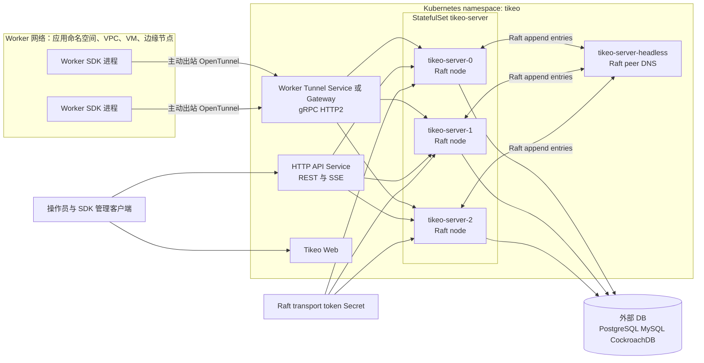
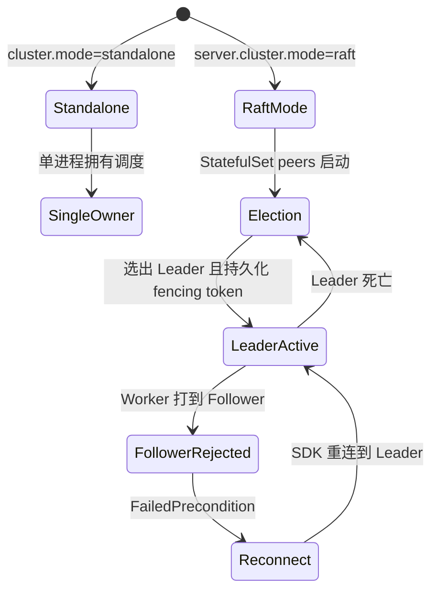
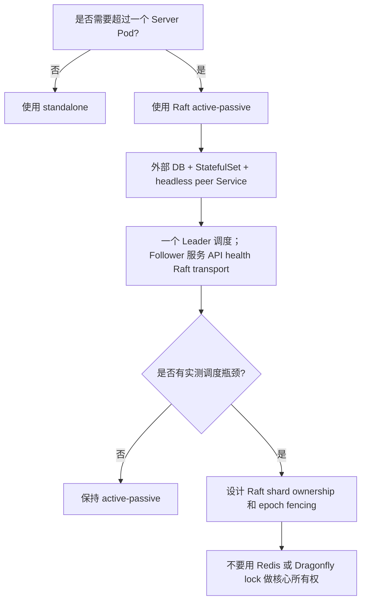
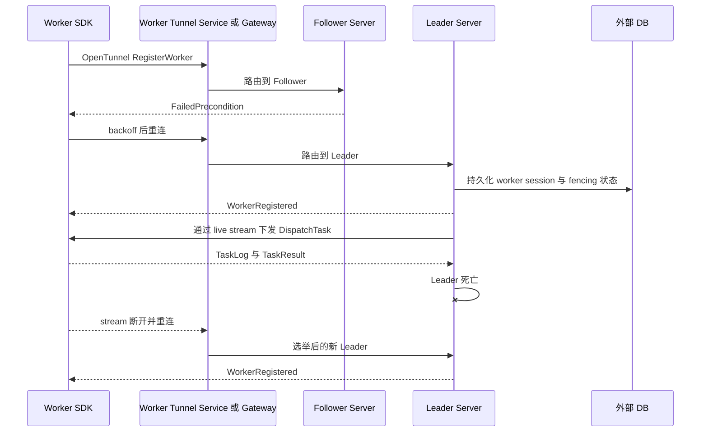

# Server 高可用与集群模式

Tikeo Server 当前实现的是 **Raft active-passive 调度所有权**。你可以运行多个 Server Pod 来获得控制面高可用，但任务调度所有权不会自动按 Pod 分片，除非未来明确启用并验证 Raft shard ownership。

这页是 Server HA 取舍的说明页。提高 `server.replicas` 或引入外部分布式锁之前，先看这里。

## 部署架构图



这个图里最重要的不是 Pod 数量，而是所有权：所有 Server Pod 都是活跃控制面成员，但任意时刻只有一个 Raft Leader 拥有调度。



## 集群模式选择



## 当前已经实现了什么

| 能力 | 当前行为 |
| --- | --- |
| 多 Pod Server 部署 | Helm `server.cluster.mode=raft` 会渲染 `StatefulSet`、稳定 Pod 名称和 headless peer Service。 |
| 共识与所有权 | Server Pod 组成 Raft 组。只有被选出的 Leader 且持久化 fencing token 后才会报告 `canSchedule=true`。 |
| 调度循环 | 只有调度 Leader 运行 schedule、dispatch、retry、notification delivery 等所有权敏感循环。Follower 跳过这些循环。 |
| Worker Tunnel 注册 | Raft 模式下 Follower 会用 `FailedPrecondition` 拒绝新的 Worker Tunnel 注册。Worker 通过 Service/LB 重连，直到路由到 Leader。 |
| Worker 执行 | Worker 仍然部署在 Server chart 之外，主动出站连接 Worker Tunnel；不需要 Worker 入站 Service。 |
| 外部分布式锁 | 核心调度所有权不使用 Redis/Dragonfly/SQL advisory lock。 |
| 多活调度 | 当前没有启用。代码中有纯 Raft/fencing shard 决策模型用于未来受控实现，但运行时 shard 调度会等到有实测瓶颈后再开启。 |

## 为什么先做 active-passive

Tikeo 有两个不同问题：

1. **控制面可用性**：一个 Server Pod 死掉后，API/集群能否恢复？
2. **调度并行度**：多个 Server Pod 能否同时安全地 claim 不同任务？

当前功能解决第一个问题，并且对第二个问题保持保守。这是为了避免调度系统最危险的故障：重复派发、split-brain ownership、旧 lease 继续生效、多个 Pod 同时认为自己拥有同一队列。

## 优点

| 优点 | 意义 |
| --- | --- |
| 所有权语义强 | Raft term + 持久化 fencing token 提供可观察的所有权证据，而不是隐式的 best-effort DB lock。 |
| 故障切换更安全 | 旧 Leader 死亡后停止拥有 dispatch；新 Leader 必须被选出并 fencing 后才恢复调度。 |
| 运维更简单 | 只需要一个 `StatefulSet`、headless Service、外部 DB 和 transport-token Secret；不需要为了调度所有权再运维 Redis/Dragonfly 集群。 |
| 降低重复派发风险 | 只有一个 Server 拥有 schedule/dispatch 循环，队列 claim 不依赖多个活跃调度器正确竞争。 |
| Worker Tunnel 模型清晰 | Leader 同时拥有 dispatch 和本地 live worker stream；Follower 不持有 Leader 无法访问的 Worker。 |
| 后续扩展路径保留 | 如果吞吐确实需要多活，可以在同一个 Raft/fencing 模型内增加 shard ownership。 |

## 限制与代价

| 限制 | 运维含义 | 缓解方式 |
| --- | --- | --- |
| 只有一个 active scheduler | 增加 Server Pod 提升 HA，但不会线性提升调度吞吐。 | 先度量队列压力；只有 Leader 成为瓶颈时才实现 Raft shard ownership。 |
| Follower 不做派发 | Follower 可服务 health/API/Raft transport，但不调度，也不接受 Worker Tunnel 注册。 | Worker Tunnel 走 Service/LB，SDK 使用重连/backoff。 |
| 故障切换不是瞬时 | 选举期间调度暂停，直到新 Leader 持久化 fencing token。 | 使用正常 retry policy，并监控 cluster status/queue age。 |
| 需要稳定身份 | Raft Pod 需要稳定名称和 peer DNS；普通 `Deployment` 不足以做生产多 Pod Server HA。 | 使用 Helm Raft overlay 或 `deploy/k8s/tikeo-raft-ha.yaml`。 |
| 需要外部 DB | 多 Pod HA 不能依赖单 Pod 本地 SQLite 文件。 | 使用 PostgreSQL、MySQL 或 CockroachDB 兼容外部存储。 |
| Worker Tunnel 依赖 LB 行为 | Worker 可能先打到 Follower 并收到 `FailedPrecondition`。 | SDK 应重连/backoff；Worker Tunnel 必须通过支持 gRPC/HTTP2 的 Service/Gateway 暴露。 |

## 部署模式

| 模式 | 如何运行 | 适用场景 | 不适用场景 |
| --- | --- | --- | --- |
| Standalone | `cluster.mode=standalone`，一个 Server 进程/Pod | 本地开发、演示、小型单节点 VM | 需要 Server Pod 故障切换 |
| Raft active-passive | `server.cluster.mode=raft`、`StatefulSet`、外部 DB、transport token | 生产 Kubernetes HA 和安全 Server failover | 期望每个 Pod 分摊一部分任务调度 |
| 未来 Raft shard ownership | 当前未在运行时启用 | 实测证明单 Leader 调度/派发吞吐不足 | 只是想“多 Pod 看起来更强”，但没有吞吐证据 |
| Redis/Dragonfly lock 调度 | 不是 Tikeo 核心调度模式 | 不适用 | 核心调度所有权；它会破坏 Raft/fencing 设计目标 |

## 前置条件

启用 Raft Server HA 前，先准备这些生产依赖，而不是只修改副本数：

- **外部数据库**：PostgreSQL、MySQL 或 CockroachDB 兼容存储，所有 Server Pod 都必须连接同一个 schema。多 Pod HA 不要使用 Pod 本地 SQLite。
- **稳定 Server 身份**：Server 必须以 `StatefulSet` 运行，并配套稳定 Pod 名称与 headless peer Service。普通 Kubernetes `Deployment` 不满足 Raft peer identity 要求。
- **Raft transport Secret**：创建高熵 `tikeo-raft-transport` Secret，并作为 `TIKEO__CLUSTER__TRANSPORT_TOKEN` 注入每个 Server Pod。
- **Worker Tunnel 网络**：Worker Tunnel 必须通过支持 gRPC/HTTP2 的 Service、Gateway 或 ingress 路径暴露。API 路径可以承载 REST 与 SSE，但 Worker Tunnel stream 不能被降级为 HTTP/1.1。
- **网络层行为**：nginx、LB、WAF、Kubernetes ingress/gateway controller 不能缓冲、改写或过早关闭长连接 SSE 与 gRPC stream。REST/SSE API 路径参考 [SSE 实时刷新部署说明](./sse-realtime)，具体 ingress 注解参考 Kubernetes controller runbook。
- **Worker 重连策略**：使用支持 `FailedPrecondition`、stream 断开、Leader failover 后重连的 SDK 版本。Raft 模式下 Follower 拒绝 Worker Tunnel 注册是预期行为。
- **运维 smoke test**：发布期间至少保留一个真实 Worker，用真实任务验证 failover，而不是只看 Pod readiness。

## 验收

同时做渲染清单检查和运行时检查。rollout 变绿只证明 Pod 启动，不证明调度所有权安全。

先渲染 Helm 输出：

```bash
helm template tikeo ./deploy/helm/tikeo \
  --namespace tikeo \
  -f deploy/helm/tikeo/examples/values-external-postgres.yaml \
  -f deploy/helm/tikeo/examples/values-raft-ha.yaml \
  | grep -E 'kind: StatefulSet|tikeo-server-headless|TIKEO__CLUSTER__MODE|TIKEO__CLUSTER__TRANSPORT_TOKEN'
```

安装或升级后：

```bash
kubectl -n tikeo rollout status statefulset/tikeo-server
kubectl -n tikeo get pods -l app.kubernetes.io/component=server -o wide
kubectl -n tikeo get svc tikeo-server-headless
```

然后从管理/API endpoint 验证集群所有权。应该只有一个 Server 报告 `canSchedule=true`；Follower 可以存在，但不能调度：

```bash
curl -fsS "$TIKEO_SERVER_URL/api/v1/cluster" \
  -H "x-tikeo-api-key: $TIKEO_MANAGEMENT_API_KEY" \
  | jq '.data.nodes[] | {nodeId, role, canSchedule, raftTerm}'
```

最后用真实 Worker 验证 Worker Tunnel。local/e2e 环境下，可以复用 failover smoke，并跳过已构建二进制的重新构建：

```bash
TIKEO_RAFT_WORKER_E2E_KEEP=0 \
TIKEO_RAFT_WORKER_E2E_REBUILD_SERVER=0 \
scripts/raft-worker-failover-e2e.sh
```

期望结果是：Worker 注册成功、failover 前任务成功、杀死 Leader、选出新 Leader、Worker 重连、failover 后任务成功。

## Kubernetes 安装摘要

不要只提高 `server.replicas`，应使用已提交的 Raft overlay：

```bash
kubectl -n tikeo create secret generic tikeo-raft-transport \
  --from-literal=transport-token="$(openssl rand -hex 32)"

helm upgrade --install tikeo ./deploy/helm/tikeo \
  --namespace tikeo \
  --create-namespace \
  -f deploy/helm/tikeo/examples/values-external-postgres.yaml \
  -f deploy/helm/tikeo/examples/values-raft-ha.yaml

kubectl -n tikeo rollout status statefulset/tikeo-server
```

预期渲染结果：

- `StatefulSet/tikeo-server`，不是 `Deployment/tikeo-server`。
- `Service/tikeo-server-headless`，用于稳定 peer DNS。
- `TIKEO__CLUSTER__MODE=raft`。
- `TIKEO__CLUSTER__NODE_ID` 来自 Pod 名称。
- `TIKEO__CLUSTER__TRANSPORT_TOKEN` 来自 Secret。
- 所有 Pod 共用外部 DB Secret。

## Worker Tunnel 故障切换行为

Raft 模式下：



1. Worker 主动向 Worker Tunnel endpoint 打开 gRPC/HTTP2 stream。
2. 如果 stream 打到 Follower，Follower 会在写入内存 registry 前用 `FailedPrecondition` 拒绝注册。
3. Worker SDK 通过 Service/LB 进行 backoff 重连。
4. 当 stream 打到当前 Leader，注册成功。
5. Leader 通过本地 live stream 派发任务。
6. 如果 Leader 死亡，stream 断开；Worker 继续重连，直到打到新 Leader。

该行为已经用多进程 failover E2E 验证：三个 Raft Server 进程、共享 PostgreSQL、TCP Service/LB proxy、Node Worker 注册、failover 前任务成功、杀死 Leader、新 Leader 选举、Worker 重连、failover 后任务成功。

## 何时才考虑后续 shard ownership

不要因为存在多个 Pod 就直接做分片调度。只有生产证据显示单个调度 Leader 是瓶颈时才考虑，例如：

- Worker 可用但 queue age 持续增长；
- Leader 的 dispatch loop CPU 或 DB claim latency 饱和；
- API/Web/Worker Tunnel 容量正常，但调度 claim 吞吐不足。

未来 shard 实现也必须保持 Raft/fencing：

- 确定性 shard key，例如 `hash(namespace/app/job_or_workflow_id) % shard_count`；
- Raft-applied assignment command 和单调 epoch；
- 每个 shard 独立 fencing token；
- failover/rebalance 后拒绝旧 token；
- 可观察的 rebalance 事件和回滚路径。

## 故障排查

| 现象 | 可能原因 | 检查方式 |
| --- | --- | --- |
| 超过一个 Pod 报告 `canSchedule=true` | fencing 失效或配置混用 | 暂停发布，检查 `TIKEO__CLUSTER__MODE`、node id、Raft term、DB fencing 记录，并确认所有 Pod 使用同一个外部 DB。 |
| 没有 Pod 报告 `canSchedule=true` | Raft 无法选举或无法持久化所有权 | 检查 headless DNS、peer address、transport token、外部 DB 连通性，以及 Pod 日志中的 election/persistence 错误。 |
| Worker 一直重连但无法注册 | Worker Tunnel 只路由到 Follower，或网络层破坏了 gRPC | 检查 Service/Gateway endpoint、HTTP/2 支持、ingress 注解、LB health check，以及 Follower 的 `FailedPrecondition` 日志。 |
| failover 后 Job 持续排队 | 新 Leader 没有 fencing 成功，或 Worker 没有重连 | 查询 `/api/v1/cluster`，检查 queue age，确认 Leader 上存在 worker session，并跑一次 management trigger smoke。 |
| 单 Pod 正常，三 Pod 失败 | 使用了本地 SQLite、普通 Deployment 或缺失 headless peer Service | 确认外部 DB、`StatefulSet/tikeo-server`、稳定 Pod 名称和 `tikeo-server-headless`。 |
| API SSE 仪表盘频繁断开 | Proxy buffering、WAF idle timeout 或 HTTP/1.1 downgrade | 应用 SSE 实时刷新网络配置，并把 API/SSE 问题与 Worker Tunnel gRPC 检查分开处理。 |

## 生产检查清单

- [ ] 单 Server 使用 `standalone`。
- [ ] 生产多 Pod Server HA 使用 `raft` + StatefulSet + 外部 DB。
- [ ] 不用 Redis/Dragonfly lock 做核心调度所有权。
- [ ] 确认只有一个节点报告 `canSchedule=true`。
- [ ] failover 后用真实 Worker 验证 Worker Tunnel 能重新连接。
- [ ] 考虑 shard ownership 前先监控 queue age。
