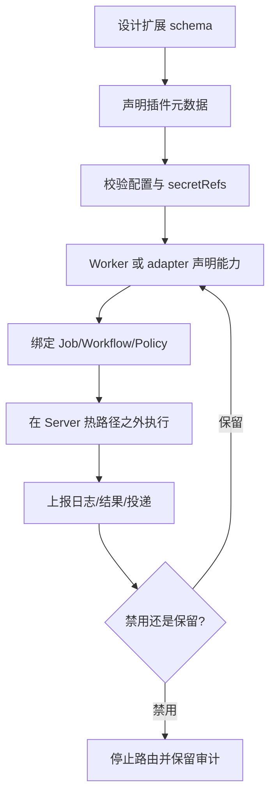

# 插件开发

Tikeo 插件开发是一种受治理的扩展模型。插件可以声明能力、提供方元数据、processor 名称、消息模板或 webhook adapter，让平台能够校验、展示和路由。它不意味着把未审查代码热加载进 Server。运行时代码仍应在 Worker 或明确配置的外部 adapter 中执行，所有输出都必须通过标准 instance、notification 和 audit 证据链回到平台。

## 前置条件

- 明确扩展点：processor、通知提供方 adapter、消息渲染器或集成 webhook。
- 配置、密钥、输入和输出的 schema。
- 对可执行代码的 Worker 或 adapter 部署方案。
- 覆盖校验、脱敏、执行证据和禁用行为的测试。

## When to use / 何时使用

当多个 Jobs、Workflows 或 Notification policies 需要复用同一能力时，可以构建插件。不要为了绕过核心校验而构建插件。如果扩展会改变调度、安全、RBAC、审计或存储语义，它很可能应该先进入核心代码。

## 能力生命周期

这个边界是有意设计的：插件能让能力对平台可见，但 Server 仍然负责校验输入、脱敏 secret 引用和保存证据。插件失败时，操作人应使用与内置 processor 相同的工具排查：Instance 控制台、投递记录、Worker 能力和 Audit。

## 扩展面

| 扩展面 | 常见插件数据 | 运行位置 | 证据 |
| --- | --- | --- | --- |
| Job processor | Processor 名称、输入 schema、输出 schema、重试提示 | Worker | Instance attempts、日志、结果 |
| Workflow node | 节点类型、输入输出映射、校验消息 | Worker 或 workflow adapter | Node replay bundle |
| Notification provider | provider id、消息类型、渠道配置 schema、secretRefs | Server renderer + sender/adapter，或 plugin webhook | 投递记录与 provider 响应 |
| Webhook adapter | 目标 schema、签名规则、重试映射 | 外部 adapter 或 Worker | 投递记录、审计、脱敏配置 |

## Schema 与密钥规则

- 尽量使用显式字段，不要把所有内容塞进自由 `options` blob。
- 密钥按引用保存，并只返回脱敏摘要。
- 保存前校验提供方消息族，例如 `blockKit`、`actionCard`、`feedCard`、`interactive`、`share_chat`、`markdown_v2`、`template_card`。
- 不支持的字段应显示为校验错误，而不是被静默忽略。

## Typical workflow / 典型流程

1. 编写 capability schema，并确定扩展哪个表面。
2. 先实现校验和脱敏，再做 happy-path sender 或 processor。
3. 增加 Worker 或 adapter 注册，让能力出现在控制台。
4. 把小 Job、Workflow node 或 Notification policy 绑定到插件。
5. 触发真实实例或测试投递，并查看证据。
6. 禁用插件，确认新路由停止，但历史记录仍可读取。

## 验收 Verify

- 非法配置返回字段级错误。
- API 摘要中不会返回 secret 原文。
- 只有 Worker/adapter 声明能力或 provider 启用时，相关抽屉才显示选项。
- 执行产生标准日志、结果、投递记录和审计。
- 禁用插件后阻止新路由，但历史证据仍可查看。

## 故障排查

| 现象 | 处理方式 |
| --- | --- |
| UI 看不到插件选项 | 检查 provider/Worker 能力注册和 RBAC 作用域。 |
| 测试发送成功但 Job 投递失败 | 对比模板变量、事件类型、策略绑定和 instance payload。 |
| 出现原始 secret | 暂停上线，先修复脱敏。 |
| Worker 能执行但调度器选不到 | 对齐 processor 名称、标签、region、cluster 与 broadcast selector。 |
| 禁用无效 | 确认 Jobs/Policies 引用的是该能力，并刷新路由缓存。 |

## 生产检查清单

- [ ] 扩展 schema、校验、脱敏和测试完整。
- [ ] 运行时代码不通过 Server 任意热加载执行。
- [ ] UI 解释了提供方字段和消息类型。
- [ ] 证据可通过 Instances、Notifications、Workers 或 Audit 查看。
- [ ] 生产前验收禁用和回滚行为。
