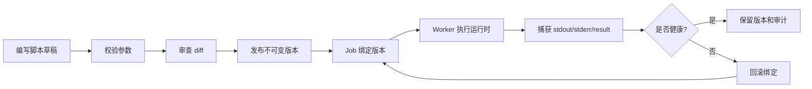

# 脚本支持

Tikeo 的脚本支持面向小型运维执行器：它们需要审查、版本化、回滚、stdout/stderr 捕获和 Job 绑定，但不一定值得每次都发布一个编译型 SDK Processor。脚本不是藏在 Server 里的 shell escape。Server 保存元数据、版本、RBAC、审计和绑定关系；Worker 通过允许的运行时执行已发布版本，并按普通实例证据回传结果。

## 前置条件

- Worker runtime 明确声明支持脚本，并声明支持的语言/运行时。
- 当前角色拥有目标 namespace/app 下创建、审查、发布和绑定脚本的权限。
- 脚本具备清晰输入输出契约。
- Job 可以绑定到不可变发布版本。

## When to use / 何时使用

当逻辑较短、偏运维、需要快速审查时使用脚本，例如清理、健康探测、数据导出交接或简单集成调用。逻辑庞大、性能敏感、依赖复杂或需要按应用代码测试发布时，应优先使用 SDK Processor。

## 闭环发布流程

关键规则是不可变。编辑草稿是安全的，因为生产 Job 不应绑定草稿。发布会创建一个可引用、可审计、可对比、可回滚的版本。生产 Job 应始终绑定发布版本 id，而不是“最新草稿”。

## 运行时边界

| 关注点 | Server 职责 | Worker 职责 |
| --- | --- | --- |
| 草稿与版本元数据 | 存储、校验、授权、审计 | 只通过派发读取指定版本 |
| 运行时执行 | 不在 Server 内执行任意脚本文本 | 解析允许的 runtime 并执行限制 |
| 证据 | 保存日志、结果、attempt、审计、投递 | 捕获 stdout、stderr、退出码、异常堆栈 |
| 回滚 | 把 Job 重新绑定到旧版本并记录审计 | 下次运行执行新绑定版本 |
| 不支持的后端 | 返回清晰校验错误 | 配置错误时报告 unsupported tool path |

## Typical workflow / 典型流程

1. 打开 **Scripts**，在正确 namespace/app 下创建草稿。
2. 先写参数和期望输出，再写运行时代码。
3. 保存草稿，并查看与上一发布版本的 diff。
4. 审查通过后发布不可变版本。
5. 把 Job 绑定到该 version id，并触发一次小规模运行。
6. 打开 Instance 控制台，验收 stdout、stderr、退出码、异常堆栈和结果 payload。
7. 失败时通过绑定旧版本回滚，不要修改已发布版本。

## 验收 Verify

- Scripts 页面能看到草稿、发布版本和 diff。
- Job 引用具体 version id。
- 脚本失败时产生实例日志和可见异常/退出码记录。
- Audit 展示谁发布版本、谁修改了 Job 绑定。

## 故障排查

| 现象 | 处理方式 |
| --- | --- |
| 无法发布脚本 | 检查校验错误、RBAC、namespace/app 与必填参数。 |
| Job 看不到脚本 | 确认 Job 与脚本作用域兼容，Worker 声明了脚本支持。 |
| 找不到 runtime | 在 Worker 节点安装或配置 runtime；不要把执行挪到 Server。 |
| 输出缺失 | 确认 runner 捕获 stdout/stderr，并在进程退出前上报 checkpoint。 |
| 回滚后行为未变 | 确认 Job 绑定到了旧 immutable version id，并触发了新实例。 |

## 生产检查清单

- [ ] 脚本发布前通过 diff 审查。
- [ ] 生产 Job 绑定不可变 version id。
- [ ] runtime 限制、超时、secret 注入规则已记录。
- [ ] 失败场景能捕获 stdout、stderr、退出码、业务错误与堆栈。
- [ ] 回滚流程用真实 Job 实例验收过。
