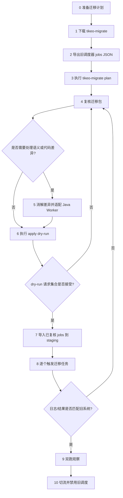

# 从 XXL-JOB 或 PowerJob 迁移的完整流程

Tikeo 提供独立的 `tikeo-migrate` CLI，帮助团队从 XXL-JOB 或 PowerJob 迁移到 Tikeo。请把它当成 **review-first 的迁移助手**：它读取旧调度器 JSON 导出，可选扫描 Java/Spring Worker 项目，并写出一份迁移包，供操作人员在任何 API 写入前复核。

`plan` 刻意设计为非破坏性命令。它 **不会** 修改旧源码、不会连接旧数据库、不会创建 Tikeo Job。真正写入动作只在 `apply` 中发生，并且每次对 staging 或生产执行前都应该先跑 `apply --dry-run`。

:::tip 从这里开始迁移
如果你正在替换 XXL-JOB 或 PowerJob，请按下面阶段顺序执行。不要一上来就导入 Job。先保留旧系统导出、生成迁移包、复核语义差异、适配 Worker，再 dry-run 并在 staging 验证。
:::

## 迁移心智模型

调度器迁移有两条线，必须在切流前汇合：

| 线索 | 迁移内容 | 为什么重要 |
| --- | --- | --- |
| 数据线 | Job 定义、调度表达式、重试策略草案、启停状态、namespace/app 目标。 | 这些会变成 Tikeo Job 草案，只有复核后才能由 `apply` 导入。 |
| 代码线 | Java 依赖、旧 handler 注解/接口、processor name、方法签名、Worker 配置。 | 只有运行中的 Worker 暴露匹配的 processor name 和能力，Tikeo 才能真正派发成功。 |

只有当两条线一起通过验证，迁移才算完成：迁移后的 Tikeo Job 必须能派发到匹配 Worker，并产生与旧任务证据一致的行为。

## 端到端流程



## 阶段 0：运行工具前先准备

在处理导出文件前，先明确迁移目标和验收标准。

| 决策项 | 推荐值 / 来源 | 原因 |
| --- | --- | --- |
| 目标环境 | 先 staging Tikeo Server，再生产。 | 直接导入生产会让回滚和证据复核变复杂。 |
| Namespace | 通常是团队、租户或业务域。 | 生成的草案需要稳定的归属和 RBAC 边界。 |
| App | 优先使用旧 executor app name；没有时使用计划好的 Tikeo app name。 | Worker 和 Job 草案需要共享路由边界。 |
| Processor 命名 | 优先保留稳定且有意义的旧 handler name。 | 降低导入 Job 和 Worker 代码不匹配的概率。 |
| API key | 使用 staging 作用域、具备 Job 创建权限的 key。 | `apply` 不应该使用无限制个人 token。 |
| 回滚负责人 | 明确到人或团队。 | 切流必须有人负责禁用 Tikeo Job 或重新启用旧调度。 |

只有当 staging Tikeo Server 可用、目标 Worker 项目明确、团队对“行为与旧系统一致”的标准达成一致后，才继续。标准应包括输出记录、日志、副作用、耗时、重试行为和告警期望。

## 阶段 1：下载迁移 CLI

每个 Release 都会在 GitHub Release 页面发布可直接运行的 `tikeo-migrate` 压缩包：

| 平台 | 产物名称 |
| --- | --- |
| Linux x86_64 | `tikeo-migrate-${TIKEO_VERSION}-x86_64-unknown-linux-gnu.tar.gz` |
| macOS Intel | `tikeo-migrate-${TIKEO_VERSION}-x86_64-apple-darwin.tar.gz` |
| macOS Apple Silicon | `tikeo-migrate-${TIKEO_VERSION}-aarch64-apple-darwin.tar.gz` |
| Windows x86_64 | `tikeo-migrate-${TIKEO_VERSION}-x86_64-pc-windows-msvc.zip` |

解压后，把二进制放进 `PATH`，或直接复制到旧 Java Worker 项目根目录。

```bash
tikeo-migrate --help
tikeo-migrate plan --help
tikeo-migrate apply --help
```

需要保留的证据：

- 二进制能在操作机器上运行。
- 迁移记录中写明 asset 名称和版本。
- 操作人员知道 `.tikeo-migration` 将写到哪里。

## 阶段 2：导出旧调度器任务

从旧调度器导出 jobs JSON。原始导出文件不要改，它是迁移包生成的审计事实源。

推荐文件名：

| 来源 | 推荐文件名 |
| --- | --- |
| XXL-JOB | `xxl-job-export.json` |
| PowerJob | `powerjob-export.json` |

可以的话，把文件放在旧 Worker 项目根目录：

```text
legacy-worker/
  build.gradle.kts          # 或 pom.xml / build.gradle
  src/main/java/...
  xxl-job-export.json       # 或 powerjob-export.json
```

支持的 JSON 形态：

- job object 数组；
- `{ "jobs": [...] }`；
- `{ "data": [...] }`；
- `{ "data": { "jobs": [...] } }`；
- `{ "content": [...] }`；
- 单个 job object。

只有当导出文件可读、未被修改、路径明确后，才继续。如果文件名不标准，或目录下有多个可能的 JSON 文件，后续应显式传 `--input`，必要时传 `--from`。

## 阶段 3：生成迁移包

### 约定优先命令

在旧 Java Worker 项目根目录执行：

```bash
cd ./legacy-worker

tikeo-migrate plan
```

自动探测规则：

| 输入 | 约定 |
| --- | --- |
| 项目根目录 | 当前目录包含 `pom.xml`、`build.gradle` 或 `build.gradle.kts` 时自动识别。 |
| 导出文件 | 单个明确 JSON 文件，名称类似 `xxl-job-export.json`、`xxljob-export.json`、`powerjob-export.json`、`power-job-export.json`、`jobs-export.json`，或 `export/`、`exports/`、`migration/` 下匹配的 JSON 文件。 |
| 来源调度器 | 优先看文件名，其次看 JSON 内容，例如 XXL-JOB 的 `executorHandler`/`jobDesc`/`scheduleConf`，或 PowerJob 的 `processorInfo`/`timeExpressionType`/`instanceRetryNum`。 |
| 迁移包输出 | `./.tikeo-migration`。 |

### 非标准目录显式命令

```bash
tikeo-migrate plan \
  --from xxl-job \
  --input ./exports/jobs.json \
  --project ./legacy-worker \
  --output-dir ./migration-bundle \
  --namespace ops \
  --app billing
```

以下情况使用显式参数：

- 导出文件名不可探测；
- 存在多个可能的 JSON 文件；
- 项目根目录不是当前目录；
- 默认 namespace/app 会误导；
- 希望输出到 `.tikeo-migration` 之外的目录。

只有当输出目录中包含下一节列出的文件后，才继续。

## 阶段 4：理解迁移包

迁移包是核心复核材料，不要跳过。

| 文件 | 作用 | 需要检查什么 |
| --- | --- | --- |
| `manifest.json` | 完整机器可读 bundle，包含 source、report、data import plan、Java project plan、checklist。 | 作为审计和交接材料保留。 |
| `jobs.tikeo.json` | 结构化迁移报告。 | `summary.total`、`summary.ready`、`summary.needsReview`、`summary.skipped`。 |
| `jobs.tikeo.md` | 人类可读 Job 复核报告。 | 每个 Job 的状态、schedule、processor name、warnings、unsupported features。 |
| `data-import-plan.json` | ready 与 needs-review Job 草案拆分。 | 只有已复核 Job 才应 live import。 |
| `java-project-plan.md` / `.json` | build system、Spring Boot major、推荐 Tikeo artifact、检测到的 handlers、review notes。 | 依赖建议和 processor name。 |
| `java-patches/*.patch` | 依赖和 handler 注解的 review-first patch 建议。 | 在分支上人工应用；不要当作盲目自动改代码。 |
| `CHECKLIST.md` | 操作验收清单。 | 作为最低迁移门禁。 |

状态含义：

| 状态 | 含义 | 下一步 |
| --- | --- | --- |
| `ready` | Job 草案没有已知阻塞问题。 | 仍需复核，然后 dry-run 导入。 |
| `needs_review` | 已生成草案，但发现不等价或有风险的旧语义。 | live import 前必须人工翻译语义。 |
| `skipped` | 缺少必要字段，或无法安全生成草案。 | 修正导出/手工映射后重新 `plan`，或在 Tikeo 中手动重建。 |

只有当每个 `needs_review` 和 `skipped` 项都有明确处理决策后，才继续。

## 阶段 5：消解调度语义差异

旧调度器的一些语义不能总是一对一映射到 Tikeo Job。迁移工具会把这些问题暴露出来，而不是隐藏掉。

### XXL-JOB 映射与复核点

| 源字段 | Tikeo 草案字段 |
| --- | --- |
| `jobDesc` | `name` |
| `executorAppName` | `app` |
| `executorHandler` | `processorName` |
| `scheduleType=CRON` + `scheduleConf` | `scheduleType=cron`, `scheduleExpr=scheduleConf` |
| `scheduleType=FIX_RATE` | `scheduleType=fixed_rate` |
| `scheduleType=NONE` | `scheduleType=api` |
| `executorFailRetryCount` | `retryPolicy.maxAttempts = retry + 1` |
| `triggerStatus=0` | `enabled=false` |

这些源能力需要重点复核：

| 旧能力 | 为什么要复核 | Tikeo 中常见处理方式 |
| --- | --- | --- |
| `executorRouteStrategy` | 路由策略可能隐含分片、固定 Worker 或故障转移行为。 | 使用 Worker labels/capabilities、app 边界，或显式 workflow fan-out。 |
| `executorBlockStrategy` | 阻塞策略可能隐含并发或排队语义。 | 配置 Tikeo concurrency/trigger policy，或改造成 workflow steps。 |
| `glueType` | Glue/script 执行不一定等价于 typed Worker processor。 | 迁移到受治理的 Tikeo script runtime，或迁移成 typed Worker processor。 |

### PowerJob 映射与复核点

| 源字段 | Tikeo 草案字段 |
| --- | --- |
| `jobName` | `name` |
| `appName` | `app` |
| `processorInfo` | `processorName` |
| `timeExpressionType=2` 或 `CRON` | `scheduleType=cron` |
| `timeExpressionType=3` 或 fixed-rate 名称 | `scheduleType=fixed_rate` |
| `timeExpressionType=4` 或 fixed-delay 名称 | `scheduleType=fixed_delay` |
| `timeExpressionType=1` 或 `API` | `scheduleType=api` |
| `instanceRetryNum` | `retryPolicy.maxAttempts = retry + 1` |
| `status=0` | `enabled=false` |

这些源能力需要重点复核：

| 旧能力 | 为什么要复核 | Tikeo 中常见处理方式 |
| --- | --- | --- |
| `executeType` | Broadcast/map-reduce 不是一次普通单 Job 派发。 | 建模为 workflow fan-out、多 Worker target，或显式业务拆分。 |
| `designatedWorkers` | Worker pinning 可能依赖旧 Worker 身份。 | 替换为 labels/capabilities，或使用专用 app/worker group。 |
| `maxInstanceNum` | 实例并发改变可能影响副作用。 | 配置并发规则，或保持 Job disabled 直到验证完成。 |

## 阶段 6：适配 Java Worker 代码

数据导入成功不代表执行成功。如果 Worker 没有暴露预期 processor name，调度仍会失败。因此生产导入前必须先处理代码线。

推荐流程：

1. 在旧 Worker 项目创建分支。
2. 根据 `java-project-plan.md` 添加推荐的 Tikeo Java 依赖。
3. 复核 `java-patches/*.patch`，手工添加 Tikeo processor 注解或 adapter。
4. 尽量保留 `jobs.tikeo.md` 中生成的 processor name；如果改名，也必须同步修改 Job 草案。
5. 跑旧项目测试。
6. 让 Worker 连接 staging Tikeo Server。
7. 确认 Worker registration 中出现预期 processors/capabilities。

常见代码问题：

| 问题 | 现象 | 修复方式 |
| --- | --- | --- |
| Processor name 不匹配 | Job 导入成功，但派发时找不到 Worker processor。 | 对齐 Job 草案中的 `processorName` 和 Worker 注解/注册名。 |
| 旧方法签名复杂 | patch 建议不足以通过编译。 | 写一个小 adapter 方法，接收 Tikeo 支持的 context/payload，再调用原业务代码。 |
| 依赖旧框架运行时上下文 | Handler 读取 XXL-JOB/PowerJob runtime context。 | 改为 Tikeo task context 或显式 job 参数。 |
| Broadcast/map-reduce processor | 单个 processor 无法表达完整行为。 | 导入前建模为 workflow fan-out 或多个显式 Job。 |

只有当 staging Worker 能启动，并暴露迁移包引用的 processor name 后，才继续。

## 阶段 7：dry-run 与数据导入

每次都先 dry-run：

```bash
tikeo-migrate apply \
  --endpoint http://127.0.0.1:9090 \
  --api-key "$TIKEO_MIGRATION_API_KEY" \
  --dry-run
```

非默认 bundle 路径：

```bash
tikeo-migrate apply \
  --bundle ./migration-bundle \
  --endpoint http://127.0.0.1:9090 \
  --api-key "$TIKEO_MIGRATION_API_KEY" \
  --dry-run
```

live import 前先复核 `apply-evidence.json`。它应该展示即将发送的完整请求集合。

受控 live import：

```bash
# 默认只导入 ready jobs。
tikeo-migrate apply \
  --endpoint https://tikeo-staging.example.com \
  --api-key "$TIKEO_MIGRATION_API_KEY"

# 只有每个 needs_review Job 都有明确决策后才使用。
tikeo-migrate apply \
  --endpoint https://tikeo-staging.example.com \
  --api-key "$TIKEO_MIGRATION_API_KEY" \
  --include-needs-review
```

只有当 staging 中导入的 Job 与已复核 bundle 一致，并且启停状态都是有意为之，才继续。

## 阶段 8：staging 验证

逐个验证迁移任务。不要因为导入成功就直接切流。

最小验证循环：

1. 确认匹配 Worker 在线。
2. 手动触发一个迁移 Job，或等待安全的调度窗口。
3. 对比 Tikeo instance status、logs、retry behavior、输出记录、副作用和旧任务证据。
4. 把差异记录到迁移 notes 或 PR。
5. 如果行为不同，修复 mapping/code/config，并回到 `plan` 或代码复核阶段。

建议保留的证据：

| 证据 | 来源 |
| --- | --- |
| Tikeo job id 和 name | Tikeo job list / imported draft。 |
| Worker id 和 processor name | Worker registration / diagnostics。 |
| 触发请求或调度时间 | Tikeo instance record。 |
| 日志与最终状态 | Tikeo task logs 和 instance result。 |
| 旧系统对比 | 旧日志、数据库行、外部副作用检查。 |
| 决策 | accepted、needs code fix、needs mapping fix 或 manual recreation。 |

只有当团队接受每个待切流 Job 的行为一致性后，才继续。

## 阶段 9：双跑、切流与回滚

推荐切流顺序：

1. staging 验证完成前，保持旧调度启用。
2. 生产导入时，尽量先以 disabled 状态导入。
3. 在 Tikeo 中启用少量低风险 Job。
4. 在副作用允许的情况下做 dual-run 或 shadow validation。
5. 只有 Tikeo 行为被接受后，才禁用对应旧调度。
6. 保留迁移包和 `apply-evidence.json` 作为发布证据。

回滚方案：

| 失败场景 | 立即回滚动作 |
| --- | --- |
| 导入的 Job 错误 | 禁用或删除 Tikeo Job；保持旧调度启用。 |
| Worker 代码失败 | 回滚 Worker 部署；保持 Job disabled 或路由到上一版 Worker。 |
| 调度意外触发 | 禁用 Tikeo Job；对照 bundle 检查 enabled flag 和 schedule expression。 |
| 副作用不一致 | 停止 Tikeo Job，如旧调度已禁用则重新启用，并回到阶段 5/6。 |

## 边界与非目标

迁移工具刻意保守：

- `plan` 不连接 XXL-JOB 或 PowerJob 数据库。
- `plan` 不修改旧源码。
- `plan` 不创建 Tikeo Job。
- `apply` 是唯一会调用 Tikeo Management API 的命令。
- Java patches 只覆盖依赖插入和 handler 注解建议；任意 executor/业务代码仍需复核。
- 不声称 broadcast、map-reduce、blocking、routing、pinning、glue/script 语义完全等价。
- 报告中保留 source snapshots，便于人工审计每个决策。

请把迁移包当成受控迁移计划和证据包，而不是盲目一键迁移。
