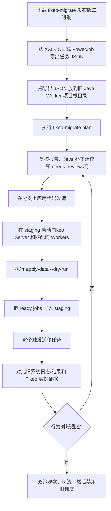

# 从 XXL-JOB 或 PowerJob 迁移的完整流程

Tikeo 提供独立的 `tikeo-migrate` CLI，帮助团队从 XXL-JOB 或 PowerJob 迁移到 Tikeo。默认的 `plan` 命令是非破坏性的：读取 JSON 导出文件，把源任务映射成 Tikeo `create job` 草案，可选扫描 Java/Spring Worker 项目，并生成包含报告、Java 依赖建议、处理器注解补丁、unsupported features 和人工复核项的迁移包。

普通用户推荐直接从 GitHub Release assets 下载。每个版本都会发布 Linux、macOS Intel、macOS Apple Silicon 和 Windows 可直接运行的 `tikeo-migrate` 压缩包，因此迁移操作机器不需要安装 Rust。

:::tip 从这里开始迁移
如果你正在替换 XXL-JOB 或 PowerJob，先看本章：下载 `tikeo-migrate`，导出 jobs JSON，在旧 Java Worker 项目根目录执行 `tikeo-migrate plan`，复核生成的迁移包，然后只把已复核的任务导入 staging。
:::

## 本迁移章节覆盖什么

迁移前先用它回答三个问题：

1. 哪些源任务可以直接创建成 Tikeo Job？
2. 哪些任务因为 legacy routing、blocking、broadcast、map-reduce 或 worker pinning 语义不完全等价，需要人工复核？
3. Tikeo 中将使用哪些 processor name、schedule、retry policy draft 和 namespace/app？

## 迁移流程总览

### 端到端流程



### 详细操作清单

| 步骤 | 动作 | 需要保留的证据 | 说明 |
| --- | --- | --- | --- |
| 1 | 从 GitHub Release 下载匹配的压缩包，例如 `tikeo-migrate-${TIKEO_VERSION}-x86_64-unknown-linux-gnu.tar.gz` 或 `tikeo-migrate-${TIKEO_VERSION}-x86_64-pc-windows-msvc.zip`。 | Release asset 名称，以及你们内部要求的 checksum/provenance 证据。 | Linux 适合 CI/堡垒机，macOS 适合本地操作机，Windows zip 适合 Windows 迁移工作站。 |
| 2 | 解压并把 `tikeo-migrate` 放进 `PATH`，或直接复制到旧 Java Worker 项目根目录。 | `tikeo-migrate --help` 输出。 | 这个 CLI 不会启动 server 进程。 |
| 3 | 从 XXL-JOB 或 PowerJob 导出 jobs JSON。 | 原始导出文件，可放到私有迁移分支或受控证据存储。 | 不要改原始导出文件，把它保留为审计事实源。 |
| 4 | 把导出 JSON 放到旧项目根目录，使用可探测名称，例如 `xxl-job-export.json` 或 `powerjob-export.json`。 | 文件路径和 hash。 | 如果文件名不标准，使用 `--input`，必要时再加 `--from`。 |
| 5 | 执行 `tikeo-migrate plan`。 | `.tikeo-migration/manifest.json`、`jobs.tikeo.md`、`data-import-plan.json`、`java-project-plan.md`、`CHECKLIST.md`。 | 该步骤非破坏性：不改源码、不连接旧 DB、不写 Tikeo API。 |
| 6 | 复核 `needs_review` jobs 和生成的 Java 补丁建议。 | Review notes 或 PR comments。 | legacy broadcast、map-reduce、routing、blocking、worker pinning 或自定义 glue 语义必须显式设计。 |
| 7 | 在分支上应用 Java 依赖/handler 改造并运行旧项目测试。 | PR diff 和测试输出。 | 生成 patch 是建议，不是盲目自动改代码。 |
| 8 | 在 staging 启动 Tikeo Server 和匹配的 Workers。 | Worker registration 与 processor/capability 证据。 | Processor name 必须匹配生成的 job 草案。 |
| 9 | 执行 `tikeo-migrate apply-data --endpoint <staging> --api-key <key> --dry-run`。 | `apply-evidence.json`。 | dry-run 先证明即将提交的请求集合。 |
| 10 | 仅对已复核 ready jobs 去掉 `--dry-run` 写入，再逐个触发迁移任务。 | Tikeo instance logs/results 和旧系统对比记录。 | 行为确认前不要关闭旧调度。 |
| 11 | 双跑观察，确认后切流并禁用旧调度。 | 切流记录和回滚说明。 | 保留迁移包作为审计材料。 |


## 命令

### 推荐的约定优先流程

把旧调度器导出的 JSON 放在旧 Worker 项目根目录，并在该目录执行工具。这个布局下，迁移规划不需要手动指定发现类参数：

```bash
cd ./legacy-worker

# 在 ./.tikeo-migration 中生成完整、非破坏性的迁移包
tikeo-migrate plan

# 复核迁移包后，先 dry-run API 写入。
# apply-data 的 --bundle 也默认读取 ./.tikeo-migration。
tikeo-migrate apply-data \
  --endpoint http://127.0.0.1:9090 \
  --api-key "$TIKEO_MIGRATION_API_KEY" \
  --dry-run
```

自动探测规则：

| 输入 | 约定 |
| --- | --- |
| 项目根目录 | 当前目录包含 `pom.xml`、`build.gradle` 或 `build.gradle.kts` 时，自动作为 Java 项目根目录。 |
| 导出文件 | 明确命名的单个 JSON 文件，例如 `xxl-job-export.json`、`xxljob-export.json`、`powerjob-export.json`、`power-job-export.json`、`jobs-export.json`，或 `export/`、`exports/`、`migration/` 下匹配的 JSON 文件。 |
| 来源调度器 | 优先根据文件名判断，其次根据 JSON 内容判断，例如 XXL-JOB 的 `executorHandler`/`jobDesc`/`scheduleConf`，或 PowerJob 的 `processorInfo`/`timeExpressionType`/`instanceRetryNum`。 |
| 迁移包输出 | `./.tikeo-migration`。 |

如果发现多个可能的导出文件，或者无法安全推断来源，命令会明确报错并要求传覆盖参数，而不是随便猜。

### 非标准目录的覆盖参数

```bash
tikeo-migrate plan \
  --from xxl-job \
  --input ./exports/jobs.json \
  --project ./legacy-worker \
  --output-dir ./migration-bundle \
  --namespace ops \
  --app billing

tikeo-migrate apply-data \
  --bundle ./migration-bundle \
  --endpoint http://127.0.0.1:9090 \
  --api-key "$TIKEO_MIGRATION_API_KEY" \
  --dry-run
```

`--from` 支持：

| 值 | 来源 |
| --- | --- |
| `xxl-job` | XXL-JOB job export records。 |
| `powerjob` | PowerJob job export records；也兼容 `power-job` alias。 |

支持的 JSON 形态：

- job object 数组；
- `{ "jobs": [...] }`；
- `{ "data": [...] }`；
- `{ "data": { "jobs": [...] } }`；
- `{ "content": [...] }`；
- 单个 job object。

## 输出内容

迁移包包含：

| 字段 | 含义 |
| --- | --- |
| `manifest.json` | 包含数据、代码和 checklist 的完整迁移包 manifest。 |
| `jobs.tikeo.json` / `jobs.tikeo.md` | Job 迁移报告，包含 total、ready、needs-review、skipped。 |
| `data-import-plan.json` | 分离 ready 与 needs-review 的 Tikeo Job 草案，便于受控写入。 |
| `java-project-plan.json` / `.md` | 检测到的 build system、Spring Boot major、推荐 Tikeo artifact、handler candidates 和 review notes。 |
| `java-patches/*.patch` | review-first 的依赖和 handler 注解补丁建议。 |
| `CHECKLIST.md` | 分支复核、staging 导入、单任务触发和双跑对账的人工验收流程。 |

## 映射规则

### XXL-JOB

| 源字段 | Tikeo 草案字段 |
| --- | --- |
| `jobDesc` | `name` |
| `executorAppName` | `app` |
| `executorHandler` | `processorName` |
| `scheduleType=CRON` + `scheduleConf` | `scheduleType=cron`, `scheduleExpr=scheduleConf` |
| `scheduleType=FIX_RATE` | `scheduleType=fixed_rate` |
| `scheduleType=NONE` | `scheduleType=api` |
| `executorFailRetryCount` | `retryPolicy.maxAttempts = retry + 1` |
| `triggerStatus=0` | `enabled=false` |

这些字段会被标记为需要复核，而不是假装完全等价：`glueType`、`executorRouteStrategy`、`executorBlockStrategy`。

### PowerJob

| 源字段 | Tikeo 草案字段 |
| --- | --- |
| `jobName` | `name` |
| `appName` | `app` |
| `processorInfo` | `processorName` |
| `timeExpressionType=2` 或 `CRON` | `scheduleType=cron` |
| `timeExpressionType=3` 或 fixed-rate 名称 | `scheduleType=fixed_rate` |
| `timeExpressionType=4` 或 fixed-delay 名称 | `scheduleType=fixed_delay` |
| `timeExpressionType=1` 或 `API` | `scheduleType=api` |
| `instanceRetryNum` | `retryPolicy.maxAttempts = retry + 1` |
| `status=0` | `enabled=false` |

这些字段会被标记为需要复核：`executeType`、`designatedWorkers`、`maxInstanceNum`。

## 复核流程

1. 把 legacy scheduler jobs 导出为 JSON；可以的话直接放到旧 Worker 项目根目录。
2. 在该项目根目录执行 `tikeo-migrate plan`。只有非标准目录结构才使用 `--input`、`--from`、`--project` 或 `--output-dir` 覆盖。
3. 复核每一个 `needs_review` 项，把旧的 routing/blocking/pinning 语义转换成 Tikeo Worker labels、capabilities、workflow fan-out 或 concurrency policy。
4. 在分支上应用生成的 Java patches，补充推荐 starter 依赖，并人工适配复杂 handler 签名。
5. 先运行 `tikeo-migrate apply-data --dry-run`，再在 staging 去掉 `--dry-run` 写入 ready jobs。
6. 启动带匹配 `processorName` 的 Workers。
7. 一次触发一个任务，对比 Tikeo instance logs/results 和旧系统行为，再切流。

## 边界

这个 MVP 是保守的：

- `plan` 不连接 XXL-JOB 或 PowerJob 数据库。
- `plan` 不自动创建 Tikeo Jobs，也不直接修改旧项目源码。
- `apply-data` 是唯一会调用 Tikeo Management API 的命令，并支持 `--dry-run`。
- Java patches 只覆盖依赖插入和 handler 注解建议；任意 executor/业务代码仍需人工复核。
- 不声称 broadcast/map-reduce/blocking/routing 语义完全等价。
- 报告中保留 source snapshots，便于人工审计每个决策。

请把迁移包当作受控迁移计划和证据包，而不是盲目一键迁移。
