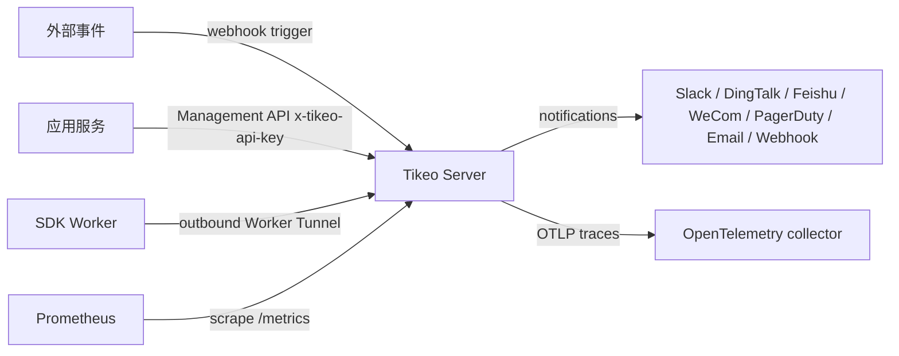

# 集成概览

本文用于判断该操作哪个集成面。SDK 实现先读 [SDK 与 API 集成指南](./sdk-and-api)，再进入语言页查看依赖和写法差异。

## 前置条件

| 需要 | 原因 |
| --- | --- |
| Management HTTP endpoint | SDK Management client 和 operator 调用 `/api/v1`、`/api-docs/openapi.json`。 |
| Worker Tunnel endpoint | Worker SDK 主动连接 tunnel listener。 |
| Namespace/app 模型 | SDK keys、Workers、jobs、selectors 共享此 scope。 |
| Service-account 流程 | SDK 需要 `x-tikeo-api-key`；人类 bearer token 不是服务凭证。 |
| Worker pool 命名 | Selectors 和 runbooks 需要稳定 `worker_pool` labels。 |

## Integration map

| Surface | 方向 | Owner | Contract tokens | 主文档 |
| --- | --- | --- | --- | --- |
| SDK Worker | Worker → Worker Tunnel | 应用团队 | `WorkerTunnelService`, `OpenTunnel`, `DispatchTask`, `TaskLog`, `TaskResult` | [SDK 与 API 集成指南](./sdk-and-api) |
| SDK Management client | 应用服务 → Server HTTP API | 应用团队 | `x-tikeo-api-key`, `/api/v1/jobs`, `/api/v1/jobs/{job}:trigger` | [Management OpenAPI reference](../reference/management-openapi) |
| Raw Management API | Operator/client → Server HTTP API | 平台/API 团队 | `/api-docs/openapi.json`, `ApiResponse` | [Management OpenAPI reference](../reference/management-openapi) |
| Inbound webhooks | 外部系统 → Server | Event-source owner | `POST /api/v1/events/webhooks/{job}:trigger` | 下方 event trigger 章节 |
| Notification Center | Server → external providers | 平台/通知 owner | `/api/v1/notification-channels`, `/api/v1/notification-policies` | [Notification Center reference](../reference/notification-center) |
| Alerts | Server → incident workflow | 平台/on-call owner | `/api/v1/alert-rules`, `/api/v1/alert-events` | Alert user guide |
| Prometheus | Scraper → Server | Observability owner | `/metrics` | 部署文档 |
| OpenTelemetry | Server → collector | Observability owner | `observability.tracing.*` | 配置参考 |
| OIDC | Browser/API ↔ IdP/Server | Identity owner | `auth.oidc.*`, `/api/v1/auth/oidc/*` | 配置参考 |
| Terraform/GitOps | IaC runner → Server | 平台 owner | `/api/v1/gitops/manifest`, `/api/v1/gitops/diff` | 部署文档 |
| Kubernetes/Helm | Cluster controller → workloads | 平台 owner | `deploy/helm/tikeo/`, `TikeoManifest` | Kubernetes 文档 |

## Traffic direction model



不要混用方向。Inbound webhooks 启动工作。Worker Tunnel 把工作派发给 Workers。Notification channels 把完成状态或 alerts 从 Tikeo 发出去。

## SDK/API integration path

| 步骤 | Owner | 输出 |
| --- | --- | --- |
| Pick SDK | 应用团队 | 选择 Rust、Go、Java/Spring Boot、Python 或 Node.js 页面。 |
| Configure Worker | 应用团队 | Outbound Worker 使用 namespace/app、labels、processor names 连接。 |
| Configure Management client | 应用团队 | 应用服务向 Management API 发送 `x-tikeo-api-key`。 |
| Create API job | 应用团队 | Job 使用 API schedule 和 processor binding。 |
| Trigger job | 应用团队 | Request 使用 `triggerType=api`；默认 helper 使用 `executionMode=single`。 |
| Inspect evidence | 应用/平台 | Instance 和 logs 证明 Worker execution。 |

## Inbound event triggers

Inbound event trigger 不是 SDK Management trigger。当外部事件需要启动已知 Tikeo job 时使用它：

```text
POST /api/v1/events/webhooks/{job}:trigger
```

Body 可包含 `source`、`eventType`、`payload`、`signature`、`timestamp`、`nonce`、`secretRef`。支持的部署也可通过 `x-tikeo-webhook-secret-ref`、`x-tikeo-webhook-signature`、`x-tikeo-webhook-timestamp`、`x-tikeo-webhook-nonce` headers 提供签名值。如果存在签名字段，Tikeo 会校验 timestamp freshness、nonce replay，以及从 Server environment 解析的 `secretRef`。

## Outbound notification channels

Notification Center 从 Tikeo 向外部 provider 发送消息。适用于 Slack、DingTalk、Feishu/Lark、WeCom、PagerDuty、email、generic webhooks 和启用的 plugin webhook-compatible providers。

| Route family | 目的 |
| --- | --- |
| `/api/v1/notification-channel-types` | 发现 provider metadata。 |
| `/api/v1/notification-channels` | 保存 redacted reusable channels。 |
| `/api/v1/notification-templates` | 渲染 provider-specific templates。 |
| `/api/v1/notification-policies` | 将 owners/events 订阅到 channels。 |
| `/api/v1/notification-delivery-attempts` | 查看 retries、due work 和 dead letters。 |
| `/api/v1/jobs/{job}/notification-bindings` | 将 notifications 绑定到 job-owned events。 |

Provider credentials 存在 channel `secretRefs`，例如 `env:TIKEO_NOTIFICATION_CHANNEL_BILLING_FEISHU_WEBHOOK_URL`。不要把 provider secrets 放进 examples、templates、screenshots 或 channel config JSON。

## Observability and identity integrations

| Surface | Verification signal |
| --- | --- |
| Prometheus | `/metrics` 响应，scraper 记录 Server metrics。 |
| OpenTelemetry | Server logs 显示 tracing enabled，collector 收到 spans。 |
| OIDC | Bootstrap/login routes 完成 callback，RBAC scopes 可见。 |
| Audit | Management actions 在 audit logs 中可见。 |

## 验收

| Integration | 最小证据 |
| --- | --- |
| SDK Worker | Online Worker record 带预期 namespace/app 和 processor。 |
| Management client | API-key call 可在 scope 内 list/create jobs。 |
| API trigger | Instance 有 `triggerType=api` 和预期 execution mode。 |
| Worker execution | Instance logs 包含 Worker-emitted task logs。 |
| Notification | Delivery attempt 显示 provider response 或 retry/DLQ status。 |
| Webhook | Event-created instance 记录 external event source。 |

## 故障排查

| 现象 | 检查边界 |
| --- | --- |
| SDK calls return unauthorized | Service-account scope 和 `x-tikeo-api-key`。 |
| Worker online 但未被选中 | Namespace/app、processor name、cluster/region、labels、`worker_pool`。 |
| Webhook 没有创建 instance | Job id、webhook signature/nonce/timestamp、`secretRef`。 |
| Notification 不投递 | Channel enabled state、`secretRefs`、template rendering、delivery attempts。 |
| Metrics 或 traces 缺失 | Server config 和 collector/scraper reachability。 |

## 生产检查清单

- [ ] SDK Worker traffic、Management API traffic、notifications 使用独立凭证和 routes。
- [ ] 语言 SDK 页面只作为 syntax guide，不作为独立行为契约。
- [ ] Management automation 使用 `x-tikeo-api-key`，不用人类 bearer token。
- [ ] Event triggers 和 notification channels 有独立 runbooks。
- [ ] Observability integrations 在上线前产出 operator-readable evidence。
- [ ] Secrets 只通过 environment 或 secret-manager refs 引用。
