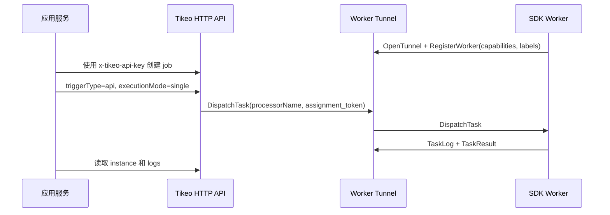

# SDK 与 API 集成指南

本文是所有 Tikeo SDK 的共同契约。共同概念、Management API 语义、Worker 连接参数、触发类型、错误与重试在这里统一说明；各语言页面只保留依赖安装、最小 Worker、异常捕获和 Management client 写法差异。

## 前置条件

| 值 | 示例 | 使用方 | 说明 |
| --- | --- | --- | --- |
| Management HTTP endpoint | `https://tikeo.example.com` | Management client | `/api/v1` 和 `/api-docs/openapi.json` 的 base URL。 |
| Worker Tunnel endpoint | `https://tikeo-worker.example.com` | Worker SDK | Worker 主动连接目标；本地 demo 使用 `http://127.0.0.1:9998`。 |
| `namespace` / `app` | `billing` / `invoices` | 两者 | 必须匹配 Worker registration、job scope 和 API-key scope。 |
| SDK API key | `TIKEO_MANAGEMENT_API_KEY` | Management client | 作为 `x-tikeo-api-key` 发送；不要使用浏览器/OIDC session。 |
| Processor name | `invoice.send-reminder` | 两者 | Job binding 必须匹配 Worker 广告的 normal processor。 |
| Worker pool label | `worker_pool=blue` | Worker routing | selector、canary 和 runbook 使用。 |

## 共同概念

Tikeo 集成有两个独立 client：

| Client | 方向 | 凭证 | 职责 |
| --- | --- | --- | --- |
| Worker SDK client | Worker → Worker Tunnel | Worker identity/config | 注册能力，接收 `DispatchTask`，发送 `TaskLog`，返回 `TaskResult`。 |
| Management SDK/API client | 应用服务 → Server HTTP API | `x-tikeo-api-key` | 创建 jobs、触发 jobs、读取 instances、查看 logs。 |

边界必须清晰。Worker 不通过 tunnel 做管理调用；应用服务也不使用 Worker Tunnel assignment token。



## 统一配置参数表

| 参数 | Rust | Go | Java/Spring Boot | Python | Node.js | 含义 |
| --- | --- | --- | --- | --- | --- | --- |
| Worker endpoint | `WorkerConfig::local(endpoint, ...)` | `LocalConfig(endpoint, ...)` | `tikeo.worker.endpoint` | `local_config(endpoint, ...)` | `localConfig(endpoint, ...)` | Worker Tunnel URL。 |
| Management endpoint | `ManagementClient::new(endpoint, ...)` | `NewManagementClient(endpoint, ...)` | `HttpTikeoJobClient` / `tikeo.management.endpoint` | `ManagementClient(endpoint, ...)` | `new ManagementClient(endpoint, ...)` | Server HTTP URL，不含 `/api/v1`。 |
| API key | `api_key` | `apiKey` | `tikeo.management.api-key` | `api_key` | `apiKey` | 发送 `x-tikeo-api-key`；从 `TIKEO_MANAGEMENT_API_KEY` 注入。 |
| Namespace/app | `namespace`, `app` | `Namespace`, `App` | `tikeo.worker.*`, `tikeo.management.*` | `namespace`, `app` | `namespace`, `app` | key、Worker、job、instance 共享 scope。 |
| Client instance id | `client_instance_id` | `ClientInstanceID` | `tikeo.worker.client-instance-id` | `client_instance_id` | `clientInstanceId` | 稳定 Worker identity hint。 |
| Labels | `labels` | `Labels` | `tikeo.worker.labels` | `labels` | `labels` | 路由依赖时包含 `worker_pool`。 |
| normal processors | `add_normal_processor` | `AddNormalProcessor` | `@TikeoProcessor` | `add_normal_processor` | `addNormalProcessor` | 广告 processor names。 |

## 认证与 Management API 语义

Management SDK helper 是 Management API 的薄 HTTP client。它们使用应用级 service credential，不使用人类 session。

| 规则 | 契约 |
| --- | --- |
| Header | 所有 SDK Management client 都发送 `x-tikeo-api-key`。 |
| 来源 | 从 `TIKEO_MANAGEMENT_API_KEY` 或 secret manager 加载。 |
| Scope | Key 绑定 namespace/app，可选绑定 worker-pool 策略。 |
| Response | HTTP routes 返回带 `code`、`message`、`data` 的 `ApiResponse`。 |
| 默认 helper 行为 | Create helper 构造 API-scheduled job；trigger helper 发送 `triggerType=api`，默认 `executionMode=single`。 |

各 SDK 页面使用这些 reference anchor：

| 操作 | Reference anchor |
| --- | --- |
| 创建 job | [`POST /api/v1/jobs`](../reference/management-openapi#post-api-v1-jobs) |
| 触发 job | [`POST /api/v1/jobs/{job}:trigger`](../reference/management-openapi#post-api-v1-jobs-job-trigger) |
| 轮询 instance | [`GET /api/v1/instances/{instance}`](../reference/management-openapi#get-api-v1-instances-instance) |
| 查看 logs | [`GET /api/v1/instances/{instance}/logs`](../reference/management-openapi#get-api-v1-instances-instance-logs) |
| Worker dispatch | [`DispatchTask`](../reference/worker-tunnel-protobuf#dispatchtask) |

## Worker 连接参数

Worker 是 outbound-only。它连接 Worker Tunnel、注册元数据，然后等待任务。不要为了让 Tikeo 访问业务代码而把 processor 暴露成 inbound HTTP route。

| 参数 | 对派发的影响 | 推荐默认值 |
| --- | --- | --- |
| `endpoint` | 必须指向 Worker Tunnel listener，不是 Management HTTP。 | 本地 `http://127.0.0.1:9998`。 |
| `namespace` + `app` | Job scope 必须匹配 Worker scope。 | 与 Management client scope 一致。 |
| `cluster` + `region` | Broadcast selector 和 operator filters 可匹配。 | 开发环境 `local`。 |
| `labels.worker_pool` | pool、canary 和 runbook 常用 selector。 | 每个部署显式设置。 |
| normal processors | Scheduler 按 processor name 路由 normal processor jobs。 | 只添加已实现 processors。 |
| Script/plugin capabilities | Scheduler 可路由 script/plugin jobs。 | 仅在 runtime 存在时广告。 |

## 触发类型

| Trigger 来源 | 创建者 | 请求语义 | Execution mode |
| --- | --- | --- | --- |
| API/manual | SDK Management client 或 operator | `triggerType=api` | 默认 `executionMode=single`。 |
| Broadcast API | SDK Management client，显式 fan-out | 带 `broadcastSelector` 的 `triggerType=api` | `executionMode=broadcast`。 |
| Webhook event | 外部 event source route | Webhook route 创建 event-backed instance | Webhook 语义。 |
| Cron/schedule | Server scheduler | schedule expression 唤醒 job | Scheduler 选择。 |

## 错误与重试

| 失败点 | 出现位置 | Retry owner | 检查 |
| --- | --- | --- | --- |
| API key 或 scope 错误 | Management client exception/error | Caller | `x-tikeo-api-key`、namespace/app、service-account scopes。 |
| Job payload 无效 | Management client exception/error | Caller | create/trigger 字段和 OpenAPI anchor。 |
| 没有匹配 Worker | Instance status 和 scheduler logs | Operator/deployment | Worker online、processor name、labels、`worker_pool`。 |
| Processor 返回失败 | Instance result 和 logs | Job retry policy | Worker task 返回值。 |
| Processor 抛异常 | Instance result 和 logs | Job retry policy | 语言异常捕获和 Worker logs。 |
| Tunnel 断开 | Worker reconnect loop | Worker supervisor | Tunnel endpoint、网络、heartbeat/lease logs。 |

所有 SDK 的 create helper 都附带同一默认 job retry policy：enabled、`maxAttempts=3`、`initialDelaySeconds=5`、`backoffMultiplier=2`、`maxDelaySeconds=60`。`maxAttempts` 包含第一次执行。

## 语言差异表

| 语言 | 依赖 | 最小 Worker 形态 | 异常捕获 | Management client |
| --- | --- | --- | --- | --- |
| Rust | `tikeo` crate | 实现 `TaskProcessor`，连接 `WorkerClient`。 | 返回 `TaskOutcome`；client error 使用 `WorkerSdkError`。 | `ManagementClient::new`, `ManagementCreateJobRequest::api`, `ManagementTriggerJobRequest::api`, `ManagementTriggerJobRequest::broadcast_api`, `ManagementBroadcastSelectorRequest`。 |
| Go | `github.com/yhyzgn/tikeo/sdks/go/tikeo` | `TaskProcessorFunc`、`NewClient`、`RegisterProcessor`。 | 返回 `error` 或 failed `TaskOutcome`。 | `NewManagementClient`, `APIJob`, `APITrigger`, `BroadcastAPITrigger`, `BroadcastSelectorRequest`。 |
| Java/Spring Boot | `net.tikeo` artifacts | `@TikeoProcessor` 或 `GrpcTikeoWorkerClient`。 | 抛异常或返回 failure model。 | `HttpTikeoJobClient`, `CreateJobRequest.api`, `TriggerJobRequest.api`, `TriggerJobRequest.broadcastApi`, `BroadcastSelectorRequest`。 |
| Python | `tikeo` package | function processor + `Client`。 | 抛异常或返回 `failed(...)`。 | `ManagementClient`, `api_job`, `api_trigger`, `broadcast_api_trigger`, `BroadcastSelectorRequest`。 |
| Node.js | `@yhyzgn/tikeo` package | `Client`、`localConfig`、processor function。 | 抛 `Error` 或返回 `failed(...)`。 | `ManagementClient`, `apiJob`, `apiTrigger`, `broadcastApiTrigger`, `BroadcastSelectorRequest`。 |

## 验收

完整 SDK/API 集成要证明 Worker registration、API job creation、trigger execution、Worker logs 和 credential scope。优先使用完整 smoke script，而不是在每个 SDK 页复制 curl：

```bash
TIKEO_MANAGEMENT_TRIGGER_REBUILD_SERVER=0 scripts/management-trigger-e2e-smoke.sh
```

该脚本创建 service-account credentials，设置 `TIKEO_MANAGEMENT_API_KEY`，用 `TIKEO_WORKER_CONNECT=1` 启动真实 Node.js Worker，创建 API job，触发它，并检查 instance logs 中的 `nodejs demo echo processed`。

## 故障排查

| 现象 | 可能原因 | 修复 |
| --- | --- | --- |
| Management 调用 unauthorized | 凭证类型错误或 scope 缺失 | 使用 `x-tikeo-api-key`，不是 bearer token。 |
| Job 触发但 Worker 不运行 | Processor 或 scope 不匹配 | 比对 job processor name、namespace/app、`worker_pool` 和 Worker registration。 |
| Broadcast 到太多 Worker | Selector 太宽 | 添加 `broadcastSelector` labels/tags/cluster/region。 |
| Script/plugin job 立即失败 | 广告了无 runtime 的 capability | 删除 capability，或安装 runtime 后再广告。 |
| Worker 反复重连 | Tunnel URL 或网络错误 | 验证 Worker Tunnel endpoint，不只是 HTTP Management。 |

## 生产检查清单

- [ ] Worker SDK 和 Management client 使用独立配置块。
- [ ] API key 从 `TIKEO_MANAGEMENT_API_KEY` 或 secret manager 加载，并作为 `x-tikeo-api-key` 发送。
- [ ] API-created jobs 使用 `triggerType=api`；默认调用使用 `executionMode=single`。
- [ ] Broadcast 调用必须有经过审查的 `broadcastSelector`。
- [ ] Worker 只广告它能执行的 processor、script 和 plugin。
- [ ] 非幂等 processor 已审查 retry policy。
